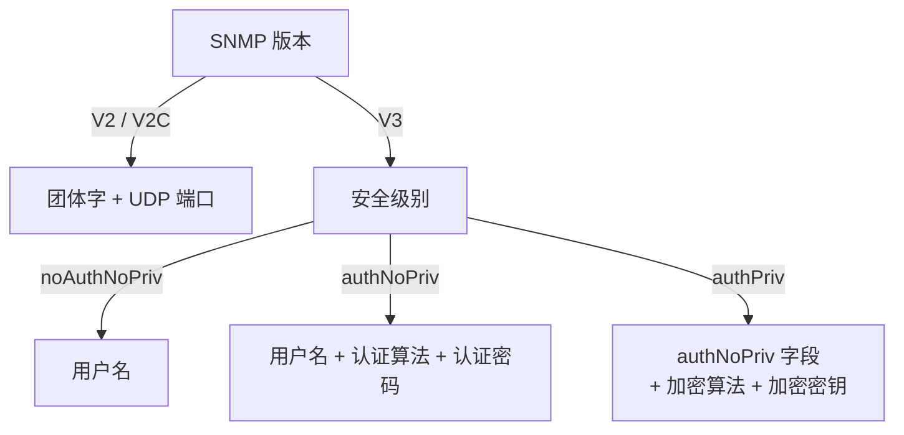

# CMDB 配置采集凭据设计

> 范围：CMDB 专业采集任务的凭据填写说明、协议专用表单、服务端校验、加密存储、节点管理下发与 Stargazer 消费。
>
> 产品取舍和验收规则以
> [`specs/changes/cmdb-collection-credential-guidance/spec.md`](../specs/changes/cmdb-collection-credential-guidance/spec.md)
> 为准；本文用于快速理解当前设计和实现链路。
>
> 文档状态：已实现，最近核对 2026-07-29。

## 0. 五分钟了解

### 0.1 要解决的问题

专业采集页面过去只显示“账户、密码、端口”等通用字段，用户无法判断底层究竟使用
SSH、数据库协议、SNMP、HTTP API、云厂商 SDK，还是 IPMI。`task_type` 又是任务执行
分类，不是连接协议，不能据此推断凭据类型。

典型歧义包括：

- InfluxDB 使用 HTTP(S) API，不应显示数据库账户或 3306 端口；
- FusionInsight 和 OceanStor 使用平台 HTTPS API，不是云 AK/SK；
- 华为云除 AK/SK 外还需要 Project ID 和 Region；
- SNMP V2/V2C 与 V3 的字段依赖不同；
- vCenter、WinSphere、IPMI 和网络配置采集都需要各自的管理账户语义。

### 0.2 一句话方案

保留现有“凭据”区块，通过标题旁唯一的 `?` Popover 说明真实协议和每个字段；简单协议
复用静态描述，复杂对象由前端专用表单写死；服务端继续负责结构校验和加密，NodeParams
把敏感字段转换为环境变量引用后下发，Stargazer 只消费与插件一致的最终字段。

### 0.3 核心设计结论

| 决策 | 结论 | 原因 |
|---|---|---|
| 帮助入口 | 只保留“凭据”标题旁的 `?` | 避免顶部常驻提示和字段级问号造成视觉噪声 |
| 协议来源 | `CredentialDescriptor` 静态常量或目录中的 `credential_protocol` | `task_type` 不是连接协议 |
| 简单协议 | SSH、MySQL、PostgreSQL、SQL Server 复用表单模板 | 字段结构稳定且有多个真实使用方 |
| 复杂对象 | SNMP、云、InfluxDB、平台 API、PC、IPMI、vSphere、WinSphere 等使用专用表单 | 字段联动、校验和转换差异较大 |
| 动态 Schema | 不使用后端 Schema 驱动前端表单 | 避免形成难维护的通用表单引擎 |
| 凭据存储 | 继续使用 `CollectModels.credential` | 不引入数据库表或 migration |
| 敏感字段 | 入库加密，下发时使用环境变量占位 | 密钥不进入配置正文、Headers 标签或日志 |
| 旧任务 | 兼容凭据对象/单元素数组、旧字段名和缺省范围 | 保证旧任务能回显并继续采集 |
| 测试接口 | 以“落库 → NodeParams → Stargazer 参数”为纵向测试面 | 防止单层测试通过但字段在层间丢失 |

### 0.4 用户看到的交互

```text
凭据  ?
┌────────────────────────────────────┐
│ 连接协议    SSH                    │
│ 凭据类型    目标主机操作系统账户  │
│ 填写说明    可登录并执行只读命令  │
│ 默认端口    22                     │
│                                    │
│ 字段说明                           │
│ 账户       ……                      │
│ 密码       ……                      │
│ 端口       ……        默认：22      │
│                                    │
│ 多凭据策略（仅支持多凭据时显示）   │
└────────────────────────────────────┘
```

- Popover 使用点击触发，按钮可获得键盘焦点；
- 字段说明、默认值和推荐值集中展示；
- 不在凭据的每个字段旁重复放置 `?`；
- 不支持多凭据的对象不显示“多凭据策略”；
- 未声明协议的插件显示明确兜底信息，不猜测表单。

## 1. 模块与接口

### 1.1 前端凭据描述模块

模块位置：

- `web/src/app/cmdb/(pages)/assetManage/autoDiscovery/collection/profess/components/credentialDescriptors.ts`
- `web/src/app/cmdb/(pages)/assetManage/autoDiscovery/collection/profess/components/credentialHelp.ts`

其小接口是：

```ts
getCredentialDescriptor(modelItem): CredentialDescriptor | null
resolveCredentialHelp(modelItem, translate): CredentialHelpDefinition
```

模块隐藏了协议名、凭据类型、说明文案键、字段说明、默认值和推荐值的选择逻辑。
`CredentialPoolEditor` 只接收解析后的 `credentialHelp` 并展示，不识别 `model_id`。

静态描述按三类组织：

- `protocols`：SSH、MySQL、PostgreSQL、SQL Server、SNMP；
- `models`：InfluxDB、云平台、FusionInsight、OceanStor、WinSphere、vCenter、IPMI、
  网络配置文件、主机配置文件；
- `pc`：Windows WinRM 与 macOS SSH。

### 1.2 前端专用表单模块

专用任务表单拥有以下实现细节：

- 默认值；
- 字段显隐和联动；
- 新建、编辑、复制回填；
- `******` 掩码语义；
- 提交前字段转换；
- 目标实例或 Region 的选择约束。

例如：

- InfluxDB：`influxdbTask.tsx`、`influxdbCredential.ts`；
- 公有云：`cloudTask.tsx`、`cloudCredentialConfig.ts`；
- 平台 API：`platformApiTask.tsx`、`platformApiCredential.ts`；
- WinSphere：`winsphereTask.tsx`、`winsphereCredential.ts`。

复杂字段不得改造成后端 JSON Schema 驱动的通用表单。新增复杂对象时，应新增或扩展其
专用配置模块，并在静态 `CredentialDescriptor` 中补充说明。

### 1.3 服务端凭据校验与加密模块

服务端负责：

- 校验必填字段、字段类型、端口范围和单/多凭据数量；
- 把旧字段转换为当前字段；
- 保留编辑时未修改的掩码密码；
- 按对象的 `encrypted_fields` 加密落库；
- API 响应使用 `******`，不返回明文。

后端静态校验契约只表达服务端校验规则，不向前端输出表单 Schema。它与
`CredentialDescriptor` 的职责不同：

| 模块 | 面向对象 | 负责内容 |
|---|---|---|
| 前端 `CredentialDescriptor` | 用户和表单 | 协议说明、字段说明、默认/推荐值、表单选择 |
| 后端凭据契约 | Serializer 和模型 | 输入合法性、默认值、加密字段、兼容转换 |

### 1.4 NodeParams 下发模块

`NodeParamsFactory` 根据 `(model_id, driver_type)` 选择 NodeParams。这个二元组很重要：
同一个 `physcial_server` 模型可以同时存在 SSH/job 与 IPMI/protocol 两条链路。

NodeParams 的稳定接口包括：

```python
set_credential()   # 生成插件参数，敏感值使用 ${ENV_NAME}
env_config()       # 生成 ENV_NAME -> 明文密钥
custom_headers()   # 转为 cmdb* Headers
main("push")       # 生成节点管理下发内容
```

节点管理收到配置正文和独立的 `env_config`，配置正文中只出现环境变量引用。

### 1.5 Stargazer 插件模块

Stargazer 的 `/collect_info` 从 `cmdb*` Headers 还原插件参数，根据 `plugin_name` 调用
对应采集器。每个采集器只应理解自己的最终字段，不承担前端字段兼容。

例如：

- `influxdb_info`：`host`、`scheme/ssl`、`port`、`verify_tls`、可选 `token`；
- `fusioninsight_info`：`host`、`username`、`password`、`port`、`verify_tls`；
- `qcloud_info`：`secret_id`、`secret_key`、`region_id`；
- `huaweicloud_info`：`accessKey`、`accessSecret`、`project_id`、`region`。

## 2. 全链路

```mermaid
flowchart LR
    UI["Web 专用任务表单<br/>默认值 / 回填 / 复制清密"]
    DESC["CredentialDescriptor<br/>协议与字段说明"]
    API["CollectModelSerializer<br/>校验 / 兼容转换"]
    DB[("PostgreSQL<br/>CollectModels.credential<br/>敏感字段加密")]
    NP["NodeParams<br/>字段映射 / ENV 占位"]
    NM["Node Management<br/>content + env_config"]
    TG["Telegraf<br/>展开环境变量"]
    HTTP["Stargazer /collect_info<br/>解析 cmdb* Headers"]
    PLUGIN["采集插件<br/>真实协议连接目标"]

    DESC --> UI
    UI -->|"credential + instances + params"| API
    API --> DB
    DB -->|"decrypt_credentials"| NP
    NP --> NM
    NM --> TG
    TG --> HTTP
    HTTP --> PLUGIN
```



### 2.1 敏感字段示例

以 InfluxDB Token 为例：

```text
Web payload
  credential.token = "operator-token"

PostgreSQL
  credential.token = "enc:..."

NodeParams Headers
  cmdbtoken = "${PASSWORD_token_cmdb_42}"

NodeParams env_config
  PASSWORD_token_cmdb_42 = "operator-token"

Stargazer 最终参数
  token = "operator-token"
```

配置正文、日志和指标标签均不得出现 `operator-token`。

## 3. 对象与凭据矩阵

| 对象 | 实际协议 | 凭据字段 | 默认值与约束 |
|---|---|---|---|
| 主机/JOB 插件 | SSH | `username`、`password`、`port` | 22；最多 3 组顺序试探 |
| MySQL | MySQL | `user`、`password`、`port` | 3306 |
| PostgreSQL | PostgreSQL | `user`、`password`、`port` | 5432 |
| SQL Server | SQL Server | `user`、`password`、`port`、`database` | 1433；数据库默认 `master` |
| SNMP | SNMP V2/V2C/V3 | 版本相关字段、`snmp_port` | UDP 161；V3 字段动态联动 |
| InfluxDB | HTTP/HTTPS API | `scheme`、`port`、`verify_tls`、可选 `token` | 8086；只允许一个明确 Endpoint |
| 阿里云 | 云 SDK/API | `accessKey`、`accessSecret`、`regions` | Region 必选 |
| 腾讯云 | 云 SDK/API | `accessKey`、`accessSecret`、`regions` | Region 下发为 `region_id` |
| 华为云 | 云 SDK/API | `accessKey`、`accessSecret`、`project_id`、`regions` | Project ID、Region 必填 |
| FusionInsight | HTTPS API / Basic | `username`、`password`、`port`、`verify_tls` | 443；兼容旧 AK/SK |
| OceanStor | DeviceManager HTTPS REST | `username`、`password`、`port`、`verify_tls` | 8088；兼容旧 AK/SK |
| vCenter | VMware vSphere HTTPS API | `username`、`password`、`port`、`ssl` | 443 |
| WinSphere | WinSphere HTTPS API | `user`、`password`、`https_port`、`verify_tls` | 443；仅一组凭据 |
| 物理服务器 IPMI | IPMI RMCP/RMCP+ | `username`、`password`、`port`、`privilege` | UDP 623 |
| 网络配置文件 | SSH / Netmiko | `username`、`password`、`port`、可选 `enable_password` | 22 |
| 主机配置文件 | SSH | `username`、`password`、`port` | 22 |
| Windows PC | WinRM | 用户、密码、协议、端口、NTLM、证书校验 | HTTPS 5986 / HTTP 5985 |
| macOS PC | SSH | 用户、端口、密码或 PEM 私钥、可选 passphrase | 22 |

### 3.1 SNMP V3 依赖



### 3.2 InfluxDB Token

- Token 选填；
- 不填时，基础识别采集是正常成功；
- 填写后才请求完整运行配置；
- Operator Token 具有实例级高权限，Popover 必须明确风险；
- 填写了无效 Token 时不能静默降级为完全成功；
- TLS 校验开关必须真实传入采集器。

### 3.3 云 Region

- 表单验证凭据后加载 Region；
- 任务保存一个明确 Region；
- 腾讯云把 `regions.resource_id` 下发为 `region_id`，采集器只遍历该 Region；
- 华为云同时下发 `project_id` 和 `region`；
- 历史腾讯云任务没有 Region 时，保持原来的“遍历全部可用地域”行为。

## 4. 新建、编辑和复制

| 场景 | 密钥行为 | 非密钥行为 |
|---|---|---|
| 新建 | 用户输入，服务端加密落库 | 保存规范化字段和默认值 |
| 编辑 | API 返回 `******`；未修改时复用原密文 | 完整回填端口、TLS、Project ID、Region 等 |
| 复制 | 密钥字段清空，要求重新输入 | 保留端口、协议、Region 等可复用配置 |

需要同时兼容凭据为对象和单元素数组的历史数据。专用表单统一先规范化为凭据池，再取
该对象允许的凭据数量。

## 5. 兼容策略

当前明确保留的兼容行为：

- 云凭据支持历史对象和当前单元素数组；
- FusionInsight、OceanStor 的旧 `accessKey/accessSecret` 在服务端转换为
  `username/password`，未重存的旧任务也能下发；
- 旧平台 endpoint 中的显式端口优先于默认端口；
- 编辑时 `******` 表示未修改，不能当作真实密钥保存；
- 复制任务时 AK、SK、密码、Token、私钥等敏感值全部清空；
- 腾讯云旧任务缺少 Region 时继续采集所有可用地域；
- InfluxDB 不允许 IP 段或多实例，避免 NodeParams 只发送首个 `host` 造成静默漏采。

兼容逻辑应位于输入转换或 NodeParams 适配处，不能扩散到 Stargazer 各采集器。

## 6. 安全约束

- 新增密钥字段必须进入对应 `encrypted_fields`；
- 数据库不得保存明文密码、Token、AK/SK 或私钥；
- API 详情不得返回明文，只返回掩码；
- 节点配置正文使用环境变量引用，真实值只进入 `env_config`；
- 日志、异常、任务摘要和 VictoriaMetrics 标签不得记录密钥；
- 云/API 凭据优先建议只读或最小权限；
- 关闭 TLS 校验时必须显示中间人攻击风险；
- Operator Token 等已知高权限凭据必须单独提示风险。

## 7. 测试策略

### 7.1 前端契约

前端脚本覆盖：

- 所有静态描述在中英文 locale 中都有协议、类型、说明和字段文案；
- 默认值和推荐值正确；
- 新建、编辑、复制及掩码行为；
- 云、InfluxDB、平台 API、WinSphere 和 PC 的提交转换；
- 14 类任务表单保持统一布局；
- Storybook 与业务页面使用同一个凭据编辑器实现。

### 7.2 服务端与 Stargazer

- Serializer：字段校验、默认值、历史字段转换；
- Model：敏感字段落库加密、读取解密、接口掩码；
- NodeParams：插件字段名、环境变量引用、Endpoint 和 Region；
- Stargazer：插件最终参数、TLS、Token 和兼容行为。

### 7.3 纵向链路

`server/apps/cmdb/tests/e2e/test_credential_delivery_pipeline.py` 验证：

1. 创建任务并真实写入 `CollectModels`；
2. 敏感字段已加密；
3. `decrypt_credentials` 交给 NodeParams；
4. 节点管理内容不包含明文；
5. 环境变量展开后，Stargazer 得到插件预期字段。

当前覆盖 InfluxDB Token、FusionInsight 旧 AK/SK、腾讯云 Region、华为云 Project ID
与 Region。

## 8. 新增插件时怎么做

### 8.1 简单协议

1. 在采集对象目录声明 `credential_protocol`、`credential_kind` 和默认端口；
2. 如果现有协议模板可表达，不新增表单；
3. 在 `credentialDescriptors.ts` 增加协议或模型描述；
4. 补齐中英文 locale；
5. 增加 Descriptor 与 NodeParams 契约测试。

### 8.2 复杂对象

1. 先从 Stargazer 采集器确认真实连接协议和最终字段；
2. 在前端增加专用配置模块，写明默认值、联动、校验、回填和提交转换；
3. 增加静态 `CredentialDescriptor`，不要增加后端动态表单 Schema；
4. 在 Serializer 定义输入约束和历史兼容；
5. 在 `encrypted_fields` 声明所有秘密；
6. 在 NodeParams 完成字段映射和环境变量下发；
7. 增加一条从任务存储到 Stargazer 参数的纵向测试。

## 9. 非目标

- 不建设凭据中心或跨任务凭据复用；
- 不实现密钥轮换；
- 不自动探测协议；
- 不允许用户切换到插件不支持的协议；
- 不把连接设置和认证信息拆成两个顶层区块；
- 不构建通用 JSON Schema/Form Builder；
- 不承诺一次性补齐所有企业扩展插件；未声明者使用明确兜底。

## 10. 快速导航

| 想了解 | 入口 |
|---|---|
| 完整需求、产品取舍和验收标准 | `specs/changes/cmdb-collection-credential-guidance/spec.md` |
| 当前实现全景 | 本文 |
| 前端静态凭据描述 | `web/.../components/credentialDescriptors.ts` |
| 帮助解析接口 | `web/.../components/credentialHelp.ts` |
| 凭据编辑器 | `web/.../components/credentialPoolEditor.tsx` |
| 服务端校验 | `server/apps/cmdb/serializers/collect_serializer.py`、`services/collect_credential_contract.py` |
| 加密字段解析 | `server/apps/cmdb/services/encrypt_collect_password.py` |
| NodeParams 选择 | `server/apps/cmdb/node_configs/config_factory.py` |
| Stargazer 参数入口 | `agents/stargazer/api/collect.py` |
| 纵向链路测试 | `server/apps/cmdb/tests/e2e/test_credential_delivery_pipeline.py` |
