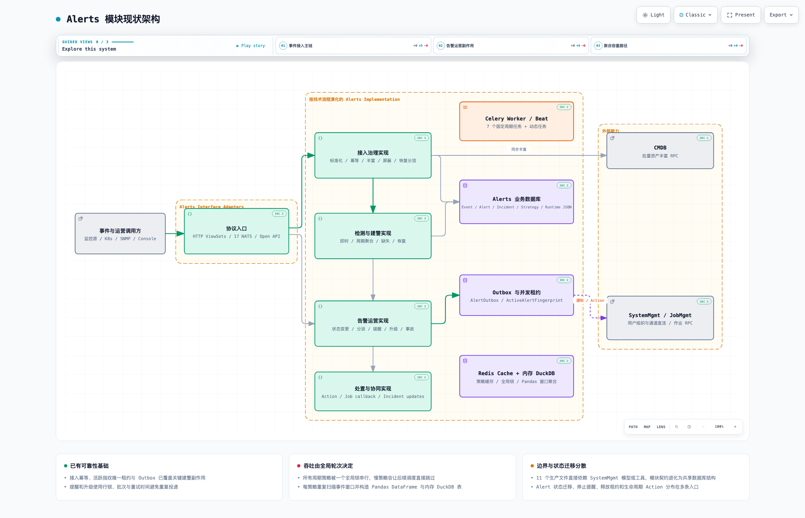
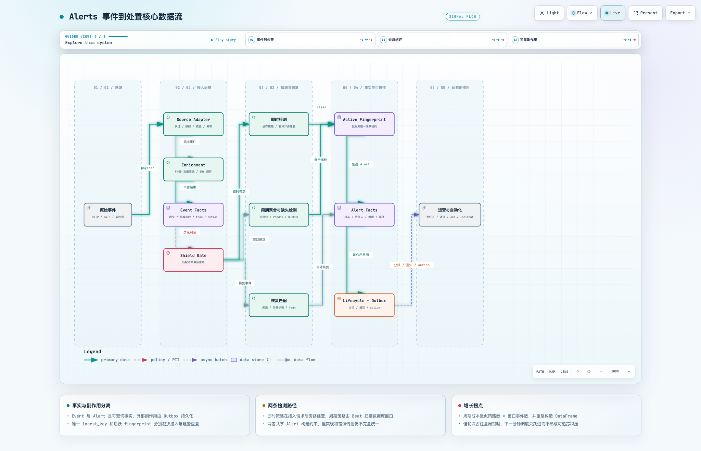
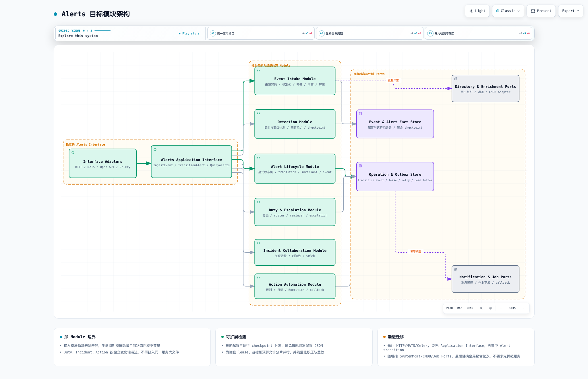

# Alerts 模块架构与代码结构分析

> 分析日期：2026-08-21
> 分析范围：`server/apps/alerts/`，以及它直接依赖的 CMDB、SystemMgmt、JobMgmt、NodeMgmt、NATS、Celery、Redis 和 DuckDB 边界。
> 分析方式：以事件到告警、告警到运营副作用的完整闭环为主，分析事实所有权、模块边界、数据流、一致性、状态迁移和容量模型，不按零散技术债组织。

## 1. 结论摘要

Alerts 是事件治理和告警运营控制面，不只是告警 CRUD。它承载六类核心能力：

1. 多来源事件认证、标准化、幂等和入库；
2. CMDB 丰富、屏蔽和恢复事件分流；
3. 即时告警、周期降噪聚合和缺失检测；
4. Alert 状态、分派、提醒、升级和自动关闭；
5. Incident 协同和 Action 自动处置；
6. 通知、作业等副作用的 Outbox 投递。

模块已有值得保留的可靠性基础：Event 使用接入幂等键和数据库唯一约束；即时、周期和缺失检测使用活跃 fingerprint 唯一租约；提醒、升级和 Outbox 使用行锁、租约、重试时间和批次；自动分派还有 UNASSIGNED 兜底扫描。

当前最需要处理的不是“再增加重试”，而是三个结构性矛盾：

- **检测容量由一个全局轮次决定**：所有周期策略被一个缓存锁串行；每个策略重复查询窗口事件，再构造 Pandas DataFrame 和内存 DuckDB 表。成本近似 `策略数 × 窗口事件数`，慢轮次会让下一分钟调度直接跳过。
- **Alert 生命周期没有唯一入口**：状态迁移、停止提醒/升级、释放活跃指纹、恢复通知和 Action 生命周期事件分布在 AlertOperator、Recovery、AutoClose、TimeoutChecker、AggregationProcessor 与模型 `save()` 中；新增状态或副作用容易只覆盖部分路径。
- **模块契约与实现边界不一致**：11 个生产文件直接导入 SystemMgmt 的 User、Group、Channel 或权限工具；NATS 的 17 个 Handler 同时承担接入、统计、权限和查询。名义上的模块协作实际退化为共享数据库结构和第二套业务入口。

另外存在一个必须优先修复的可靠性缺口：notification Outbox 调用 `sync_notify` 后无条件返回；`sync_notify` 会吞掉通道异常并返回 `result=false`，Outbox 随后仍将记录标记为 `DELIVERED`。这会形成“通知失败但投递账本显示成功”的假确认。

建议继续保持模块化单体，先修复通知投递确认语义并建立统一 Alert Transition；再分离策略配置与运行 checkpoint、引入策略级 lease 和游标预算；随后建立 Alerts Application Interface 与外部 Ports。暂不需要先拆微服务或替换 Celery/NATS。

## 2. 图件

- Archify 交互式现状架构：[alerts-current.architecture.html](./alerts-current.architecture.html)
- Archify 交互式核心数据流：[alerts-core.dataflow.html](./alerts-core.dataflow.html)
- Archify 交互式目标架构：[alerts-target.architecture.html](./alerts-target.architecture.html)
- Archify 可维护规格：[现状 JSON](./alerts-current.architecture.json) · [核心数据流 JSON](./alerts-core.dataflow.json) · [目标 JSON](./alerts-target.architecture.json)

HTML 支持明暗主题、缩放、搜索、关系追踪、聚焦视图、演示和 PNG/SVG 等导出；不依赖 draw.io。







## 3. 模块边界与事实所有权

### 3.1 Event、Alert、Incident 是三个不同层级的事实

| 数据概念 | 事实源 | Alerts 的职责 | 边界约束 |
|---|---|---|---|
| 原始观测、标准事件、恢复事件 | `Event` | 保存来源、原文、标准字段、团队、action 和 ingest identity | Event 是不可替代的接入审计事实，不应由 Alert 反推 |
| 可运营异常 | `Alert` | 保存 fingerprint、状态、责任人、维度和关联 Event | 所有活跃状态必须受统一状态机和唯一 fingerprint 约束 |
| 事故协同 | `Incident` | 关联多个 Alert，保存负责人、协作者和时间线 | Incident 不重新拥有 Event/Alert 的状态事实 |
| 策略定义 | `AlarmStrategy` 等配置表 | 保存匹配、窗口、分派、屏蔽、提醒和升级定义 | 用户配置不能继续混存检测运行 checkpoint |
| 副作用意图与执行结果 | `AlertOutbox`、`ActionExecution`、`NotifyResult` | 保存幂等键、尝试、状态和外部结果 | 业务结果失败不能被 transport 成功掩盖 |
| 用户、组织、通知通道 | SystemMgmt | Alerts 只解析 roster、范围和通道 | 应通过 Directory/Notification Port，不直连对方模型 |
| 资产与拓扑 | CMDB | 仅在接入时按授权组织丰富 Event | 同步失败应降级并可观察，不改变 Event 身份 |
| 作业脚本与执行 | JobMgmt | Action 解析目标并创建执行记录 | Job 是外部执行事实源，Alerts 保存映射、回调和终态 |

核心模型见 [models.py:29](../../server/apps/alerts/models/models.py#L29)、[models.py:130](../../server/apps/alerts/models/models.py#L130) 和 [models.py:227](../../server/apps/alerts/models/models.py#L227)。

### 3.2 建议明确六个能力域

| 能力域 | 核心职责 | 当前主要落点 | 应拥有的规则/事实 |
|---|---|---|---|
| Event Intake | 来源契约、认证、标准化、幂等、丰富和屏蔽 | `common/source_adapter/`、`enrichment/`、`common/shield.py` | IngestEnvelope、来源版本、接收结果和 Event identity |
| Detection | 即时、窗口聚合、缺失检测、恢复匹配 | `aggregation/` | 策略快照、checkpoint、lease、fingerprint 和检测预算 |
| Alert Lifecycle | Alert 状态迁移与不变量 | `service/alter_operator.py`、`service/alert_lifecycle.py`、`aggregation/recovery/` | Transition、终态、生命周期事件和副作用意图 |
| Duty & Escalation | 自动分派、提醒、升级和 roster | `common/assignment.py`、`reminder_service.py`、`escalation_service.py` | 责任人快照、due time、层级和通知意图 |
| Incident Collaboration | 事故、关联告警、协作者和更新 | `views/incident.py`、`incident_operator.py` | Incident 聚合边界、时间线和权限范围 |
| Action Automation | Action 规则、目标解析、Execution 和 callback | `action/`、`views/action.py` | 执行幂等键、团队交集、远程任务映射和终态 |

HTTP、Open API、NATS、Celery 和管理命令只是 Interface Adapter，不应形成新的业务规则所有者。

## 4. 现状代码结构

### 4.1 规模与热点

不含测试和 migration，`server/apps/alerts/` 约有 **20,183 行 Python**、**170 个生产 Python 文件**；测试文件约 **112 个**。主要热点：

- `nats/nats.py`：1,318 行；
- `aggregation_processor.py`：838 行；
- `common/source_adapter/base.py`：718 行；
- `service/alter_operator.py`：638 行；
- `service/reminder_service.py`：605 行；
- `tasks/tasks.py`：481 行；
- `common/assignment.py`：478 行；
- `views/incident.py`：465 行。

代码已经出现 `aggregation / action / enrichment / extensions` 等能力目录，但主流程仍横跨 `views / nats / common / service / tasks / models`。修改“告警恢复后应触发什么”需要同时理解 RecoveryHandler、RecoveryChecker、AggregationProcessor、ReminderService、Alert.save 和通知；修改“新增来源”需要进入 718 行 Adapter 基类并理解丰富、幂等、屏蔽、即时检测与恢复分流。这说明当前目录只部分表达业务所有权。

### 4.2 接入主流程收在一个过深的 Adapter 基类

`AlertSourceAdapter.create_events` 同时完成来源转换、字段补全、丰富和结果统计，见 [base.py:206](../../server/apps/alerts/common/source_adapter/base.py#L206)；`bulk_save_events` 负责批内去重、数据库预查询、分批写入和冲突回读，见 [base.py:480](../../server/apps/alerts/common/source_adapter/base.py#L480)；`main` 又编排屏蔽、即时检测和恢复处理，见 [base.py:617](../../server/apps/alerts/common/source_adapter/base.py#L617)。

这不是简单的“文件太大”，而是抽象层次混合：

```text
来源协议映射
  + Event identity / 幂等策略
  + CMDB 丰富降级
  + 屏蔽规则执行
  + 即时检测调度
  + 恢复事件路由
```

建议把来源 Adapter 限定为 `raw payload → IngestEnvelope`；接入用例统一拥有幂等、丰富、屏蔽和后续检测触发。这样新增来源不会继承全部数据库和生命周期细节。

### 4.3 NATS 已成为查询和统计的第二业务层

`nats/nats.py` 注册 17 个 Handler，前半部分包含趋势、来源、通知和数据质量统计，`receive_alert_events` 又承担可信内部接入，后半部分继续提供多种告警统计。入口的权限、时间范围、时区格式化和 ORM 聚合都在同一 1,318 行文件中，见 [nats.py:333](../../server/apps/alerts/nats/nats.py#L333) 和 [nats.py:718](../../server/apps/alerts/nats/nats.py#L718)。

目标不是删除 NATS，而是让 Handler 只做：

```text
可信调用上下文 → DTO 校验 → Alerts Application Query/Command → 响应映射
```

趋势和分布等统计应归入 Query Service；内部事件接入应调用和 HTTP 相同的 Event Intake 用例。

### 4.4 SystemMgmt 边界被共享模型穿透

11 个生产文件直接导入 SystemMgmt 模型或工具，覆盖 User、Group、Channel、GroupUtils 和权限 helper。例如：

- Alert Serializer 直接查询 User，见 [alert.py:13](../../server/apps/alerts/serializers/alert.py#L13)；
- 分派/屏蔽 Serializer 直接依赖 Group、User 和 GroupUtils，见 [assignment_shield.py:8](../../server/apps/alerts/serializers/assignment_shield.py#L8)；
- 通知格式化直接依赖 SystemMgmt User，见 [base.py:7](../../server/apps/alerts/common/notify/base.py#L7)；
- Incident View 直接依赖 User，见 [incident.py:23](../../server/apps/alerts/views/incident.py#L23)。

这会让 SystemMgmt schema、用户展示规则和权限工具的变化扩散到 Alerts。应建立窄接口：

```text
DirectoryPort.resolve_users(usernames, allowed_org_ids)
DirectoryPort.resolve_roster(targets, allowed_org_ids)
NotificationPort.list_channels(scope)
NotificationPort.send(command) -> DeliveryResult
```

## 5. 核心数据流与状态模型

### 5.1 事件到告警

当前主链为：

```text
HTTP / NATS / 监控源事件
  → 来源认证和团队上下文
  → 字段映射、时间/级别标准化
  → 构造 external_id、event_id、ingest_key
  → 按组织调用 CMDB 丰富（失败降级）
  → Event 批内去重 + DB 唯一约束
  → 屏蔽判定
  ├─ 即时策略：接入后同步或有界异步建警
  ├─ 周期策略：Beat 扫描窗口并聚合建警
  └─ 恢复事件：复合恢复键匹配活跃 Alert
  → ActiveAlertFingerprint 唯一租约
  → Alert
  → Lifecycle / Outbox
```

Event 唯一约束由 `source + push_source_id + ingest_key` 组成，见 [models.py:82](../../server/apps/alerts/models/models.py#L82)；活跃 fingerprint 使用独立唯一表，见 [active_fingerprint.py:6](../../server/apps/alerts/models/active_fingerprint.py#L6)。这是正确的两级幂等：前者处理重复接入，后者处理不同检测路径并发建警。

### 5.2 即时与周期检测的容量语义不同

即时路径缓存活跃策略并按阈值选择同步或 Celery 批量建警。周期路径由 `event_aggregation_alert` 每分钟启动；`cache.add` 获取整个 Alerts 模块唯一锁，未获取时直接跳过，见 [tasks.py:72](../../server/apps/alerts/tasks/tasks.py#L72)。

`AggregationProcessor` 逐个串行处理所有非即时策略，单策略失败只隔离到当前策略，但轮次结束仍整体失败，见 [aggregation_processor.py:69](../../server/apps/alerts/aggregation/processor/aggregation_processor.py#L69)。每个策略都会：

1. 按窗口查询 Event；
2. 应用匹配规则；
3. 把 QuerySet 全部转为 Python list；
4. 构造 Pandas DataFrame；
5. 注册到内存 DuckDB 并建表；
6. 执行聚合 SQL。

整窗搬运见 [connection.py:29](../../server/apps/alerts/aggregation/engine/connection.py#L29)。这使轮次成本近似：

```text
DB 扫描与 Python 内存 ≈ Σ 每个策略的窗口候选事件
轮次延迟 ≈ Σ 每个策略的查询 + DataFrame + DuckDB + 建警时间
```

锁可以防止并发重复轮次，但不能提供扩展性、积压语义或公平性。目标应是策略级 lease + checkpoint + scan budget；慢策略不阻塞其他策略，跳过/延迟有可查询原因，worker 可按租户/策略分片。

### 5.3 策略配置与运行状态混存在一个 JSON

缺失检测把 `heartbeat_status`、`last_heartbeat_time` 和 `last_heartbeat_context` 写回 `AlarmStrategy.params`，见 [aggregation_processor.py:257](../../server/apps/alerts/aggregation/processor/aggregation_processor.py#L257) 和 [aggregation_processor.py:517](../../server/apps/alerts/aggregation/processor/aggregation_processor.py#L517)。这会导致：

- 每轮检测改写用户配置记录和 `updated_at`；
- 配置编辑与运行 checkpoint 竞争同一行；
- 审计无法区分用户改配置还是检测器推进状态；
- 将来按策略并行时需要更粗的行锁；
- JSON 字段不利于索引、超时扫描和容量报表。

应新增 `DetectionRuntime`：`strategy_id / generation / lease_owner / lease_until / cursor / last_heartbeat_at / status / next_due_at / last_error`。`AlarmStrategy.params` 只保存版本化配置快照。

### 5.4 Alert 生命周期是隐式状态机

人工分派、认领、转派、关闭和处理集中在 `AlertOperator`，但自动恢复、自动关闭、会话超时和缺失恢复从其他实现直接修改状态。模型 `Alert.save()` 又在检测到非活跃状态后删除 fingerprint lease，见 [models.py:201](../../server/apps/alerts/models/models.py#L201)。

这种模型 hook 不能覆盖 QuerySet `update()`、bulk 路径或未来的新 Repository；状态迁移副作用也并不只包括释放租约，还包括停止提醒/升级、恢复通知、Action、操作日志和 Outbox。应建立唯一接口：

```text
transition(alert_id, command, actor, expected_version)
  → 锁定 Alert
  → 校验 current_state × command
  → 写 next_state + transition event
  → 释放/占用 fingerprint
  → 创建 reminder/escalation/action/notification outbox
  → commit
```

所有 HTTP、Open API、NATS、Recovery、AutoClose 和 TimeoutChecker 都调用它；禁止直接赋值 `alert.status`。

### 5.5 Outbox 框架正确，但 notification 的业务确认错误

Outbox 已具备 delivering 租约、attempt、指数退避、最大次数、stale recovery 和条件终态更新，见 [outbox.py:66](../../server/apps/alerts/service/outbox.py#L66)。

问题在 notification adapter：`_deliver_payload` 调用 `sync_notify` 后直接返回，见 [outbox.py:36](../../server/apps/alerts/service/outbox.py#L36)；`sync_notify` 捕获通道异常并构造 `{"result": false}`，见 [tasks.py:419](../../server/apps/alerts/tasks/tasks.py#L419)。调用方不检查结果，`deliver_outbox_record` 会把 Outbox 标记为 `DELIVERED`。

应定义明确结果契约：

```text
DeliveryResult = delivered | retryable_failure | permanent_failure
```

- 任一可重试通道失败：抛出 typed exception，使 Outbox 回到 pending；
- 永久失败：记录失败原因并进入 dead-letter/failed；
- 批量多通道：拆为每通道/每目标独立 Outbox，避免一个成功掩盖另一个失败；
- NotifyResult 是展示与审计投影，不能代替 Outbox 终态裁决。

## 6. 结构性不合理设计与影响

| 优先级 | 架构主题 | 现状 | 维护/扩展影响 | 并发/性能/可靠性影响 |
|---|---|---|---|---|
| P0 | 通知 Outbox 假确认 | `sync_notify` 吞异常并返回失败，Outbox 仍置 delivered | 运维看到投递成功但用户未收到，补发入口失真 | 持续通道故障永久丢通知，不再重试 |
| P0 | Alert 状态迁移多入口 | 人工、恢复、关闭、超时和缺失检测直接改状态 | 新状态/副作用需要修改多条路径，容易行为漂移 | fingerprint、提醒、升级、通知和 Action 可能不一致 |
| P0 | 全局聚合轮次 | 一个缓存锁串行全部周期策略，重叠调度直接跳过 | 新策略线性放大整轮维护与排障成本 | 慢策略造成全局延迟，缺少 backlog、lease 和公平性 |
| P0 | 每策略整窗内存聚合 | QuerySet → list → Pandas → DuckDB，策略间重复扫描 | 策略规则与执行引擎紧耦合，难替换查询计划 | 内存和 DB I/O 近似 `S × E`，worker 有 OOM/长占用风险 |
| P1 | 配置与运行态混存 | heartbeat runtime 写回 `AlarmStrategy.params` | 配置审计、版本和迁移语义不清 | 配置编辑与 detector 竞争同一行，难分片并行 |
| P1 | SystemMgmt 模型直连 | 11 个生产文件直接导入用户、组织、通道和工具 | 对方 schema/权限重构扩散到 Alerts | 跨模块查询预算、缓存和故障降级无法统一 |
| P1 | NATS 形成第二业务层 | 1,318 行、17 Handler 混合接入、权限、统计和 ORM | HTTP/NATS 契约和授权语义容易漂移 | 重统计查询与接入共享 Handler 资源，缺少隔离 |
| P1 | 周期任务吞异常 | reminder/escalation 捕获顶层异常并返回 error dict | Celery 任务状态显示成功，监控需解析业务返回 | 调度失败不进入任务重试，故障容易静默 |
| P1 | 接入基类职责过深 | 718 行基类同时拥有映射、幂等、丰富、屏蔽、检测和恢复 | 新来源需要理解全部内核，测试替身宽 | 同步接入延迟包含 CMDB 与多条业务规则 |
| P2 | 技术目录仍压平能力 | 生命周期、Duty、Incident、Action 跨 views/service/common/tasks | 能力所有权和依赖方向不清 | 批次、锁、重试和错误分类难复用 |

## 7. 并发与容量模型

### 7.1 检测执行应有策略级资源预算

每个策略至少需要：

```text
generation / owner / lease_until / cursor / window_end
max_events / max_groups / max_runtime_ms / memory budget
next_due_at / lag_seconds / last_success_at / last_error
```

执行计划应冻结 `window_end`，按稳定游标分批读取；达到事件、分组、时间或内存预算后保存 checkpoint 并续跑。不能用“加长全局锁超时”解决容量问题。

### 7.2 Detection 队列与运营队列必须隔离

建议至少划分：

| 队列 | 工作负载 | 预算重点 |
|---|---|---|
| `alerts.ingest` | 大批事件接入后的有界异步工作 | 单批事件数、payload 字节、租户限流 |
| `alerts.detect.instant` | 即时策略异步建警 | 低延迟、短任务、fingerprint 冲突率 |
| `alerts.detect.window` | 聚合与缺失检测 | 策略 lease、内存、运行时、分片公平性 |
| `alerts.lifecycle` | 分派、提醒、升级和自动关闭 | due-time 延迟、行锁、批次、stale recovery |
| `alerts.delivery` | notification/action Outbox | 不可被聚合任务饿死，独立并发和重试 |

### 7.3 接入同步路径必须保持有界

当前 Event 分批 100 写入、丰富 key 最多 500，是正确基础。后续每个来源还必须声明：最大事件数、最大单事件/批次字节、最大标签/丰富深度、CMDB 调用超时、接入总时限和部分失败 ACK。同步请求内不能等待无界检测、通知或作业执行。

### 7.4 查询和统计要独立预算

趋势、分布、TopN 和数据质量统计集中在 NATS 文件。应统一：最大时间跨度、最大分组数、是否允许 count、稳定时区、缓存 TTL、慢查询日志和租户并发。高成本统计不能与内部事件接入共享同一 worker/连接预算。

## 8. 目标代码结构

```text
server/apps/alerts/
├── adapters/
│   ├── inbound/{http,open_api,nats,celery}/
│   └── outbound/{cmdb,system_directory,notification,job}/
├── application/
│   ├── ingest_commands.py
│   ├── alert_commands.py
│   ├── incident_commands.py
│   └── queries.py
├── capabilities/
│   ├── event_intake/
│   ├── detection/
│   ├── alert_lifecycle/
│   ├── duty_escalation/
│   ├── incident_collaboration/
│   └── action_automation/
├── ports/
│   ├── directory.py
│   ├── enrichment.py
│   ├── notification.py
│   └── job_execution.py
└── operational/
    ├── leases.py
    ├── checkpoints.py
    ├── outbox.py
    └── delivery_result.py
```

迁移顺序：先增加 Application Interface 并让旧入口委托；再集中 Alert Transition 和通知确认语义；随后分离 DetectionRuntime 与策略配置；最后移动目录、收窄 Ports 和替换全局聚合轮次。不要一次性重写整个 Alerts 模块。

## 9. 分阶段优化计划

### 近期 P0

1. 修复 notification Outbox 结果契约：失败必须重试或进入 failed/dead-letter，按通道拆分投递粒度。
2. 建立 `AlertTransitionService`，统一人工操作、恢复、自动关闭、会话超时和缺失恢复。
3. 禁止新增直接 `alert.status =` 和 QuerySet 状态更新；增加状态机 contract test。
4. 为全局聚合轮次补齐 lag、锁跳过、策略耗时、窗口事件数、DataFrame 行数和峰值内存指标。
5. 为接入、窗口检测、生命周期和 delivery 配置独立 Celery 队列与资源上限。
6. reminder/escalation 顶层异常必须反映为 Celery failure 或显式可重试结果。

完成标准：通知失败不会被标为 delivered；同一状态命令从任意入口产生相同终态和副作用；能量化哪个策略造成聚合延迟；delivery 不被聚合任务饿死。

### 中期 P1

1. 建立 `Alerts Application Interface`，HTTP、Open API、NATS 和 Celery 只做协议适配。
2. 把 `AlarmStrategy.params` 中运行字段迁移到 `DetectionRuntime`，引入 generation、lease 和 checkpoint。
3. 用策略级调度替代全局单例轮次，增加事件数、分组数、内存和运行时预算。
4. 拆分 Event Intake：Source Adapter 只输出 Envelope，接入用例拥有幂等、丰富、屏蔽和路由。
5. 抽取 Directory、Enrichment、Notification 和 Job Port，移除 SystemMgmt 模型直连。
6. 把 NATS 统计迁移到 Query Service，并增加时间范围、缓存和查询预算。

### 长期 P2

1. 按能力目录迁移并增加依赖规则测试，禁止 capability 反向依赖 inbound adapter。
2. 评估使用数据库原生聚合、增量物化或独立流处理替换“每策略 Pandas + DuckDB”，但先用真实容量数据决策。
3. 只有当 Detection 或 Delivery 形成独立扩缩容、故障和发布边界时，再评估物理服务拆分。

## 10. 开发提醒

1. Event、Alert、Incident 是不同事实层，不能为了页面方便互相复制状态所有权。
2. 新来源只负责映射到版本化 IngestEnvelope；不要复制幂等、屏蔽、恢复或建警流程。
3. `external_id` 是业务关联键，`event_id` 是记录 ID，`ingest_key` 是接入幂等键，三者不可混用。
4. 所有 Alert 状态变化必须调用统一 Transition；直接赋值状态会绕过 fingerprint、提醒、升级和副作用约束。
5. `transaction.on_commit` 只保证“提交后尝试调度”，不能替代持久化 Outbox。
6. Outbox 只有在业务副作用明确成功后才能 delivered；异常被吞或返回 `result=false` 都不是成功。
7. 新周期任务必须声明 lease、deadline、批次、游标、重试、stale recovery 和 lag 指标。
8. 不要在单个全局锁内串行新增策略类型；新检测器必须有策略级预算和 checkpoint。
9. 用户、组织、通知通道和资产查询必须通过 Port，并携带服务端计算的授权组织范围。
10. NATS payload 不能决定权限范围；调用方身份来自可信传输上下文。
11. 新 JSON 配置必须有 schema version 和上限；运行状态、due time、lease 和查询条件使用显式字段。
12. 日志不能记录完整事件正文、通知正文、secret 或大 payload；记录稳定 ID、计数、耗时和错误类别。

## 11. 验证

三份 Archify 规格均以 `showcase` 质量档通过 9 项结构校验，代码证据引用已验证。HTML 在 1440×900、1600×1000、1920×1080 和 2048×1320 视口下无横向/纵向溢出，并人工检查明暗主题。

后续应补充：Alert 状态机 contract test、notification Outbox 失败/部分成功测试、策略 lease 与 stale recovery 测试、窗口容量测试、接入批次与 payload 上限测试，以及禁止能力模块直接导入 SystemMgmt 模型的架构测试。
