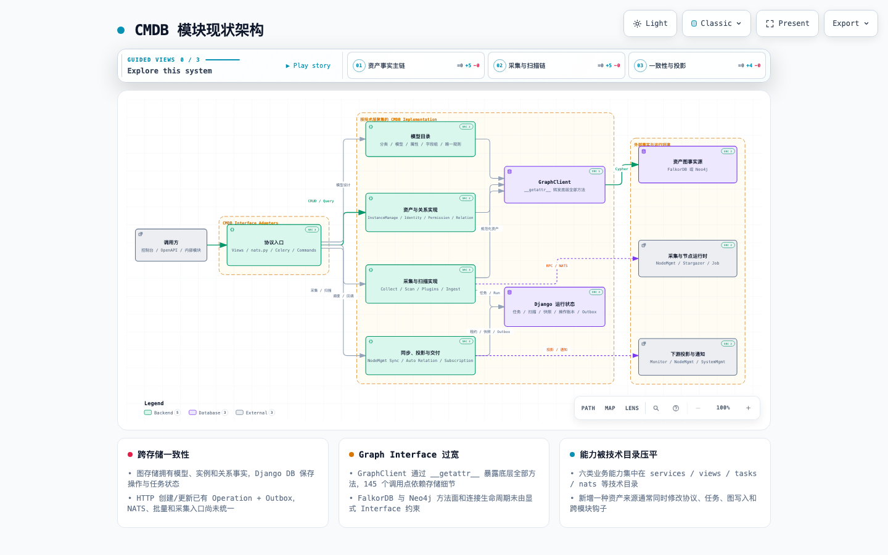
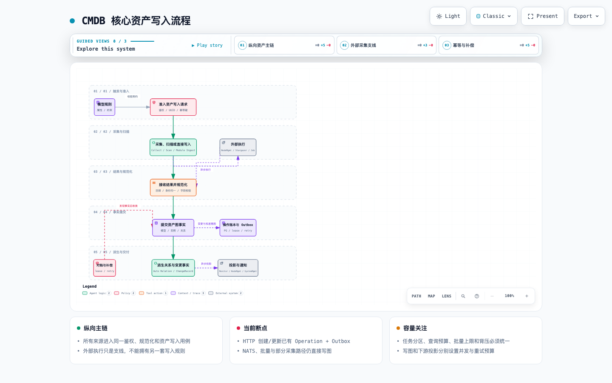
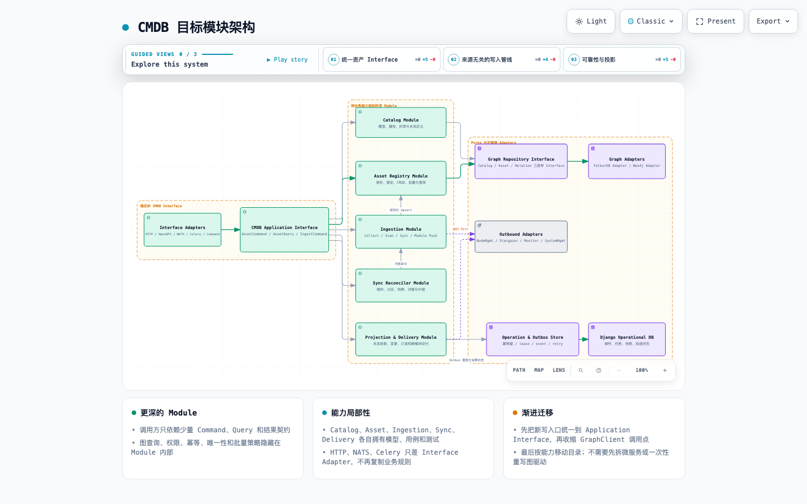

# CMDB 模块架构与代码结构分析

> 分析日期：2026-08-21
> 分析范围：`server/apps/cmdb/`，以及它直接依赖的 Graph、NodeMgmt、Stargazer、Monitor、SystemMgmt、NATS 和 Celery 边界。
> 分析方法：以模块职责、能力边界、事实所有权、数据流、一致性、并发容量和演进接口为主；不按零散技术债组织。

## 1. 结论摘要

CMDB 不是一个简单的“模型和实例 CRUD”模块。它已经同时承担六类能力：

1. 模型目录与约束管理；
2. 资产身份、实例和关系管理；
3. 采集、扫描、自定义上报和跨模块写入；
4. NodeMgmt 同步、快照、对账和补偿；
5. 自动关系、变更记录和查询投影；
6. 订阅及对 Monitor、NodeMgmt、SystemMgmt 的下游交付。

当前最大的结构性矛盾是：**业务已经按能力域生长，代码仍主要按 `views / services / tasks / nats / graph / models / collection` 技术层组织。** 一个“资产写入”用例会跨越协议入口、权限、唯一规则、图存储、Django 操作账本、变更记录、自动关系和下游通知；但这些规则没有被一个统一的应用接口收口。

由此产生三类长期风险：

- **行为漂移**：HTTP 单实例创建/更新已经使用 `Operation + Outbox`，NATS、批量和部分采集路径仍直接调用 `InstanceManage`；同一业务动作具有不同的幂等、审计和补偿语义。
- **存储泄漏**：`GraphClient.__getattr__` 将底层驱动的全部方法暴露给约 145 个调用点，业务代码实际依赖 FalkorDB/Neo4j 的宽接口，而不是稳定的资产仓储契约。
- **容量互扰**：扫描、同步、快照、恢复、Outbox 和普通任务缺少模块级队列与预算隔离；批量校验和导入还有按整个模型加载实例的路径，数据量增长会放大内存、图查询和 worker 占用。

建议继续采用**模块化单体**，暂不拆微服务。优先统一资产写入应用接口和跨存储一致性语义，再收窄 Graph Repository，最后按能力域迁移代码目录。只有当图查询/写入或同步编排形成独立容量、故障和发布边界后，才评估物理拆分。

## 2. 图件

- Archify 交互式现状架构：[cmdb-current.architecture.html](./cmdb-current.architecture.html)
- Archify 交互式核心写入流程：[cmdb-core-vertical.workflow.html](./cmdb-core-vertical.workflow.html)
- Archify 交互式目标架构：[cmdb-target.architecture.html](./cmdb-target.architecture.html)
- Archify 可维护规格：[现状 JSON](./cmdb-current.architecture.json) · [核心流程 JSON](./cmdb-core-vertical.workflow.json) · [目标 JSON](./cmdb-target.architecture.json)

HTML 支持明暗主题、缩放、搜索、关系追踪、聚焦视图、演示和 PNG/SVG 等导出。图件默认静态展示，不启用流动动画，也不依赖 draw.io。







## 3. 模块定位与事实所有权

### 3.1 CMDB 是资产事实的控制面，不应成为所有外部系统的事实副本

当前数据分布不是单数据库事务模型：

| 数据概念 | 事实源 | CMDB 中的职责 | 约束 |
|---|---|---|---|
| 分类、模型、属性、实例、关系 | FalkorDB 或 Neo4j | 拥有资产图业务事实 | 业务不得依赖图内部数字 `_id` 作为跨模块标识 |
| 操作、任务、同步运行、快照、订阅、Outbox | Django DB | 拥有运行状态、投递意图和审计投影 | 与图事实通过稳定 UUID、operation ID 和幂等键关联 |
| 节点、凭据、采集执行状态 | NodeMgmt | 发起同步、采集和对账 | CMDB 保存同步游标/快照，不复制对方全部运行事实 |
| 监控接入和观测状态 | Monitor | 投递资产变化或查询投影 | 下游失败必须可重试和对账，不能靠请求内 best effort |
| 组织、用户和授权信息 | SystemMgmt | 解析调用方上下文与可见范围 | 通过公开 Port 调用，不导入对方 View 私有函数 |

`GraphClient` 会根据 `FALKORDB_HOST` 选择 FalkorDB，否则选择 Neo4j，见 [graph_client.py:32](../../server/apps/cmdb/graph/drivers/graph_client.py#L32)。因此 Graph 是资产事实源，Django DB 是操作与可靠性交付事实源；目标不是强行把两者放进一个事务，而是建立可恢复的提交协议。

### 3.2 建议明确六个能力域

| 能力域 | 核心职责 | 当前主要落点 | 应拥有的规则/事实 |
|---|---|---|---|
| Catalog | 分类、模型、属性、字段组、枚举、唯一规则 | `services/model.py`、`classification.py`、`field_group.py`、`unique_rule.py` | 模型契约、属性约束和关系定义 |
| Asset Registry | 身份归一、实例 CRUD、关系和权限查询 | `services/instance.py`、`identity.py`、`permission.py`、`graph/` | 资产 UUID、实例和关系事实 |
| Ingestion | 采集、扫描、插件映射、自定义上报、模块推送 | `collection/`、`services/collect_service.py`、`scan_*`、`module_ingest.py` | 来源契约、规范化结果和写入批次 |
| Sync & Reconcile | NodeMgmt 同步、配置对账、快照和故障恢复 | `node_mgmt_sync_service.py`、`config_file_service.py` | 同步运行、租约、分区、快照和对账状态 |
| Projection | 自动关系、变更记录、展示字段和查询投影 | `auto_relation_*`、`change_record_*`、`display_field/` | 可重建投影、变更事件和投影游标 |
| Delivery | 订阅、跨模块通知和失败补偿 | `subscription_*`、`scan_push_monitor.py` | 投递意图、尝试次数、结果和死信状态 |

HTTP、OpenAPI、NATS、Celery 和管理命令都是 Interface Adapter，不应拥有独立业务规则。

## 4. 现状代码结构与复杂度

### 4.1 规模已经超过单纯技术分层的舒适区

不含测试和 migration，`server/apps/cmdb/` 约有 **68,629 行 Python**，测试文件约 **313 个**。生产代码主要集中在：

- `services/`：约 28,432 行；
- `collection/`：约 7,885 行；
- `views/`：约 5,728 行；
- `graph/`：约 4,281 行；
- `display_field/`：约 2,403 行。

几个实现同时承担多种职责：

- `node_mgmt_sync_service.py`：约 3,561 行；
- `instance.py`：约 2,948 行；
- `model.py`：约 2,382 行；
- `subscription_trigger.py`：约 1,214 行；
- `unique_rule.py`：约 1,055 行；
- `config_file_service.py`：约 1,014 行。

文件大不是单独的罪因，真正的问题是它们混合了用例编排、领域规则、存储查询、外部调用、状态机和恢复策略。开发者修改一种资产来源时，需要理解多个不相干的并发与一致性细节。

### 4.2 入口和执行形态较多，但没有统一应用内核

CMDB 已注册 18 组 ViewSet 路由和 12 条显式 OpenAPI 路径，见 [urls.py:22](../../server/apps/cmdb/urls.py#L22)；`nats/nats.py` 约 2,114 行并注册 38 个 NATS Handler。

理想依赖方向应是：

```text
HTTP / OpenAPI / NATS / Celery / Command
                    │
                    ▼
          CMDB Application Interface
                    │
      ┌─────────────┼──────────────┐
      ▼             ▼              ▼
 AssetCommand   AssetQuery   IngestCommand
      │             │              │
      └─────────────┴──────────────┘
                    ▼
        能力模块 + Port + Outbox
```

入口仅负责协议转换、调用方上下文、幂等键和响应映射。当前 NATS 的 `create_instance` 和 `update_instance` 直接调用 `InstanceManage`，见 [nats.py:576](../../server/apps/cmdb/nats/nats.py#L576)；HTTP 创建和更新则经过 `OperationService`，见 [instance.py:441](../../server/apps/cmdb/views/instance.py#L441) 和 [instance.py:571](../../server/apps/cmdb/views/instance.py#L571)。这正是需要先收口的行为分叉。

### 4.3 GraphClient 名义统一，实际是宽而浅的转发层

`GraphClient.__getattr__` 把未知属性全部转发给具体驱动，见 [graph_client.py:54](../../server/apps/cmdb/graph/drivers/graph_client.py#L54)。仓库中约有 145 个生产调用点直接构造 `GraphClient`，导致：

- 业务层能调用任何底层方法，存储细节扩散；
- FalkorDB 与 Neo4j 的方法集合、参数语义和连接生命周期缺少编译期/静态约束；
- 更换驱动时需要验证大量调用点，而不是少数适配器；
- 单元测试倾向 Mock 图客户端方法，难以保护跨驱动契约。

应拆成三个窄接口：

```text
CatalogRepository   # 模型、属性、约束和关系定义
AssetRepository     # 实例、身份、批量读写和分页
RelationRepository  # 关系查询、遍历和关联变更
```

FalkorDB/Neo4j 分别实现这些接口，并运行同一套 contract test。图查询的分页、排序、超时、最大结果数和错误分类也应成为接口契约，而不是调用点自定。

## 5. 三条核心流程

### 5.1 模型与实例写入

HTTP 单实例创建/更新当前主链：

```text
鉴权与可见范围
  → Idempotency-Key
  → OperationService.start
  → 图写租约
  → InstanceManage 写图
  → 记录 graph result
  → Outbox(change_record, auto_relation)
  → 消费、重试与完成
```

这是现有最好的可靠性基础：`OperationService` 记录请求摘要并拒绝同一幂等键的不同请求，见 [operation_service.py:43](../../server/apps/cmdb/services/operation_service.py#L43)；写图使用租约和 owner token，见 [operation_service.py:73](../../server/apps/cmdb/services/operation_service.py#L73)；提交图结果后在 Django 事务内创建 Outbox，见 [operation_service.py:87](../../server/apps/cmdb/services/operation_service.py#L87)；超时写入还能通过 `_cmdb_operation_id` 查找图事实并恢复，见 [operation_service.py:312](../../server/apps/cmdb/services/operation_service.py#L312)。

但这套协议只覆盖部分入口：

- NATS 创建/更新/删除直接进入 `InstanceManage`；
- HTTP 批量删除和部分批量更新直接执行；
- 采集、扫描和同步存在各自的写图与后处理路径；
- 某些删除路径为了不丢审计先写变更记录再删图，图删除失败时会留下“已删除”的幽灵审计。

优化重点不是再增加一套补偿，而是让所有写入口调用同一个 `AssetCommand`。每个命令统一定义：调用方、授权范围、幂等键、目标 UUID、变更原因、写图操作、预期事件和失败语义。

### 5.2 采集、扫描与资产入库

采集链路包含三种执行模式：

```text
直接上报 ─────────────────────────┐
NodeMgmt / Job 采集 ─→ 回调/NATS ─┼→ 来源规范化 → 身份解析 → 模型校验 → 资产 Upsert
Stargazer 扫描 ───────→ 结果回传 ─┘                               │
                                                               ├→ 关系/变更投影
                                                               └→ 下游通知
```

当前 `collection/` 中存在大量插件和节点配置实现，扩展来源较灵活；问题是“来源适配”和“资产提交”之间没有唯一、明确的边界。新来源容易复制身份匹配、唯一校验、批量写入和后处理逻辑。

建议定义标准 `IngestEnvelope`：

```text
source / source_event_id / schema_version
actor / allowed_org_ids / observed_at
model_id / identity / attributes / relations
mode(create|update|upsert|reconcile)
```

各插件只负责把外部数据映射到 Envelope；`Ingestion Module` 负责批次上限、字段校验、身份归一和去重；最终仍调用统一 `AssetCommand`。这样插件扩展不会形成另一套资产写入内核。

### 5.3 NodeMgmt 同步、快照与对账

`NodeMgmtSyncService` 已具备值得保留的可靠性机制：运行状态、active scope、超时、配置重试、采集 claim、节点和字节硬上限、快照配额与 lease，见 [node_mgmt_sync_service.py:68](../../server/apps/cmdb/services/node_mgmt_sync_service.py#L68)。它说明模块已经从“定时拉取”演进为真正的同步状态机。

当前问题是同一个类还承担：

- 配置版本和运行生成；
- 分区/region 状态；
- NodeMgmt 查询与数据清洗；
- 身份映射和实例写入；
- 快照捕获、配额和清理；
- 调度派发、重试、心跳和过期恢复；
- 展示摘要和详细结果。

应按状态机边界拆成：

```text
SyncOrchestrator      # 状态迁移、租约、deadline、分区计划
NodeSourcePort        # NodeMgmt 分页读取和错误分类
HostMapper            # 外部节点 → 规范化资产命令
SnapshotStore         # 配额、批次、留存和读取
ReconcileExecutor     # diff、upsert、失联/删除策略
SyncProjection        # 页面摘要与详情
```

拆分后仍可在同一 Django app 和数据库中运行；这是模块内部解耦，不等于服务拆分。

## 6. 结构性不合理设计与影响

| 优先级 | 架构主题 | 现状 | 维护/扩展影响 | 并发/性能影响 |
|---|---|---|---|---|
| P0 | 多入口写入语义不一致 | HTTP 单写有 Operation/Outbox，NATS、批量和采集路径不统一 | 同一动作的审计、幂等、错误码和补偿不同 | 重试可能重复写、漏投影或产生并发覆盖 |
| P0 | Graph 接口过宽 | `__getattr__` 暴露驱动全部方法，145 个调用点依赖存储细节 | 驱动替换、契约测试和查询治理成本高 | 难以统一 timeout、分页、连接和查询预算 |
| P0 | 批量唯一校验全模型扫描 | 批量创建/导入会加载模型下全部实例，见 [instance.py:1017](../../server/apps/cmdb/services/instance.py#L1017) 和 [instance.py:2203](../../server/apps/cmdb/services/instance.py#L2203) | 新模型数据量增大后功能行为不变但成本失控 | 内存 O(N)、图查询放大、worker 长时间占用 |
| P0 | 长任务缺少队列隔离 | CMDB 未定义代码级 task route；全局默认 worker concurrency 为 2，见 [celery.py:22](../../server/config/components/celery.py#L22) | 运维依赖部署人员隐式配置，故障定位困难 | 扫描/同步可阻塞恢复、Outbox 和普通任务 |
| P1 | 能力被技术目录压平 | 六个能力分散在 services/views/tasks/nats/graph | 新需求跨目录，所有权和测试边界不清 | 重复查询、重复规范化和重复后处理难发现 |
| P1 | 同步编排器过载 | 3.5k 行类混合状态机、I/O、映射、快照和展示 | 修改一类同步规则需要理解整条状态机 | 长事务/长 worker 占用和失败恢复耦合 |
| P1 | 跨模块私有接口泄漏 | CMDB 从 Monitor View 导入 `_build_actor_context`，见 [scan_push_monitor.py:116](../../server/apps/cmdb/services/scan_push_monitor.py#L116) | 对方重构 View 会破坏 CMDB，依赖方向不可见 | 请求上下文构造难以独立测试和限流 |
| P1 | 下游副作用可靠性不一致 | 一部分走 Outbox，一部分 `on_commit` 或直接调用 | 下游状态漂移后缺少统一追踪与人工恢复入口 | 进程提交后崩溃可能丢失通知意图 |
| P2 | NATS API 过大 | 38 个 Handler 混合查询、权限、报表和变更 | NATS 逐渐成为第二套业务层 | Handler 并发与图查询预算无法按用例治理 |

## 7. 并发与性能分析

### 7.1 唯一约束已经有锁基础，但还需统一入口和索引策略

`UniqueWriteLockService` 会根据单字段/组合唯一规则生成稳定锁键，并按排序顺序获取租约，见 [unique_write_lock.py:22](../../server/apps/cmdb/services/unique_write_lock.py#L22) 和 [unique_write_lock.py:67](../../server/apps/cmdb/services/unique_write_lock.py#L67)。这能降低跨存储并发唯一冲突和死锁概率。

但锁不是查询优化，也不能保护绕过它的写入口。后续必须同时满足：

- 所有创建、更新、Upsert 和批量写入都经过同一锁策略；
- 候选查询只按本批涉及的唯一键读取，不加载整个模型；
- 批量操作按规范化 lock key 排序并分块；
- 记录锁等待、租约过期、竞争拒绝和重试次数；
- 对 FalkorDB 和 Neo4j 分别验证唯一候选查询的索引计划。

### 7.2 图查询必须有显式预算

每个新增查询用例至少声明：

```text
最大 page size / 是否允许 count
最大关系深度 / 最大返回节点和边
timeout / retry policy
排序稳定键 / 游标语义
调用方并发上限 / cache policy
```

禁止在业务循环中无界调用 GraphClient，也禁止通过“先查全部再 Python 过滤”实现唯一校验、权限或分页。应记录查询模板、耗时、扫描/返回数量、超时和错误类别，才能区分业务热点与驱动问题。

### 7.3 Celery 和 NATS 要按工作负载隔离

建议至少划分四类预算：

| 队列/并发域 | 工作负载 | 主要保护对象 |
|---|---|---|
| `cmdb.interactive` | 小批量用户触发任务 | API 延迟和用户反馈 |
| `cmdb.ingest` | 采集、扫描结果规范化和批量 Upsert | Graph 写入与背压 |
| `cmdb.sync` | NodeMgmt 同步、快照和对账 | 长任务、外部依赖和内存 |
| `cmdb.reliability` | Operation 恢复、Outbox、投影补偿 | 一致性收敛能力 |

每类任务都要声明：最大并发、批次大小、软/硬超时、lease、幂等键、重试上限、退避和 stale recovery。可靠性队列不能与大扫描共享所有 worker，否则故障时最需要的补偿能力会被故障任务本身挤占。

## 8. 目标架构与代码结构

目标保持单一 `cmdb` Django app，但依赖方向改为“适配器 → 应用接口 → 能力模块 → Port”：

```text
server/apps/cmdb/
├── adapters/
│   ├── inbound/
│   │   ├── http/
│   │   ├── openapi/
│   │   ├── nats/
│   │   ├── celery/
│   │   └── management/
│   └── outbound/
│       ├── falkordb/
│       ├── neo4j/
│       ├── node_mgmt/
│       ├── monitor/
│       └── system_mgmt/
├── application/
│   ├── asset_commands.py
│   ├── asset_queries.py
│   ├── ingest_commands.py
│   └── operation_context.py
├── capabilities/
│   ├── catalog/
│   ├── assets/
│   ├── ingestion/
│   ├── sync/
│   ├── projection/
│   └── delivery/
├── ports/
│   ├── graph.py
│   ├── node_source.py
│   ├── permission.py
│   └── delivery.py
└── operational/
    ├── models/
    ├── outbox/
    └── leases/
```

迁移时不应一次移动整个目录。先建立新 Interface，让旧入口委托新用例；再逐个把 GraphClient 调用收进 Repository；最后按能力移动文件。这样每一步都有可验证的依赖方向，避免大规模改名造成回归。

## 9. 分阶段优化计划

### 近期：P0，先控制一致性和容量风险

1. 建立 `CMDB Application Interface`，让 HTTP、NATS、批量、采集和同步共享 `AssetCommand`。
2. 将 Operation、图事实恢复和 Outbox 覆盖到全部资产变更入口，统一错误和人工重放语义。
3. 去除批量创建/导入的全模型实例加载，改为按唯一键候选查询、分块和有界批次。
4. 为同步、采集、交互和可靠性任务配置独立 Celery route、并发和超时预算。
5. 去除 CMDB 对 Monitor View 私有函数的导入，建立公开 actor/permission Port。
6. 为图查询补充 timeout、page limit、cardinality、慢查询和连接池指标。

完成标准：同一资产命令从 HTTP/NATS 进入产生相同操作记录和事件；失败可以在操作 ID 下定位并恢复；大批量不会全量加载模型实例；可靠性任务不会被扫描任务饿死。

### 中期：P1，建立稳定模块接口

1. 定义 `CatalogRepository / AssetRepository / RelationRepository`，为两种图驱动建立共享 contract test。
2. 将 NodeMgmt 同步拆为编排、来源、映射、快照、对账和投影组件。
3. 统一采集、扫描、自定义上报和模块推送的 `IngestEnvelope` 与身份解析流程。
4. 将所有外部副作用收敛到 Delivery/Outbox，并提供投递查询、重放和死信处理入口。
5. 将 NATS Handler 缩为协议适配器，查询和写入分别委托 Application Interface。

完成标准：业务服务不直接构造 GraphClient；新增来源只实现 Adapter/Mapper；同步组件可分别单测；所有外部投影有可观察状态。

### 长期：P2，按能力迁移并基于证据决定物理拆分

1. 逐步把技术目录迁移为能力优先目录，明确每个模块的模型、用例和测试所有权。
2. 建立资产变更事件版本、Schema 兼容规则和数据保留策略。
3. 根据指标评估是否拆分 Graph Query、Ingestion Worker 或 Sync Reconciler。

仅在以下证据持续存在时考虑物理拆分：

- 独立容量：某能力需要显著不同的 CPU、内存、连接池或扩缩容策略；
- 独立故障域：该能力的故障频繁拖垮交互式 CMDB；
- 独立发布节奏：团队长期需要在不发布 CMDB 主体的情况下独立迭代；
- 稳定契约：Interface、事件和数据所有权已经成熟。

## 10. 开发提醒

1. **资产对外标识只使用 `inst_uuid` 和协议 v2。** 数字 `_id` 是图内部实现，不得出现在新 API、事件或跨模块缓存键中。
2. **任何新写入口都必须走 CMDB Application Interface。** 必须同时定义 actor、授权范围、幂等键、operation、Outbox 和补偿策略。
3. **Graph 不是通用 DAO。** 新增调用前先判断它属于 Catalog、Asset 还是 Relation Repository，并声明分页和查询预算。
4. **禁止跨模块导入私有 View/Service 实现。** 通过公开 Port、RPC 或稳定 utility 契约交互。
5. **插件只负责来源适配。** 身份归一、唯一规则、权限、资产写入和投影不能复制进插件。
6. **所有批量接口必须有硬上限和分块。** 同时限制行数、字节数、并发数和单批执行时间。
7. **所有长任务必须有 lease 和 stale recovery。** 仅设置 retry 不足以处理 worker 崩溃、重复消费和超时结果回传。
8. **新 Celery 任务必须声明队列。** 同步/扫描不得与 Operation 恢复和 Outbox 争用唯一 worker 池。
9. **下游调用成功不等于投影已收敛。** 保存投递意图、对方幂等键、结果和可重放状态。
10. **先迁移调用方向，再移动文件。** 避免为了目录美观一次性重构 6 万行代码。

## 11. 验证与持续维护

本分析使用仓库静态证据和 Archify 图件校验完成。三份最终图规格均按 `showcase` 质量档通过 9 项结构校验，HTML 在 1440×900、1600×1000、1920×1080 和 2048×1320 视口下无横向/纵向溢出，并人工检查明暗主题。

建议后续将以下检查纳入模块门禁：

- FalkorDB/Neo4j Repository contract test；
- HTTP/NATS/Celery 同一 AssetCommand 的行为一致性测试；
- Operation/Outbox 崩溃点和重放测试；
- 批量写入、唯一冲突和锁竞争的容量测试；
- 同步任务的 deadline、lease、快照配额和 stale recovery 测试；
- 依赖规则测试：能力模块不得反向依赖 inbound adapter，业务代码不得直接构造 GraphClient。

这份文档应在以下情况更新：新增资产来源、改变图驱动、修改实例标识协议、增加写入口、调整同步状态机，或决定拆分独立服务。
