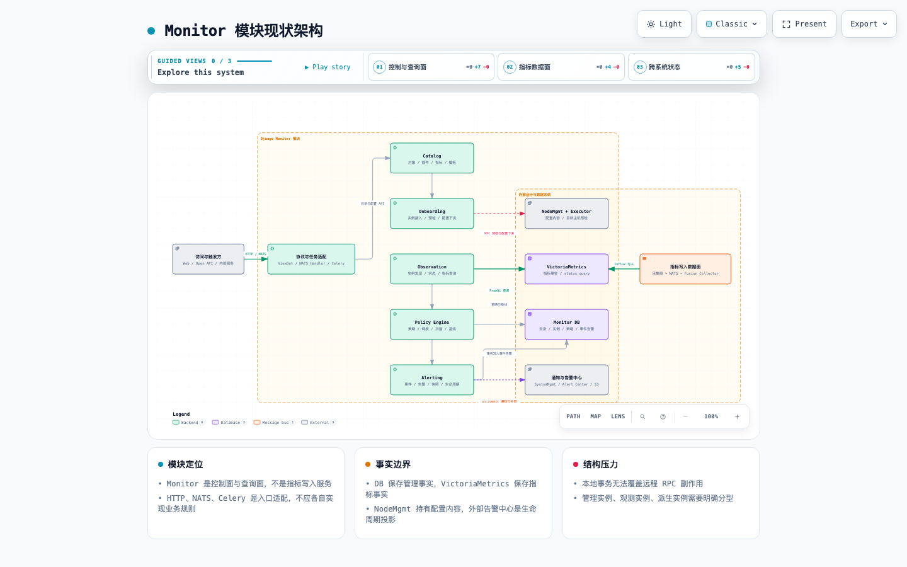
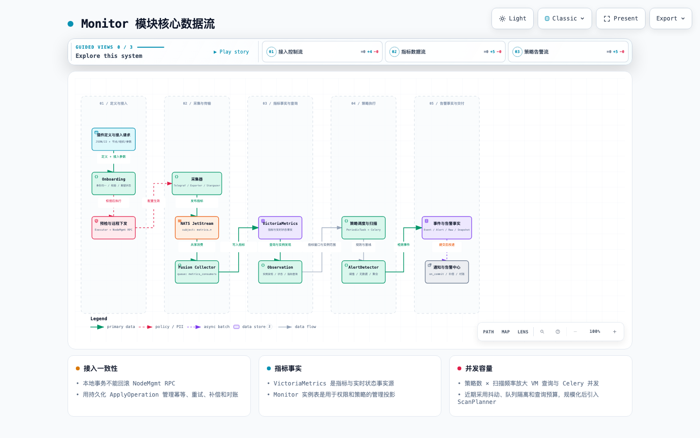
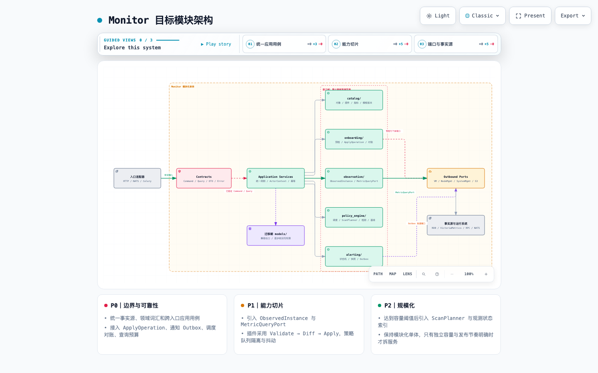

# Monitor 模块架构与代码结构分析（示例）

> 分析日期：2026-08-21
> 分析范围：`server/apps/monitor/`、`web/src/app/monitor/`，以及与指标链路直接相关的 NodeMgmt、Stargazer、Fusion Collector、VictoriaMetrics 适配。
> 分析方式：以模块职责、领域边界、事实源、数据流、并发模型和扩展点为主，不按零散技术债问题组织。

## 1. 结论摘要

Monitor 已经形成一条完整的运维监控产品闭环：

**插件定义 → 采集预检 → 实例接入与配置下发 → 指标采集 → 实例发现与视图查询 → 策略扫描 → 事件告警 → 通知与告警中心生命周期。**

它不是简单的“监控页面 + 告警任务”，而是同时承载六类能力：

1. 监控对象、插件、指标和模板目录；
2. 实例接入、采集预检和配置下发；
3. 观测实例、插件状态、指标查询和仪表盘；
4. 策略定义、周期调度、指标扫描和基线；
5. 事件、告警、原始数据和指标快照；
6. 通知渠道与外部告警中心生命周期同步。

当前最重要的架构判断不是“某个文件过大”，而是：**产品能力已按领域生长，代码仍主要按 `models / views / services / tasks / utils` 技术分层组织，领域边界和事实所有权没有被代码结构充分表达。** 这会使新增插件、对象、查询入口或策略能力时，修改范围跨越多个技术目录，并增加 HTTP、NATS、Celery 三套入口行为漂移的概率。

建议保持“模块化单体”，暂不按微服务拆分；先在 Monitor 内部建立能力切片、共享应用用例、外部端口适配和清晰的数据所有权。只有当策略扫描、指标查询或接入下发具有独立容量和发布节奏后，再评估物理拆分。

## 2. 图件

- Archify 交互式现状架构：[monitor-current.architecture.html](./monitor-current.architecture.html)
- Archify 交互式核心数据流：[monitor-core.dataflow.html](./monitor-core.dataflow.html)
- Archify 交互式目标架构：[monitor-target.architecture.html](./monitor-target.architecture.html)
- Archify 可维护规格：[现状架构 JSON](./monitor-current.architecture.json) · [核心数据流 JSON](./monitor-core.dataflow.json) · [目标架构 JSON](./monitor-target.architecture.json)

Archify HTML 支持明暗主题、缩放、搜索、关系追踪、聚焦视图、演示和图片/SVG 导出；默认使用静态模式，不启用流动动画。







## 3. 模块定位与边界

### 3.1 Monitor 是控制面和查询面，不是指标写入面

指标写入的真实链路为：

```text
Telegraf / Exporter / Stargazer
        │ Influx Line Protocol
        ▼
NATS JetStream（metrics.*）
        │ queue_group = metrics_consumers
        ▼
Fusion Collector
        │ InfluxDB write protocol
        ▼
VictoriaMetrics
```

证据：

- Telegraf 将指标发往 `metrics.${node.ip_filter}`，配置位于 [Telegraf.json](../../server/apps/node_mgmt/support-files/collectors/Telegraf.json)。
- Stargazer 将 Prometheus 文本转换为 Influx Line Protocol 后发布到 `metrics.<task_type>`，见 [nats_helper.py:246](../../agents/stargazer/tasks/utils/nats_helper.py#L246)。
- Fusion Collector 订阅 `metrics.*`，使用共享消费组并写入 VictoriaMetrics，见 [telegraf.conf:20](../../agents/fusion-collector/telegraf/telegraf.conf#L20) 和 [telegraf.conf:51](../../agents/fusion-collector/telegraf/telegraf.conf#L51)。

因此，Monitor 的核心边界应定义为：

- 管理插件、对象、实例接入、策略和告警等业务状态；
- 查询 VictoriaMetrics 中的指标事实；
- 将指标事实投影为可管理、可授权、可展示的实例和状态；
- 编排 NodeMgmt、Executor、SystemMgmt、告警中心等外部能力；
- **不拥有指标写入吞吐和时序数据持久化。**

这个边界很重要。后续指标写入性能问题应首先定位 NATS、Fusion Collector 和 VictoriaMetrics；Monitor 侧主要关注查询放大、扫描并发和状态投影成本。

### 3.2 模块内建议明确六个能力域

| 能力域 | 核心职责 | 当前主要落点 | 应拥有的业务事实 |
|---|---|---|---|
| Catalog | 对象类型、对象、插件、指标、配置/UI 模板 | `models/plugin.py`、`models/monitor_metrics.py`、`management/services/plugin_migrate.py` | 监控能力定义、版本和兼容信息 |
| Onboarding | 实例接入、参数校验、预检、配置渲染、下发与对账 | `services/node_mgmt.py`、`services/collect_detect.py`、`utils/plugin_controller.py` | 期望采集状态、接入操作状态 |
| Observation | 指标查询、实例发现、插件在线状态、搜索与视图 | `services/monitor_instance.py`、`services/effective_plugins.py`、`utils/victoriametrics_api.py` | 观测状态的投影，不拥有原始时序事实 |
| Policy Engine | 策略、调度、扫描、聚合、基线和无数据检测 | `views/monitor_policy.py`、`tasks/services/policy_scan/` | 策略定义、扫描游标与基线 |
| Alerting | 事件、告警状态机、原始数据、指标快照 | `models/monitor_policy.py`、`tasks/services/policy_scan/event_alert_manager.py` | 事件和告警的业务事实 |
| Delivery | 通知渠道、告警中心投影、失败补偿 | `services/alert_lifecycle_notify.py`、`tasks/monitor_policy.py` | 投递记录、重试和对账状态 |

HTTP、NATS、Celery 不应成为新的业务域，它们应是调用上述能力的适配器。

## 4. 现状代码结构

### 4.1 规模与形态

当前规模约为：

- 后端 Monitor 生产代码约 **17,407 行 Python**，不含测试和 migration；
- 后端测试文件约 **270 个**，说明模块已经具有较强行为保护；
- 前端 Monitor 约 **54,986 行 TypeScript/TSX**；
- 内置插件资产约 **878 个 JSON**、**301 个 Jinja2 模板**。

后端仍采用典型 Django 技术分层：

```text
server/apps/monitor/
├── models/          # 多个能力域的数据模型
├── views/           # HTTP 接口、权限、部分业务编排
├── serializers/     # 输入输出与部分校验
├── services/        # 应用服务、领域服务、外部调用混合
├── tasks/           # 同步、策略扫描、通知补偿等异步入口
├── nats/            # 第二套应用 API
├── utils/           # VM、渲染、单位、查询等基础与业务工具
├── management/      # 插件和策略目录导入
└── support-files/   # 插件定义、模板和策略资产
```

该结构适合模块早期快速交付，但在当前体量下，开发者若要理解“插件接入”或“策略扫描”，必须横跨模型、视图、服务、任务和工具目录。代码结构没有直接回答“哪个能力拥有这段逻辑”。

### 4.2 入口呈多协议、多执行形态

Monitor 的公开 HTTP 路由已经覆盖对象、指标、实例、策略、插件、事件、告警、采集检测和代理接口，见 [urls.py:20](../../server/apps/monitor/urls.py#L20)。应用启动时还注册 NATS 权限和 Monitor Handler，见 [apps.py:8](../../server/apps/monitor/apps.py#L8)。周期任务同时来自静态 Beat 配置和数据库 `PeriodicTask`。

这意味着一个业务用例可能从三种入口触发：

```text
HTTP ViewSet ─┐
NATS Handler ─┼─> 应用用例 ─> 领域能力 ─> 外部端口
Celery Task ──┘
```

目标不是删除这些入口，而是让它们共享同一个应用用例。入口只负责协议转换、鉴权上下文、幂等键和响应映射，不能各自实现一套业务规则。

### 4.3 前端是页面型结构，公共监控能力尚未形成稳定内核

前端功能覆盖接入、资产、仪表盘、查询、事件、策略和模板，业务完整度较高；但代码量主要沉淀在页面、对象仪表盘和局部 Hook 中。建议区分：

- **平台内核**：API 契约、查询客户端、时间范围、刷新、缓存、权限、单位格式、通用图表和错误语义；
- **业务功能**：接入、资产、视图、策略、告警；
- **对象仪表盘包**：Host、MySQL、Kubernetes 等对象特有指标和布局。

不建议为了“统一”把所有对象仪表盘强制配置化。共性下沉到平台内核，对象差异保留独立组件，扩展性会更好。

## 5. 数据所有权与事实源

模块目前最需要补充的不是更多表，而是一份团队共同认可的事实源约定。

| 数据概念 | 当前事实源 | Monitor 中的形态 | 架构约束 |
|---|---|---|---|
| 内置插件定义 | 仓库 `support-files/plugins/` | DB 运行时投影 | 文件变更必须可验证、可预览 Diff、可追踪版本 |
| 自定义插件 | Monitor DB | `MonitorPlugin` 等 | 与内置插件明确区分来源和可编辑范围 |
| 采集期望状态 | Monitor 元数据 + NodeMgmt 配置内容 | `CollectConfig` 只保存标识和类型 | 需要一个接入操作记录串起两端状态 |
| 采集实际状态 | VictoriaMetrics 中的 `status_query` 结果 | 请求时计算或页面合并 | 不能用 `CollectConfig` 是否存在代替“在线” |
| 受管实例 | Monitor DB | `MonitorInstance` | 用于权限、组织、策略绑定和生命周期管理 |
| 自动发现实例 | VictoriaMetrics 标签，周期投影到 DB | `MonitorInstance(auto=True)` | 投影允许延迟，应记录观测时间和来源 |
| 派生实例 | VictoriaMetrics 标签 | 某些场景不存在独立 `MonitorInstance` 行 | 必须有明确身份模型，不能依赖接口特判 |
| 策略定义 | Monitor DB | `MonitorPolicy` | 策略本体是唯一事实 |
| 策略调度 | `MonitorPolicy.schedule` + `PeriodicTask` | 双份状态 | `PeriodicTask` 是可重建投影，需要定期对账 |
| 事件和告警 | Monitor DB | `MonitorEvent`、`MonitorAlert` | 由 Alerting 域拥有，外部告警中心只是投影 |
| 原始数据和快照 | S3 | `S3JSONField` 引用 | 需要保留策略、留存周期和读取失败语义 |
| 通知渠道 | SystemMgmt | Monitor 保存通知意图 | 渠道定义不应复制进 Monitor |
| 告警中心记录 | 外部告警中心 | Monitor 保存同步状态 | 必须支持幂等投递和对账 |

内置插件文件会被逐个读取并导入 DB，单文件失败后继续处理，见 [plugin_migrate.py:106](../../server/apps/monitor/management/services/plugin_migrate.py#L106)；配置模板和 UI 模板则会与 DB 做创建、更新和删除对比，见 [plugin_migrate.py:250](../../server/apps/monitor/management/services/plugin_migrate.py#L250)。这说明文件实际上是内置目录的设计源，DB 是运行时投影，后续导入流程应显式表达这一点。

## 6. 三条核心数据流分析

### 6.1 插件接入与配置下发

当前链路：

```text
插件文件/自定义插件
  → Monitor 目录
  → 用户选择节点、组织和参数
  → CollectDetectTask 预检
  → 创建/复用 MonitorInstance、组织关系和 CollectConfig
  → 渲染 Jinja2
  → RPC NodeMgmt 写入配置内容
  → 采集器运行
```

好的设计基础：

- 采集预检已有明确的 `pending / running / success / failed` 状态和执行阶段，见 [collect_detect.py:6](../../server/apps/monitor/models/collect_detect.py#L6)；
- 接入前进行实例身份归一、插件节点选择校验和预校验，见 [node_mgmt.py:748](../../server/apps/monitor/services/node_mgmt.py#L748)；
- 模板缺失或下发失败采用失败关闭，避免生成半有效配置。

结构性限制：

实例、组织关系和 `CollectConfig` 在本地数据库事务中创建，但同一事务内部还会调用 Controller，后者进一步触发 NodeMgmt RPC，见 [node_mgmt.py:810](../../server/apps/monitor/services/node_mgmt.py#L810)。数据库回滚无法自动撤销已经成功的远程副作用，因此“外层事务包裹所有操作”只对本地数据库成立。

建议把预检任务的显式状态模型扩展为 `ApplyOperation`：

```text
VALIDATED → DB_PREPARED → REMOTE_APPLYING → APPLIED → VERIFIED
                         └──────────────→ FAILED / COMPENSATING
```

每次操作保存幂等键、目标实例、插件版本、配置摘要、远程配置 ID、阶段、错误和重试次数。数据库事务负责生成“期望状态 + 待执行操作”，异步执行器负责远程下发并对账。这样失败可以重试，超时可以查询实际结果，人工也能知道停在哪一步。

### 6.2 指标采集、实例发现与查询

Monitor 同时存在三种实例语义：

1. **ManagedInstance**：DB 中明确受管的实例，用于组织、权限、接入配置和策略绑定；
2. **ObservedInstance**：根据 VictoriaMetrics 标签观察到的实例；
3. **DerivedInstance**：Pod、Node 等派生资源，可能有指标事实但没有独立 `MonitorInstance` 行。

自动发现任务会查询每个对象的 `default_metric`，将 VM 标签转换为 `MonitorInstance(auto=True)`，并在连续不活跃后清理，见 [sync_instance.py:27](../../server/apps/monitor/tasks/services/sync_instance.py#L27) 和 [sync_instance.py:79](../../server/apps/monitor/tasks/services/sync_instance.py#L79)。有效插件查询则明确允许没有 `MonitorInstance` 行的派生实例，见 [effective_plugins.py:18](../../server/apps/monitor/services/effective_plugins.py#L18)。

这不是单点 Bug，而是领域模型尚未把三类实例表达出来。随着 Kubernetes、云资源和复合对象增加，继续用“是否有 DB 行”做分支会产生：

- 权限归属不一致；
- 实例详情、搜索和策略绑定语义不同；
- 实时状态与管理状态混合；
- 对象新增时需要复制特殊判断。

建议建立独立的 `ObservedInstanceProjection`，至少包含：

```text
observation_id
monitor_object_id
identity_labels / canonical_instance_id
parent_managed_instance_id
source_plugin_id
first_seen_at / last_seen_at
status / organization_hint
```

`MonitorInstance` 保留管理语义；观测投影可以由 VM 查询或事件流刷新。页面和策略通过明确的解析规则关联两者，不再把一个模型同时当作配置对象和实时发现结果。

同时抽象统一的 `MetricQueryPort`，集中处理：

- PromQL 模板与参数绑定；
- 时间范围、step、最大序列数和超时；
- 标签到实例身份的转换；
- 缓存和批量查询；
- 错误分类、降级与可观测性。

例如当前有效插件状态会按插件逐个发起 VM 查询，见 [effective_plugins.py:71](../../server/apps/monitor/services/effective_plugins.py#L71)。对象或插件数量增长时，这类“业务循环内调用指标后端”的实现需要被查询预算和批量规划约束。

### 6.3 策略扫描、事件告警与通知

策略扫描内部已经有较好的职责分解：`MetricQueryService`、`AlertDetector`、`EventAlertManager` 和 `SnapshotRecorder` 由 `MonitorPolicyScan` 编排，见 [scanner.py:20](../../server/apps/monitor/tasks/services/policy_scan/scanner.py#L20)。

事件、告警、原始数据和告警升级被放在同一数据库事务中，通知通过 `transaction.on_commit` 在提交后触发，见 [event_alert_manager.py:108](../../server/apps/monitor/tasks/services/policy_scan/event_alert_manager.py#L108)。这是应保留的正确边界：先确认告警事实，再产生外部副作用。

当前调度模型是每个策略创建一个 `PeriodicTask`，见 [monitor_policy.py:384](../../server/apps/monitor/views/monitor_policy.py#L384)；每个任务调用具备单例保护的 `scan_policy_task`，并对漏跑周期做有上限的补偿，见 [tasks/monitor_policy.py:23](../../server/apps/monitor/tasks/monitor_policy.py#L23)。

该模型在策略数量较小时简单可靠，但容量增长近似为：

```text
单位时间扫描成本
≈ 到期策略数
× 每策略目标实例/指标数
× 时间窗口与聚合复杂度
× VM 查询和结果序列数
```

需要分两步演进：

**近期保留每策略任务：**

- 创建策略时加入调度抖动，避免整点同时触发；
- 策略扫描使用独立队列，并设置 worker 并发和 VM 查询并发上限；
- 为单策略设置最大实例数、最大指标数、最大时间窗口和执行超时；
- 建立 `MonitorPolicy.schedule` 与 `PeriodicTask` 的对账任务；
- 指标查询、检测、落库和通知分别记录耗时、数量与失败类型。

**规模达到阈值后引入 ScanPlanner：**

- 固定频率查询“当前到期策略”，生成扫描分片；
- 按对象、数据源、组织或查询模板合并可共享的 VM 查询；
- 分片设置租约、幂等键和截止时间；
- 扫描执行和调度状态解耦，不再依赖每策略一个 Beat 行。

通知方面，当前已有每 5 分钟运行的告警中心补偿任务，见 [config.py:12](../../server/apps/monitor/config.py#L12)，并限制单批数量和最大重试次数，见 [tasks/monitor_policy.py:99](../../server/apps/monitor/tasks/monitor_policy.py#L99)。长期建议将 `on_commit` 回调改为写 `NotificationOutbox`，由独立消费者投递；这样即使 worker 在提交后、发送前崩溃，通知意图也不会丢失。

## 7. 结构性不合理设计与影响

这里按“架构主题”而不是按单文件问题归纳。

### 7.1 目录按技术分层，改动按业务能力发生

**现状：** 同一用例跨 `views / serializers / services / utils / tasks / models`；同一技术目录包含多个领域。

**影响：** 修改边界扩大，代码所有权不清晰；新人难以从目录理解产品链路；局部重构容易遗漏 NATS 或异步入口。

**方向：** 按 Catalog、Onboarding、Observation、Policy Engine、Alerting 切片，每个切片内部再保留 `models / services / tests` 等小分层。

### 7.2 HTTP、NATS、Celery 被当成业务实现位置

**现状：** HTTP ViewSet、NATS Handler 和 Celery Task 都可能进行输入归一、权限判断和业务编排。

**影响：** 同一能力从不同入口调用时，默认值、校验、权限、错误码和事务语义可能逐渐漂移。

**方向：** 建立共享 Command/Query 与 Application Service。协议层只转换输入输出；权限通过统一 `ActorContext` 进入用例。

### 7.3 期望状态、远程配置和实际观测缺少统一操作模型

**现状：** `CollectConfig` 保存元数据，配置内容在 NodeMgmt，运行状态来自 VM；一次接入横跨本地事务和远程 RPC。

**影响：** 超时后的真实结果难判断，局部成功难补偿，重复提交幂等性依赖各层偶然实现，运维人员难以对账。

**方向：** `DesiredCollectionState + ApplyOperation + ObservedCollectionState` 三层模型，明确幂等、重试、补偿和一致性窗口。

### 7.4 管理实例和观测实例没有形成一等概念

**现状：** DB 实例、VM 标签实例和无 DB 行的派生实例在不同接口中被临时合并。

**影响：** 新增复合对象时权限、组织、搜索、详情和策略源行为容易不一致；实例同步也承担了过多语义。

**方向：** 管理模型与观测投影分离，通过显式 Identity Mapping 关联。

### 7.5 查询和策略执行缺少统一容量治理点

**现状：** 页面、状态查询、实例同步、规则分组和策略扫描都可直接查询 VM；查询构造与并发控制分散。

**影响：** 实例数、插件数和策略数增长后，容易形成查询放大、整点惊群、Celery 队列阻塞和 VM 高基数压力。

**方向：** 所有查询通过 `MetricQueryPort/Planner`，统一预算、超时、缓存、批量、限流和指标；策略队列与普通任务隔离。

### 7.6 插件目录是数据驱动架构，但缺少发布语义

**现状：** 文件逐个导入，单文件失败继续；模板再分批同步。运行库可能在一次导入后处于“部分新版本”。

**影响：** 插件规模越大，定义、模板、指标和 UI 之间越容易出现版本不一致；回滚和变更审阅困难。

**方向：** 保留配置驱动优势，引入 `Validate → Plan/Diff → Apply → Reconcile`：

- manifest 声明插件 schema 版本、最低平台版本和摘要；
- CI 校验对象、指标、模板、UI 和策略引用完整性；
- 应用前输出新增/修改/删除计划；
- 同一插件版本原子生效；
- 保留上一版本与回滚入口。

## 8. 目标代码结构

建议渐进调整为：

```text
server/apps/monitor/
├── catalog/
│   ├── models.py
│   ├── plugin_registry.py
│   ├── import_plan.py
│   └── services.py
├── onboarding/
│   ├── models.py              # DesiredCollectionState / ApplyOperation
│   ├── commands.py
│   ├── preflight.py
│   ├── apply.py
│   └── reconcile.py
├── observation/
│   ├── models.py              # ObservedInstanceProjection
│   ├── identity.py
│   ├── metric_query.py
│   ├── instance_discovery.py
│   └── plugin_status.py
├── policy_engine/
│   ├── models.py
│   ├── scheduler.py
│   ├── scan_planner.py
│   ├── scanner.py
│   ├── detector.py
│   └── baseline.py
├── alerting/
│   ├── models.py
│   ├── state_machine.py
│   ├── event_manager.py
│   ├── snapshot.py
│   └── outbox.py
├── application/
│   ├── commands.py
│   ├── queries.py
│   └── actor_context.py
├── contracts/
│   ├── dto.py
│   └── errors.py
└── adapters/
    ├── http/
    ├── nats/
    ├── celery/
    ├── victoria_metrics/
    ├── node_mgmt/
    ├── system_mgmt/
    └── s3/
```

迁移时不应一次性搬目录。推荐选择一条端到端链路作为样板，例如“查询实例有效插件”：

1. 先定义 Query、DTO 和统一错误；
2. 把 VM 查询收口到 Observation 的端口；
3. HTTP 和 NATS 同时调用同一 Query Handler；
4. 原入口保留薄兼容层；
5. 测试行为不变后，再迁移下一条链路。

前端建议结构：

```text
web/src/app/monitor/
├── platform/
│   ├── api-contracts/
│   ├── query-client/
│   ├── time-range/
│   ├── refresh-cache/
│   ├── permissions/
│   └── widgets/
├── features/
│   ├── integrations/
│   ├── assets/
│   ├── views/
│   ├── policies/
│   └── alerts/
└── dashboards/
    ├── shared/
    └── objects/
```

## 9. 优化路线与优先级

### P0：边界和可靠性基线（2–4 周）

| 动作 | 目的 | 验收 |
|---|---|---|
| 发布事实源与领域词汇表 | 统一“实例、配置、状态、策略、告警”的含义 | 新需求评审必须标明读写哪个事实源 |
| HTTP/NATS 共用 Application Service | 消除多入口业务漂移 | 同一用例跨入口具有相同校验和错误语义 |
| 新增接入 `ApplyOperation` | 管理跨 DB/RPC 一致性 | 超时、失败、重复请求均可查询、重试和对账 |
| 新增 `NotificationOutbox` | 避免提交后进程崩溃丢通知 | 告警事实与投递意图原子落库，消费者幂等 |
| VM 查询预算和监控 | 先建立容量护栏 | 每类查询有超时、序列数、并发和耗时指标 |
| 策略调度对账 | 修复双份状态潜在漂移 | 能重建缺失任务并清理孤儿任务 |

### P1：能力切片和扩展机制（1–2 个月）

| 动作 | 目的 | 验收 |
|---|---|---|
| 逐用例迁移到能力目录 | 让代码结构表达业务所有权 | 新增能力主要在一个切片内完成 |
| 建立 `ObservedInstanceProjection` | 分离管理状态和观测事实 | 派生实例、自动发现实例有统一身份和权限规则 |
| 统一 `MetricQueryPort` | 控制查询放大和高基数风险 | 页面、同步、状态、策略复用同一查询治理能力 |
| 插件 Validate/Diff/Apply | 建立插件版本发布语义 | 导入前可预览，失败不留下半版本状态，可回滚 |
| 策略队列隔离、抖动和限流 | 控制并发尖峰 | 策略峰值不阻塞接入和普通异步任务 |

### P2：规模化能力（季度级，达到阈值再做）

| 动作 | 触发条件 | 目标 |
|---|---|---|
| ScanPlanner 与分片批处理 | 策略任务数或 VM 查询峰值接近预算 | 合并查询、水平扩展、明确租约与截止时间 |
| 观测状态物化索引 | 页面实时查询 VM 的成本或延迟不可接受 | 常用状态查询稳定在可控延迟 |
| 统一 HTTP/NATS Schema | 多语言调用方或接口版本增长 | 自动生成契约、兼容检查和客户端 |
| 前端 Monitor Platform Kernel | 对象仪表盘和查询页面持续增加 | 统一时间、刷新、缓存、图表和错误体验 |

## 10. 后续架构设计提醒

开发和评审 Monitor 需求时，至少检查以下问题：

1. **这项数据的唯一事实源是谁？** DB、插件文件、NodeMgmt、VictoriaMetrics、S3、SystemMgmt 不能互相替代。
2. **这是管理状态还是观测状态？** “已配置”不等于“正在上报”，“VM 有标签”也不等于“已受管”。
3. **是否跨越本地事务和远程副作用？** 一旦跨越，必须设计幂等键、持久化操作状态、重试、补偿和对账。
4. **HTTP、NATS、Celery 是否调用同一应用用例？** 不要在新入口复制校验和编排。
5. **指标查询的容量是多少？** 明确最大时间范围、step、序列数、插件数、实例数、超时、并发和缓存策略。
6. **周期任务是否会同一时间触发？** 默认加入抖动和队列隔离，避免整点惊群。
7. **失败是否可观察？** 必须记录操作 ID、策略 ID、实例 ID、阶段、远端请求 ID和重试状态，避免只留一条异常日志。
8. **插件变更是否具备版本和兼容性？** 对象身份键、指标名、模板字段和策略引用都属于兼容契约。
9. **告警状态由谁拥有？** Monitor 的事件告警是事实，通知渠道和外部告警中心是投影；外部失败不能回滚告警事实。
10. **是否真的需要拆服务？** 只有独立容量、故障隔离、团队所有权或发布节奏已经明确时才拆；目录边界不清时拆服务只会把函数调用变成不可靠网络调用。

## 11. 进入实施前需要确认的容量参数

下列参数会决定 P1/P2 的具体方案，目前无法仅从代码得出，建议由产品、运维和研发共同确认：

- 未来 12 个月的受管实例数、观测实例数及标签基数；
- 内置和自定义插件数量，以及单对象最大有效插件数；
- 策略总量、最短扫描周期、单策略最大目标实例数；
- VictoriaMetrics 可接受的查询并发、超时、最大序列数和高峰 QPS；
- 自动发现实例的保留时间、消失判定和历史查询要求；
- 派生资源是否需要独立权限、组织归属、策略绑定和告警历史；
- NodeMgmt 创建/更新配置接口的幂等语义，以及是否支持查询下发结果；
- Monitor 与外部告警中心之间，关闭、恢复、认领等动作的最终所有权。

这些数据确定前，可以完成 P0 的边界收口和可靠性建设；不建议提前实现复杂的 ScanPlanner 或拆分独立微服务。
