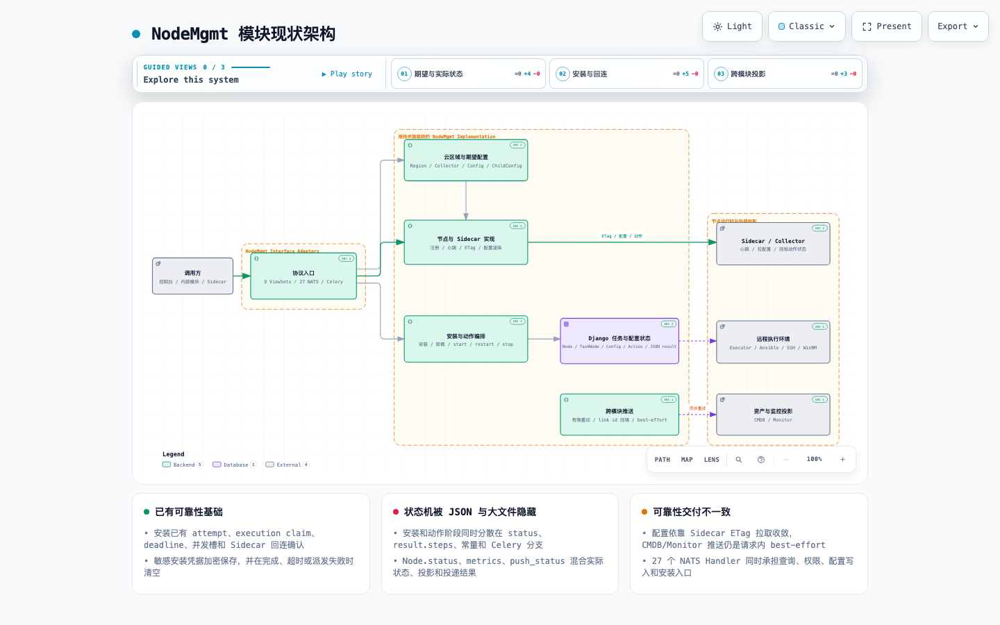
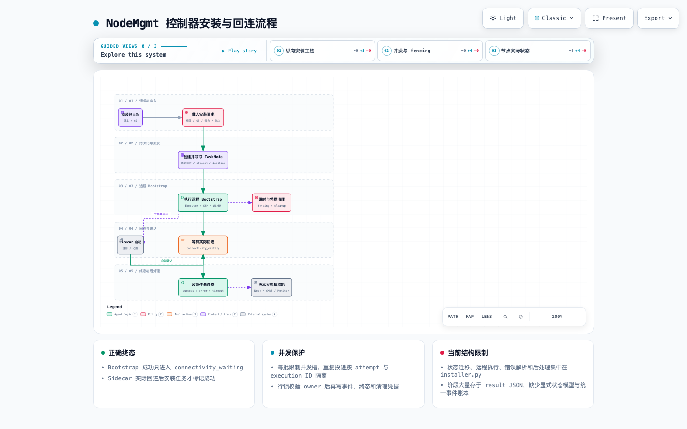
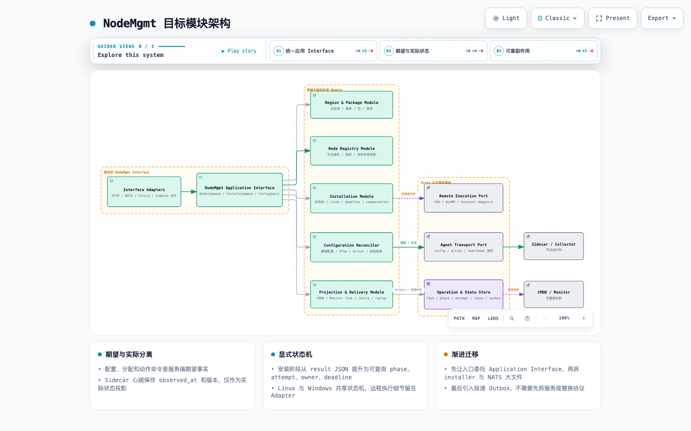

# NodeMgmt 模块架构与代码结构分析

> 分析日期：2026-08-21
> 分析范围：`server/apps/node_mgmt/`，以及与节点安装、Sidecar、Executor、NATS、CMDB、Monitor 直接相关的边界。
> 分析方式：按节点生命周期、期望/实际状态、远程副作用、并发和补偿整体分析，不按零散技术债组织。

## 1. 结论摘要

NodeMgmt 是节点运行控制面，不只是“节点列表”。它承载五类核心能力：

1. 云区域、代理服务、安装包和版本目录；
2. 节点身份、组织归属、Sidecar 注册和心跳；
3. 控制器/采集器安装、卸载、重试和远程执行；
4. 采集器期望配置、节点分配、动作下发和状态收敛；
5. 向 CMDB、Monitor 投影节点和关联 ID。

模块已有较强的远程操作可靠性基础：安装批次限制并发槽；TaskNode 保存 attempt、execution phase、deadline；Windows 执行使用 execution ID fencing；派发、完成和超时时在行锁下校验 owner；安装命令成功后还要等待 Sidecar 实际回连；敏感凭据加密保存并在终态清空。

当前最大问题不是缺少重试，而是**可靠性规则没有形成显式、可复用的 Module**：安装状态机、Linux/Windows 执行、事件解析、凭据生命周期、超时和后处理集中在 1,676 行 `tasks/installer.py`；节点实际状态、投递状态和执行细节大量隐藏在 JSON；HTTP、27 个 NATS Handler、Celery 和 Sidecar API 仍可能各自承担业务规则。

另一个关键不一致是：配置下发采用 Sidecar 拉取 + ETag，具备持续收敛特征；CMDB/Monitor 推送却仍是请求内有限重试和 best-effort。进程退出或持续故障后没有持久化投递意图，`push_status` 只能记录最后一次同步调用结果，不能替代 Outbox。

建议继续保持模块化单体，先建立统一 NodeMgmt Application Interface、显式安装状态机和持久化 Delivery Outbox；随后拆分 Remote Execution Port 与 Agent Transport Port。暂不需要先拆服务或替换 NATS。

## 2. 图件

- Archify 交互式现状架构：[node-mgmt-current.architecture.html](./node-mgmt-current.architecture.html)
- Archify 交互式安装与回连流程：[node-mgmt-install.workflow.html](./node-mgmt-install.workflow.html)
- Archify 交互式目标架构：[node-mgmt-target.architecture.html](./node-mgmt-target.architecture.html)
- Archify 可维护规格：[现状 JSON](./node-mgmt-current.architecture.json) · [安装流程 JSON](./node-mgmt-install.workflow.json) · [目标 JSON](./node-mgmt-target.architecture.json)







## 3. 模块边界与事实所有权

### 3.1 NodeMgmt 拥有节点运行管理事实，CMDB 拥有资产事实

| 数据概念 | 事实源 | 说明 |
|---|---|---|
| 节点 ID、云区域、组织、安装方式 | NodeMgmt DB | NodeMgmt 的节点管理事实 |
| 采集器、配置模板、子配置、节点分配 | NodeMgmt DB | 服务端期望状态 |
| 安装/卸载/动作任务及节点结果 | NodeMgmt DB | 远程操作状态与审计 |
| Sidecar/Collector 实际运行状态 | 节点运行时 | `Node.status/metrics` 是请求时写入的观测投影 |
| 资产模型、实例和关系 | CMDB Graph | NodeMgmt 只保存 `cmdb_id` 关联指针 |
| 监控实例和接入状态 | Monitor | NodeMgmt 只保存 `monitor_id` 关联指针 |
| Executor/Ansible 任务 | 外部执行环境 | NodeMgmt 保存 operation/task 映射与终态，不复制执行器内部事实 |

`Node` 同时保存 `status`、`metrics`、`push_status` 以及 CMDB/Monitor link ID，见 [sidecar.py:32](../../server/apps/node_mgmt/models/sidecar.py#L32)。后续必须区分：

- **Desired**：服务端配置、分配和动作命令；
- **Observed**：Sidecar 最后一次心跳、Collector 状态和版本；
- **Projected**：CMDB/Monitor 投递与关联结果。

三者不能继续仅靠几个 JSON 字段和 `updated_at` 推断。

### 3.2 建议明确五个能力域

| 能力域 | 职责 | 当前落点 | 应拥有的事实/规则 |
|---|---|---|---|
| Region & Package | 云区域、区域服务、环境、代理、包和版本 | `services/cloudregion.py`、`package.py`、`version_discovery.py` | 区域连接信息、部署/健康投影、包兼容矩阵 |
| Node Registry | 节点身份、组织、Sidecar 注册、心跳、可见范围 | `services/sidecar.py`、`node.py`、`models/sidecar.py` | node ID、管理属性、最后观测时间和实际状态投影 |
| Installation | 控制器/采集器安装、卸载、重试、凭据和回连 | `tasks/installer.py`、`services/installer.py`、`windows_remote_bootstrap.py` | operation、phase、attempt、owner、deadline 和终态 |
| Configuration Reconciler | 配置模板、子配置、节点分配、ETag、动作和回报 | `nats/node.py`、`sidecar_config.py`、`action_task.py` | 期望版本、应用版本、动作状态和偏差 |
| Projection & Delivery | CMDB/Monitor upsert、retire、link 回填和补偿 | `module_push.py`、`module_ingest.py`、`module_link.py` | 投递意图、尝试、结果、死信和对账状态 |

HTTP、NATS、Sidecar API 和 Celery 是 Adapter，不是新的能力域。

## 4. 现状代码结构

### 4.1 规模与热点

生产代码约 **16,888 行 Python**，不含测试和 migration；测试文件约 **51 个**。主要热点：

- `tasks/installer.py`：1,676 行；
- `nats/node.py`：1,041 行；
- `services/sidecar.py`：1,036 行；
- `services/cloudregion.py`：764 行；
- `windows_remote_bootstrap.py`：682 行；
- `services/node.py`：664 行；
- `views/sidecar.py`：661 行。

当前目录按 `views / services / tasks / nats / models / utils` 分层。开发者修改“安装后回连”需要同时理解 View、Service、Celery、Sidecar heartbeat、TaskNode JSON 和超时任务；修改“配置生效”则要横跨 NATS、M2M、信号、缓存、模板渲染和 Agent 拉取。这说明代码结构没有直接表达能力所有权。

### 4.2 多协议入口尚未完全收口

模块注册 9 组 ViewSet，见 [urls.py:15](../../server/apps/node_mgmt/urls.py#L15)；应用启动时注册 NATS 和 signals，见 [apps.py:8](../../server/apps/node_mgmt/apps.py#L8)；`nats/node.py` 注册约 27 个 Handler，混合：

- 节点查询和权限；
- 云区域秘密/代理查询；
- 采集器与配置导入；
- 父/子配置批量创建、更新和删除；
- 安装入口与任务查询。

`node_list` 仍接受消息体中的 `skip_permission` 和调用方自报的 `legacy_callsite`，见 [node.py:808](../../server/apps/node_mgmt/nats/node.py#L808)。虽然代码会记录告警，这仍然让 Interface 的权限语义依赖不可信 payload。相邻的 `get_nodes_by_ips` 已改为从服务端 CMDB 采集任务解析组织范围，见 [node.py:844](../../server/apps/node_mgmt/nats/node.py#L844)，应作为迁移方向：调用方身份和数据范围必须来自可信传输上下文或服务端记录。

## 5. 核心数据流

### 5.1 控制器安装与实际回连

当前正确的主链是：

```text
安装请求
  → 权限、OS、架构、包兼容和批次校验
  → 创建 ControllerTask / TaskNode
  → 加密凭据并保存组织快照
  → 按批次并发槽 claim TaskNode
  → 写 attempt / phase / deadline
  → Executor 执行 SSH 或 WinRM Bootstrap
  → 清理敏感凭据
  → connectivity_waiting
  → Sidecar 注册/心跳
  → 行锁下确认对应 attempt
  → success / error / timeout
```

`InstallerService.install_controller` 在事务中创建 Task 和加密 TaskNode 凭据，见 [installer.py:191](../../server/apps/node_mgmt/services/installer.py#L191)。派发器在锁住主任务后计算可用并发槽、写 phase/deadline，再通过 `on_commit` 发送 installer 和 timeout，见 [installer.py:545](../../server/apps/node_mgmt/tasks/installer.py#L545)。单节点任务会检查 attempt，Windows 还会领取 execution ID；finally 清空密码、私钥和 passphrase，见 [installer.py:1069](../../server/apps/node_mgmt/tasks/installer.py#L1069)。

尤其值得保留的是：Bootstrap 成功后进入 `connectivity_waiting`，Sidecar 心跳再调用收敛任务，见 [installer.py:1123](../../server/apps/node_mgmt/tasks/installer.py#L1123)。这避免了“命令返回 0，但 Agent 未启动/无法连接”被错误标记为成功。

结构限制在于状态迁移由多个辅助函数、字符串常量、`status` 和 `result.steps` 共同表达。应提升为显式字段：

```text
phase = queued | bootstrap_running | connectivity_waiting | terminal
attempt / owner_token / lease_expires_at / deadline_at
terminal_status / failure_code / last_observed_at
```

详细步骤和原始输出可以保留 JSON，但不能再作为调度查询和并发判断的主要结构。

### 5.2 配置期望与 Sidecar 实际状态

服务端保存 Collector、CollectorConfiguration、ChildConfig 和 Node 关联。Sidecar 使用 ETag 拉取配置；模型信号在配置、关联或环境变化提交后失效相关缓存，见 [signals.py:17](../../server/apps/node_mgmt/signals.py#L17)。心跳输入会过滤服务端拥有字段，避免客户端覆盖组织和 link ID，见 [sidecar.py:422](../../server/apps/node_mgmt/services/sidecar.py#L422)。

这条链路本质上是 Reconciler：

```text
DesiredConfig(version, content hash, assignment)
        │ Sidecar pull + ETag
        ▼
AppliedConfig(version, applied_at, result)
        │ heartbeat/status
        ▼
ObservedRuntime(last_seen, collector status, version)
```

当前 ETag 能减少传输和渲染，但 ETag 相等只代表“服务端认为内容未变化”，不代表节点已成功应用。建议 Sidecar 回报 `desired_version / applied_version / applied_at / error`，页面才能区分未拉取、应用中、已应用和应用失败。

### 5.3 采集器动作与超时

批量动作先创建 `CollectorActionTask` 和每节点 TaskNode，再下发 start/restart/stop，并由 Sidecar 状态回报或 timeout 收敛，见 [node.py:256](../../server/apps/node_mgmt/services/node.py#L256) 和 [action_task.py:158](../../server/apps/node_mgmt/tasks/action_task.py#L158)。

该模型方向正确，但安装任务和动作任务拥有两套类似的主/子任务、计数、超时和回报收敛逻辑。中期应共享一个 Operation Kernel：

- 主任务/目标任务；
- phase、attempt、deadline、claim；
- command payload 和 expected observation；
- callback/observation 收敛；
- timeout、cancel 和重试。

安装和动作保留各自领域规则，不要合并成巨型通用 Workflow Engine；只复用可靠性状态内核。

### 5.4 CMDB/Monitor 投影

`ModulePushService` 会按目标同步调用 CMDB/Monitor，最多有限重试，并把结果写入 `Node.push_status`，见 [module_push.py:66](../../server/apps/node_mgmt/services/module_push.py#L66)。删除/退役使用 best-effort，失败不阻断主流程。该选择保证节点管理操作可完成，但持续故障时会永久漂移。

目标应是：

```text
Node 事务提交
  → ProjectionOutbox(node_id, target, event_version, payload_hash)
  → 独立 worker claim + retry + backoff
  → 对端幂等 ingest
  → 回填 link ID 与 delivery status
  → 定期 reconcile / dead-letter
```

`push_status` 可保留为页面投影，但事实应由 Outbox/DeliveryAttempt 表拥有。

## 6. 结构性不合理设计与影响

| 优先级 | 主题 | 现状 | 维护/扩展影响 | 并发/性能/可靠性影响 |
|---|---|---|---|---|
| P0 | 跨模块投影无持久化意图 | 同步有限重试、best-effort、结果写 Node JSON | 无统一重放、死信和对账入口 | 进程退出或持续故障后永久漂移 |
| P0 | 权限由 NATS payload 控制 | legacy `node_list` 接受 `skip_permission` | 调用方需要知道隐含白名单和危险开关 | 可信边界模糊，容易形成越权或全量查询 |
| P0 | 状态机隐藏在 JSON | phase/steps/failure 与字符串状态分散 | 新增取消、暂停、重试策略要修改大量分支 | JSON 查询依赖数据库方言，锁和索引难治理 |
| P0 | 安装任务文件职责过载 | 状态机、远程执行、错误解析、凭据和后处理同文件 | Linux/Windows 任一变化影响整条链 | worker 长占用、异常路径复杂、恢复难审计 |
| P1 | NATS 形成第二业务层 | 1,041 行 Handler/Service 混合查询、权限和配置写入 | HTTP/NATS 行为容易漂移 | 大批量事务占用 NATS handler，背压不清晰 |
| P1 | 期望与实际状态未显式建模 | ETag、Node.status 和更新时间推断生效情况 | UI/调用方无法解释“配置存在但未生效” | 重试风暴或静默失败都难识别 |
| P1 | 两套任务可靠性内核 | InstallerTask 与 CollectorActionTask 各自收敛 | attempt/timeout/cancel 规则重复 | 重复消费和超时竞态需要分别修复 |
| P1 | 缓存失效依赖 signals | 多模型 signal + on_commit 删除 ETag | bulk/脚本新路径容易遗漏失效语义 | 节点短期继续拉旧配置，难定位版本 |
| P2 | 技术目录压平能力 | Node/Config/Installer/Delivery 横跨所有目录 | 新需求修改范围和所有权不清 | 重复查询、重复批次策略难发现 |

## 7. 并发与容量模型

### 7.1 安装并发应从进程常量升级为可观察资源预算

当前派发会根据 `CONTROLLER_INSTALL_MAX_PARALLEL` 和正在 Bootstrap 的 TaskNode 计算空位。这能控制单批，但还需要：

- 云区域级并发上限，避免一个区域占满 Executor；
- 全局与租户/组织公平性；
- SSH 与 WinRM 分开预算；
- broker/worker 重启后的 stale claim 恢复；
- 排队时长、执行时长、回连时长和超时原因指标；
- API 批次行数和总凭据字节硬上限。

### 7.2 心跳路径必须保持有界

Sidecar 心跳是高频入口，不能承担无界同步工作。当前使用 ETag、状态签名和 debounce 减少重复收敛任务，见 [sidecar.py:244](../../server/apps/node_mgmt/services/sidecar.py#L244)，这是正确基础。后续应保证：

- 请求内只写本节点实际状态与轻量 observation；
- 安装/动作/投影收敛写事件或有界任务，不扫描全任务表；
- `last_seen_at`、状态版本和 collector 摘要有索引/独立字段；
- 高频原始 metrics 不无限写 Node JSON；
- 缓存故障时仍有 DB 有界路径和限流。

### 7.3 配置批量操作要有版本、上限和幂等键

NATS 中已有批量父/子配置创建和冲突收敛，但新接口仍需声明：最大节点数、最大配置字节、事务批次、配置版本、幂等键和部分失败语义。不要在单个 NATS Handler 中执行不受控的全批模板渲染、M2M 写入和缓存失效。

### 7.4 队列隔离

建议至少划分：

| 队列 | 工作负载 | 预算重点 |
|---|---|---|
| `node.interactive` | 小批量 UI 操作 | 低延迟、有界批次 |
| `node.install` | SSH/WinRM 安装与卸载 | 区域/协议并发、硬超时、fencing |
| `node.reconcile` | 回连、动作和配置收敛 | 高频、幂等、短任务 |
| `node.delivery` | CMDB/Monitor Outbox 与对账 | 不可被安装任务饿死 |
| `node.discovery` | 版本和区域健康检查 | 周期抖动、外部超时 |

## 8. 目标代码结构

```text
server/apps/node_mgmt/
├── adapters/
│   ├── inbound/{http,nats,celery,sidecar_api}/
│   └── outbound/{executor,ssh,winrm,cmdb,monitor}/
├── application/
│   ├── node_commands.py
│   ├── install_commands.py
│   ├── config_commands.py
│   └── queries.py
├── capabilities/
│   ├── region_package/
│   ├── node_registry/
│   ├── installation/
│   ├── configuration/
│   └── delivery/
├── ports/
│   ├── remote_execution.py
│   ├── agent_transport.py
│   └── projection.py
└── operational/
    ├── operation_state.py
    ├── leases.py
    └── outbox.py
```

迁移顺序：先建立 Application Interface 并让旧入口委托；再把远程执行细节移入 Adapter；然后把 phase/attempt/deadline 提升为显式状态；最后移动目录和引入 Outbox。不要一次性搬动整个模块。

## 9. 分阶段优化计划

### 近期 P0

1. 建立 `NodeMgmt Application Interface`，HTTP/NATS/Celery 不再直接实现安装、配置和权限规则。
2. 移除消息体 `skip_permission`，由可信调用方身份或服务端任务解析数据范围。
3. 为 CMDB/Monitor 投影增加 Outbox、attempt、next_retry_at、lease 和 dead-letter。
4. 把安装 `phase / attempt / deadline / owner` 提升为显式字段；JSON 只保留步骤详情。
5. 配置 node.install/node.reconcile/node.delivery 独立队列和并发预算。
6. 为 Sidecar 回报增加 `desired_version / applied_version / applied_at / error`。

完成标准：持续下游故障可自动恢复；权限不依赖 payload 开关；重复安装投递不会启动过期 attempt；页面能区分期望配置和实际应用状态。

### 中期 P1

1. 拆出 `InstallationStateMachine`、`RemoteExecutionPort` 和 Linux/Windows Adapter。
2. 提取安装/动作共享的 operation、claim、timeout 和 observation 收敛内核。
3. 将 `nats/node.py` 缩为输入 DTO、可信调用上下文和应用用例委托。
4. 将 ETag 失效从隐式 signal 规则收敛为 Configuration Module 的版本变更事件。
5. 建立 Sidecar/Server 双向协议版本和兼容测试。

### 长期 P2

1. 按能力目录迁移，建立依赖规则测试。
2. 按云区域/节点量建立分片、配额和容量基线。
3. 只有当远程安装或 Agent Transport 具备独立扩缩容、故障和发布需求时再评估物理拆分。

## 10. 开发提醒

1. 远程命令成功不等于节点可用；安装必须等待 Sidecar 实际回连。
2. 新任务必须声明 phase、attempt、owner、deadline、timeout、cancel 和 stale recovery。
3. 敏感凭据必须加密、write-only、最短留存，并在所有终态和派发失败路径清空。
4. Sidecar 只能写客户端拥有字段；组织、link ID、期望配置等服务端字段必须 fail closed。
5. NATS payload 不能决定 `skip_permission` 或授权组织；权限来自可信传输上下文/服务端记录。
6. ETag 只说明期望内容未变，不证明节点已应用；必须保存 applied version 和 observation time。
7. 新批量接口必须限制节点数、配置字节、并发、事务批次和超时。
8. 新外部副作用必须持久化 operation/outbox；日志和 `push_status` 不能替代投递账本。
9. 不要在心跳请求内做跨模块同步调用或全表扫描。
10. 新 OS/架构只实现 Remote Adapter 和兼容矩阵，不复制安装状态机。

## 11. 验证

三份 Archify 规格均以 `showcase` 质量档通过 9 项结构校验，代码证据引用已验证。HTML 在 1440×900、1600×1000、1920×1080 和 2048×1320 视口下无横向/纵向溢出，并人工检查明暗主题。

后续建议增加：安装状态机 contract test、重复投递/fencing 测试、Sidecar 协议版本测试、Outbox 崩溃恢复测试、云区域并发容量测试，以及禁止 inbound adapter 被能力模块反向依赖的架构测试。
