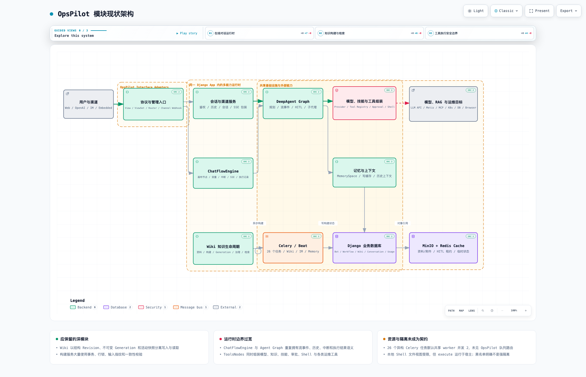
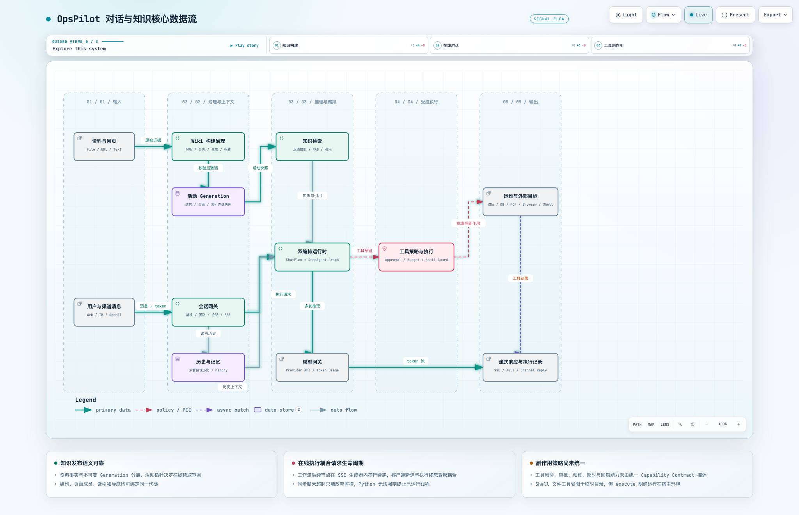
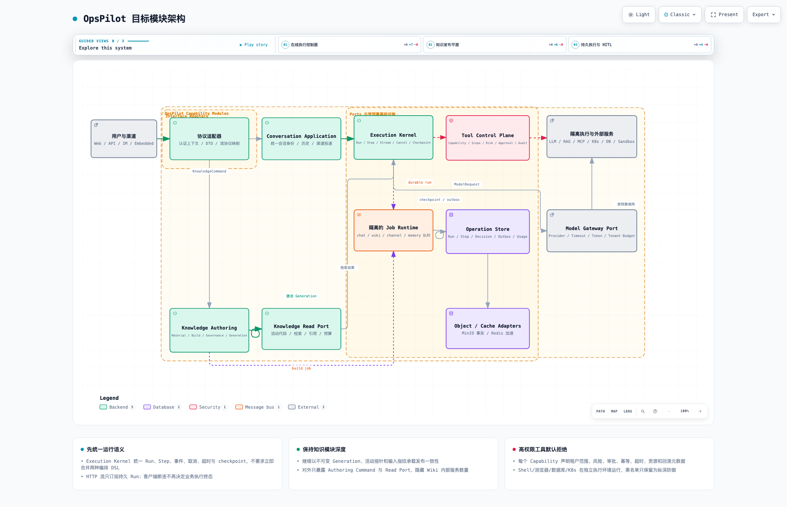

# OpsPilot 模块架构与代码结构分析

> 分析日期：2026-08-21
> 分析范围：`server/apps/opspilot/`，以及其直接依赖的 Django、Celery、Redis、MinIO、LLM Provider、Metis/RAG、MCP、数据库、Kubernetes、Browser 和渠道边界。
> 分析方式：以“知识构建—会话接入—推理编排—工具副作用—流式回传”的完整闭环为主，分析能力边界、事实所有权、执行生命周期、并发容量和安全隔离，不按单个技术债组织。

## 1. 结论摘要

OpsPilot 不是一个普通的“机器人模块”，而是在同一 Django App 内承载了至少八类能力：

1. 模型供应商、模型和 Token Usage 管理；
2. Skill Package、工具注册和运行时组装；
3. Bot、渠道、会话和多协议接入；
4. ChatFlow 画布工作流运行时；
5. DeepAgent 规划、流式事件、HITL 和工具执行运行时；
6. Memory 和对话上下文；
7. Wiki 资料、构建、治理、不可变 Generation 和检索；
8. Celery 异步构建、渠道回复和后台维护。

不含测试和 migration，模块约有 **115,372 行生产 Python**、约 **259 个测试文件**。体量本身不是问题；真正的问题是模块内存在两种截然不同的成熟度：

- **Wiki 是应保留的深模块**：资料事实、结构 Revision、不可变 Generation、活动指针、页面成员和索引快照已经形成清晰发布语义；关键路径大量使用事务、行锁、输入指纹和一致性校验。
- **在线运行时仍是横向组合**：ChatFlowEngine 与 DeepAgent Graph 重复拥有流事件、历史、中断、执行结果和超时语义；4,068 行的 `ToolsNodes` 同时组装模型、知识、技能、审批、Shell、Kubernetes、数据库和浏览器工具。

当前最需要处理的四个结构性风险是：

- **高权限工具缺少可证明的强隔离边界**：文件工具被限制在临时目录，但代码明确说明 `execute` 运行在宿主环境；ShellGuard 是默认放行的字符串黑名单，可通过环境变量关闭，也明确声明不是容器级隔离。
- **业务执行生命周期与 HTTP/SSE 生命周期耦合**：流式工作流在响应生成器内继续执行后续节点；同步 Agent 超时后只能让调用方放弃等待，Python 无法强制终止已运行线程。断连、超时和 worker 回收因此可能与业务终态漂移。
- **运行语义存在双实现**：ChatFlowEngine 与 Agent Graph 分别处理 stream、history、HITL、interrupt、usage、attachment 和 result；修复一个协议或状态问题需要判断两套路径是否都覆盖。
- **异构后台任务没有资源舱壁**：`tasks.py` 约 2,026 行、包含约 26 个 Celery task，覆盖聊天、IM、Memory 和 Wiki；全局 Celery 默认并发只有 2，未见 OpsPilot 专属 task route。长 Wiki/LLM 任务可以阻塞低延迟消息任务。

建议继续保持模块化单体，但按能力收敛内部边界。短期先把高权限工具变成默认拒绝的 Capability Contract，落独立执行环境，并建立队列与资源预算；随后建立持久化 Execution Kernel，统一 Run、Step、事件、取消、超时、HITL 和 checkpoint 语义。不要立即合并 ChatFlow DSL 与 Agent DSL，也不要拆掉 Wiki 已有的 Generation 内核。

## 2. 图件

- Archify 交互式现状架构：[opspilot-current.architecture.html](./opspilot-current.architecture.html)
- Archify 交互式核心数据流：[opspilot-chat-knowledge.dataflow.html](./opspilot-chat-knowledge.dataflow.html)
- Archify 交互式目标架构：[opspilot-target.architecture.html](./opspilot-target.architecture.html)
- Archify 可维护规格：[现状 JSON](./opspilot-current.architecture.json) · [核心数据流最终 JSON](./opspilot-chat-knowledge.dataflow.json) · [目标 JSON](./opspilot-target.architecture.json)

核心数据流曾交付一版 790 高度规格；多视口检查发现其在 1440×900 下纵向溢出 16px。依据 Archify 冻结交付规则，原规格 [opspilot-chat-knowledge.dataflow.json](./opspilot-chat-knowledge.dataflow.json) 保留为交付证据，最终规格以 `v2` 为准。三张最终 HTML 均通过 9/9 showcase 检查、0 composition errors/warnings，以及 1440×900、1600×1000、1920×1080、2048×1320 明暗主题视觉检查。

HTML 支持明暗主题、缩放、搜索、关系追踪、聚焦视图、演示和 PNG/SVG 等导出；不依赖 draw.io。







## 3. 能力边界与事实所有权

### 3.1 建议明确八个能力域

| 能力域 | 核心职责 | 当前主要落点 | 应拥有的事实/规则 |
|---|---|---|---|
| Model Catalog | 模型供应商、模型、密钥、能力与使用量 | `models/model_mgmt.py`、`services/chat_service.py`、`metis/llm/common/` | ModelIdentity、Capability、ProviderPolicy、Usage |
| Skill Catalog | Skill Package、工具定义、依赖和版本 | `services/skill_package/`、`models/model_mgmt.py` | SkillVersion、ToolDescriptor、依赖清单和发布状态 |
| Conversation | 会话身份、参与者、历史、渠道投递 | `services/skill_channel_chat_service.py`、`models/bot_mgmt.py`、`models/skill_channel_mgmt.py` | ConversationId、Participant、Message、Delivery |
| Workflow Runtime | 画布 DSL、节点、变量、分支和工作流执行 | `utils/chat_flow_utils/` | WorkflowDefinition、Run、NodeStep、VariableSnapshot |
| Agent Runtime | 规划、模型循环、工具意图、流事件和 HITL | `metis/llm/chain/`、`metis/llm/agent/` | AgentRun、ModelStep、ToolIntent、Interrupt |
| Tool Control | 工具授权、租户范围、风险、审批、资源与回滚 | 当前分散在 `node.py`、middleware 和具体工具 | CapabilityContract、ApprovalDecision、ExecutionReceipt |
| Knowledge | 资料、结构、Generation、页面、证据、治理和检索 | `services/wiki/`、`models/wiki_mgmt.py` | Material、Revision、Generation、Evidence、ReadScope |
| Memory | MemorySpace、写缓存、摘要和上下文装配 | `memory/`、`models/memory_mgmt.py`、`tasks.py` | MemoryEntry、WriteIntent、FlushCheckpoint |

HTTP、OpenAI Compatible API、AGUI、WebChat、微信公众号、企业微信、钉钉和 Celery 应只是 Interface Adapter 或 Job Adapter，不应再次拥有会话、权限和执行状态规则。

### 3.2 Wiki 的事实层级值得保留

Wiki 已经区分：

```text
Material / MaterialVersion             原始资料事实
WikiStructureRevision                  不可变结构快照
WikiGeneration                         一次发布候选或历史代际
WikiGenerationPage / Index / Overview  代际内冻结的读取投影
WikiKnowledgeBase.active_generation    在线读取的唯一活动指针
BuildRecord                            构建进度、输入指纹、预算与 checkpoint
CheckItem / WikiDecisionRule           人工治理与可回放决策
```

`WikiGeneration` 明确区分 preparing、ready、active、superseded、failed 和 cancelled，见 [wiki_mgmt.py:333](../../server/apps/opspilot/models/wiki_mgmt.py#L333)；Generation 页面成员具有唯一约束和活动状态检查，见 [wiki_mgmt.py:381](../../server/apps/opspilot/models/wiki_mgmt.py#L381)；激活入口使用事务和锁裁决活动代际，见 [generation_service.py:946](../../server/apps/opspilot/services/wiki/generation_service.py#L946)。

目标不是把几十个 Wiki service 重新揉成一个大类，而是给外部只暴露两个窄接口：

```text
KnowledgeAuthoringCommand  # 导入、构建、治理、发布、回滚
KnowledgeReadPort          # 活动代际、检索、引用、导航
```

内部服务数量可以多，但外部不能依赖其编排顺序、模型表和中间 stage。

## 4. 现状代码结构

### 4.1 规模与热点

生产代码按主要目录大致分布：

| 目录 | 生产 Python 行数 | 主要含义 |
|---|---:|---|
| `metis/` | 50,710 | Agent Graph、模型、工具和 loader |
| `services/` | 38,635 | Wiki、渠道、模型、技能和应用服务 |
| `utils/` | 9,391 | ChatFlow、HITL、审批、附件和通用运行工具 |
| `viewsets/` | 7,294 | 管理与 Wiki API |
| 根文件 | 3,959 | views、tasks、urls、config 等 |
| `models/` | 2,411 | Bot、Channel、Model、Memory、Wiki 事实 |
| `serializers/` | 1,883 | 输入输出模型 |

最大热点包括：

- `metis/llm/chain/node.py`：4,068 行；
- `services/wiki/check_service.py`：2,619 行；
- `tasks.py`：2,026 行；
- `services/wiki/build_service.py`：1,980 行；
- `metis/llm/chain/graph.py`：1,857 行；
- `metis/llm/tools/browser_tool.py`：1,755 行；
- `services/wiki/directory_readiness_service.py`：1,611 行；
- `services/wiki/structure_service.py`：1,578 行；
- `viewsets/wiki_page_view.py`：1,542 行；
- `viewsets/llm_view.py`：1,343 行；
- `views.py`：1,252 行；
- `utils/chat_flow_utils/engine/engine.py`：1,197 行。

大文件不直接等于坏设计，但这些热点显示三种不同问题：Wiki 大文件通常封装复杂不变量；`ToolsNodes` 是职责不断横向累积的组合根；`views.py` 和 `tasks.py` 则把多种入口/工作负载压在同一技术文件中。

### 4.2 两套编排器重复拥有运行语义

`ChatFlowEngine` 同时负责节点选择、变量、执行上下文、同步执行、SSE/AGUI、对话历史、中断和执行结果，流式入口见 [engine.py:407](../../server/apps/opspilot/utils/chat_flow_utils/engine/engine.py#L407)。Agent 节点产生流后，后续节点仍在同一个异步生成器内串行执行，见 [engine.py:575](../../server/apps/opspilot/utils/chat_flow_utils/engine/engine.py#L575)。

`DeepAgentGraph` 也拥有 compile/invoke、流事件归一化、工具事件、HITL、usage、去重和最终消息；Agent 工厂虽然统一到 DeepAgent，见 [agent_factory.py:17](../../server/apps/opspilot/utils/agent_factory.py#L17)，但它没有替代 ChatFlow 的运行生命周期。

当前关系是：

```text
ChatFlow DSL
  → ChatFlowEngine 拥有 Run/Node/SSE/History
  → Agent 节点
  → DeepAgent Graph 再拥有 ModelStep/ToolStep/Stream/HITL/Usage
```

建议先提取共享 `Execution Kernel`，不要立即合并两个 DSL：

```text
Workflow Planner ─┐
                  ├─ Execution Kernel: Run / Step / Event / Cancel / Timeout / Checkpoint
Agent Planner ────┘
```

两种 planner 可以继续独立，但不得各自定义“什么算运行中、取消、超时、等待用户、成功或失败”。

### 4.3 `ToolsNodes` 是过宽的运行时组合根

`ToolsNodes` 从 [node.py:661](../../server/apps/opspilot/metis/llm/chain/node.py#L661) 开始，覆盖知识检索、报告工具、Kubernetes 修复、用户选择、审批、Skill Package 物化、依赖安装、临时目录、Agent 构建和多种内置运维工具。它既决定有哪些能力，也决定能力如何授权、如何运行和如何与提示词交互。

这会导致：

- 新增工具需要理解 Agent 构建和多个 middleware 的隐式顺序；
- 审批、租户身份、超时、资源和回滚无法在注册时一次验证；
- 工具风险依赖名称、提示词和局部 builder，缺少可查询的统一目录；
- 运行时按请求拼装大量描述和配置，难以做稳定缓存、版本冻结和审计复现。

应将组合根缩到：

```text
ToolCatalog.resolve(skill_version, tenant)
  → [CapabilityContract]
ToolControl.authorize(intent, caller, run)
  → ApprovalDecision / Denial
ToolExecutor.execute(contract, input, budget)
  → ExecutionReceipt
```

### 4.4 协议入口和历史模型过多

`urls.py` 同时注册模型、工具、Skill、Bot、Workflow、Memory、Wiki 等大量 Router，并显式暴露 completions、ChatFlow、attachments、interrupt、approval、choice、WebChat 和多个 IM 入口。`views.py` 又集中执行、审批、选择和各渠道入口。

持久层至少存在 `BotConversationHistory`、`WorkFlowConversationHistory`、`SkillConversationMessage` 和 `BotWebChatSession` 等不同会话/历史概念，入口还需要自行决定 team、usage_team、guest group、participant 和 channel 身份。新增一种渠道或删除策略时容易只覆盖部分历史表。

建议定义统一会话标识：

```text
ConversationIdentity = tenant + application + channel + external_session
MessageEnvelope = conversation_id + sender + role + content + idempotency_key
```

各渠道只保留外部映射；消息、参与者、保留策略和审计由 Conversation Application 统一拥有。

## 5. 核心数据流与生命周期

### 5.1 知识构建流

```text
File / URL / Text
  → Material + MaterialVersion / MinIO
  → Celery 解析、分类、生成和检查
  → BuildRecord 冻结 base_generation、structure、pipeline 和 source fingerprints
  → Candidate Generation
  → 页面成员 / 索引 / 导航 / 关系一致性校验
  → 原子切换 active_generation
  → 在线检索只读活动代际
```

这条链路的核心语义正确：构建失败不应污染在线活动代际，读取方不应在一次请求中混用多个 Generation。后续优化必须保留 `active_generation + read scope + consistency check`，不能为了少几张表退回“页面当前版本 + 后台边写边读”。

### 5.2 在线对话与工具副作用流

```text
Web / OpenAI / IM / Embedded
  → token、team、participant 和 Bot scope 校验
  → Conversation / History / Memory
  → ChatFlowEngine 或直接 Agent
  → Knowledge Retrieval + Model Provider
  → Tool Intent
  → approval / budget / shell guard / tool-specific check
  → K8s / DB / MCP / Browser / Shell
  → SSE / AGUI / Channel Reply + execution/history records
```

当前最危险的断点在 `Tool Intent → 真实副作用`：工具防护不是由统一 contract 驱动，而是散在请求参数、提示词、middleware 和工具实现中。

### 5.3 SSE 不能继续充当任务运行容器

同步聊天为异步 Agent 创建 daemon thread 和独立事件循环；超时后调用方立即返回，但注释明确说明 Python 无法强制终止已经运行的线程，见 [chat_service.py:275](../../server/apps/opspilot/services/chat_service.py#L275)。LLM 单次调用默认超时为 300 秒，见 [llm_client_factory.py:87](../../server/apps/opspilot/metis/llm/common/llm_client_factory.py#L87)。

流式 ChatFlow 则直接返回 `StreamingHttpResponse`，见 [views.py:627](../../server/apps/opspilot/views.py#L627)，执行和记录继续发生在 generator 内。其后果不是“流式性能差”这么简单，而是：

- 请求 worker、数据库连接和外部调用资源占用时间等于整个 Agent/Workflow 生命周期；
- 客户端断连、反向代理超时和 worker 重启会影响执行推进；
- 同一 Run 的取消、恢复、重连和结果回放缺少统一持久 checkpoint；
- 同步超时可能留下仍在运行的 daemon thread，连续超时会形成不可见资源占用。

目标应是：HTTP 创建或恢复持久 Run，SSE 只订阅 Run Event；Run 由可取消的 execution worker 推进。短任务仍可 fast-path 同步执行，但也必须写相同 Run/Step 事实。

### 5.4 HITL 路由不能只依赖缓存租约

会话级 pending HITL 使用 `pending_hitl:{bot}:{session}` 缓存键和默认 30 秒续租，见 [pending_hitl.py:1](../../server/apps/opspilot/utils/pending_hitl.py#L1)。它适合作为快速路由索引，但不能成为等待状态的事实源：缓存抖动、TTL 漂移或 worker 停止续租后，下一条消息可能从工作流入口新建执行。

应持久化：

```text
Run(status=waiting_input)
DecisionRequest(run_id, step_id, kind, options, expires_at, version)
Decision(run_id, request_id, actor, value, decided_at)
```

Redis 只缓存 `conversation → active decision request`；缓存未命中时可从 Operation Store 恢复。

## 6. 结构性不合理设计与影响

| 优先级 | 架构主题 | 现状 | 维护/扩展影响 | 并发/性能/可靠性影响 |
|---|---|---|---|---|
| P0 | 高权限工具没有强隔离契约 | LocalShell 文件视图受限，但 execute 在宿主运行；ShellGuard 是可关闭、默认放行黑名单 | 每增加一种工具都要重新理解局部防护和提示词规则 | 绕过或配置错误可影响宿主、凭据、数据库和集群；资源边界不可证明 |
| P0 | 执行生命周期耦合 HTTP/SSE | 后续节点在流生成器内推进；同步超时只能放弃等待 | 每个协议都要处理断连、取消、超时和结果记录 | 断连/代理超时可能中止推进；daemon thread 在超时后继续占资源 |
| P0 | 双编排运行语义 | ChatFlowEngine 与 Agent Graph 分别实现 stream/history/HITL/result | 修复状态或协议需覆盖两套路径，行为容易漂移 | 取消、超时、重试和 usage 可能产生不同终态 |
| P0 | Celery 无 OpsPilot 舱壁 | 约 26 个聊天、IM、Memory、Wiki task 共用默认 worker；全局并发 2 | 新增长任务会意外影响即时消息 | Wiki/LLM 长任务可饿死渠道回复，缺少队列级 SLO 和资源预算 |
| P1 | HITL 等待索引只在缓存 | pending session 使用 30s 自续租约 | 恢复、迁移和排障需要拼接缓存与多个执行表 | 缓存丢失后消息可能误建新 Run，审批/选择重复风险增大 |
| P1 | `ToolsNodes` 组合根过宽 | 4,068 行同时组装模型、技能、知识、审批和运维工具 | 新工具修改面大、middleware 顺序隐式、测试替身宽 | 每请求动态组装成本高，风险/预算/回滚不统一 |
| P1 | Token 预算默认可不限制 | 分步模型次数默认 10，但累计 token budget 默认 0=无限制 | 产品套餐、租户配额和成本控制难形成一致契约 | 异常规划可造成高成本和长时间占用；仅模型次数不能约束大上下文 |
| P1 | 会话事实分散 | 多套 History、Message、Session 模型与多渠道入口 | 保留、检索、权限和删除规则容易漏路径 | 重复消息、重连和并发会话的幂等裁决不一致 |
| P1 | 技术入口文件压平能力 | `views.py` 1,252 行、`tasks.py` 2,026 行、路由覆盖多个子域 | 修改 Wiki、渠道或执行都触及共享入口 | 高低延迟工作负载和异常监控无法自然隔离 |
| P2 | 一个 Django App 包含多个 bounded context | Wiki、Agent、Workflow、Conversation、Model/Skill 共用 app 命名空间 | 依赖方向和公开 API 不清晰，AI/开发者导航成本高 | 部署、队列和容量不能按能力独立演进 |

## 7. 并发、安全与容量模型

### 7.1 每个 Run 必须声明预算

```text
tenant / caller / application / definition_version
deadline / max_steps / max_model_calls / max_tokens / max_cost
max_tool_calls / max_parallelism / max_output_bytes
cancel_requested_at / heartbeat_at / lease_until
```

累计 token budget 不能继续默认 0=无限制；即使产品希望“无限”，系统也要有平台硬上限。外部 LLM 300 秒 timeout 只是单次网络上限，不是整轮 Run 预算。

### 7.2 队列必须按工作负载隔离

建议至少划分：

| 队列 | 工作负载 | 重点预算/SLO |
|---|---|---|
| `opspilot.chat` | 在线 Run、短模型调用和事件推进 | 首 token、断连恢复、deadline、每租户并发 |
| `opspilot.channel` | IM 入站与回复 | 低延迟、幂等键、渠道重试和死信 |
| `opspilot.wiki.parse` | 文件/网页解析、OCR | 文件大小、页数、下载字节、CPU/内存 |
| `opspilot.wiki.build` | LLM 生成、索引、导航和检查 | Generation lease、token budget、checkpoint |
| `opspilot.memory` | 写缓存 flush 和摘要 | 批次、游标、冲突与降级 |
| `opspilot.tool` | 外部副作用与隔离执行 | Capability、审批、资源、超时、审计、回滚 |

不同队列要有独立 worker concurrency、prefetch、soft/hard time limit、retry policy 和积压告警。不能只提高全局并发 2；那会让长任务与低延迟任务继续争抢同一连接和内存池。

### 7.3 Capability Contract 必须默认拒绝

每个可执行工具在发布时至少声明：

```text
name / version / input_schema / output_schema
tenant_scope / target_scope / credential_scope
risk_level / approval_policy / dry_run_support
idempotency / timeout / cpu / memory / network_policy
side_effects / rollback / compensating_action
audit_fields / redaction / allowed_executor
```

LLM 只能提出 `ToolIntent`，不能决定授权。审批也不能通过“让模型主动调用 approval tool”成为唯一防线。Shell 黑名单可保留为纵深防御，但 Shell、Browser、数据库写入和 Kubernetes 变更必须在独立执行环境完成；宿主进程不应直接成为 sandbox。

### 7.4 Wiki 构建继续采用代际与 fenced activation

Wiki 后续扩容应围绕 KB/Generation lease、冻结输入和 checkpoint 分片，不应拆散其一致性边界。并行构建同一 KB 时，激活必须校验：base generation、structure revision、pipeline version、source fingerprint 和候选状态仍匹配。旧 worker 即使晚完成，也不能覆盖新代际。

## 8. 优化路线图

### P0：0–4 周

1. **建立 Tool Capability Catalog**：先覆盖 Shell、Browser、Kubernetes、数据库写入、Redis 删除/flush 等高风险工具；统一风险、scope、审批、timeout、资源和回滚元数据。
2. **把高风险执行移出 Web/Celery 宿主进程**：接入受限容器或独立 executor，默认无宿主文件、数据库凭据和集群网络；ShellGuard 只作附加防护。
3. **建立 OpsPilot Celery 路由和 worker 舱壁**：至少拆出 channel、wiki、memory、tool；为每类任务设置 time limit、并发和积压监控。
4. **收敛超时与取消语义**：为 Run 建 deadline/cancel token；同步超时不得只遗留 daemon thread；外部模型和工具必须接受剩余预算。
5. **把 HITL 等待事实持久化**：Redis pending key 退化为索引；Run/DecisionRequest/Decision 成为事实源。

### P1：1–2 个月

1. **建立 Execution Kernel**：统一 Run、Step、Event、Usage、Interrupt、Timeout、Checkpoint 和 Result；ChatFlow 与 Agent 继续作为两个 planner。
2. **将 SSE 改为 Run Event 订阅**：支持断线重连、last-event-id、结果回放和客户端无关执行；保留短任务 fast-path。
3. **拆分 Tool Catalog、Policy、Executor**：`ToolsNodes` 只做兼容适配，逐步把工具构建迁到版本化 descriptor。
4. **统一 Conversation Identity 与 MessageEnvelope**：收敛 History/Session 的保留、权限、幂等、搜索和删除规则。
5. **建立 OpsPilot Application Interface**：HTTP、NATS、IM 和 Celery adapter 只调用稳定 Command/Query，不直编排 ORM 和内部 service。
6. **补齐租户成本与容量治理**：token、模型次数、并发 Run、工具次数、输出字节和 Wiki 构建预算均进入 admission control。

### P2：2–6 个月

1. 按能力目录重组为 `conversation / execution / knowledge / skills / tools / memory / interfaces / infrastructure`，用依赖测试阻止反向引用。
2. 只有在指标证明需要时，才将 Tool Executor、Wiki Worker 或 Channel Worker 独立部署；先保持共享数据库下的模块化单体。
3. 为 Execution Event、Tool Receipt 和 Knowledge Generation 建立统一审计与可观测投影。
4. 删除旧运行时兼容入口，禁止长期维护双写 History、双状态机或影子 DSL。

## 9. 目标代码结构

```text
apps/opspilot/
├── interfaces/
│   ├── http/
│   ├── openai/
│   ├── agui/
│   ├── channels/
│   └── jobs/
├── conversation/
│   ├── application.py
│   ├── model.py
│   ├── repository.py
│   └── ports.py
├── execution/
│   ├── kernel.py
│   ├── run_model.py
│   ├── event_stream.py
│   ├── checkpoint.py
│   ├── planners/
│   │   ├── workflow.py
│   │   └── agent.py
│   └── ports.py
├── tools/
│   ├── catalog.py
│   ├── capability.py
│   ├── policy.py
│   ├── approval.py
│   ├── executor.py
│   └── adapters/
├── knowledge/
│   ├── authoring.py
│   ├── read_port.py
│   └── internal/         # 保留现有 Wiki 深模块
├── skills/
├── memory/
└── infrastructure/
    ├── django/
    ├── celery/
    ├── minio/
    ├── redis/
    ├── model_providers/
    └── sandbox/
```

关键依赖方向：

```text
interfaces → application capability → domain/runtime model → ports
infrastructure adapters ────────────────────────────────────┘
```

`execution` 可以依赖 Knowledge Read Port、Model Port 和 Tool Control Port；不得直接导入 Wiki 内部 service、具体模型 SDK 或某个 Kubernetes/数据库工具实现。

## 10. 给开发同学的架构提醒

1. **不要把“合并两个大类”当成统一运行时**：先统一 Run/Step/Event 契约，再迁移 planner。
2. **不要破坏 Wiki Generation 语义**：在线读取必须绑定一个活动代际，构建不能边写边被读。
3. **缓存不是执行事实源**：HITL、取消、checkpoint、审批和结果必须可从数据库恢复。
4. **SSE 是投影，不是任务容器**：客户端断连不应决定业务 Run 是否存在或结束。
5. **LLM 只提出意图，不授予权限**：任何副作用都由服务端按 caller、tenant、target 和 capability 决策。
6. **高权限工具默认拒绝**：未声明风险、scope、预算、审计和 executor 的工具不得上线。
7. **“临时目录”不等于 sandbox**：宿主 shell、网络、进程和凭据必须有系统级隔离。
8. **所有预算都必须有平台硬上限**：0 不能在运行时解释成真正无限。
9. **任务按资源行为分队列**：不要让文件解析、Wiki LLM 构建和渠道回复共享并发池。
10. **每个外部副作用都要有幂等键和 Receipt**：至少记录请求、目标、结果、耗时、重试和最终状态。
11. **租户上下文在入口冻结**：异步任务和工具执行只接收不可伪造的 caller snapshot，不从提示词或客户端字段重建权限。
12. **新增渠道只写 Adapter**：不得新增一套 History、权限和工作流执行逻辑。
13. **新增工具先补 Capability Contract 测试**：测试 scope、拒绝、审批、超时、取消、资源和审计，不只测 happy path。
14. **跨模块调用使用 Port**：OpsPilot 不直接拥有 SystemMgmt 用户、CMDB 资产或 Job 执行事实。

## 11. 验证清单

### 架构验证

- [ ] 任一协议入口只调用一个稳定 Application Command/Query；
- [ ] ChatFlow 与 Agent 对 Run、Step、取消、超时和终态定义一致；
- [ ] Knowledge Read Port 不泄漏 Wiki 内部 ORM/service；
- [ ] Tool Catalog 可列出所有高风险 capability 和对应 executor；
- [ ] Conversation 只有一个规范身份和消息幂等语义。

### 并发与恢复验证

- [ ] 客户端断线后 Run 可继续、取消或按策略停止，并可重连回放；
- [ ] worker 崩溃后可从 checkpoint 恢复，不重复真实副作用；
- [ ] 缓存清空后 HITL 请求仍可恢复和正确路由；
- [ ] Wiki 旧 worker 晚完成不能覆盖新 Generation；
- [ ] Wiki 长任务不会阻塞渠道回复和在线 Run；
- [ ] 连续 LLM timeout 不会累积不可控 daemon thread 或连接。

### 安全与成本验证

- [ ] Shell/Browser/数据库/K8s 不运行在 Web/Celery 宿主权限域；
- [ ] 未注册 capability、越租户 target 和缺审批请求默认拒绝；
- [ ] token、模型次数、工具次数、输出和运行时均有硬上限；
- [ ] 日志、Receipt 和事件对密钥、密码、附件 token 做统一脱敏；
- [ ] 破坏性工具具备 dry-run、幂等或补偿策略，并有真实契约测试。

## 12. 建议跟踪指标

- Run：创建率、并发、P50/P95/P99、取消率、超时率、恢复率、stale lease；
- Streaming：首 token、断连率、重连率、event lag、回放字节；
- Model：调用数、tokens、费用、provider error、timeout、tenant budget rejection；
- Tool：intent、拒绝、审批等待、执行、失败、回滚、按风险级别分布；
- Celery：按队列 backlog、oldest age、runtime、retry、worker RSS/CPU；
- Wiki：build lag、Generation activation、budget exhausted、failed stage、stale candidate；
- HITL：pending age、cache miss recovery、重复决策、过期和错误路由；
- Conversation：重复消息、幂等冲突、跨渠道映射失败和历史写入延迟。
