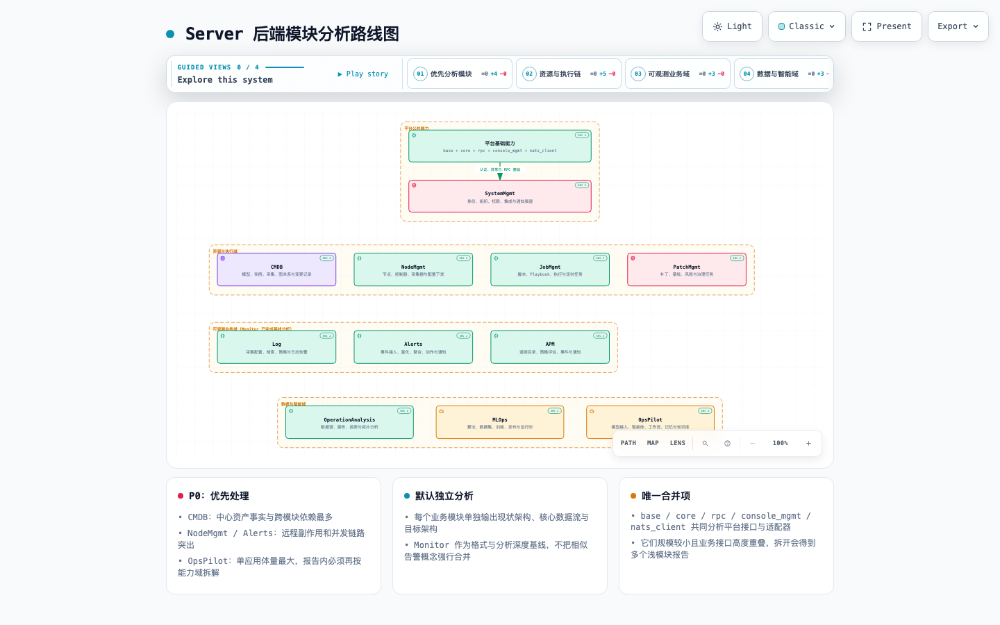

# Server 后端模块架构分析路线图

> 盘点日期：2026-08-21
> 基线版本：`fe407afdc44ff2b543871888e8934f5ee869764e`
> 范围：`server/apps/` 与直接支撑 Django 应用运行的 `server/nats_client/`。Monitor 已完成首个示例分析，本路线图聚焦其余模块。

> 完成状态：Monitor 基线与其余 12 个分析工作流均已完成；共形成 13 份模块报告、39 张 Archify 主图及对应可维护规格。

## 1. 结论

`server/` 当前除 Monitor 外还有 **15 个 Django 应用模块**，另有一个 `nats_client` 基础设施模块。它们不适合按目录批量套模板：代码规模从数百行到十余万行，入口同时包含 HTTP、Celery、NATS、管理命令和模型事件，模块深度差异明显。

建议采用以下组织方式：

- **12 个分析工作流**：11 个业务模块独立分析，1 个平台基础能力组合分析；
- **默认独立**：即使 Log、Alerts、APM 与 Monitor 都包含告警概念，也分别拥有不同事实和运行链路，不合并报告；
- **唯一合并项**：`base + core + rpc + console_mgmt + nats_client`。这些目录规模较小、平台接口高度重叠，拆开会得到多个浅模块报告；
- **OpsPilot 内部分域**：仍作为一个 Django 模块交付总报告，但报告内部必须分别分析模型接入、智能体与工作流、记忆、知识库和技能执行；
- **暂不按微服务边界预设结论**：先找清模块 Interface、事实所有权和真实 Seam，再判断是否需要物理拆分。

## 2. 图件

- 单页模块图导航：[server-module-architecture-hub.html](./server-module-architecture-hub.html)
- Server 总体模块架构：[server-overall.architecture.html](./server-overall.architecture.html) · [JSON](./server-overall.architecture.json) · [PNG](./server-overall.architecture.light.png)
- Archify 交互式路线图：[server-module-analysis-roadmap.architecture.html](./server-module-analysis-roadmap.architecture.html)
- Archify 可维护规格：[server-module-analysis-roadmap.architecture.json](./server-module-analysis-roadmap.architecture.json)



## 3. 模块清单与分析方式

生产代码行数用于衡量分析工作量，不用于评价代码质量；统计排除了测试和 migration。

| 工作流 | 包含模块 | 生产代码规模 | 核心职责判断 | 方式 | 优先级 |
|---|---|---:|---|---|---|
| CMDB | `cmdb` | 68.6k | 模型、实例、采集、图关系、变更与同步 | 独立 | P0 |
| NodeMgmt | `node_mgmt` | 16.9k | 节点、控制器、采集器、安装与配置下发 | 独立 | P0 |
| Alerts | `alerts` | 20.2k | 事件接入、富化、聚合、动作和通知 | 独立 | P0 |
| OpsPilot | `opspilot` | 115.4k | 模型接入、智能体、工作流、记忆、知识库和技能 | 独立，内部再分域 | P0 |
| SystemMgmt | `system_mgmt` | 22.0k | 身份、组织、权限、集成、通知渠道和审计 | 独立 | P1 |
| OperationAnalysis | `operation_analysis` | 24.8k | 数据源、数据连接、画布、报表和拓扑分析 | 独立 | P1 |
| MLOps | `mlops` | 21.3k | 算法、数据集、训练、发布与运行时 | 独立 | P1 |
| PatchMgmt | `patch_mgmt` | 17.1k | 补丁、基线、风险评估与治理执行 | 独立 | P1 |
| Log | `log` | 11.4k | 日志采集配置、检索、策略和日志告警 | 独立 | P1 |
| JobMgmt | `job_mgmt` | 11.4k | 脚本、Playbook、作业执行和定时任务 | 独立 | P1 |
| APM | `apm` | 8.8k | 遥测目录、运行时探测、策略评估、事件和通知 | 独立 | P1 |
| 平台基础能力 | `base`、`core`、`rpc`、`console_mgmt`、`nats_client` | 16.3k | 用户基础模型、认证中间件、公共异常、RPC 与 NATS 适配、控制台用户能力 | 合并 | P2 |

已完成的 Monitor 继续作为产物格式与分析深度基线，但不能作为其他模块的领域结论来源。

## 4. 为什么只合并平台基础能力

### 4.1 可以合并的模块

`base`、`core`、`rpc`、`console_mgmt` 和 `nats_client` 共同形成平台 Interface 与协议适配层：

- `base` 主要拥有用户基础模型和 API Secret；
- `core` 承担认证、公共异常、中间件、OpenAPI 和 Celery 装配；
- `rpc` 是跨 Django 应用和外部执行能力的 Adapter 集合；
- `console_mgmt` 主要提供当前用户、通知和应用集合等控制台能力；
- `nats_client` 提供 NATS 请求、响应、权限与订阅基础设施。

分别分析会重复描述同一认证上下文、异常契约、调用协议和启动装配，难以形成有深度的 Module。因此合并后重点分析“平台 Interface 是否足够小、Adapter 是否泄漏业务语义、调用方需要知道多少隐含约束”。

### 4.2 不应因为概念相似而合并的模块

- **Monitor / Log / Alerts / APM**：都出现事件或告警，但数据事实、查询后端、聚合模型和调度方式不同；应独立分析后再核对接口重叠。
- **JobMgmt / PatchMgmt**：PatchMgmt 使用节点与执行能力，但拥有补丁、基线、风险和治理操作事实；它不是 JobMgmt 的子目录。
- **CMDB / NodeMgmt**：前者拥有配置资产和模型实例，后者拥有节点运行时与配置下发；合并会掩盖期望状态与实际状态的 Seam。
- **MLOps / OpsPilot**：都调用模型或算法，但一个关注算法生命周期与运行时，另一个关注智能体产品能力和知识上下文。

## 5. 推荐执行顺序

### P0：先处理中心事实、外部副作用和高并发模块

1. **CMDB**：跨模块依赖最多，先明确模型实例、采集事实、变更记录和 NodeMgmt 同步关系；
2. **NodeMgmt**：包含安装、控制器、采集器和配置下发等远程副作用，重点分析幂等、补偿、并发和状态对账；
3. **Alerts**：聚合窗口、事件富化、动作执行与通知链路并存，重点分析分区、幂等、乱序和容量模型；
4. **OpsPilot**：体量最大，先形成内部能力地图，再分别追踪智能体执行、记忆和知识库数据流。

CMDB 与 NodeMgmt 应连续分析，但仍分别交付报告：前一份明确资产事实，后一份明确节点运行事实，两者之间单独记录同步 Interface。

### P1：按业务链继续独立分析

建议顺序为：

```text
SystemMgmt
  → JobMgmt → PatchMgmt
  → Log → APM
  → OperationAnalysis
  → MLOps
```

SystemMgmt 先于其他 P1 模块，是因为组织、权限、集成和通知渠道被多个模块依赖。Log 与 APM 放在 Alerts 之后，可以复用已明确的事件交付 Interface，但各自仍需独立做数据流和容量分析。

### P2：平台基础能力收口

最后分析平台基础能力，可以利用前述业务模块暴露出来的真实调用需求，避免凭假设设计公共抽象。重点判断：

- 哪些 Interface 真正有两个以上 Adapter；
- `rpc` 是否只是转发，还是隐藏了鉴权、错误、超时和重试复杂度；
- HTTP、Celery、NATS 和管理命令是否共享应用用例；
- 公共 Core 是否吸收了本应由业务模块拥有的规则。

## 6. 每个模块的固定交付物

每个工作流以 Monitor 示例为最低基线，交付以下文件：

```text
<module>-module-architecture-analysis.md
<module>-current.architecture.json/html
<module>-core.workflow.json/html
<module>-target.architecture.json/html
```

图型按语义选择，不机械套用：

- **现状与目标模块结构**：使用 Archify `architecture`；
- **核心业务主链路**：优先使用自上而下的 `workflow`，避免阶段列强制横向造成阅读方向错误；
- **真正的数据血缘、生产消费和存储链路**：使用 `dataflow`；
- **请求生命周期与异步回调**：必要时补充 `sequence`；
- **任务、告警、作业等状态转换**：状态复杂时补充 `lifecycle`。

默认每个模块只交付三张主图；只有 Sequence 或 Lifecycle 能揭示架构风险时才增加，不为了图件数量扩张产物。

## 7. 每份报告的分析框架

报告按模块整体组织，不按 Tech Debt 单点清单组织：

1. **模块定位与 Interface**：调用方必须知道哪些参数、不变量、顺序、错误、配置和性能约束；
2. **能力域与代码结构**：目录是否表达业务能力，修改一个用例需要跨越多少技术层；
3. **入口与 Adapter**：HTTP、Celery、NATS、管理命令和信号是否共享同一应用用例；
4. **事实所有权**：数据库、对象存储、消息系统和外部平台中谁是唯一事实源，哪些只是投影；
5. **核心数据流**：输入、校验、事务、异步处理、持久化、通知和对账；
6. **并发与容量模型**：任务粒度、锁、队列、批量、背压、查询放大、超时和重试；
7. **结构性不合理设计**：说明它如何影响维护、扩展、可靠性或性能，而不是列出孤立文件问题；
8. **目标 Module 与 Seam**：优先深化现有模块，明确 Interface 和 Adapter，不预设微服务；
9. **短期与长期路线**：短期处理高风险一致性和容量问题，长期调整代码结构与事实模型；
10. **开发提醒**：列出新增入口、任务、模型、外部调用和查询时必须遵守的约束。

## 8. 全局架构治理提醒

仓库执行手册引用了根目录 `ARCHITECTURE.md`，但当前基线中该文件不存在。模块分析完成后，应增加一个轻量的后端模块索引，记录：

- 每个模块的职责与拥有的数据事实；
- 允许的跨模块依赖方向；
- 跨模块调用使用的 Interface；
- 指向各模块详细架构报告的链接。

它不应复制每份模块报告，而应成为开发者判断“代码应该放在哪里、能否直接 import 另一个模块”的入口。

## 9. 已完成模块与产物索引

每行按“现状架构—核心链路—目标架构”组织；HTML 可交互浏览，报告内同时提供 JSON 规格和静态 PNG 链接。

| 模块 | 整体分析 | 现状架构 | 核心链路 | 目标架构 |
|---|---|---|---|---|
| Monitor | [报告](./monitor-module-architecture-analysis.md) | [现状](./monitor-current.architecture.html) | [核心数据流](./monitor-core.dataflow.html) | [目标](./monitor-target.architecture.html) |
| CMDB | [报告](./cmdb-module-architecture-analysis.md) | [现状](./cmdb-current.architecture.html) | [核心纵向流程](./cmdb-core-vertical.workflow.html) | [目标](./cmdb-target.architecture.html) |
| NodeMgmt | [报告](./node-mgmt-module-architecture-analysis.md) | [现状](./node-mgmt-current.architecture.html) | [安装与下发流程](./node-mgmt-install.workflow.html) | [目标](./node-mgmt-target.architecture.html) |
| Alerts | [报告](./alerts-module-architecture-analysis.md) | [现状](./alerts-current.architecture.html) | [告警数据流](./alerts-core.dataflow.html) | [目标](./alerts-target.architecture.html) |
| OpsPilot | [报告](./opspilot-module-architecture-analysis.md) | [现状](./opspilot-current.architecture.html) | [对话与知识数据流](./opspilot-chat-knowledge.dataflow.html) | [目标](./opspilot-target.architecture.html) |
| SystemMgmt | [报告](./system-mgmt-module-architecture-analysis.md) | [现状](./system-mgmt-current.architecture.html) | [身份权限数据流](./system-mgmt-identity-access.dataflow.html) | [目标](./system-mgmt-target.architecture.html) |
| JobMgmt | [报告](./job-mgmt-module-architecture-analysis.md) | [现状](./job-mgmt-current.architecture.html) | [执行生命周期](./job-mgmt-execution-lifecycle.dataflow.html) | [目标](./job-mgmt-target.architecture.html) |
| PatchMgmt | [报告](./patch-mgmt-module-architecture-analysis.md) | [现状](./patch-mgmt-current.architecture.html) | [治理数据流](./patch-mgmt-governance.dataflow.html) | [目标](./patch-mgmt-target.architecture.html) |
| Log | [报告](./log-module-architecture-analysis.md) | [现状](./log-current.architecture.html) | [策略生命周期](./log-policy-lifecycle.dataflow.html) | [目标](./log-target.architecture.html) |
| APM | [报告](./apm-module-architecture-analysis.md) | [现状](./apm-current.architecture.html) | [策略生命周期](./apm-policy-lifecycle.dataflow.html) | [目标](./apm-target.architecture.html) |
| OperationAnalysis | [报告](./operation-analysis-module-architecture-analysis.md) | [现状](./operation-analysis-current.architecture.html) | [报表数据流](./operation-analysis-report.dataflow.html) | [目标](./operation-analysis-target.architecture.html) |
| MLOps | [报告](./mlops-module-architecture-analysis.md) | [现状](./mlops-current.architecture.html) | [训练与服务生命周期](./mlops-lifecycle.dataflow.html) | [目标](./mlops-target.architecture.html) |
| 平台基础能力 | [报告](./platform-core-module-architecture-analysis.md) | [现状](./platform-core-current.architecture.html) | [请求与 RPC 数据流](./platform-core-request-rpc.dataflow.html) | [目标](./platform-core-target.architecture.html) |

### 9.1 跨模块共性信号

独立分析后反复出现的不是“应合并成一个大模块”，而是应由平台能力提供稳定协议的五类共性：

1. **身份与数据范围**：HTTP、Celery、NATS 和外部回调必须传递同一个可验证 actor/scope 上下文；
2. **运行身份与 fencing**：安装、作业、告警动作、采集、发布、训练和服务部署都需要持久 run/generation/token；
3. **外部副作用意图**：对象存储、远程执行、通知、运行时控制和第三方 API 不能依赖数据库事务自动回滚；
4. **容量预算**：所有批量、查询、LLM/模型、临时盘和队列路径都要显式声明并发、字节、deadline 与公平性；
5. **事实与投影**：每个模块需明确唯一事实源，搜索索引、运行时状态、缓存、对象引用和报表结果只作为有版本的投影。

这些共性适合复用协议、端口和测试套件；各模块的业务状态机、事实所有权和补偿策略仍应留在本模块内。
