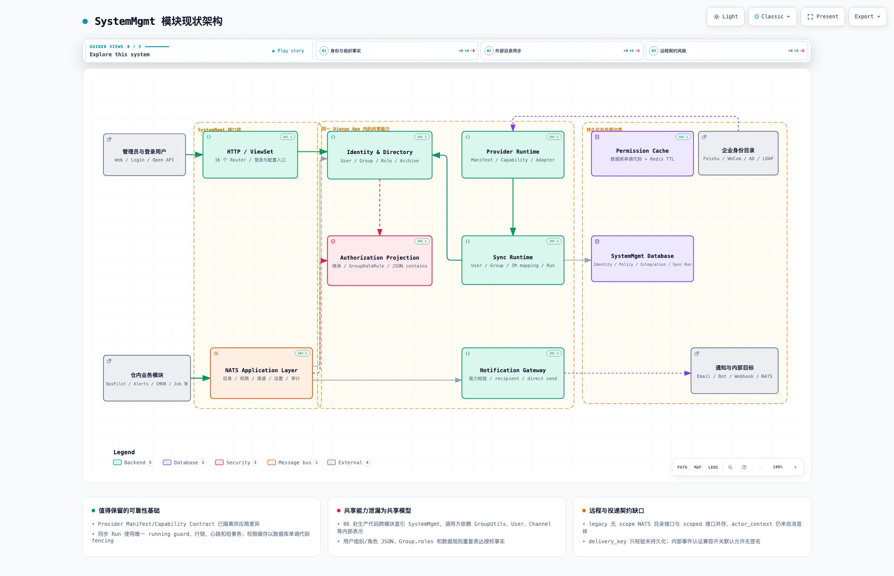
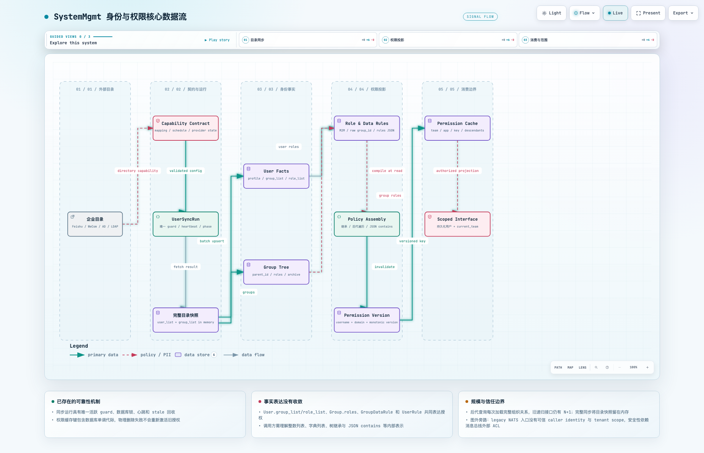
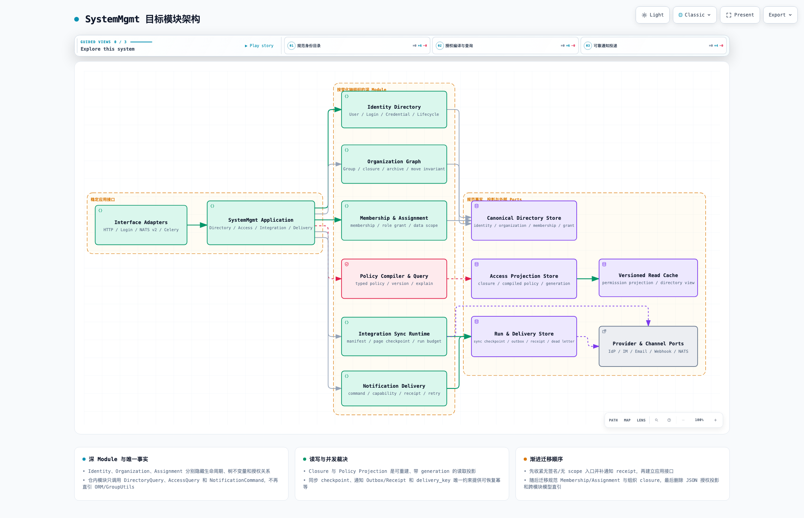

# SystemMgmt 模块架构与代码结构分析

> 分析日期：2026-08-21
> 分析范围：`server/apps/system_mgmt/`，以及其直接依赖的 Django、数据库、Redis、NATS、Celery、外部身份目录和消息渠道边界。
> 分析方式：以“外部身份目录—本地身份事实—组织层级—授权投影—远程消费—通知投递”的完整闭环为主，分析事实所有权、接口信任、事务一致性、并发容量和跨模块耦合，不按单个技术债组织。

## 1. 结论摘要

SystemMgmt 已经不只是一个“系统管理页面”，而是全仓共享的身份与访问基础设施。在同一个 Django App 内，它同时拥有：

1. 用户、登录、密码、OTP、认证绑定和登录审计；
2. 组织树、角色、菜单、应用资源和数据规则；
3. Provider Manifest、能力契约、集成实例和供应商 Adapter；
4. 企业目录同步、组织全量对账、IM 用户映射和同步运行；
5. Email、Bot、Webhook、NATS 等通知渠道；
6. 49 个 NATS handler 组成的远程目录、权限、设置、认证和通知接口；
7. 系统设置、网络白名单、操作日志和错误日志。

不含测试和 migration，模块约有 **22,033 行生产 Python**、**90 个测试文件**，注册 **16 个 DRF Router**。仓内其他 App 的生产代码中，至少有 **86 处导入语句、分布在 69 个文件**直接引用 `apps.system_mgmt`；OpsPilot、Alerts、JobMgmt、Core、CMDB 和 OperationAnalysis 是主要消费者。

SystemMgmt 的成熟度并不低。三项已有设计应明确保留：

- **Provider Runtime 是清晰的扩展 seam**：Manifest、Capability Adapter、Pydantic 结果和稳定错误码隔离了 Feishu、WeCom、AD 等供应商差异；
- **同步 Run 有可靠并发裁决**：唯一 running guard、source 行锁、heartbeat、stale 回收、短事务和锁顺序已经覆盖多数据库差异；
- **权限缓存有正确 fencing**：数据库单调 `UserPermissionVersion` 进入全部权限缓存键，物理删除失败也不会重新激活旧授权。

真正影响后续维护、扩展和安全性的，是四个结构性断点：

- **共享能力泄漏成共享模型**：调用方直接读取 `User`、`Group`、`Channel` 和 `GroupUtils`，身份目录没有形成比 ORM 更稳定的模块接口；
- **授权事实没有收敛**：`User.group_list/role_list` JSON、`Group.roles` M2M、`GroupDataRule.group_id/rules` 和 `UserRule` 同时表达成员、角色与数据范围；
- **远程信任契约处于双轨状态**：带 `current_team` 的 scoped handler 与无 scope legacy handler 并存，且注释明确说明 `actor_context` 仍来自消息体，不构成可信调用身份；
- **通知接口声明幂等键却没有幂等实现**：`dispatch_notification` 强制传 `delivery_key`，但只校验格式，后续没有持久化、唯一约束或 receipt；调用方超时重试可能重复发送。

建议继续保持模块化单体，不要先拆微服务。短期先关闭无签名和无范围入口、补通知 Delivery/Receipt；随后建立稳定 `DirectoryQuery`、`AccessQuery`、`NotificationCommand` 和 `IntegrationAdmin` 接口，逐模块移除跨 App ORM 直引。中期将 Membership、Assignment 和组织 Closure 收敛为规范事实，再删除 JSON 授权投影。

## 2. 图件

- Archify 交互式现状架构：[system-mgmt-current.architecture.html](./system-mgmt-current.architecture.html)
- Archify 交互式身份权限数据流：[system-mgmt-identity-access.dataflow.html](./system-mgmt-identity-access.dataflow.html)
- Archify 交互式目标架构：[system-mgmt-target.architecture.html](./system-mgmt-target.architecture.html)
- Archify 可维护规格：[现状 JSON](./system-mgmt-current.architecture.json) · [身份权限数据流最终 JSON](./system-mgmt-identity-access.dataflow.json) · [目标 JSON](./system-mgmt-target.architecture.json)

身份权限数据流曾交付 760 高度规格；多视口检查发现其在 1440×900 下纵向溢出 14px。依据 Archify 冻结交付规则，原规格 [system-mgmt-identity-access.dataflow.json](./system-mgmt-identity-access.dataflow.json) 保留为交付证据，最终规格以 `v2` 为准。三张最终 HTML 均通过 9/9 showcase 检查、0 composition errors/warnings，以及 1440×900、1600×1000、1920×1080、2048×1320 明暗主题视觉检查。

HTML 支持明暗主题、缩放、搜索、关系追踪、聚焦视图、演示和 PNG/SVG 等导出；不依赖 draw.io。







## 3. 能力边界与事实所有权

### 3.1 建议明确六个能力域

| 能力域 | 核心职责 | 当前主要落点 | 应拥有的规范事实/规则 |
|---|---|---|---|
| Identity Directory | 用户身份、状态、认证凭据、登录生命周期 | `models/user.py`、login/auth services | Identity、Credential、AccountState、LoginDecision |
| Organization Graph | 组织节点、父子关系、移动、归档和恢复 | `models/user.py::Group`、`group_archive_service.py` | Organization、Closure、ArchiveState、MoveInvariant |
| Membership & Assignment | 用户成员关系、角色授予和数据范围授予 | User JSON、Group.roles、GroupDataRule、UserRule | Membership、RoleGrant、DataScopeGrant |
| Access Policy | 策略编译、继承、版本、查询和 explain | NATS permissions、GroupUtils、permission cache | PolicySchema、CompiledProjection、Generation、Decision |
| Integration Runtime | 集成实例、Provider 能力、目录/IM 同步运行 | `providers/`、`user_sync_service.py`、IM services | Integration、Capability、SyncRun、Checkpoint |
| Notification Delivery | 渠道能力、投递命令、幂等、receipt、重试和死信 | `nats/channels.py`、channel utils | Delivery、TargetReceipt、Attempt、ProviderResult |

HTTP、Login、NATS 和 Celery 都应只是 Interface/Job Adapter；它们不能再次定义用户范围、组织继承、幂等和通知终态。

### 3.2 SystemMgmt 不应继续把 ORM 当公共 API

当前调用方可以直接：

```text
from apps.system_mgmt.models import User, Group, Channel
from apps.system_mgmt.utils.group_utils import GroupUtils
```

这使调用方同时依赖表结构、JSON 表示、软删除语义、树遍历算法和缓存失效规则。任何 Membership 规范化或组织树索引优化都会变成全仓迁移。

目标公共面应收敛为：

```text
DirectoryQuery.get_users(scope, fields, page)
DirectoryQuery.get_organizations(scope, relation)
AccessQuery.authorize(principal, action, resource, context)
AccessQuery.explain(...)
NotificationCommand.submit(delivery_key, channel, targets, content)
IntegrationAdmin.run_sync(source, trigger, budget)
```

接口返回稳定 DTO，不返回 Django QuerySet、模型实例或 `group_list` 原始 JSON。

## 4. 现状代码结构

### 4.1 规模与热点

较大的生产文件包括：

| 文件 | 行数 | 主要职责 |
|---|---:|---|
| `services/user_sync_service.py` | 1,513 | Run、Provider 调用、心跳、用户/组织同步、全量对账、缓存失效 |
| `providers/adapters/feishu.py` | 1,458 | 飞书认证、分页、字段映射和能力实现 |
| `providers/adapters/wecom.py` | 992 | 企业微信能力实现 |
| `viewset/user_viewset.py` | 862 | 用户 CRUD、权限和批量操作入口 |
| `nats/channels.py` | 795 | 渠道查询、组织范围、公开投递、内部认证和具体发送 |
| `services/im_notification_service.py` | 505 | IM 映射同步与 Run |
| `viewset/group_viewset.py` | 500 | 组织管理和归档入口 |
| `tasks.py` | 498 | 密码、邮件、同步等任务 |
| `services/group_archive_service.py` | 488 | 组织子树锁定、归档、恢复和删除 |
| `nats/users.py` | 426 | scoped/legacy 用户目录和用户初始化 |
| `providers/adapters/ad.py` | 407 | AD 目录能力实现 |
| `utils/group_utils.py` | 400 | 树遍历、范围过滤和树 DTO |
| `nats/permissions.py` | 291 | 远程权限规则读取和变更 |

大文件不是统一问题：`user_sync_service.py` 和 `group_archive_service.py` 的相当部分复杂度来自真实并发不变量；`nats/channels.py`、`nats/users.py` 和 `nats/permissions.py` 则更像第二套 Application Layer，把协议、鉴权、ORM 查询和业务规则揉在 handler 文件中。

### 4.2 Provider Framework 是应深化的深模块

Provider Runtime 已具备：

- manifest 和 provider registry；
- capability adapter registry；
- Pydantic `CapabilityExecutionResult/Error`；
- 稳定、可判定 retryable 的错误；
- `capability_contract_service.py` 对 capability 状态、字段映射、schedule 和 IM mapping 的集中校验。

因此不建议为了缩短 Feishu/WeCom 文件而先拆 provider。优先让 Adapter 隐藏分页、限流、token 和供应商字段，向 Integration Runtime 暴露统一的 paged snapshot/cursor；不要把供应商分页与重试重新泄漏到同步服务。

### 4.3 同步 Run 的可靠性基础正确

用户同步 stale timeout 默认 6 小时，并根据数据库能力选择 `select_for_update`、`skip_locked` 或条件更新；Provider 阻塞期间用独立连接续 heartbeat，见 [user_sync_service.py:27](../../server/apps/system_mgmt/services/user_sync_service.py#L27) 和 [user_sync_service.py:56](../../server/apps/system_mgmt/services/user_sync_service.py#L56)。

写入阶段对 running 状态做 fencing，Run 被回收后旧 worker 不能继续落库，见 [user_sync_service.py:124](../../server/apps/system_mgmt/services/user_sync_service.py#L124)。组织归档也有稳定锁集合、明确锁顺序和 `transaction.on_commit` 缓存失效。

这些机制应沉淀为共享 `SyncRunKernel`，同时供 UserSync 和 IMNotificationSync 使用；不要在重构时退回“Celery task 是否在跑”这种进程内状态判断。

## 5. 身份、权限与通知数据流

### 5.1 外部目录同步流

```text
IntegrationInstance + UserSyncSource
  → Capability Contract 校验
  → 创建唯一 RUNNING UserSyncRun
  → Provider Adapter 拉取 user_list + group_list
  → 完整结果留在本轮内存
  → 构造 child_map，递归同步组织
  → 用户按 batch 标准化与 upsert
  → 全量对账 stale 用户/组织
  → 推进受影响用户 Permission Version
  → Run success / partial / failed
```

当前 Provider 结果直接读取完整 `user_list` 和 `group_list`，见 [user_sync_service.py:531](../../server/apps/system_mgmt/services/user_sync_service.py#L531)；组同步又构建完整 `child_map` 并递归 walk，见 [user_sync_service.py:1250](../../server/apps/system_mgmt/services/user_sync_service.py#L1250)。

这在中小目录可接受，但容量近似：

```text
内存 = O(U + G + provider payload)
组织构建 = O(G) + 若干父节点名称查询
用户写入 = O(U / batch) 次事务与缓存代际推进
```

增长到十万级用户、多来源并行或 Provider 响应很大时，应支持 cursor/page checkpoint、每页输入摘要和 Run budget。全量删除对账只能在所有页面完成并校验 snapshot token 后执行，不能在单页失败时误删未出现用户。

### 5.2 授权事实与读取流

当前授权关系同时存在：

```text
User.group_list JSON                 用户所属组织投影
User.role_list JSON                  用户直接角色投影
Group.roles M2M                      组织角色授予
Group.allow_inherit_roles            组织继承开关
GroupDataRule.group_id + rules JSON  组织数据规则
UserRule(username, domain, rule)      用户规则关联
```

`User` 的两个 JSON 字段见 [user.py:17](../../server/apps/system_mgmt/models/user.py#L17)，`Group.parent_id` 是没有 FK 的整数且同时持有 roles，见 [user.py:80](../../server/apps/system_mgmt/models/user.py#L80)；数据规则又用 raw `group_id` 和 JSON，见 [group_data_rule.py:4](../../server/apps/system_mgmt/models/group_data_rule.py#L4)。

读取时，`GroupUtils` 每次把全部活动组织的 `(id, parent_id)` 载入内存再遍历，见 [group_utils.py:22](../../server/apps/system_mgmt/utils/group_utils.py#L22)；旧接口仍明确标注 N+1，见 [group_utils.py:104](../../server/apps/system_mgmt/utils/group_utils.py#L104)。scoped NATS 查询还为每个组织构造一个 `group_list__contains` OR 条件，见 [users.py:142](../../server/apps/system_mgmt/nats/users.py#L142)。

建议用 ORM 维护跨数据库兼容的 closure 表：

```text
OrganizationClosure(ancestor_id, descendant_id, depth, generation)
Membership(user_id, organization_id, state, source)
RoleAssignment(subject_type, subject_id, role_id, scope_id)
DataScopeAssignment(subject_type, subject_id, policy_id, scope_id)
```

禁止 raw SQL；组织 move/archive 只能经 Organization Graph service，在一个事务内更新规范关系、closure generation 和受影响权限代际。

### 5.3 权限缓存 fencing 应保留

`UserPermissionVersion` 是独立于用户生命周期的数据库单调代际，见 [user.py:69](../../server/apps/system_mgmt/models/user.py#L69)。缓存模块明确将该代际嵌入权限和 token key，并在事务内推进，见 [permission_cache.py:47](../../server/apps/core/utils/permission_cache.py#L47)。

这比单纯 Redis `delete_pattern` 更可靠：即使事务提交后的物理删除失败，旧 key 也不再匹配新 generation。后续 Policy Projection 应复用这个思想，将 key 进一步收敛为：

```text
access:{principal}:{organization}:{application}:{policy_generation}:{query}
```

### 5.4 通知投递缺少真实幂等边界

`dispatch_notification` 要求 `delivery_key` 非空且不超过 384 字符，见 [channels.py:405](../../server/apps/system_mgmt/nats/channels.py#L405)。但校验之后，函数直接解析渠道、接收人和内容并调用 `send_msg_with_channel`，见 [channels.py:494](../../server/apps/system_mgmt/nats/channels.py#L494)；`delivery_key` 没有进入任何查询、唯一约束、Outbox 或 Receipt。

因此当前真实语义是：

```text
调用方超时 / NATS 重试
  → 同一个 delivery_key 再次进入
  → 再次调用 Email/Bot/Webhook/NATS provider
  → 可能重复通知
```

应建立：

```text
NotificationDelivery(producer, delivery_key, payload_hash, status)
  UNIQUE(producer, delivery_key)
NotificationTargetReceipt(delivery_id, target_key, status, attempts, provider_receipt)
NotificationOutbox(delivery_id, target_receipt_id, next_attempt_at, lease_owner)
```

同 key、同 payload 返回已有结果；同 key、不同 payload 失败关闭。外部 Provider 未必支持 exactly-once，因此系统承诺应是“数据库唯一接收 + 每目标可恢复 at-least-once + 有 receipt 的重复抑制”，不能声称绝对 exactly-once。

## 6. 结构性不合理设计与影响

| 优先级 | 架构主题 | 现状 | 维护/扩展影响 | 并发/性能/安全影响 |
|---|---|---|---|---|
| P0 | 通知幂等契约缺失 | `delivery_key` 只校验不持久化，成功后直接返回 delivered | 每个调用方各自维护 ledger、重试和补偿，语义持续分叉 | 超时重试可重复发信/发 Bot/复制告警；无统一 receipt 和死信 |
| P0 | 内部事件认证默认兼容放行 | `ALERTS_ALLOW_LEGACY_INTERNAL_EVENT_AUTH` 默认 `true`；无签名请求可走 warning 后放行 | 新调用方容易继续依赖旧路径，兼容窗口无法自然退出 | 消息总线 ACL 或 subject 配置错误时，业务代码不能独立证明调用身份 |
| P0 | scoped 与 legacy NATS 双轨 | `get_group_users/get_all_users/search_users` 等无可信 scope 接口仍注册；scoped 的 actor_context 来自消息体 | 每次新增远程能力都要判断信任模型和兼容路径 | 可枚举范围依赖总线外部信任；调用方声明不能作为授权主体 |
| P1 | 授权事实重复 | User JSON、Group M2M、raw group_id、规则 JSON 和 UserRule 并存 | 表示迁移和规则变更需要多处同步；调用方理解内部 shape | 更新遗漏导致授权漂移；JSON contains/overlap 的数据库差异与查询成本上升 |
| P1 | 组织图没有规范关系层 | `parent_id` 是整数，不具 FK；后代查询加载整棵树，旧接口递归 N+1 | cycle、orphan、move 和 archive 不变量散落在 service/helper | 高频 scope 查询 O(G)；深树递归与大 OR 条件增加延迟和内存 |
| P1 | 跨模块模型直引 | 86 处生产导入、69 个文件依赖 SystemMgmt 内部实现 | 任何表/JSON/软删除变化形成全仓修改，无法局部测试 | 调用方可绕过统一 scope、缓存失效和审计入口 |
| P1 | NATS handler 成为第二应用层 | 49 个 handler 内含鉴权、ORM、DTO、发送和兼容逻辑 | HTTP 与 NATS 同一能力容易行为漂移，契约无法版本化 | unbounded query/page、消息身份和重试策略不统一 |
| P1 | 完整目录快照同步 | Provider 返回完整 user/group list，本轮构建完整 child map | 不易断点续跑、按页审计或限制单次资源 | 大目录占用 O(U+G) 内存；失败后重拉全部，长 Run 扩大 stale 窗口 |
| P2 | 模型保存含基础设施副作用 | `User.save()` 在事务内直接清权限缓存 | 任意 profile 更新都会触发权限代际/缓存路径，模型难复用 | 大批更新若未走 bulk 路径会产生高频 cache/DB 操作 |
| P2 | Provider Adapter 体量大 | Feishu 1,458 行、WeCom 992 行 | 能力增多后单文件导航困难 | 主要风险可由分页预算和端口测试控制，不应优先机械拆分 |

内部认证兼容开关默认值见 [internal_event_auth.py:129](../../server/apps/core/utils/internal_event_auth.py#L129)。SystemMgmt 的 `_accept_internal_request` 在签名失败且未传 auth 时检查该兼容开关并放行，见 [channels.py:315](../../server/apps/system_mgmt/nats/channels.py#L315)。legacy 目录接口代码已明确标为限时风险接受，截止 2026-09-04，见 [users.py:25](../../server/apps/system_mgmt/nats/users.py#L25)。

## 7. 目标架构

目标仍是一个 Django 模块化单体，但内部依赖只能朝向稳定接口：

```text
HTTP / Login / NATS v2 / Celery
  → SystemMgmt Application Interface
      → Identity Directory
      → Organization Graph
      → Membership & Assignment
      → Policy Compiler & Query
      → Integration Sync Runtime
      → Notification Delivery

Canonical Directory Store
  → Access Projection Store(generation)
  → Versioned Read Cache

SyncRun / Checkpoint + Notification Outbox / Receipt
  → Provider & Channel Ports
```

### 7.1 深模块接口

每个 Module 要隐藏不变量，而不是只把文件搬目录：

- `IdentityDirectory` 隐藏账号状态、密码、OTP、认证绑定和用户生命周期；
- `OrganizationGraph` 隐藏 cycle/orphan 检查、closure、move、archive 和 restore；
- `AssignmentService` 隐藏 Membership、RoleGrant 和 DataScopeGrant 的唯一性与来源；
- `PolicyService` 隐藏继承、schema version、compile、generation 和 explain；
- `SyncRuntime` 隐藏 provider cursor、checkpoint、budget、heartbeat 和 reconciliation；
- `NotificationDelivery` 隐藏 delivery claim、目标 receipt、attempt、retry 和 dead letter。

### 7.2 什么时候才考虑拆服务

至少满足以下两项再考虑把身份/通知拆出 Django 进程：

- 需要独立部署、独立 SLO 或独立安全团队治理；
- 授权查询吞吐明显高于业务模块并需要独立扩缩；
- 企业目录同步与 Web 请求存在持续资源争抢，队列舱壁仍不能满足；
- 多个仓库/产品共同消费且版本契约已经稳定。

在此之前，先用应用接口、端口、队列和表级事实边界解决耦合。过早网络化只会把当前 ORM/JSON 耦合变成 RPC payload 耦合。

## 8. 优化路线与优先级

### 8.1 P0：1—2 个迭代内

#### A. 落通知 Delivery、Receipt 和 Outbox

1. 新增 `(producer, delivery_key)` 唯一约束和 `payload_hash`；
2. `dispatch_notification` 只做命令校验与 claim，不在 NATS handler 内直接调用 Provider；
3. 每个渠道/接收目标形成 TargetReceipt，Worker 使用短 lease 领取；
4. 重试读取已有 receipt，区分 retryable、permanent failure 和 unknown；
5. Alerts、APM、OperationAnalysis 等调用方删除各自“收到 response 即成功”的重复判定。

验收：同 key 并发 100 次只产生一个 Delivery；对每个目标最多一个 active attempt；worker 崩溃后可恢复；同 key 不同 payload 失败关闭。

#### B. 关闭无签名内部事件默认放行

1. 把兼容开关默认值改为 false；
2. 盘点调用方并配置 caller-specific current/previous key；
3. unsigned 请求只计量和拒绝，不再 silent fallback；
4. 删除跨域命名的 `ALERTS_...` 全局开关，改为 SystemMgmt InternalEventAuth policy；
5. 保留密钥轮换窗口，不保留无签名窗口。

#### C. 完成 NATS v2 scoped cutover

1. principal 由 NATS transport/ACL 注入，禁止从消息体 `actor_context` 自证身份；
2. 所有目录查询必须包含 audience、tenant/current_team、字段白名单和 page limit；
3. 2026-09-04 前移除 `get_group_users/get_all_users/search_users` 等 legacy subject；
4. 注册表测试从“必须保留 legacy”改为“legacy 不得注册”；
5. 对拒绝、越权和返回行数建立指标。

### 8.2 P1：2—4 个迭代

#### D. 建立 SystemMgmt Application Interface

先在当前 App 内建立 Facade/Port，再逐消费者迁移：

1. Core/current_team 与认证后端；
2. Alerts、CMDB、JobMgmt；
3. OpsPilot、OperationAnalysis；
4. Monitor、Log、PatchMgmt、NodeMgmt；
5. 删除外部 `from apps.system_mgmt.models/utils` 直引门禁。

每迁移一个调用方，都应删除旧导入，不保留长期双入口。

#### E. 规范化 Membership、Assignment 和 Organization Closure

1. 新表和约束先建好；
2. 用管理命令 dry-run 校验 JSON、M2M 与规则间差异；
3. 一次性 backfill，生成 reconciliation 报告；
4. 短维护窗口切换唯一写入口和读取投影；
5. 验证权限代际、API token、菜单和数据范围；
6. 删除 JSON 双写与旧读取，避免长期影子设计。

Closure 使用 Django ORM 维护，禁止 raw SQL；需要覆盖 move、archive、restore、cycle、并发 move 和大子树测试。

#### F. 版本化 Policy Projection

把自由 JSON 规则升级为带 schema version 的 typed policy：

```text
PolicyDefinition(schema_version, application, action, resource_type, expression)
PolicyGeneration(version, status, compiled_at)
CompiledGrant(principal, organization, application, action, resource_scope, generation)
```

读取只查 active generation；重建失败不污染在线授权；`explain` 返回命中的 grant、继承链和 generation。

### 8.3 P2：中长期

- Provider 改为分页/cursor 协议，Run 持久化 page checkpoint、snapshot token 和 resource budget；
- UserSync、IMSync、通知投递使用独立 Celery queue、并发上限和 SLO；
- 将 `User.save()` 中的权限副作用移到显式 application command，普通 profile 更新只失效必要投影；
- 对 Integration Adapter 按 capability 文件拆分，但保持一个 Provider Facade；
- 建立目录、授权和通知 contract tests，供所有仓内消费者复用。

## 9. 开发同学后续设计提醒

1. **消息体不能自证身份**：`actor_context`、`is_superuser`、organizations 等字段只能是请求参数；可信 principal 必须来自认证/传输层。
2. **所有公共目录接口必须显式 scope**：没有 tenant/current_team、字段白名单和 page limit 的新接口不得合入。
3. **不要再暴露 ORM/QuerySet**：跨模块返回 DTO 或 ID；禁止新增 `apps.system_mgmt.models` 外部导入。
4. **组织变更只能走一个入口**：禁止直接改 `parent_id`、`is_delete`、Membership 或 Group roles；Application Service 负责不变量、closure 和 permission generation。
5. **权限正确性不能只依赖 Redis delete**：任何授权变更必须在同一数据库事务推进 generation，物理清理只做资源回收。
6. **幂等键必须进入唯一约束**：只校验 key 格式不等于幂等；需要 payload hash、receipt、attempt 和冲突语义。
7. **外部发送先记录意图**：数据库提交后由 Outbox Worker 执行；不要在业务事务、NATS handler 或 model save 内直接发消息。
8. **同步删除必须在完整快照之后**：分页中途、Provider 部分失败或 snapshot token 变化时禁止执行 stale reconciliation。
9. **保持多数据库兼容**：组织 closure、claim、批量迁移统一使用 Django ORM，遵守仓库禁止 raw SQL 的红线。
10. **大文件按不变量拆，不按行数拆**：Provider Adapter、Sync Run、Organization Graph 可大，但外部接口必须窄，事务边界必须可测试。
11. **不保留长期双读双写**：迁移可以有 dry-run、backfill 和短切换期，但验收后立即删除 JSON 影子投影和 legacy subject。
12. **失败必须可观测**：至少记录 caller、scope、generation、delivery_key、run_id、checkpoint、retryable code 和拒绝原因，严禁记录密码、token 或 provider secret。

## 10. 建议验收指标

| 主题 | 指标 |
|---|---|
| 模块边界 | SystemMgmt 外部生产代码直接导入 model/utils 数量最终为 0 |
| 远程授权 | legacy subject 注册数为 0；100% 请求具有 transport principal 与显式 scope |
| 通知可靠性 | delivery claim 冲突率、重复抑制数、receipt 终态率、unknown/死信积压可观测 |
| 组织查询 | 后代/祖先查询不再每请求加载全表；P95 与组织总量增长近似稳定 |
| 权限一致性 | 任意授权变更提交后旧 generation 立即不可读；缓存删除失败测试仍通过 |
| 同步容量 | 峰值内存受 page budget 约束；可从 checkpoint 恢复；不完整快照不执行删除 |
| 迁移正确性 | Membership/Assignment backfill 差异为 0；无长期双写和 fallback |
| 安全 | unsigned 内部事件拒绝率可观测且最终为 0；无消息体自声明提权路径 |

## 11. 推荐先做什么

第一批改动不要同时重写身份表和权限引擎。建议顺序：

```text
Notification Delivery/Receipt
  → InternalEventAuth 默认拒绝
  → NATS v2 scoped cutover
  → SystemMgmt Application Interface
  → Membership/Assignment + Organization Closure
  → Policy Projection generation
  → Provider 分页 checkpoint 与队列舱壁
```

前三项直接消除重复通知和远程信任风险；Application Interface 为后续事实迁移建立可控 seam；最后再替换 JSON 授权表示，能避免全仓消费者与数据库模型同时震荡。
