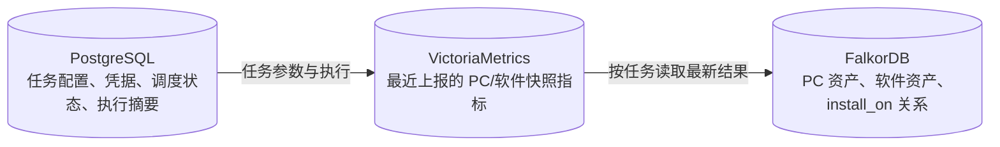
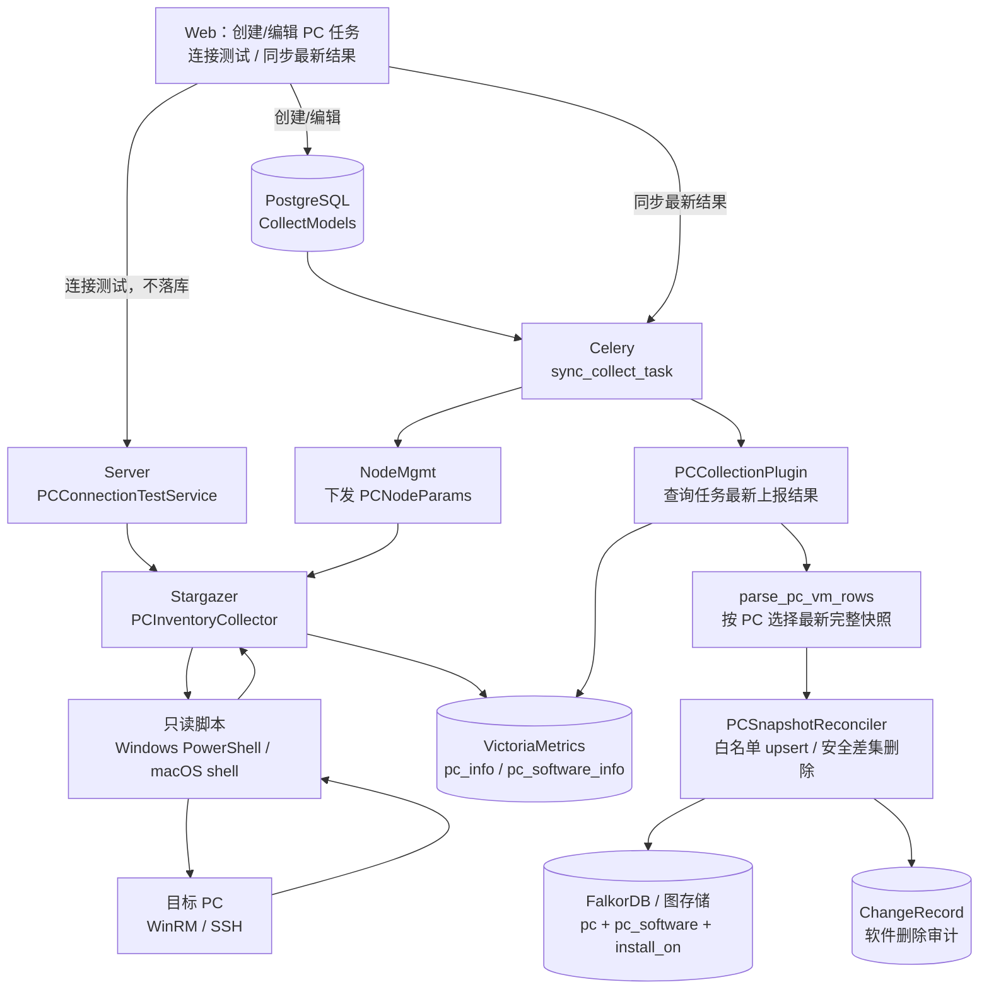
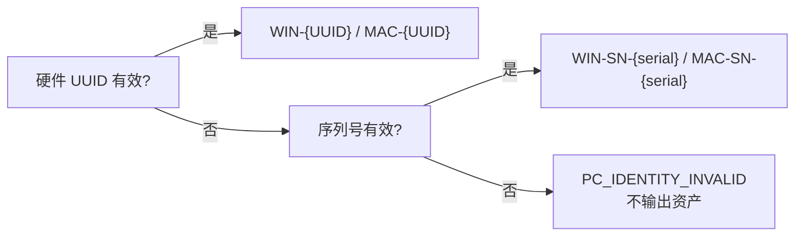
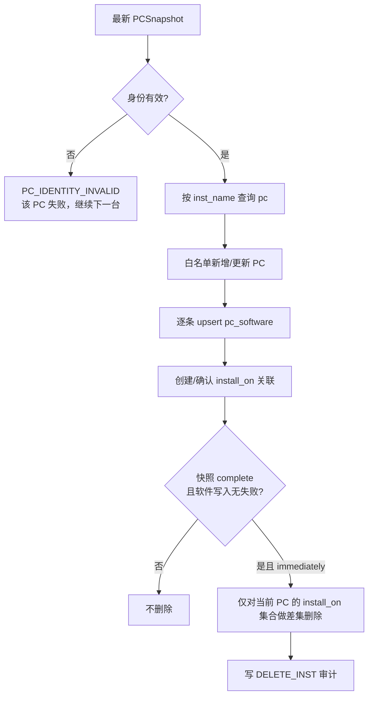
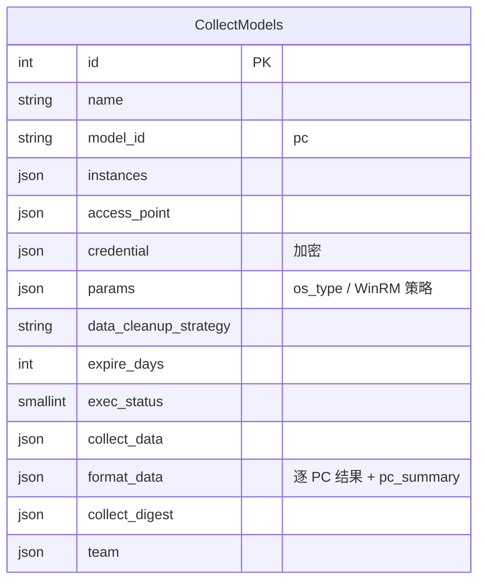
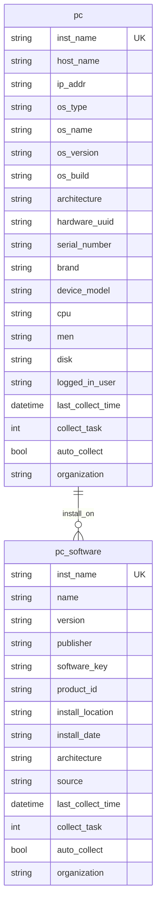

# CMDB PC 配置采集项目设计

> 范围：`server/apps/cmdb`、`server/apps/cmdb_enterprise`、`agents/stargazer` 与 CMDB Web 控制台。
> 当前边界：一个 PC 只配置在一个采集任务中；不处理多个任务并发采集同一 PC。
> 长期有效的产品边界与验收规则以
> [`specs/capabilities/cmdb-pc-collection.md`](../specs/capabilities/cmdb-pc-collection.md)
> 为准；本文只维护当前实现链路、图模型和故障处理细节。
>
> 文档状态：已实现，最近核对 2026-07-29。

## 0. 五分钟了解

### 0.1 要解决的问题

CMDB 需要从 Windows 和 macOS PC 自动发现以下信息：

- PC 的稳定身份、硬件和操作系统配置；
- 系统级安装软件及其与 PC 的归属关系；
- 新增、更新、卸载以及采集不完整等变化；
- 在网络、认证、单机写入或软件写入失败时，仍能给出可解释且不误删数据的结果。

本功能不是远程运维工具。所有目标侧脚本只读，不安装、卸载、启动软件，也不修改
注册表、文件或系统配置。

### 0.2 一句话方案

复用通用采集任务完成配置、调度、凭据和 VictoriaMetrics 传输；Stargazer 为每台 PC
生成独立快照；Server 使用 PC 专用对账器把快照安全写入 FalkorDB，并且只有完整快照
才能删除当前 PC 已缺失的软件。

### 0.3 核心设计结论

| 决策 | 结论 | 原因 |
|---|---|---|
| 任务模型 | 复用 PostgreSQL `CollectModels` | PC 仍是标准周期采集任务，不需要新的任务生命周期 |
| 资产存储 | `pc`、`pc_software` 和 `install_on` 存入 FalkorDB | 资产和关系属于 CMDB 图模型，不属于任务配置表 |
| 中间数据 | `pc_info`、`pc_software_info` 上报 VictoriaMetrics | 复用现有采集传输和查询能力 |
| PC 身份 | 标准硬件 UUID 优先，无效时回退整机序列号 | IP、主机名和登录用户都会变化，不能作为稳定身份 |
| 软件身份 | `PC inst_name + software_key` 派生 | 同名软件在不同 PC 上必须隔离，版本升级不能产生新实例 |
| 对账范围 | 每台 PC 独立解析、写入和清理 | 一台失败不能回滚其他 PC，partial 不能误删 |
| 删除范围 | 只处理当前 PC 的 `install_on` 软件集合 | 禁止通用模型级差集误删其他 PC 的软件 |
| 多任务归属 | 不新增权威表，不实现任务移交 | 产品明确要求同一 PC 只配置在一个任务中 |
| 任务删除 | 不级联删除 PC、软件和关系 | 任务是采集来源，不是资产生命周期所有者 |

### 0.4 明确不支持

- 多个任务同时采集同一台 PC；
- 删除原任务后，由新任务接管同一台已保留 PC；
- 点击“同步最新结果”时立即发起远程 WinRM/SSH 采集；
- 采集脚本修改目标系统；
- 使用 IP、主机名或 FalkorDB 任务 ID 作为 PC 的稳定身份。

### 0.5 三类存储分别保存什么



- PostgreSQL 回答“采集任务如何运行、最近一次运行结果如何”；
- VictoriaMetrics 回答“采集器最近上报了什么”；
- FalkorDB 回答“CMDB 当前有哪些 PC、软件和关联”。

`collect_task` 只是 FalkorDB 资产的创建来源字段，不是 PC 身份、锁或任务接管依据。

### 0.6 文档导航

| 想了解 | 阅读位置 |
|---|---|
| 产品边界和长期验收规则 | `specs/capabilities/cmdb-pc-collection.md` |
| 本次简化变更和已移除设计 | `specs/changes/cmdb-pc-collection-simplification/spec.md` |
| 用户如何配置和排障 | `server/apps/cmdb/support-files/plugins_doc/pc.md` |
| 实现链路、数据模型和开发入口 | 本文 |
| 商业版 ignored 文件如何交付 | `docs/reviews/cmdb-pc-discovery-2026-07-22/05-enterprise-sync-manifest.md` |

## 1. 全景链路



手工按钮的准确语义是“同步最新结果”：它触发 Server 查询 VictoriaMetrics 中该任务已上报的最新数据并写入 CMDB，不直接发起一轮新的 WinRM/SSH 远程采集。

## 2. 分段设计

### 2.1 任务与凭据

- PC 任务复用通用 `CollectModels`，特征为 `model_id="pc"`、`driver_type=JOB`、`task_type=HOST`。
- 一个任务只允许一种操作系统：Windows 或 macOS；创建后不可切换。
- Windows 使用 WinRM，支持 5986/HTTPS 和显式 5985/HTTP，认证为 NTLM。
- macOS 使用 SSH，密码与私钥二选一。
- 凭据入库加密；节点参数中的秘密使用环境变量占位，经 `env_config` 注入，不进入 headers 或 VictoriaMetrics 标签。
- 删除任务只清理计划和节点配置，不删除已发现的 PC 或软件资产。

### 2.2 连接测试

连接测试走 Server 到 Stargazer 的只读调试接口，复用真实 WinRM/SSH 执行能力，但只运行身份脚本：

- 读取硬件 UUID 与序列号；
- 不扫描软件；
- 不写 CMDB；
- 只返回稳定错误码，不透传可能包含秘密的原始执行器错误。

### 2.3 目标侧采集

Windows 脚本只读采集：

- 主机名、系统名称/版本/构建号、架构；
- 硬件 UUID、BIOS 序列号；
- 厂商、型号、CPU、物理内存、所有本地逻辑磁盘总容量、登录用户；
- HKLM 64 位与 32 位 Uninstall 视图中的系统级软件，并排除系统组件、补丁、驱动。

macOS 脚本只读采集：

- 主机、系统、架构、硬件 UUID、序列号；
- Apple 型号、CPU、物理内存、根文件系统容量、控制台用户；
- `/Applications` 与 `/Applications/Utilities` 下的应用，不扫描用户目录和系统应用目录。

身份规则：



软件实例名由 `PC inst_name + software_key` 的 SHA-256 摘要生成，软件升级只更新同一实例，不产生重复软件。
Stargazer 只按允许名单读取 PC 插件目录中的发现/身份脚本；外部绝对路径和目录穿越不能改变实际下发脚本。

### 2.4 快照协议与完整性

每轮上报包含：

- 一个 `pc_info`；
- 零到多条 `pc_software_info`；
- `snapshot_id`；
- `software_snapshot_status`；
- `software_expected_count` 与 `software_error_count`。

Server 按 `(pc inst_name, snapshot_id)` 聚合，并按指标时间只保留每台 PC 最新的一轮。以下任一条件成立时，快照降级为 `partial`：

- Stargazer 报告 partial；
- 软件错误数非零；
- 软件条数与期望数不一致；
- 同一快照出现重复软件实例名；
- 软件的 PC 或 snapshot 归属不匹配。

部分快照可以更新已成功采集的数据，但绝不触发软件删除，任务状态为 `PARTIAL_SUCCESS`。

### 2.5 CMDB 对账



关键约束：

- PC 与软件只写采集白名单；`asset_code`、`user`、`location`、`organization` 等人工字段不会被更新覆盖。
- `last_collect_time` 和运行字段 `collect_time` 都由 Server 使用快照指标时间生成，不信任脚本自报时间。
- PC 的 `collect_task` 只是创建来源/历史字段，不承担锁、权威或移交语义。
- 单台 PC 失败不会回滚或阻断同任务内其他 PC。
- 软件归属只通过 `install_on` 关联表达，传输字段 `pc_inst_name`、`snapshot_id` 不落资产。
- 立即删除只在当前 PC 的关联集合内计算，绝不对整个 `pc_software` 模型做全局差集。
- `after_expiration` 只清理该任务创建的 PC 所关联且过期的软件，永不删除 PC。

### 2.6 与通用配置采集的复用边界

PC 采集不是一套完全独立的任务系统。以下能力继续复用通用逻辑：

- `CollectModels` 的创建、编辑、周期调度、权限和执行状态；
- 接入点选择、IP 范围、凭据池加密和环境变量注入；
- Stargazer 插件加载、VictoriaMetrics 上报和 Server 查询；
- Web 的基础任务表单、通用横向布局、任务列表和插件说明入口；
- `format_data`、`collect_digest` 和最终执行状态的通用展示结构。

以下部分不能直接使用通用对象采集逻辑：

| 专用逻辑 | 不能复用的原因 |
|---|---|
| 逐 PC 快照归组 | PC 与软件是一次采集中的父子数据，必须用同一 `snapshot_id` 判断完整性 |
| 软件写入和 `install_on` 建边 | 软件成功不等于关联成功，建边失败必须阻断删除并补偿孤儿节点 |
| 差集删除 | 通用模型级差集可能删除其他 PC 的软件，PC 只能在当前关联集合内计算 |
| partial 状态 | 已成功的字段需要保留，但不完整结果不能触发删除 |
| PC 级状态聚合 | PC 本体失败与软件局部失败含义不同，分别映射为 failed 和 partial |

因此 `PCCollectionPlugin` 复用查询与结果容器，但把实际写入交给
`parse_pc_vm_rows`、`PCSnapshotReconciler` 和 `apply_pc_snapshots`，并绕开通用任务级
清理。这是一个刻意的安全边界，不是重复实现通用采集框架。

## 3. 数据模型

### 3.1 PostgreSQL

本方案不新增 PC 业务表，只复用 `CollectModels`：



本方案不引入 `PCDiscoveryAuthority` 表。原因是当前产品明确不支持多个任务采集同一 PC；增加它只会引入来源抢占、移交、删除保护和水位状态机，却不能为当前场景提供实际收益。

### 3.2 图模型



关联固定为：

```text
pc_software --install_on (n:1)--> pc
model_asst_id = pc_software_install_on_pc
```

## 4. 状态与错误

任务聚合规则：

- 全部 PC 失败：`ERROR`；
- 没有找到任何 PC 最新上报快照：`ERROR`，摘要提示检查采集完成情况与数据上报时间；
- 任一 PC partial，或成功/失败混合：`PARTIAL_SUCCESS`；
- 所有 PC 完整成功：`SUCCESS`；
- 完整的空软件快照仍是成功，且在立即清理策略下表示卸载了全部已知软件。

稳定错误码包括连接、认证、脚本、身份、快照完整性和 CMDB 写入错误；不再包含多任务来源冲突或旧快照水位错误。

### 4.1 PC 级状态判定

| PC 本体写入 | 快照/软件结果 | `pc_summary` 分类 | 任务影响 |
|---|---|---|---|
| 失败 | 任意 | `pc_failed` | 全部 PC 都失败时 `ERROR`，否则 `PARTIAL_SUCCESS` |
| 成功 | partial 快照 | `pc_partial` | `PARTIAL_SUCCESS` |
| 成功 | 软件或关联局部失败 | `pc_partial` | `PARTIAL_SUCCESS` |
| 成功 | 软件差集删除失败 | `pc_partial` | `PARTIAL_SUCCESS`，下轮继续治理 |
| 成功 | complete 且全部写入成功 | `pc_complete` | 所有 PC 都 complete 时 `SUCCESS` |

PC 本体成功但软件失败时，PC 的 add/update 行仍是成功；失败的软件或关联单独记录错误。
这样不会把整台 PC 误报为失败，同时任务仍能准确显示部分成功。

### 4.2 删除与补偿矩阵

| 场景 | 保留已成功写入 | 是否允许删除旧软件 | 补偿 |
|---|---|---|---|
| PC 身份无效 | 否 | 否 | 无 |
| PC 写入失败 | 否 | 否 | 单台失败隔离 |
| 软件更新失败 | 是 | 否 | 记录 `CMDB_WRITE_PARTIAL` |
| 本轮新建软件后建边失败 | PC 保留 | 否 | 删除本轮创建的孤立软件 |
| complete 且全部软件/关联成功 | 是 | 按策略 | 立即清理时记录删除审计 |
| partial、计数不一致或归属不匹配 | 是 | 否 | 等下一轮完整快照 |
| 差集删除失败 | 是 | 否 | 保留失败实体，下轮重试 |

### 4.3 主要稳定错误码

| 分类 | 错误码 | 含义 |
|---|---|---|
| 网络 | `TARGET_UNREACHABLE` | 接入点无法连接目标 |
| Windows | `WINRM_AUTH_FAILED` / `WINRM_TLS_FAILED` | WinRM 认证或 TLS 失败 |
| macOS | `SSH_AUTH_FAILED` / `SSH_KEY_INVALID` | SSH 认证或私钥失败 |
| 执行 | `SCRIPT_TIMEOUT` / `SCRIPT_OUTPUT_INVALID` | 超时或脚本输出不符合合同 |
| 身份 | `PC_IDENTITY_INVALID` | UUID 和序列号都不能形成稳定身份 |
| 快照 | `SOFTWARE_PARTIAL` / `SNAPSHOT_COUNT_MISMATCH` | 软件结果不完整 |
| 写入 | `CMDB_WRITE_PARTIAL` | PC 之外的软件、关联或删除局部失败 |

错误详情进入任务摘要前必须脱敏并截断；密码、私钥和密码短语不能进入日志、
VictoriaMetrics 标签或对外错误文案。

## 5. 主要实现入口

| 层 | 文件 | 职责 |
|---|---|---|
| 任务校验 | `server/apps/cmdb/services/pc_collect_policy.py` | OS、协议、凭据与超时约束 |
| 连接测试 | `server/apps/cmdb/services/pc_connection_test.py` | 转发只读测试并稳定化错误 |
| 节点参数/插件 | `server/apps/cmdb_enterprise/collect/pc.py` | 秘密注入、VM 查询、快照对账入口 |
| 快照与对账 | `server/apps/cmdb/services/pc_discovery.py` | 解析、白名单 upsert、安全清理 |
| 状态聚合 | `server/apps/cmdb/tasks/celery_tasks.py` | `pc_summary` 与任务最终状态 |
| Stargazer | `agents/stargazer/enterprise/plugins/inputs/pc/pc_inventory.py` | 协议路由、规范化、资源边界 |
| 只读脚本 | `agents/stargazer/enterprise/plugins/inputs/pc/pc_*_discover.*` | 硬件、系统和软件采集 |
| 图模型配置 | `server/apps/cmdb/support-files/model_config.xlsx` | `pc_software` 模型和 `install_on` 关联 |
| Web | `web/src/app/cmdb/(pages)/assetManage/autoDiscovery/collection/profess/` | PC 表单、测试连接、同步最新结果 |

> `cmdb_enterprise` 与 `stargazer/enterprise` 是商业代码目录；交付时需按企业版同步清单同步。

## 6. 修改导航

| 需求变化 | 首要修改点 | 必须同步检查 |
|---|---|---|
| 新增 PC 采集字段 | 目标脚本、`PC_COLLECTED_FIELDS`、`model_config.xlsx` | fixture、白名单测试、插件文档 |
| 修改 PC 身份规则 | 四个目标脚本、`pc_inventory.py` | 合法/占位 UUID、序列号回退、软件实例 ID |
| 修改软件稳定键 | `build_software_stable_key` | 升级幂等、跨 PC 隔离、历史实例兼容 |
| 修改快照合同 | `normalize_snapshot`、`parse_pc_vm_rows` | complete/partial 安全门和 VM 标签 |
| 修改清理策略 | `PCSnapshotReconciler`、过期清理服务 | 当前 PC 范围、失败补偿、删除审计 |
| 修改任务状态 | `apply_pc_snapshots`、`_decide_collect_exec_status` | 全失败、混合、软件局部失败、空软件 |
| 修改凭据或协议 | `pc_collect_policy.py`、`PCNodeParams`、Web PC 表单 | 加密、环境变量、连接测试和日志脱敏 |
| 修改插件说明 | `support-files/plugins_doc/pc.md` | 中英文 UI 入口和静态合同 |

任何影响身份、快照完整性或删除条件的修改都属于高风险变更，至少需要覆盖
Stargazer 合同、Server 对账和端到端流水线三个测试接缝。
Server 端到端测试必须至少有一条通过 `PCCollectionPlugin.run()` 调用真实
`Collection.query()` 封装，以 VM HTTP 响应为外部边界，随后验证 PC、软件实体和
`install_on` 关系写入图库；不能全部绕过查询层直接调用 `format_data()`。

## 7. 验证与验收

### 7.1 Server

```bash
cd server
MINIO_ENDPOINT=localhost:9000 \
MINIO_ACCESS_KEY=test \
MINIO_SECRET_KEY=test \
MINIO_USE_HTTPS=false \
INSTALL_APPS=system_mgmt,node_mgmt,cmdb \
uv run pytest -q -o addopts='' \
  apps/cmdb/tests/test_pc_*.py \
  apps/cmdb/tests/e2e/test_pc_discovery_pipeline.py
```

### 7.2 Stargazer

```bash
cd agents/stargazer
uv run pytest -q \
  tests/test_pc_inventory.py \
  tests/test_pc_scripts_contract.py \
  tests/test_pc_debug.py \
  tests/test_pc_discovery_contract.py
```

### 7.3 Web

```bash
cd web
pnpm exec tsx scripts/cmdb-pc-discovery-form-test.ts
pnpm exec tsx scripts/cmdb-collection-form-layout-test.ts
pnpm exec tsx scripts/cmdb-credential-help-test.ts
pnpm exec tsx scripts/cmdb-cloud-credential-contract-test.ts
```

### 7.4 交付前检查

```bash
cd server
MINIO_ENDPOINT=localhost:9000 \
MINIO_ACCESS_KEY=test \
MINIO_SECRET_KEY=test \
MINIO_USE_HTTPS=false \
INSTALL_APPS=system_mgmt,node_mgmt,cmdb \
uv run python manage.py makemigrations --check --dry-run

cd ..
git diff --check
```

验收必须同时满足：

- 目标测试通过率不低于 80%，目标为全部通过；
- migration state 无漂移；
- 生产代码不再引用权威模型、移交 API 和来源冲突错误码；
- Windows/macOS 脚本保持只读；
- 完整空软件、partial、软件关联失败、单 PC 失败等边界均有测试；
- Web 的“同步最新结果”语义、通用横向布局和插件说明入口保持可用；
- ignored 商业文件按同步清单进入商业版源码库。

## 8. 未来何时需要重新设计

在当前产品边界内，不应提前增加 PC 权威归属表。只有出现以下真实需求时，才重新评估：

- 同一 PC 允许被多个任务发现，并需要确定唯一写入者；
- 删除任务后需要由新任务无损接管同一 PC；
- 不同来源之间需要优先级、审批、抢占或回滚；
- 需要跨任务保存独立快照水位并拒绝旧来源写入。

届时需要单独设计来源身份、唯一约束、并发首绑、移交状态、删除权限和存量数据迁移，
不能仅依赖 FalkorDB 的 `collect_task` 字段或“最早任务 ID”推断权威来源。

在扩展更多采集器版本或快照字段之前，可以考虑增加轻量
`snapshot_schema_version`，用于兼容新旧 Stargazer 输出；它属于传输协议版本，不需要
新增 PC 业务表。
