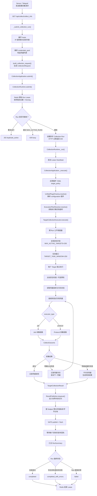
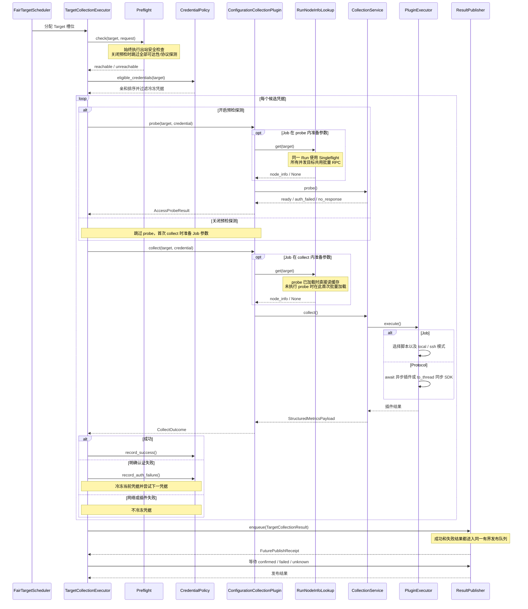
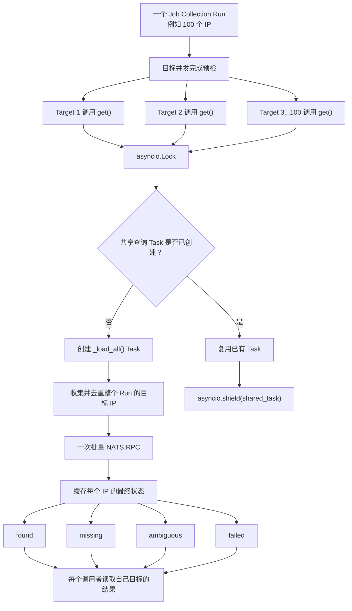

# Stargazer 配置采集调用链

> 状态：按当前代码实现整理
> 更新日期：2026-08-20
> 范围：`agents/stargazer` 配置采集；同时说明 Job 与 Protocol 两条执行分支

## 1. 结论

Job 与 Protocol 采集共用同一套异步框架：HTTP 接入、Run 租约、跨 Run 公平调度、
目标并发、凭据亲和与冷冻、失败隔离、有界发布队列和 Run 汇总完全一致。

两者在 `ConfigurationCollectionPlugin.probe()` / `collect()` 准备单目标参数时分叉：

- **Job**：先通过 Run 级 `RunNodeInfoLookup` 批量查询节点信息，再通过 NATS
  `local.execute.<node_id>` 或 `ssh.execute.<node_id>` 执行采集脚本。
- **Protocol**：不查询 `node_info`，直接按照插件 YAML 加载采集类；原生异步依赖直接
  `await`，同步 SDK 由插件使用 `asyncio.to_thread()` 隔离。

异常排查统一检索 `event=plugin_exception`。每个 Run 最多输出 3 个调用链样本，字段包含
`task_id`、`plugin_ref`、`model_id`、`plugin_name`、`target`、`error_type` 和 `call_chain`；
调用链只保留文件、行号与函数名，不包含异常正文、源码行和凭据内容。

## 2. 总体调用链



## 3. Job 与 Protocol 执行分支

```mermaid
flowchart LR
    A["Target + Credential<br/>TargetCollectionContext"] --> B["ConfigurationCollectionPlugin.collect()"]
    B --> C{"executor_type"}

    subgraph JOB["Job 采集"]
        C -->|"job"| J1["_prepare_job_params()"]
        J1 --> J2["RunNodeInfoLookup.get(target)"]
        J2 --> J3{"共享查询 Task 是否存在？"}
        J3 -->|"否"| J4["首个调用者创建 _load_all() Task"]
        J3 -->|"是"| J5["其他调用者复用同一 Task"]
        J4 --> J6["收集本 Run 全部目标 IP"]
        J5 --> J6
        J6 --> J7["一次 NATS RPC<br/>bklite.get_nodes_by_ips"]
        J7 --> J8["Server 用 collect_task_id<br/>解析可信组织范围"]
        J8 --> J9["NodeService.get_nodes_by_ips()"]
        J9 --> J10{"目标是否唯一匹配 Node？"}
        J10 -->|"是"| J11["注入 params.node_info"]
        J10 -->|"否 / 查询失败"| J12["不注入 node_info<br/>保留原 node_id"]
        J11 --> J13["CollectionService.collect()"]
        J12 --> J13
        J13 --> J14["PluginExecutor<br/>选择 Linux / Windows 脚本"]
        J14 --> J15{"是否有 node_info？"}
        J15 -->|"有"| J16["local.execute.<目标 Node ID><br/>目标节点本地执行"]
        J15 -->|"无"| J17["ssh.execute.<执行节点 ID><br/>执行节点 SSH 采集目标"]
        J16 --> J18["解析脚本执行结果"]
        J17 --> J18
    end

    subgraph PROTOCOL["Protocol 采集"]
        C -->|"protocol"| P1["不创建 RunNodeInfoLookup"]
        P1 --> P2["CollectionService.collect()"]
        P2 --> P3["PluginExecutor 读取插件 YAML"]
        P3 --> P4["动态加载采集类"]
        P4 --> P5{"插件底层依赖"}
        P5 -->|"原生异步库"| P6["直接 await 异步网络 I/O"]
        P5 -->|"同步 SDK"| P7["asyncio.to_thread() 隔离阻塞"]
        P6 --> P8["转换结构化采集结果"]
        P7 --> P8
    end

    J18 --> R["CollectOutcome"]
    P8 --> R
    R --> S["TargetCollectionResult"]
    S --> T["统一结果发布队列"]
```



## 4. 单个目标与凭据的时序



## 5. Job 的 Run 级 `node_info` Singleflight



行为边界：

- 单个普通 IP Run 在 500 个目标的批量上限内只产生一次 Server RPC。
- 多个目标同时进入 `get()` 时，只有首个调用者创建共享 Task。
- `asyncio.shield()` 保证单个目标取消不会取消整个 Run 的共享查询。
- `found`、`missing`、`ambiguous`、`failed` 都会缓存，不会因未命中而重复查询。
- 查询总预算为 15 秒；查询失败不阻断采集，而是回退到原 `node_id` 的 SSH 执行模式。

## 6. Job 节点查询的唯一入口

Job 节点信息只允许由 `ConfigurationCollectionPlugin._prepare_job_params()` 通过 Run 级
`RunNodeInfoLookup` 查询。`CollectionService` 不再自行查询节点，也不再访问旧的
`bklite.node_list` subject。

唯一链路如下：

```text
UnifiedPluginFactory
→ 为 Job Run 创建 RunNodeInfoLookup
→ ConfigurationCollectionPlugin._prepare_job_params()
→ RunNodeInfoLookup.get(target)
→ bklite.get_nodes_by_ips（一次 Run 级批量 RPC）
→ 找到时注入 params.node_info
→ CollectionService.collect()
```

当批量查询得到 `missing`、`ambiguous` 或 `failed` 时，`CollectionService` 直接在没有
`node_info` 的情况下执行，由 `PluginExecutor` 选择原 `node_id` 的 SSH 回退模式。它不会
恢复成每个目标一次节点查询。

如果绕过 `CollectionApplication` 直接实例化 `CollectionService`，调用方必须显式提供已经
解析好的 `node_info`，或者接受没有 `node_info` 时的 SSH 回退行为；服务层不会隐式访问
Server 补齐节点信息。

## 7. 并发边界

当前生产建议值：

```text
MAX_ACTIVE_RUNS=16
MAX_ACTIVE_TARGETS=250
TARGET_TASK_WINDOW=250
```

- `MAX_ACTIVE_RUNS`：单个 Stargazer 进程同时接纳的 Collection Run 上限。
- `MAX_ACTIVE_TARGETS`：跨所有 Run 共用的目标执行槽位上限。
- `TARGET_TASK_WINDOW`：允许创建的目标 worker 任务窗口，防止一次性创建大量 Task。
- 公平调度器按 Run 轮转分配目标，单个大 Run 不能预占全部 worker。
- 目标槽位覆盖预检、凭据尝试、插件执行和进入发布路径；发布队列另有独立容量与背压。

## 8. 关键代码入口

| 阶段 | 文件 / 方法 |
|---|---|
| HTTP 接入 | `agents/stargazer/api/collect.py::_submit_collection_run` |
| 请求规范化 | `agents/stargazer/core/collection/request_builder.py::build_collection_request` |
| Run 接纳与租约 | `agents/stargazer/core/collection/runtime.py::CollectionRuntime` |
| 应用装配 | `agents/stargazer/core/collection/application.py::CollectionApplication` |
| 插件与 Job 查询器创建 | `agents/stargazer/core/collection/plugins.py::UnifiedPluginFactory` |
| 跨 Run 目标执行 | `agents/stargazer/core/collection/executor.py::TargetCollectionExecutor` |
| Job 批量节点查询 | `agents/stargazer/core/collection/node_info_lookup.py::RunNodeInfoLookup` |
| 节点 RPC Adapter | `agents/stargazer/service/node_info_loader.py::load_node_infos` |
| 单目标采集服务 | `agents/stargazer/service/collection_service.py::CollectionService` |
| YAML 插件执行 | `agents/stargazer/core/plugin/executor.py::PluginExecutor` |
| 结果队列与发布 | `agents/stargazer/core/collection/result_publisher.py` |
| Server 节点查询 responder | `server/apps/node_mgmt/nats/node.py::get_nodes_by_ips` |
| Server 节点查询实现 | `server/apps/node_mgmt/services/node.py::NodeService.get_nodes_by_ips` |
