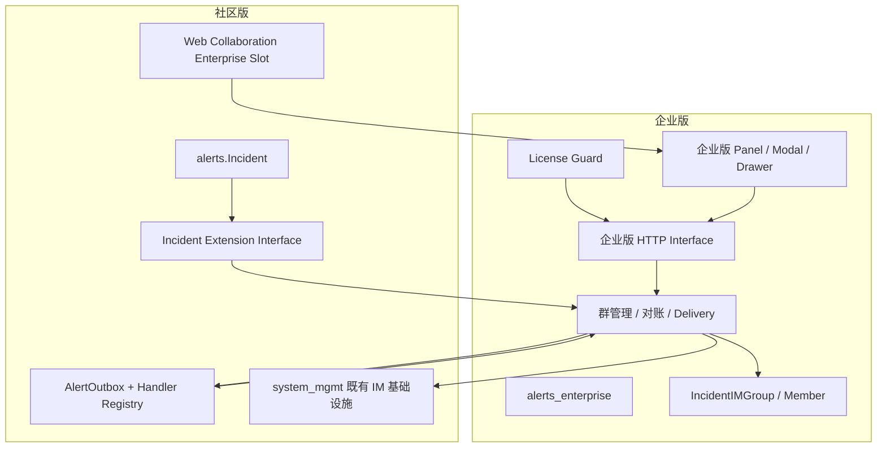
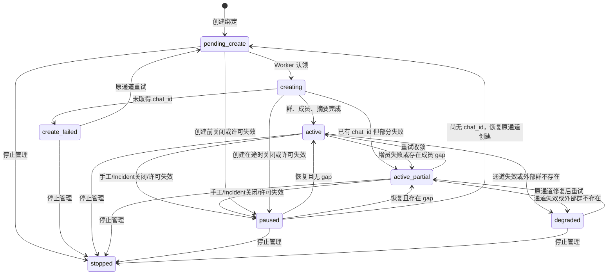

# 企业版 Incident 一键拉群完整设计

- 日期：2026-07-30
- 状态：已实现，待飞书与企业微信真实租户验收
- 产品版本：企业版
- 本期真实验证平台：飞书、企业微信
- 后续平台：其他声明 `im_group` 能力的 IM Provider
- 适用模块：社区版 `alerts` 扩展 seam、企业版 `alerts_enterprise`、企业版 Alarm Web
- 不调整范围：`system_mgmt` 的目录结构、Provider loader 结构和用户映射模型；仅在
  已有 `wecom` Provider 上增量增加 `im_group`
- 取代文档：[Incident 飞书协作群设计](./2026-07-21-incident-feishu-im-group-design.md)

## 1. 五分钟了解

### 1.1 需求

Incident 被拉起后，Incident 负责人可在协作区点击“一键拉群”，从当前可用的多个 IM
平台和应用通道中选择一个，为 Incident 创建外部协作群。创建时把当前负责人和协作人
加入群；负责人可选择是否持续把后续加入 Incident 的人员补充进群。

本期同时使用飞书和企业微信完成真实闭环。两端共用 Alerts 企业版状态机；平台差异只
存在于 Provider Adapter、成员 ID、批次、幂等和平台前置条件中。

### 1.2 最重要的产品规则

1. 平台只在建群前选择；创建绑定后，`provider/channel/member_id_type` 永久冻结。
2. 一个 Incident 生命周期内最多创建一个 IM 群绑定，不支持停止管理后换平台重建。
3. 只有 Incident 负责人可以创建和管理群；协作人只能作为成员和查看者。
4. 群成员来源为 `operator + collaborators` 去重结果，不展开 Incident 所属团队。
5. 持续同步只增不减：新增人员自动补拉，移除人员不自动踢出外部群。
6. 至少一名负责人已完成所选通道的 IM 映射即可创建；其他未映射人员不阻塞。
7. Incident 关闭时暂停自动增员；重新打开后按关闭前配置恢复。
8. 用户主动退出外部群后不循环强拉；负责人可手工重试。
9. 该功能仅属于企业版；社区版没有入口、接口、业务表或平台群调用。

### 1.3 一句话架构

社区版 Alerts 只提供 Incident 生命周期、Outbox 和 Web 协作区三个稳定扩展 seam；
企业版 `alerts_enterprise` 持有群绑定、状态机、可靠投递、接口、许可门控和前端交互；
System Management 继续作为既有 IM 应用、通道、用户映射及 Provider 运行时。

## 2. 范围

### 2.1 本期包含

- 告警中心 CE/EE 代码分离及无企业包降级合同。
- 建群前按 Provider 分组选择一个可用 IM 通道。
- 冻结所选 Provider、通道、成员 ID 类型和群主外部身份。
- 复用 `IMNotificationChannel` 和 `IMNotificationUserMapping`。
- 异步建群、保存外部群 ID、发送 Incident 摘要、分批增员。
- 未映射、冲突、部分成功、平台失败和可重试错误展示。
- 持续同步开关、手工暂停/恢复、成员重试和不可逆停止管理。
- Incident 关闭/重开联动、周期补偿、Outbox 重试和并发 fencing。
- 企业许可门控、审计、可观测性和敏感信息保护。
- 飞书、企业微信自动化合同和真实租户 Runbook。

### 2.2 本期不包含

- 同一 Incident 同时维护多个外部群。
- 创建后切换 Provider、应用通道或成员 ID 类型。
- 停止管理后重新建群。
- 自动解散外部群。
- 从 Incident 移除人员时自动踢群。
- 用户主动退群后持续自动拉回。
- 外部群名称、公告、群主变更的双向同步。
- 群消息回写 Incident。
- 普通微信个人群能力承诺；只有平台提供可用建群能力时才可注册 `im_group`。
- 重构 `system_mgmt` 的目录、Provider loader 或数据模型。

## 3. 术语

| 术语 | 定义 |
|---|---|
| Incident 负责人 | `Incident.operator` 中的用户；具备企业许可和 Incident 编辑权限时可以管理群 |
| Incident 协作人 | `Incident.collaborators` 中的用户；可入群、可查看，但不能管理 |
| 当前期望成员 | `operator + collaborators` 去重后的当前集合 |
| IM Provider | 飞书、企业微信等提供应用身份、用户身份及群能力的平台实现 |
| IM 通道 | `IMNotificationChannel`；确定 IntegrationInstance、用户映射策略和团队访问范围 |
| 群绑定 | Incident 与创建时所选通道及外部群之间不可切换的管理关系 |
| 持续同步 | 把新增当前期望成员补充加入外部群的单向行为 |
| 只增不减 | 已加入外部群的人员不会因从 Incident 移除而自动退群 |
| 停止管理 | BK-Lite 不再管理绑定；外部群保留，且该 Incident 不可重新建群 |
| 外部事实 | Provider 已返回的 `chat_id`、成员结果或消息结果 |
| 本地事实 | 群绑定、成员状态、Outbox 和审计记录 |

## 4. 已确认的产品决策

### 4.1 权限

- `Incident.operator` 中任意负责人均可创建和管理群。
- 写操作同时要求既有 Incident 编辑权限。
- 超级管理员如果不在 `operator` 中，也不能绕过负责人规则。
- 可查看 Incident 的用户可以查看群状态和脱敏成员结果。
- 通道选项、群主候选和用户映射预览只向负责人返回。
- `IMNotificationChannel.team` 只控制通道可见性，不决定群成员。

### 4.2 平台选择

- 创建 Modal 先展示所有声明并通过 `im_group` readiness 的通道。
- 多平台时按 Provider 分组；只有一个平台时仍明确展示平台名称。
- 创建请求只提交 `channel_id`，Provider 由服务端从通道推导。
- 群绑定创建后不允许修改 `channel/provider/member_id_type`。
- 停止管理不会释放重新建群资格。

### 4.3 成员生命周期

- 初始集合为当前期望成员。
- 至少一名已映射负责人才能创建。
- 未映射或冲突人员记为可行动状态，不阻断其他成员。
- 新增负责人或协作人：开启持续同步时自动补拉。
- 移除人员：
  - 已入群人员保留；
  - 尚未入群人员不得被排队中的旧任务继续拉入；
  - 保留历史成员快照用于审计。
- 映射补齐或外部 ID 改变：
  - 当前仍为期望成员时重新进入待同步；
  - 已移除人员不重新入队。

### 4.4 Incident 生命周期

- 关闭 Incident：
  - 暂停尚未发生的建群、摘要和增员；
  - 外部调用已经在途时，只记录已发生的外部事实，不覆盖暂停状态。
- 重新打开：
  - 关闭前持续同步开启时恢复；
  - 根据 `current_stage + external_chat_id + 错误事实` 生成正确的后续任务；
  - 不重新创建已经取得 `external_chat_id` 的群。
- 手工暂停不会被 Incident 重开自动恢复。

### 4.5 企业许可

- 企业包不存在：UI、路由、任务和企业表均不存在。
- 企业包存在但许可无效：
  - 不允许创建、设置、重试、恢复或新的外部调用；
  - 已有绑定和脱敏状态可只读展示；
  - 周期同步不得继续产生外部副作用。
- 许可恢复后由负责人手工恢复，或按最终许可产品策略触发一次安全对账。
- 精确许可模块代码由企业版许可目录提供，本设计不在社区仓猜测或复制许可事实。

## 5. CE/EE 代码边界

### 5.1 总体关系



### 5.2 社区版 Alerts 保留的 seam

#### Incident 扩展 Interface

社区版只发布与扩展相关的稳定事实：

```python
class IncidentExtension(Protocol):
    def participants_changed(self, incident_id: int) -> None: ...
    def incident_closed(self, incident_id: int) -> None: ...
    def incident_reopened(self, incident_id: int) -> None: ...
```

约束：

- 通过 registry 注册，不直接导入企业实现。
- 在核心 Incident 事务提交后调度，外部 API 绝不进入核心事务。
- 扩展调度失败不得把已成功的 Incident 操作回滚。
- 企业周期扫描负责补偿进程在提交后、调度前崩溃的窗口。
- 没有企业 handler 时为空操作，不产生无意义事件。

建议社区版位置：

```text
server/apps/alerts/extensions/
├── __init__.py
├── incident.py
└── registry.py
```

#### Outbox Handler Registry

社区版 Outbox 只负责：

- 认领和 generation；
- 过期 `delivering` 回收；
- 有界重试；
- fencing；
- 最终状态提交；
- 调用注册 handler。

企业版注册：

```python
register_outbox_handler(
    kind="incident_im_group.create",
    deliver=deliver_create_group,
    exhausted=handle_delivery_exhausted,
)
```

社区版不得出现 `if kind.startswith("incident_im_group.")`。

#### Web 企业扩展 Slot

社区协作页只保留一个 app-local 扩展入口，不把它晋升为 shared：

```tsx
<IncidentCollaborationExtension
  incidentId={incidentId}
  refreshVersion={refreshVersion}
/>
```

扩展入口使用仓库现有 `web/scripts/prepare-enterprise.mjs` 机制：

```text
enterprise/web/src/app/alarm/incidents/im-group/index.tsx
    ↓ enterprise prepare junction
web/src/app/alarm/(enterprise)/incidents/im-group/index.tsx
    ↓ tsconfig fallback
web/src/lib/enterpriseStub.ts
```

目录 junction 会让 Turbopack 按企业源码的真实路径解析裸包导入。因此
`prepare-enterprise.mjs` 同时生成
`enterprise/web/node_modules -> web/node_modules` 依赖链接，企业组件复用主 Web 的
唯一 React、Ant Design 和其他前端依赖树。禁止在 `enterprise/web` 再安装一套依赖，
避免双 React、版本漂移和本地可运行但构建失败。

社区侧通过 `@/app/alarm/(enterprise)/*` 尝试加载；无 enterprise overlay 时返回 `null`。
社区组件不引用 Incident IM 类型、接口或文案，也不新增第二套企业模块发现逻辑。

### 5.3 企业版 Alerts app

```text
enterprise/server/apps/alerts_enterprise/
├── __init__.py
├── apps.py
├── config.py
├── registry_hooks.py
├── models/
│   ├── __init__.py
│   └── incident_im.py
├── migrations/
│   ├── __init__.py
│   └── 0001_initial.py
├── serializers/
│   └── incident_im.py
├── views/
│   └── incident_im.py
├── services/
│   └── incident_im/
│       ├── channels.py
│       ├── constants.py
│       ├── delivery.py
│       ├── errors.py
│       ├── groups.py
│       ├── members.py
│       ├── observability.py
│       └── reconcile.py
├── tasks/
│   └── incident_im.py
├── routes.py
└── tests/
```

源码位于 Git 子模块；企业构建把 `enterprise/server/apps` overlay 到运行时
`server/apps`。`AlertsEnterpriseConfig.ready()` 导入 `registry_hooks.py`，并通过社区
registry 注册 Incident 生命周期 handler、Outbox handler 和 Alerts URL patterns。

`alerts_enterprise` 不提供 `urls.py`，避免根 URL 自动把它暴露为
`/api/v1/alerts_enterprise/`。企业 `routes.py` 中的 patterns 通过社区 Alerts URL
registry 挂载到既有 `/api/v1/alerts/` 域下。注册模块不承载业务实现。

显式 `INSTALL_APPS` 的企业部署必须包含 `alerts_enterprise`。社区版不得安装该 app。

### 5.4 System Management 边界

本次不移动、不重构：

- `IntegrationInstance`
- `IMNotificationChannel`
- `IMNotificationUserMapping`
- Provider manifest/registry/runtime
- `BaseIMGroupAdapter`
- `FeishuIMGroupAdapter`
- `IMGroupRuntimeService`

主工作区已经存在正式 `wecom` Provider：

```text
server/apps/system_mgmt/providers/
├── manifests/
│   └── wecom.py               # 已有 login_auth/user_sync/im_notification
├── adapters/
│   └── wecom.py               # 已有登录、通讯录和通知 Adapter
└── loader.py                  # 已注册 wecom
```

`wecom` 是企业微信自建应用 Provider；现有 `wechat` 仍表示微信开放平台 OAuth，二者
不得复用 provider key、`openid/unionid` 或登录配置。本期不重复实现 Provider 和用户
同步，只做以下增量：

- 在现有 manifest 增加 `im_group` capability，并把凭据变更的
  `reset_capabilities` 覆盖到该 capability；
- 在现有 `wecom.py` Adapter 中增加 `WeComIMGroupAdapter`；
- 实现 `create_group/get_group/add_members/send_group_message`，复用已依赖的
  `wechatpy.enterprise.WeChatClient.appchat`；
- readiness 验证自建应用凭据和 `appchat` 所需条件，不在应用启动期创建外部资源。

不新增或修改 System Management 数据表；`external_match_field`、
`external_receive_field` 和 `external_snapshot` 已能保存 `userid`。界面展示文案中原有
“Feishu User ID/Open ID”标签应在 Provider 表单内由 manifest 提供，不能把企微
`userid` 伪装成飞书字段。

`IncidentIMGroup.channel` 是运行期依赖，不是绑定历史的生命周期所有者。字段使用
可空 `SET_NULL`：System Management 可以删除通道，删除后 Incident 群绑定、成员结果、
外部群 ID 和渠道快照继续保留，但停止一切外部调用并进入不可重试的
`degraded / IM_CHANNEL_MISSING`。不快照凭据，不允许同名新渠道自动接管旧群。
企业 app 通过 `IMNotificationChannel.pre_delete` 在同一删除事务中即时写入降级事实，
社区侧当前 `_has_active_incident_im_groups()` 特判随迁移删除。

企业 Alerts 新建 `IncidentIMChannelGateway`，只使用 System Management 的公开模型和
`RuntimeApplicationService`，不依赖当前限定飞书的 `IMGroupRuntimeService`：

```python
class IncidentIMChannelGateway:
    def list_ready_channels(self, user): ...
    def require_ready_channel(self, user, channel_id): ...
    def execute(self, channel, operation, **kwargs): ...
    def execute_for_group(self, group, operation, **kwargs): ...
```

创建前的约束和成员预览使用 `execute(channel, ...)`；绑定创建后的建群、增员、摘要和
漂移复核统一使用 `execute_for_group(group, ...)`。后者每次按实时 `channel_id` 重新
解析渠道，不信任 ORM 已缓存关系。若删除在 Worker 解析前提交，则不得发起新外呼；
已经进入第三方平台的在途请求无法与本地删除形成分布式原子事务，允许完成，并由现有
幂等键和本地状态收口。ACK 可以保存已确认的 `external_chat_id`、已入群成员等外部
事实，但锁后必须再次检查 `channel_id`，不得覆盖 `degraded / IM_CHANNEL_MISSING`
或派生新的 Outbox。这里不承诺撤销或 fencing 已发出的第三方请求。

通道可选条件：

```text
channel enabled + ready
instance enabled + ready
provider manifest 声明 im_group
instance capability_status.im_notification = ready
adapter 已注册
当前用户可访问 channel
```

`capability_status.im_group` 只记录可选诊断结果，不是 Incident 选择渠道或创建群的
前置条件。群协作页不暴露平台固定 API URL，也不要求为了诊断额外申请应用信息读取
权限；真实建群权限在外部操作时校验并转换为可行动错误。

飞书和企业微信满足相同条件后均由 Gateway 自动发现；Alerts 不使用
`if provider == "feishu"` 或 `if provider == "wecom"` 分支。

### 5.5 企业微信现有代码事实与缺口

仓库扫描确认：

| 能力 | 当前代码事实 | 本期动作 |
|---|---|---|
| 正式 WeCom Provider | 主工作区已有 manifest、loader 注册和测试 | 安全纳入目标分支，禁止重复实现 |
| 自建应用凭据 | IntegrationInstance 已配置 `corp_id/corp_secret/agent_id` | 复用并补 `im_group` readiness/reset |
| 企业内部身份 | manifest 固定 `userid` 为 identity/receive field | 直接复用 |
| 通讯录与通知 | 已实现 `list_external_users` 和 `send_message` | 直接复用 |
| 正式用户映射 | 通用同步服务写入 `IMNotificationUserMapping(userid)` | 建群前验证所选通知渠道已同步 |
| 应用群聊 SDK | `appchat.create/update/get/send_text` 已安装 | 实现 `WeComIMGroupAdapter` |
| 群运行时 | 当前 `IMGroupRuntimeService` 硬编码飞书 | 企业 Gateway 直接走通用 Runtime |

截图中的“通知渠道” capability ready 表示 Provider 能力就绪；Incident 真正可建群还
要求至少一个企微 `IMNotificationChannel` 已执行账号同步并生成当前成员的
`IMNotificationUserMapping(userid)`。本设计不使用 OpsPilot `ChannelUser`。

## 6. 后端设计

### 6.1 数据模型

#### `IncidentIMGroup`

| 字段 | 说明 |
|---|---|
| `id` | UUID 主键 |
| `incident` | `alerts.Incident` 外键；数据库唯一 |
| `channel` | 可空 `IMNotificationChannel` 外键，`SET_NULL`；存在时提供运行期凭据和映射 |
| `channel_id_snapshot` | 创建时渠道数据库 ID 快照，仅用于审计，不参与运行期解析 |
| `provider_key` | 创建时从 IntegrationInstance 冻结；无 `feishu` 默认值 |
| `channel_name_snapshot` | 通道名称快照 |
| `member_id_type` | 创建时冻结的外部身份类型 |
| `max_initial_members/max_add_members` | 创建时冻结的 Provider 批次约束，避免升级后改变既有群语义 |
| `group_name` | 创建时事故名称快照；客户端不可覆盖 |
| `external_chat_id` | 外部群 ID；得到后立即持久化 |
| `external_owner_id` | 外部群主身份快照 |
| `status` | 绑定状态 |
| `current_stage` | 当前异步阶段 |
| `continuous_sync_enabled` | 持续同步开关 |
| `resume_after_reopen` | 关闭前是否需要在重开后恢复 |
| `pause_reason` | `manual/incident_closed/license_invalid/空` |
| `idempotency_key` | 稳定建群键 |
| `last_error_code/message` | 稳定、脱敏、截断错误 |
| `last_sync_at` | 最近一次成功同步时间 |
| `last_reconcile_attempt_at` | 周期扫描公平游标 |
| `delivery_lock_token/expires_at` | 群级投递租约 |
| `stopped_at/by` | 不可逆停止管理审计 |
| `created_by/updated_by` | BK-Lite 操作审计 |
| `created_at/updated_at` | 时间审计 |

数据库约束：

```python
UniqueConstraint(
    fields=["incident"],
    name="unique_incident_im_group",
)
```

不再使用 `active_slot`。任何状态下已有绑定都拒绝第二次创建。

外键策略：

- `incident -> alerts.Incident`：`CASCADE`，遵循 Incident 删除语义；
- `channel -> system_mgmt.IMNotificationChannel`：可空 `SET_NULL`；删除渠道不删除
  Incident 历史，也不阻止 System Management 清理配置；
- 非空的 `channel_id_snapshot` 与
  `provider_key/channel_name_snapshot/member_id_type` 共同保留创建时
  审计事实；快照不得用于恢复凭据或自动接管新渠道；
- System Management 不通过反向 relation 判断企业状态。

渠道删除后的状态合同：

```text
channel = NULL
├── 绑定、成员、external_chat_id 和审计快照保留
├── Gateway 返回不可重试 IM_CHANNEL_MISSING，不再发起新的 Runtime Adapter 调用
├── active/create/add/summary/reconcile 收敛为 degraded
├── paused/stopped 的权威生命周期状态不被旧任务覆盖
├── 删除事务收敛当前阶段，清理暂停任务租约，未确认的 adding 成员记为失败
├── 前端 can_retry=false，仍允许查看和停止管理
└── 外部群不删除，也不允许换渠道或重新建群
```

#### `IncidentIMMember`

| 字段 | 说明 |
|---|---|
| `group` | 群绑定外键 |
| `username` | BK-Lite 用户名快照 |
| `role` | `operator/collaborator`，重合时取 operator |
| `external_id/type` | 最近一次解析出的外部身份快照 |
| `mapping_status` | `mapped/unmapped/conflict` |
| `sync_status` | `waiting/pending/adding/joined/failed` |
| `attempt_count` | 投递尝试次数 |
| `last_error_code/message` | 成员级稳定错误 |
| `joined_at` | 成功入群时间 |
| `created_at/updated_at` | 时间审计 |

约束：

```python
UniqueConstraint(
    fields=["group", "username"],
    name="unique_incident_im_member_username",
)
```

成员不外键依赖 `IMNotificationUserMapping`，因为通道同步可能重建映射行。

### 6.2 单一企业版迁移

由于功能迁移从未部署：

1. 删除社区版 Alerts 的 `0022_incident_im_group` 至 `0025`；
2. 删除社区版 `IncidentIMGroup/IncidentIMMember` 模型和导出；
3. 新建一个企业迁移：

```text
enterprise/server/apps/alerts_enterprise/migrations/0001_initial.py
```

依赖：

```python
dependencies = [
    ("alerts", "0022_merge_20260717_0921"),
    ("system_mgmt", "0040_usersyncsource_platform_config"),
]
```

`0001_initial` 一次性创建最终字段、索引和约束。无需数据迁移，也不使用
`squashmigrations`。

如实施期间目标分支新增社区迁移，只更新企业 `0001_initial` 的 dependency，不拆出
第二个企业迁移。

迁移门禁：

- 空白数据库可应用和回滚企业 `0001`；
- 社区构建不会发现企业迁移；
- `makemigrations --check` 无漂移；
- PostgreSQL、MySQL、SQLite 均使用普通唯一约束，不依赖条件唯一索引；
- 不使用 raw SQL。

### 6.3 状态机



`stopped` 为不可逆终态，不能回到创建态，也不能创建第二条绑定。

### 6.4 异步阶段

```text
queued
creating_chat
adding_members
sending_summary
completed
```

`external_chat_id` 是外部群已创建的权威事实。一旦取得：

- 先保存 `external_chat_id`；
- 后续重试不得再次创建群；
- 摘要和增员分别重试；
- 关闭、暂停或许可失效不能清除外部事实。

### 6.5 Outbox kind

```text
incident_im_group.create
incident_im_group.add_members
incident_im_group.send_summary
incident_im_group.reconcile
```

不变量：

- 每个 Outbox 有稳定幂等键。
- 单个 add-members Outbox 通常最多执行一次外部调用；企业微信仅在平台返回
  `86007` 且无法指出无效成员时，按 6.7 节的预算执行有界拆分探测。
- 同一群同一时刻最多一个有效 delivery lease。
- 旧 worker 不能覆盖新 generation 的终态。
- 过期且已耗尽的 `delivering` 直接转 FAILED，不再次执行外部副作用。
- 耗尽 hook 只能更新错误事实，不能覆盖最新暂停或 stopped 状态。
- stopped 后旧 Outbox 全部安全空操作。

### 6.6 成员解析

1. 收集当前期望成员并确定角色。
2. 查询通道下 BK-Lite User 对应的 `IMNotificationUserMapping`。
3. 使用绑定冻结的 `member_id_type` 读取 `external_snapshot`。
4. 映射行缺失、类型不匹配、ID 为空或冲突时生成稳定错误码。
5. 当前仍为期望成员且身份变化时重新进入 `pending`。
6. 已移除人员永不被旧任务重新拉入。

群创建时：

- 当前操作者已映射时默认其为群主；
- 否则默认第一名已映射负责人；
- 所有负责人均未映射时拒绝创建。

成员预览和实际提交必须区分两个集合：

- “当前期望成员”完整展示，保证负责人能看到遗漏、待映射和冲突；
- “可加入成员”仅包含所选通道下具有唯一有效映射的人员，才会提交给 Provider；
- 待映射、映射冲突成员本次不加入，也不阻断其他成员建群；映射修复后由持续同步或
  手工重试补拉；
- 已映射只代表具备平台身份，不代表平台最终接受。平台判定账号不可用时转为成员级
  `failed`，群若已创建则保持 `active_partial`，不得误报为渠道配置异常。

### 6.7 平台批次

飞书安全批次为每批最多 50 人。企业微信使用 Adapter 声明并经测试租户验证的安全批次；
当前 `wechatpy` 合同显示创建成员使用 `userid`、至少 2 人且最多 500 人，但业务实现
仍采用保守、可配置的 Adapter 批次上限，不把 SDK 注释当成永久平台上限。

每个批次本地提交后才能生成下一批，例如飞书：

```text
51 人  -> 50 + 1
101 人 -> 50 + 50 + 1
```

Alerts 企业 Gateway 可读取 Adapter 暴露的安全批次上限；没有声明的平台使用保守上限，
并在该平台接入任务中以真实文档和合同测试固定。通常一个 Outbox 对应一次外部请求；
企业微信 `appchat` 无法返回批次中的具体坏账号，是唯一例外：Adapter 可以在同一个
有租约的 Delivery 内执行有界隔离请求，但必须返回明确的 `joined_member_ids`、
`invalid_member_ids` 和 `failed_member_ids`，且所有调用都受预算限制。

企业微信建群还有平台专属前置条件：

- 只能使用企业自建应用和同一企业内部 `userid`；
- 至少两名当前期望成员已映射才能提交创建；其中群主必须为已映射负责人；
- 服务端生成不超过 32 个字母数字字符的确定性 `chatid`；
- 重试先用确定性 `chatid` 查询，已存在时直接恢复本地事实，禁止创建第二个群；当前
  企微环境对“格式合法但尚未创建”的查询也可能返回 86001，因此仅在创建预检阶段把
  86001/86003 视为不存在；86008 仍按其他应用占用处理，禁止继续创建；
- 创建成功后发送 Incident 摘要，只有群和摘要链路完成才向前端显示“可用”；
- `add_members` 只传 `add_user_list`，本期绝不调用 `del_user_list`。
- `create_group` 先尝试“群主 + 一名候选人”的最小可用成员集；候选人返回 86007 时
  尝试下一名，群主、权限、群名等错误立即失败；候选探测最多 20 次。
- 群创建后，其余成员进入增员阶段；批次返回 86007 时二分隔离无效 `userid`，单批
  的预检查询和增员请求合计最多执行 32 次外部调用。达到预算仍未定位的成员记为
  成员级失败，不无限调用平台。
- 增员前用 `appchat.get` 读取当前群成员并跳过已存在人员，保证部分增员成功后 Worker
  崩溃重放不会重复推断成员事实。
- 隔离过程中若部分成员已成功、随后遇到限流或网络类可重试错误，先保存平台已确认的
  已入群/无效账号事实；未完成成员保持 `pending`，由 Outbox 重试，不降级为永久失败。

飞书仍允许“至少一名负责人已映射”创建；企业微信的两人下限属于 Provider readiness
预览的一部分。Modal 必须展示平台专属阻断原因，而不是提交后才返回通用失败。

### 6.8 摘要消息

统一消息结构：

```text
Incident 协作群已建立

标题：{title}
级别：{level}
状态：{status}
负责人：{operators}
详情：{absolute_incident_url}

后续新增的 Incident 相关人员将按当前持续同步设置加入本群。
```

要求：

- 使用稳定消息幂等键（平台支持时传递）；
- URL 必须是 IM 客户端可访问的绝对地址；
- 不包含 token、secret、完整外部用户 ID 或未授权字段；
- 日志失败不能改变消息投递结果。

### 6.9 双平台 Adapter 合同

Alerts 只依赖统一 `BaseIMGroupAdapter` Interface：

| 操作 | 飞书 Adapter | 企业微信 Adapter |
|---|---|---|
| `create_group` | 创建 chat，稳定 `uuid` | 确定性 `chatid`，先查后建 |
| `get_group` | 按 `chat_id` 查询 | `appchat.get(chatid)` |
| `add_members` | 按 `open_id` 增员 | `appchat.update(add_user_list=userid)` |
| `send_group_message` | `receive_id_type=chat_id` | `appchat.send_text(chatid, content)` |
| 成员身份 | `open_id` | `userid` |
| 删除成员 | 不调用 | 不传 `del_user_list` |
| 原生消息幂等 | 传稳定 UUID | 无原生键；Outbox 状态和摘要阶段防重 |

Adapter 返回统一结果：

```text
success
partial_success
retryable
external_chat_id
joined_member_ids
invalid_member_ids
failed_member_ids
request_id
errors[{code, field, message}]
```

平台原始 `errcode/code` 只在 Adapter 内归一化；Alerts 不解析平台响应。企业微信创建
请求超时且无法确定结果时，下一次执行必须先按确定性 `chatid` 查询。查询已存在视为
上次外部调用成功；查询不存在才允许再次创建。

## 7. HTTP Interface

路径保持在 Alerts 领域下，但仅企业包注册：

```text
/api/v1/alerts/api/incident/{incident_pk}/im-group/
```

| 方法与路径 | 用途 | 权限 |
|---|---|---|
| `GET im-group/options/` | Provider 分组通道、默认群名、群主候选、成员预览 | Incident 负责人 |
| `GET im-group/` | 群状态、阶段、汇总、动作矩阵 | Incident 查看权限 |
| `GET im-group/members/` | 脱敏成员分页和错误 | Incident 查看权限 |
| `POST im-group/` | 创建唯一绑定并入队，返回 202 | 负责人 + Edit + 企业许可 |
| `PATCH im-group/` | 修改持续同步开关 | 负责人 + Edit + 企业许可 |
| `POST im-group/pause/` | 手工暂停 | 负责人 + Edit + 企业许可 |
| `POST im-group/resume/` | 恢复 | 负责人 + Edit + 企业许可 |
| `POST im-group/retry/` | 重试原绑定、待处理或失败成员 | 负责人 + Edit + 企业许可 |
| `POST im-group/stop/` | 不可逆停止管理，外部群保留 | 负责人 + Edit + 企业许可 |

不提供：

- 修改 Provider 或 channel 的接口；
- 删除绑定记录的接口；
- 第二次创建接口；
- 解散外部群接口。

### 7.1 Options 响应

```json
{
  "providers": [
    {
      "key": "feishu",
      "name": "飞书",
      "channels": [
        {
          "id": 12,
          "name": "总部飞书",
          "status": "ready",
          "member_id_type": "open_id",
          "owner_candidates": [
            {"username": "zhangsan", "display_name": "张三"}
          ],
          "preview": {
            "mapped": 3,
            "unmapped": 1,
            "conflict": 0
          }
        }
      ]
    },
    {
      "key": "wecom",
      "name": "企业微信",
      "channels": [
        {
          "id": 18,
          "name": "总部企业微信",
          "status": "ready",
          "member_id_type": "userid",
          "owner_candidates": [
            {"username": "zhangsan", "display_name": "张三"}
          ],
          "preview": {
            "mapped": 3,
            "unmapped": 1,
            "conflict": 0
          },
          "requirements": {
            "minimum_mapped_members": 2,
            "satisfied": true,
            "blockers": []
          }
        }
      ]
    }
  ],
  "default_group_name": "数据库连接异常",
  "permissions": {
    "can_create": true
  }
}
```

不返回凭据、token、完整外部成员 ID 或原始用户快照。

`requirements` 由 Provider Adapter 的公开元数据和服务端预览共同生成。企业微信不足
两名已映射当前成员、没有已映射负责人或应用 readiness 不满足时，通道仍可展示用于
诊断，但 `satisfied=false` 且不可提交；前端只渲染服务端 blocker，不自行复制平台规则。

### 7.2 创建请求

```json
{
  "channel_id": 12,
  "owner_username": "zhangsan",
  "group_name": "[P1] 数据库连接异常 · INC-1042",
  "continuous_sync_enabled": true
}
```

服务端必须忽略或拒绝客户端提交的 `provider_key/member_id_type/external_owner_id`。

### 7.3 响应动作矩阵

前端不得复制状态机。状态响应返回：

```json
{
  "permissions": {
    "can_view": true,
    "can_create": false,
    "can_pause": true,
    "can_resume": false,
    "can_retry": true,
    "can_change_sync": true,
    "can_stop": true
  }
}
```

## 8. 前端设计

### 8.1 CE/EE 所有权

社区版：

```text
web/src/app/alarm/(pages)/incidents/components/collaboration/index.tsx
└── 只引用 @/app/alarm/(enterprise)/incidents/im-group
```

企业版：

```text
enterprise/web/src/app/alarm/incidents/im-group/
├── index.tsx
├── api.ts
├── types.ts
├── useIncidentIMGroup.ts
├── createModal.tsx
├── memberDrawer.tsx
├── confirmModals.tsx
├── controller.ts
├── state.ts
└── viewModel.ts
```

企业组件属于 Alarm app-local，不进入 `web/src/components`。

### 8.2 页面布局

采用已确认的方案 A：

- 群卡片位于 Incident 协作页右侧栏；
- 放在协作者列表上方；
- 右侧栏扩展为 300px，优先保证 IM 群状态、错误和动作可读；协作者列表采用紧凑行距和头像；
- 复杂成员与错误明细进入 Drawer；
- 创建配置进入 Modal；
- 不创建独立“IM 群管理”页面。

### 8.3 未建群状态

展示：

- “IM 协作群”标题；
- 企业版可用状态；
- 可用 Provider 数量或“暂无可用通道”；
- “一键拉群”主按钮。

负责人可以创建；其他查看者只看到只读提示。企业许可无效时不展示可操作按钮。

### 8.4 创建 Modal

字段顺序：

1. IM 平台；
2. 应用通道；
3. 群名称（事故名称，只读）；
4. 群主；
5. 成员映射预览；
6. 持续同步开关；
7. 只增不减说明。

交互：

- 平台来自 `options.providers`。
- 切换平台时清空通道、群主和预览。
- 选择通道后加载该通道的群主候选和成员预览。
- 群名称由服务端根据 `Incident.title` 生成；前端只读展示，创建接口即使收到其他名称
  也必须以事务内重新读取的事故名称为准。
- 建群成功后必须保存平台返回的 `external_chat_id`；后续系统消息通过群绑定的
  `provider_key + channel + external_chat_id` 路由，不得解析群名称定位外部群。
- 至少一名已映射负责人，否则提交禁用。
- 预览汇总使用“本次可加入 / 暂不加入”，逐人显示“预计加入 / 待映射本次不加入 /
  映射冲突本次不加入”；未映射和冲突以 Warning 显示但不阻塞。
- 提交按钮显示预计加入人数；平台执行后若某个已映射账号被拒绝，详情 Drawer 展示
  具体成员和安全、可行动的账号状态或应用可见范围提示。
- Modal 主体限高并内部滚动，底部按钮保持可见。
- 提交按钮有 loading，防止重复提交。

### 8.5 运行态卡片

| 状态 | 重点 | 主动作 |
|---|---|---|
| `pending_create/creating` | 当前阶段、处理中 | 查看进度 |
| `active` | 平台、已加入人数、同步设置 | 查看详情 |
| `active_partial` | 待映射/失败/待处理数量 | 重试或查看详情 |
| `paused` | 暂停原因 | 恢复（允许时） |
| `create_failed` | 原通道建群失败 | 重试 |
| `degraded` | 通道或外部群异常 | 重新检查/重试 |
| `stopped` | 已停止管理、外部群保留 | 只读查看 |

更多动作：

- 切换持续同步；
- 手工暂停；
- 重试；
- 复制外部群 ID或打开群（Provider 返回权威 URL 时）；
- 停止管理。

绝不展示“更换平台”“重新选择通道”或“重新建群”。

### 8.6 成员 Drawer

展示：

- Provider 和通道；
- 群状态、阶段、持续同步状态；
- 已加入、待映射、失败数量；
- 成员分页；
- `all/pending/joined/failed` 筛选；
- 脱敏错误；
- 对允许成员执行单人重试。

不展示完整外部 ID。外部 ID 仅用于后端投递和审计。

### 8.7 暂停、恢复和停止管理

- 暂停 Modal 说明不会移除已入群成员。
- Incident 关闭暂停由系统触发，前端不允许手工恢复。
- 停止管理必须二次确认并输入群名称或确认短语。
- 确认文案明确：
  - 外部群不会删除；
  - 后续成员不会同步；
  - 当前 Incident 不能重新建群或切换平台。

### 8.8 刷新策略

- 创建中和增员中短轮询；
- 稳定状态不持续高频轮询；
- Incident、协作者或 `refreshVersion` 变化时刷新；
- 页面卸载或切换 Incident 时取消请求和计时器；
- 轮询连续失败后停止自动轮询，展示手工刷新；
- 服务端状态和动作矩阵是唯一事实来源。

### 8.9 反馈与可访问性

- 复用 Ant Design `Card/Form/Select/Modal/Drawer/Table/Alert/Tag/Button`。
- 不新增 shared 组件。
- 状态不能只靠颜色表达。
- 图标按钮提供 `aria-label`。
- Modal/Drawer 可键盘关闭，危险确认需明确后果。
- 长群名、通道名和错误安全省略并可查看完整脱敏文本。
- 亮色和暗色均需视觉检查。

## 9. 安全、审计与可观测性

### 9.1 凭据

- Alerts 企业代码不读取数据库密文或环境变量凭据。
- 只通过 `RuntimeApplicationService` 调用 Provider。
- API、日志、审计和 Outbox payload 不保存 token、secret 或完整请求体。

### 9.2 错误

统一稳定错误码示例：

```text
IM_GROUP_ALREADY_EXISTS
IM_GROUP_LICENSE_REQUIRED
IM_GROUP_CHANNEL_UNAVAILABLE
IM_GROUP_CHANNEL_NOT_READY
IM_GROUP_PROVIDER_UNSUPPORTED
IM_GROUP_NO_MAPPED_OPERATOR
IM_GROUP_OWNER_NOT_MAPPED
IM_GROUP_BINDING_IMMUTABLE
IM_GROUP_STOPPED
IM_USER_MAPPING_NOT_FOUND
IM_USER_MAPPING_CONFLICT
IM_USER_RECEIVE_ID_MISSING
provider.auth_failed
provider.permission_denied
provider.rate_limited
provider.group_not_found
provider.timeout
provider.request_failed
```

错误文案在 Alerts 层使用“IM 平台/IM 通道/IM 协作群”；平台专属诊断留在 Adapter。

### 9.3 日志白名单

允许：

```text
event
operation
result
group_id
incident_id
provider
channel_id_snapshot
stage
status
error_code
error_detail
external_code
request_id
external_request_id
exception_type
member_count
joined_count
failed_count
duration_ms
retryable
```

其中 `error_detail` 只能来自 Provider 明确声明为安全的诊断详情；平台未归一化的异常
只记录异常类型，不记录异常消息。建群、增员、摘要发送的失败与重试事件必须使用同一
组关联字段，便于从 Celery 日志定位到具体 Incident、群绑定、通道、阶段和第三方请求。

禁止：

```text
Authorization
token / secret
完整 URL query
完整 external_id/chat_id
原始请求/响应
用户邮箱和手机号
换行未清洗的第三方 request ID
```

### 9.4 审计

记录：

- 创建请求和最终结果；
- 平台及通道名称快照；
- 持续同步开关变化；
- 暂停、恢复、重试；
- Incident 关闭/重开联动；
- 不可逆停止管理；
- 成员批次成功/失败汇总。

## 10. TDD 设计

### 10.1 预先确认的测试 seam

实施只在以下公开 seam 测试，不测试私有函数：

1. **社区版降级 seam**：没有企业包时，Alerts 启动、URL、迁移和 Web Slot。
2. **Incident Extension Interface**：人员变化、关闭、重开向已注册 handler 发布事实。
3. **Outbox Handler Registry Interface**：kind 注册、投递、耗尽和 fencing。
4. **企业 HTTP Interface**：权限、许可、请求和响应合同。
5. **IncidentIMChannelGateway Interface**：多 Provider 通道发现、访问和 readiness。
6. **群领域 Interface**：创建、设置、暂停、恢复、重试、停止管理。
7. **Delivery Interface**：建群、增员、摘要和外部 ACK 边界。
8. **生命周期 Interface**：人员变化、周期补偿、关闭和重开。
9. **企业 Web 用户 Interface**：Slot、Modal、卡片、Drawer 和确认动作。
10. **真实 Provider seam**：专用飞书、企业微信测试租户 Runbook。

测试可以通过接口结果、数据库权威事实和记录的 Adapter 调用观察行为；不得 mock
被测模块内部私有函数。

### 10.2 RED→GREEN 纵向切片

#### Slice 1：纯社区版为空

RED：

- CE 构建仍注册 IM 群 URL；
- CE migration graph 包含 Incident IM 表；
- CE 协作页渲染企业面板。

GREEN：

- 企业包缺失时路由不存在、无企业表、Slot 返回 `null`；
- Alerts 既有测试不受影响。

#### Slice 2：企业 app 和单一迁移

RED：

- `alerts_enterprise` 未安装或模型无唯一约束；
- 同一 Incident 可创建两个绑定；
- migration graph 出现多段功能迁移。

GREEN：

- `0001_initial` 可应用；
- 一个 Incident 永久唯一；
- 无 `active_slot`；
- provider 无默认值；
- 社区 migration graph 不含企业迁移。

#### Slice 3：多 Provider 创建前选择

使用 Fake Provider A/B：

RED：

- options 只返回飞书；
- 无 `im_group` capability 的 Provider 被返回；
- 客户端可以伪造 provider。

GREEN：

- options 按 Provider 分组；
- 只返回 ready 且可访问通道；
- POST 仅信任 `channel_id`；
- 创建后 Provider、channel、ID 类型冻结。

#### Slice 4：权限和许可

RED：

- 非负责人或无许可用户可以创建；
- 超级管理员非负责人绕过规则；
- 许可无效时周期任务仍外呼。

GREEN：

- 查看和管理权限分离；
- 所有写入口服务端 fail closed；
- 无许可只读保留，自动副作用暂停。

#### Slice 5：异步创建

RED：

- HTTP 请求等待 Provider；
- 重复请求创建两个绑定；
- 创建失败未分类。
- 单个企微无效 `userid` 导致整个群创建失败；
- Provider 未明确确认的成员被本地误记为已入群；
- 企微隔离请求无预算导致外部调用风暴。

GREEN：

- 事务内保存绑定、成员快照和 Outbox，返回 202；
- 重复请求稳定冲突；
- 所有负责人未映射时拒绝；
- 部分未映射不阻断。
- 企微使用最小可用群创建，坏候选人形成成员失败而有效成员继续；
- Delivery 仅把 `joined_member_ids` 标记为已入群，未尝试成员保持 `pending`；
- 增员隔离有界，ACK 丢失时先读取群成员恢复外部事实。

#### Slice 6：外部群和 ACK

RED：

- Provider 成功、本地 ACK 崩溃后重复建群；
- 返回缺少 chat_id 被当成功；
- 创建中关闭仍覆盖暂停。

GREEN：

- 稳定 idempotency key；
- chat_id 先落库；
- 已有 chat_id 重投不再建群；
- 外呼前和 ACK 后复核生命周期。

#### Slice 7：摘要消息

RED：

- ACK 丢失后生成新消息幂等键；
- 已暂停仍发送；
- 摘要包含敏感字段。

GREEN：

- 稳定消息键；
- 暂停/关闭/许可失效时不产生新消息；
- 摘要内容和 URL 合同正确。

#### Slice 8：分批增员和只增不减

RED：

- 51/101 人超过平台上限；
- 首批后暂停仍继续第二批；
- 移除的 pending 成员被旧 Outbox 拉入；
- failed 成员被周期任务无限重试。

GREEN：

- 50+1、50+50+1；
- 每个 Outbox 一次外呼；
- 每批前复核当前期望成员和生命周期；
- 自动同步只处理 pending；
- failed 仅手工重试。

#### Slice 9：关闭和重开

RED：

- pending_create 在关闭后仍建群；
- 重开重复创建已有 chat_id 的群；
- 手工暂停被重开恢复；
- 历史已移除成员让状态永久 partial。

GREEN：

- 创建前/在途两类竞态安全；
- 重开按外部事实继续正确阶段；
- 手工暂停保持；
- 状态聚合只看当前期望成员。

#### Slice 10：不可逆停止管理

RED：

- stopped 后允许第二次创建；
- 旧 Outbox 修改 stopped 绑定；
- UI 提供切换平台动作。

GREEN：

- 数据库永久唯一；
- stopped 后外部调用为空操作；
- 外部群保留；
- UI 只读且明确不可重建。

#### Slice 11：企业 Web

RED：

- 社区 Slot 泄漏企业 UI；
- Modal 可提交无群主通道；
- 平台切换保留旧通道；
- 前端复制权限/状态机。

GREEN：

- CE/EE 构建合同；
- 完整表单校验；
- 状态、动作矩阵完全由服务端驱动；
- 创建中轮询、取消请求和失败恢复正确。

#### Slice 12：飞书 Adapter 合同与真实闭环

自动化 GREEN 后才执行真实租户：

- 用户同步和映射；
- 单次建群；
- 部分映射；
- 摘要；
- 幂等和重投；
- 映射补齐；
- 新增人员；
- 只增不减；
- 关闭/重开；
- 暂停/恢复；
- 平台失败和重试；
- 不可逆停止管理。

#### Slice 13：在现有企业微信 Provider 增加群能力

RED：

- `wecom` manifest 没有 `im_group`；
- `WeComIMGroupAdapter` 未注册或仍返回 not implemented；
- 凭据更新后 `im_group` readiness 没有失效；
- 通知渠道虽然 ready，但没有 `userid` 映射时仍允许建群；
- Incident Gateway 不返回 ready 的企微通道。

GREEN：

- 保留既有 `login_auth/user_sync/im_notification` 行为和测试；
- `im_group` manifest、Adapter 注册、readiness 和 reset 合同通过；
- 直接读取既有 `IMNotificationUserMapping.external_receive_key == "userid"`；
- 未映射和映射冲突只生成可行动预览，不猜测或读取 `ChannelUser`；
- Gateway 同时返回飞书和企微，且按 Provider 分组。

#### Slice 14：企业微信群 Adapter 与真实闭环

RED：

- 少于两名已映射当前成员仍可提交；
- 重试随机生成新 `chatid`；
- 创建成功但摘要未发送即标记 active；
- 增员调用 `del_user_list`；
- 外部联系人或其他企业身份进入自动重试；
- 企微失败污染飞书错误分类。

GREEN：

- `create/get/update(add_user_list)/send_text` 满足统一 Adapter 合同；
- 确定性 `chatid` 和“先查后建”保证重投幂等；
- 创建、摘要、增员、只增不减、暂停/重开、手工重试和 stopped 全链路通过；
- 企微永久不支持身份进入不可重试错误；
- 日志只记录平台、操作、请求 ID、耗时、错误码和数量，不记录 secret 或完整 userid；
- 专用企业微信测试企业完成真实 Runbook。

### 10.3 后端测试矩阵

| 类别 | 重点 |
|---|---|
| CE 合同 | 无企业包启动、无 URL、无 migration、无 handler |
| 模型/迁移 | 单一 0001、永久唯一、字段冻结、跨数据库约束 |
| Gateway | Provider capability、readiness、团队权限、无凭据泄露 |
| API | 200/202/400/403/404/409、许可、operator、分页 |
| Domain | 状态机、只增不减、停止管理不可逆 |
| Outbox | generation、lease、过期回收、耗尽、旧 worker fencing |
| Delivery | ACK 丢失、部分失败、批次、暂停竞态、外部群丢失 |
| Lifecycle | 人员变化、映射补齐、关闭/重开、周期公平性 |
| Security | 日志白名单、错误脱敏、凭据不进入 payload |
| Provider 合同 | 飞书 `open_id`、企微 `userid`、幂等、批次、错误归一化 |

### 10.4 前端测试矩阵

| 类别 | 重点 |
|---|---|
| CE Slot | enterprise 模块缺失时为空且不请求 API |
| Options | 多 Provider 分组、通道切换、群主和预览 |
| Modal | 校验、loading、部分映射、长内容、取消 |
| Card | 所有状态、动作矩阵、许可只读 |
| Drawer | 分页、筛选、错误、单成员重试 |
| Lifecycle | 轮询、切换 Incident、取消请求、失败恢复 |
| Confirmation | 暂停、恢复、持续同步、不可逆停止管理 |
| Accessibility | 键盘、aria、非颜色状态、焦点和危险确认 |
| Visual | 亮色、暗色、300px 右栏、紧凑协作者列表、长中英文 |

### 10.5 测试纪律

- 每个 Slice 严格执行一个 RED、最小 GREEN，再进入下一 Slice。
- 不一次性编写全部测试。
- 测试只穿过本节已确认 seam。
- Adapter 使用合同 Fake，不 mock 企业领域内部函数。
- 预期值来自产品规则和 worked example，不复制实现算法。
- 完成每个 Slice 后运行受影响回归，最终运行 CE 与 EE 完整专项。

## 11. 真实双平台验证前置条件

- 飞书专用测试租户、企业微信专用测试企业和各自测试应用，不使用生产用户。
- IntegrationInstance、通知渠道和用户映射 ready。
- `im_notification` capability ready；`im_group` 可选诊断不作为验收前置条件。
- Alerts 企业 `0001` 已部署。
- `WEB_BASE_URL` 可从飞书和企业微信客户端访问。
- 至少准备：
  - 两名已映射负责人；
  - 一名已映射协作人；
  - 一名故意未映射协作人；
  - 一名非负责人查看者；
  - 一名后续新增协作人。
- 51/101 人批次场景使用专用测试集合。
- 创建真实群前再次确认外部副作用和清理责任。

企业微信额外准备：

- 自建应用 `corp_id/secret/agent_id`，应用可见范围满足 `appchat` 与通讯录要求；
- 至少两名已映射内部成员，且至少一名是 Incident 负责人；
- 一名故意无 `userid` 映射的 BK-Lite 用户；
- 一名不属于当前企业或平台不支持的身份，用于验证永久失败分类；
- 验证创建后的首条 Incident 摘要在客户端可见；
- 验证同一确定性 `chatid` 的超时重投不会创建第二个群。

真实验证不得以自动化测试替代；自动化通过只表示代码合同 GREEN。

## 12. 发布与回滚

### 12.1 发布顺序

1. 发布社区 Alerts 扩展 seam，验证 CE 无行为变化。
2. 把主工作区已有的 `wecom` Provider、用户同步和通知渠道实现安全纳入目标分支，
   保留其既有测试。
3. 在现有 `wecom` manifest/adapter 上增加 `im_group` 并验证 `userid` 映射；该步骤
   不执行 System Management migration。
4. 企业构建安装 `alerts_enterprise` 并执行 `0001_initial`。
5. 发布企业 Web overlay。
6. 验证许可、双平台通道 readiness 和 Celery handler 注册。
7. 在专用飞书租户执行 Runbook。
8. 在专用企业微信测试企业执行 Runbook。
9. 双平台真实验证通过后再开放给企业用户。

### 12.2 回滚

- 前端入口可通过企业许可或功能开关关闭。
- 停止企业周期任务和新 Outbox 调度。
- 已有外部群不删除。
- 已取得的外部事实和本地审计保留。
- 不回滚已经执行且含业务数据的企业迁移；代码回滚必须保持模型可读。
- 如果尚无业务数据且仍处于验证环境，可整体回退企业 app 和 `0001`。

## 13. 现有原型迁移清单

### 13.1 移入企业版

| 当前社区位置 | 企业目标 |
|---|---|
| `alerts/models/incident_im.py` | `enterprise/server/apps/alerts_enterprise/models/incident_im.py` |
| `alerts/service/incident_im/*` | `enterprise/server/apps/alerts_enterprise/services/incident_im/*` |
| `alerts/serializers/incident_im.py` | `enterprise/server/apps/alerts_enterprise/serializers/incident_im.py` |
| `alerts/views/incident_im.py` | `enterprise/server/apps/alerts_enterprise/views/incident_im.py` |
| Incident IM URL | `alerts_enterprise/routes.py`，通过 CE registry 挂入 Alerts |
| Incident IM tests | `enterprise/server/apps/alerts_enterprise/tests/` |
| Web `api/incidentIMGroup.ts` | `enterprise/web/src/app/alarm/incidents/im-group/api.ts` |
| Web `collaboration/imGroup/*` | `enterprise/web/src/app/alarm/incidents/im-group/` |
| Web extension入口 | `enterprise/web/src/app/alarm/incidents/im-group/index.tsx` |
| Web `imGroup` locales | 复用 Alarm 公共语言资源目录，运行时代码仍归企业版 |

### 13.2 社区版替换

| 当前耦合 | 替换 |
|---|---|
| Incident serializer 直接调用 reconcile | Incident Extension Interface |
| IncidentOperator 直接调用 pause/resume | Incident Extension Interface |
| Outbox 硬编码 IM kind | Outbox Handler Registry |
| Alerts URL 直接注册企业 ViewSet | Alerts URL Pattern Registry |
| 协作页直接 import IM Panel | 基于 `(enterprise)` junction/fallback 的 app-local facade |
| System Management 反查 `active_slot` | 企业模型使用可空 `SET_NULL` channel 与不可变渠道快照 |

### 13.3 删除

- 社区版 `IncidentIMGroup/IncidentIMMember` 导出。
- 社区版 `0022_incident_im_group` 至 `0025`。
- `active_slot` 及“停止后重新创建”测试。
- 创建后切换通道或平台的任何接口、文案和测试。
- 社区版 Alarm 中所有具体 IM 群前端实现。

## 14. 验收标准

功能可以进入真实发布评审，必须同时满足：

1. CE 无企业包时无入口、无接口、无企业表、无启动错误。
2. EE 许可无效时所有新外部副作用 fail closed。
3. 企业 app 只有一个 `0001_initial`，模型无漂移。
4. 一个 Incident 永久最多一个群绑定。
5. 创建前可以从多个 Provider 通道中选择一个；未 ready 通道保留展示并返回
   channel 级 blocker 供诊断，但禁止提交。
6. 创建后 Provider、channel 和成员 ID 类型不可切换。
7. 飞书和企业微信的创建、摘要、增员、暂停、重试、关闭/重开和停止管理闭环通过。
8. 只增不减和“已移除 pending 人员不再入群”同时成立。
9. ACK 丢失、旧 worker、租约过期和耗尽 hook 不产生重复群或状态覆盖。
10. 前端完整覆盖 Modal、卡片、Drawer、轮询、权限、许可和错误状态。
11. 日志、审计、API 和 Outbox 无凭据与完整外部用户 ID 泄漏。
12. 真实飞书、企业微信 Runbook 完成且证据脱敏。

## 15. 实施与验证结果

- 社区版只保留 Incident、Outbox、路由和 Web 四个通用扩展 seam；无企业包回归
  `40 passed`。
- 企业版 Alerts、飞书与企业微信 Provider 合同联合回归 `395 passed`，其中包含
  Enterprise → Runtime → WeCom 的创建、增员、摘要、暂停、恢复和停止纵向链路。
- Provider 约束读取失败时 fail closed，不使用默认批次值继续创建；企业微信超过
  500 人时只校验并创建首批，剩余成员按冻结的增员批次持续入群。
- 许可失效时保留暂停、停止等安全管理动作，配置入口只读；日志降级次数可由健康
  诊断读取。
- 企业 Web 状态机、API 路径、双 Provider 选择与不可逆停止的专项 TDD 通过。
- `alerts_enterprise` 仅含 `0001_initial`；`makemigrations --check --dry-run`
  返回 `No changes detected`，`sqlmigrate alerts_enterprise 0001` 成功。
- 原社区版 Incident IM 的 `0022` 至 `0025` 已删除；因尚未在目标环境执行，无数据迁移。
- 企业构建必须显式安装 `alerts_enterprise` 并执行其 `0001_initial`；社区构建不得安装。
- 自动化闭环已经完成；发布前剩余工作仅为按 Runbook 在真实飞书租户与企业微信测试企业
  验证应用权限、通讯录映射、客户端群可见性和平台限流。

正式验收入口：
[Incident IM 飞书/企业微信完整链路 Runbook](../../validation/incident-im-group-dual-platform-runbook.md)。

### 15.1 审计后补强（2026-07-31）

- 企业许可在 HTTP 写入口、周期对账、Outbox 消费和 Provider Gateway 四层
  fail-closed；只读查询与安全停止操作保留。
- 企业微信确定性 `chatid` 创建采用 `GET → 明确不存在 → CREATE`，查询结果不确定时
  禁止创建，覆盖 create 成功但本地 ACK 丢失的恢复窗口。
- Provider 通过 `get_constraints` 公开成员 ID 类型、初始成员上下限、增员批次、
  原生幂等能力和平台要求；Options 返回 `requirements/satisfied/blockers`，前端在提交
  前阻断不满足的请求。
- 企业微信 readiness 不再只验证 token，还验证自建应用详情和根部门可见范围。
- 平台展示名来自 Provider manifest，Alerts 和 Web 不硬编码飞书/企业微信分支。
