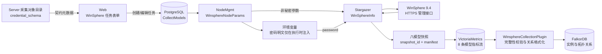
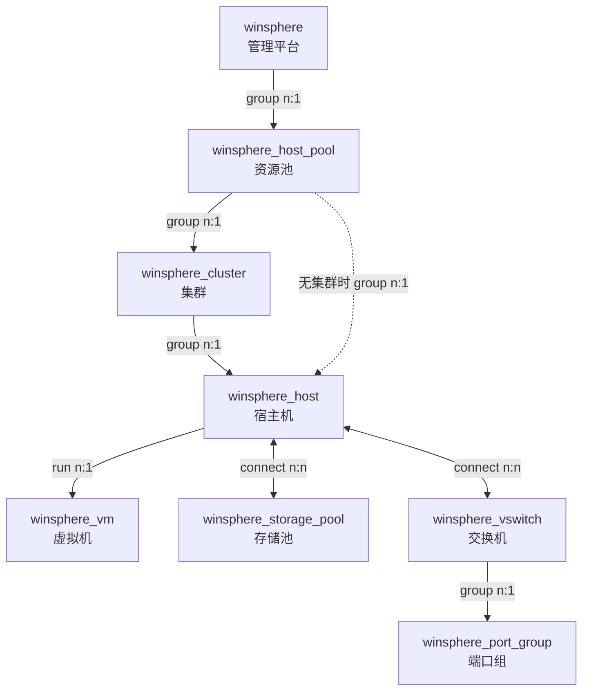

# CMDB WinSphere 配置采集项目设计

> 范围：`server/apps/cmdb`、`server/apps/cmdb_enterprise`、`agents/stargazer` 与 CMDB Web 控制台。
> 产品边界和验收规则以
> [`specs/changes/cmdb-winsphere-collection/spec.md`](../specs/changes/cmdb-winsphere-collection/spec.md)
> 为准；本文说明当前实现链路、模块接口、模型关系和故障处理。
>
> 文档状态：已实现，最近核对 2026-07-29。

## 0. 五分钟了解

### 0.1 要解决的问题

CMDB 需要通过云宏 WinSphere 9.4 管理接口，自动发现以下八类配置对象及其关系：

1. WinSphere 管理平台；
2. 资源池；
3. 集群；
4. 宿主机；
5. 虚拟机；
6. 存储池；
7. 交换机；
8. 端口组。

WinSphere 的对象和接口语义与 vCenter 不同，因此本功能只参考现有虚拟化采集链路，
不复用 vCenter 凭据结构，也不假设两者的模型和身份规则相同。

### 0.2 一句话方案

Web 从 Server 提供的静态凭据契约生成任务表单；Server 校验并加密保存单个管理端点；
Stargazer 通过 HTTPS 管理接口采集完整的八模型快照；Server 校验快照 manifest 后，
再将实例与拓扑关系写入 CMDB。

### 0.3 核心设计结论

| 决策 | 结论 | 原因 |
|---|---|---|
| 连接方式 | HTTPS 管理接口 | WinSphere 已提供管理接口，不需要 SSH 或向目标下发脚本 |
| 任务类型 | `cloud` | 采集对象是虚拟化管理平台及其资源拓扑 |
| 驱动类型 | `protocol` | 由 Stargazer 协议执行器直接调用管理接口 |
| 目标范围 | 一个任务只有一个管理地址和一组凭据 | 一次快照必须对应唯一平台，避免跨平台身份和清理范围混淆 |
| 凭据模型 | 使用服务端静态注册表，不新增 DB 模型 | 字段结构固定，可复用现有任务 JSON 和加密能力 |
| 前端表单 | 从 `credential_schema` 渲染 | 默认值、必填、端口范围和帮助信息只有一份事实来源 |
| 对象模型 | 八个 FalkorDB 模型及既定关系 | 资产拓扑属于 CMDB 图模型，不属于任务配置数据库 |
| 完整性 | 版本化 manifest + 八条指标流 | 防止丢页、部分上报或旧失败轮次触发错误删除 |
| 网络兼容 | 标准和分布式网络统一到交换机、端口组模型 | 对外保持稳定模型，同时保留类型化身份避免冲突 |
| 清理规则 | 仅完整且权威的模型快照允许差集删除 | 可选网络接口缺失时保留历史数据，避免误删 |

### 0.4 明确不支持

- 使用 SSH 登录 WinSphere 或在 WinSphere 主机执行采集脚本；
- 一个任务配置多个管理端点、多组凭据或 `ip_range`；
- HTTP 明文管理接口；
- 带协议、端口、路径的管理地址；
- IPv6 管理地址；
- 将 WinSphere 凭据设计成 vCenter 凭据的兼容别名；
- 为凭据契约新增数据库表或 Django migration。

## 1. 全景链路



这条链路有四个主要模块：

| 模块 | 对外接口 | 隐藏的实现复杂度 |
|---|---|---|
| 凭据契约模块 | 根据 `model_id` 返回字段描述并校验凭据 | 默认值、必填、加密、端口和 TLS 规则 |
| WinSphere 客户端模块 | 登录并列出各类原始资源 | 会话、401 重认证、分页、接口差异和错误归一化 |
| 快照模块 | 返回八模型结果与 manifest | 身份规范化、空模型哨兵、摘要和权威性 |
| CMDB 格式化模块 | 将已验证快照转换成实例与关系 | 最新轮次选择、完整性验证、类型转换和安全清理 |

调用方应通过这些接口使用模块，不应复制其内部规则。

## 2. 任务与凭据

### 2.1 任务契约

WinSphere 任务必须满足：

```text
model_id   = winsphere
task_type  = cloud
driver_type = protocol
instances  = [{ management_address: "<IPv4 或 DNS>" }]
ip_range   = 不允许
```

管理地址在 Server 和 Stargazer 两端均做规范化：去除首尾空白、DNS 转为小写并去除末尾
的点。地址不能包含协议、端口、路径、用户信息或空白字符。

### 2.2 凭据契约

| 字段 | 类型 | 必填 | 默认值 | 存储规则 |
|---|---|---:|---|---|
| `user` | 字符串 | 是 | 无 | 去除首尾空白 |
| `password` | 密码 | 是 | 无 | 加密存储，读取时返回掩码 |
| `https_port` | 整数 | 是 | `443` | 范围 `1..65535` |
| `verify_tls` | 布尔值 | 是 | `false` | 兼容默认；生产环境建议开启 |

静态注册表是默认值、必填、加密字段、校验规则、标签和帮助文案的唯一事实来源。
采集对象目录将同一份 `credential_schema` 返回给 Web，Web 负责按 schema 创建默认值、
渲染字段并进行同构校验；Server 始终执行最终校验。

编辑任务时，密码值 `******` 表示沿用原密文。新建任务不能把掩码作为真实密码保存。

### 2.3 密码传递

数据库中的密码保持密文。生成 Stargazer 节点参数时：

- 普通参数包含 `user`、`https_port`、`verify_tls`；
- `password` 参数使用环境变量占位符；
- 明文只通过节点执行环境的 `env_config` 注入；
- 密码不进入任务日志、HTTP header 标签或 VictoriaMetrics 指标。

## 3. WinSphere 管理接口适配

### 3.1 会话

客户端调用 `POST /api/login`，提交 `user` 和 `pwd`，再将响应中的 `sessionId` 写入
`SESSION` Cookie。普通请求遇到一次 `401` 时重新登录并重试一次；重试仍失败则整轮采集失败。

所有请求固定使用 HTTPS，并使用任务配置的端口、TLS 校验开关和超时。

### 3.2 资源接口

| CMDB 对象 | WinSphere 接口 | 说明 |
|---|---|---|
| 资源池 | `/api/compute/pools` | 分页 |
| 集群 | `/api/compute/clusters` | 分页 |
| 宿主机 | `/api/compute/hosts` | 请求附带集群、资源池名称 |
| 虚拟机 | `/api/compute/domains` | 请求附带宿主机、集群、资源池名称 |
| 存储池 | `/api/storage/storagePools` | 分页 |
| 标准交换机 | `/api/compute/vswitchs` | 可选接口 |
| 标准端口组 | `/api/compute/vswitchs/portGroups/list` | 可选接口 |
| 分布式交换机 | `/api/compute/dvswitchs` | 可选接口 |
| 分布式交换机宿主机 | `/api/compute/dvswitchs/{id}/hosts` | 可选接口 |
| 分布式端口组 | `/api/compute/dvswitchs/{id}/portGroups` | 可选接口 |

管理平台对象不依赖列表接口，由规范化后的管理端点生成。

### 3.3 分页不变量

WinSphere 列表接口使用一基页号：

```text
start = 1, 2, 3, ...
size  = page_size，默认 200
```

采集过程中必须满足：

- 响应页号与请求页号一致；
- 每页 `total` 存在、是非负整数且整轮不漂移；
- 已获取条数不能超过 `total`；
- 到达 `total` 前不能返回空页；
- 同一身份不能跨页或在页内重复。

标准交换机的分页身份是 `(hostId, id)`；标准端口组是
`(hostId, vswitchId, id)`。不能只按原生 `id` 去重，因为不同宿主机或父交换机的 ID
空间可能重复。

## 4. 领域模型与身份

### 4.1 模型拓扑



宿主机优先关联集群；没有有效集群关联时回退关联资源池。存储池和交换机可连接多个宿主机。

### 4.2 身份规则

所有模型都有 `platform_id`，用于隔离不同 WinSphere 管理平台的资源空间。

| 模型 | `resource_id` 来源 |
|---|---|
| 管理平台 | `https://{management_address}:{https_port}` |
| 资源池、集群、宿主机、虚拟机、存储池 | WinSphere 原生 ID |
| 标准交换机 | 类型前缀 + `hostId` + 原生 ID |
| 分布式交换机 | 类型前缀 + 原生 ID |
| 标准端口组 | 类型前缀 + `hostId` + `vswitchId` + 原生 ID |
| 分布式端口组 | 类型前缀 + 分布式交换机 ID + 原生 ID |

类型前缀和父级 ID 防止标准、分布式网络对象或不同父级下的对象发生身份冲突。
无稳定身份的单条资源会被跳过；如果某个统一模型有原始数据但全部缺少稳定身份，
整轮采集失败。

模型、字段和关联由 `server/apps/cmdb/support-files/model_config.xlsx` 定义，不新增
Django ORM 模型。

## 5. 快照协议与安全清理

### 5.1 快照结构

Stargazer 先在内存中完成全部采集和格式化，再生成：

```json
{
  "success": true,
  "snapshot_id": "<uuid>",
  "snapshot_status": "complete",
  "snapshot_manifest": {
    "schema_version": 1,
    "snapshot_id": "<uuid>",
    "expected_models": ["固定的八模型顺序"],
    "models": {
      "<model_id>": {
        "count": 0,
        "identity_hash": "<排序后 resource_id 的 SHA-256>",
        "authoritative": true
      }
    }
  },
  "result": {
    "<model_id>": []
  }
}
```

每个模型必须上报一条数据指标流；空模型通过空集合哨兵表达。manifest 只附在平台指标，
避免在每条资源指标上重复大块元数据。

### 5.2 Server 验证

Server 只把满足以下条件的结果视为完整快照：

1. manifest 版本、`snapshot_id` 和平台指标一致；
2. 期望模型集合与实际模型集合精确等于固定八模型；
3. 每个模型没有重复 `resource_id`；
4. 每个模型的实际数量和身份摘要与 manifest 一致；
5. 最新一次采集尝试不是晚于该快照的失败轮次。

缺失或损坏的 manifest 可以保守地新增、更新已获得的数据，但不能触发差集删除。

### 5.3 权威性

核心计算、存储接口失败会使整轮失败。网络接口在部分 WinSphere 版本中可能不存在，
因此网络相关接口返回 `404` 或 `405` 时：

- 保留其他已成功采集的模型；
- 交换机或端口组标记为 `authoritative=false`；
- 本轮不能用该模型的空结果删除历史实例；
- 其他完整且权威的模型仍可按既有策略处理。

这一区分表达的是“确认不存在”和“本轮无法确认”的差异。

## 6. 异常语义

| 场景 | 结果 |
|---|---|
| 登录失败、无 `sessionId` | 整轮失败 |
| 请求返回一次 `401` | 重新登录并重试一次 |
| 重试失败、非 200、非法 JSON | 整轮失败 |
| 分页页号、总数或身份漂移 | 整轮失败 |
| 核心模型全部缺少稳定身份 | 整轮失败 |
| 可选网络接口 404/405 | 对应网络模型非权威，不执行删除 |
| 八模型任一指标流缺失 | 快照不完整，不执行删除 |
| manifest 数量或摘要不符 | 快照不完整，不执行删除 |
| 新失败轮次晚于旧完整快照 | 不回退消费旧完整快照 |
| `verify_tls=false` | 允许执行，但 Web 显示安全风险提示 |

失败响应仍生成可查询的 `winsphere_info` 失败指标，供任务状态和错误展示使用。

## 7. 实现导航

| 需求 | 主要位置 |
|---|---|
| 长期边界和验收规则 | `specs/changes/cmdb-winsphere-collection/spec.md` |
| 凭据契约注册表 | `server/apps/cmdb/services/collect_credential_contract.py` |
| 任务类型、端点和凭据校验 | `server/apps/cmdb/serializers/collect_serializer.py` |
| 管理地址规范化 | `server/apps/cmdb/services/winsphere_endpoint.py` |
| 企业采集对象注册、节点参数和 CMDB 格式化 | `server/apps/cmdb_enterprise/collect/winsphere.py` |
| Stargazer 插件声明 | `agents/stargazer/enterprise/plugins/inputs/winsphere/plugin.yml` |
| WinSphere 客户端、采集和 manifest | `agents/stargazer/enterprise/plugins/inputs/winsphere/winsphere_info.py` |
| Agent 指标传输 | `agents/stargazer/service/collection_service.py` |
| Web 任务表单 | `web/src/app/cmdb/(pages)/assetManage/autoDiscovery/collection/profess/components/winsphereTask.tsx` |
| Web schema 适配与校验 | `web/src/app/cmdb/(pages)/assetManage/autoDiscovery/collection/profess/components/winsphereCredential.ts` |
| CMDB 模型配置 | `server/apps/cmdb/support-files/model_config.xlsx` |

关键测试：

- `agents/stargazer/tests/test_winsphere_info.py`
- `agents/stargazer/tests/test_winsphere_snapshot_transport.py`
- `server/apps/cmdb/tests/test_winsphere_credential_contract.py`
- `server/apps/cmdb_enterprise/tests/test_winsphere_collect.py`
- `server/apps/cmdb/tests/e2e/test_winsphere_enterprise_pipeline.py`
- `server/apps/cmdb/tests/test_winsphere_model_config.py`
- `web/scripts/cmdb-winsphere-credential-test.ts`

## 8. 修改指南

### 8.1 新增采集字段

1. 确认 WinSphere 原始字段和空值语义；
2. 在 Stargazer 对应对象格式化函数中输出；
3. 在企业格式化模块的 `field_mappings` 中声明类型转换；
4. 更新 `model_config.xlsx` 的对应属性；
5. 补充 Agent、Server 和模型配置测试。

### 8.2 新增或替换接口

1. 明确接口属于核心接口还是可选接口；
2. 为分页接口定义稳定、作用域正确的 `identity_fields`；
3. 保持客户端方法只返回资源列表；
4. 在快照模块内完成跨接口聚合和身份规范化；
5. 为登录、401、分页漂移、404/405 和非法响应补测试。

### 8.3 新增模型

新增模型会改变快照协议，必须同时更新：

- Agent 的固定模型顺序、结果和 manifest；
- VictoriaMetrics 指标流；
- Server 的模型顺序、身份字段、字段映射和关系；
- `model_config.xlsx`；
- 端到端与完整性测试；
- 本文档和功能规格。

不能只在某一端增加模型，否则 Server 会按“不完整快照”拒绝权威清理。

### 8.4 修改凭据

凭据字段只能先修改服务端静态注册表，再由采集对象目录传给 Web。禁止在多个表单分支
分别硬编码默认值和校验规则。密码类字段还必须同步检查加密、掩码编辑语义、环境变量
注入和日志脱敏。

## 9. 已知风险与现场验收

自动化测试覆盖了契约、分页、身份、快照和入库链路，但真实环境仍应验证：

- WinSphere 9.4 不同补丁版本的字段名和网络接口可用性；
- 只读账号是否拥有全部计划采集接口的访问权限；
- 自签名证书、证书链和 `verify_tls=true` 的部署方式；
- 大规模资源下的分页数量、单轮时长和 VictoriaMetrics 标签体积；
- 标准与分布式网络同时存在时，宿主机和端口组关系是否与控制台一致。

现场验收应至少准备：一个资源池、一个集群、两台宿主机、一台虚拟机、一个共享存储池、
一个标准或分布式交换机及其端口组，并验证新增、更新、空结果、接口不可用和认证过期场景。
