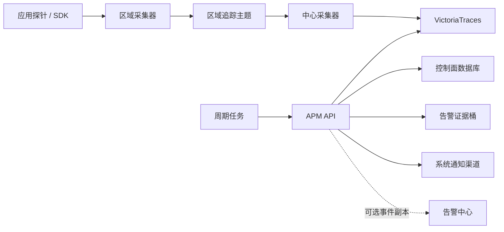

# 模块 ARD：APM（应用性能监控）

APM 是独立产品应用，负责应用目录、调用链查询、服务拓扑、SLO 与自有告警生命周期。它不复用监控的指标库与插件模型，也不复用告警中心的业务表。

对应产品能力：[[apm-product.md#产品入口]]

对应功能清单：[[apm-function-list.md#二、功能清单]]

告警契约细节以 [[apm-alerting.md#长期契约]] 为单一事实来源，本文只保留组件与数据流。

## 职责与边界【已实现】

- 控制面：应用、服务、实例、组织授权、SLO、策略、告警、事件、通知投递。
- 查询面：调用链、Span、错误聚合、拓扑、RED、首页总览、运行健康。
- 数据面：受信区域内的 OTLP 接入，经消息队列写入追踪库；服务端只查询、不对追踪库做写入重建。
- 硬边界：生产代码不得依赖监控或告警中心业务模块；告警中心若接收副本，不得回写 APM。

> 证据来源：server/apps/apm/apps.py:4-7，server/apps/apm/tests/test_app_boundary.py:5-16，specs/capabilities/apm-alerting.md:3-12　|　同步基线：61bace9f　|　【已实现】

## 组件【已实现】

| 组件 | 职责 |
|---|---|
| APM API | 挂载在 `api/v1/apm/`，提供目录、查询、SLO、策略、告警、通知与健康接口 |
| 探针开放下载 | `open_api/probe/download/<artifact>`，无登录态，仅白名单制品 |
| 区域采集器 | 接收 OTLP，清洗后按区域主题发布 |
| 中心采集器 | 消费区域主题并写入追踪库 |
| 追踪存储 | VictoriaTraces，APM 唯一遥测事实源 |
| 快照对象存储 | 告警事件原始证据的私有桶 |
| 周期任务 | 目录对账、依赖探测、策略评估、发件箱投递、快照落盘与过期 |

> 证据来源：server/apps/apm/urls.py:25-46，server/apps/apm/views/open_probe.py:9-34，server/apps/apm/config.py:3-27，deploy/apm/README.md:11-22，server/apps/apm/adapters/victoriatraces.py:151-156，server/config/components/minio.py:24　|　同步基线：61bace9f　|　【已实现】

## 接口契约【已实现】

根前缀 `api/v1/apm/`（由根路由按 app 名自动挂载）。

| 资源 | 契约 |
|---|---|
| `applications` / `integration-config` / `instances` / `services` | 应用目录、接入配置、实例与服务 |
| `slos` / `dashboard` / `health` | SLO、首页总览、运行依赖健康 |
| `traces` / `spans` / `issues` / `topology` | 调用链、Span、错误聚合、依赖拓扑 |
| `policies` / `alerts` / `events` | 策略、告警、不可变事件 |
| `notification-channels` / `notification-deliveries` / `notification-recipients` | 通知渠道、投递与接收人 |
| `open_api/probe/download/...` | 探针制品开放下载 |

查询窗：调用链最长 35 天，拓扑最长 7 天。禁止任意查询语言与无界窗口。

> 证据来源：server/urls.py:19-27，server/apps/apm/urls.py:25-46，server/apps/apm/adapters/victoriatraces.py:36-37　|　同步基线：61bace9f　|　【已实现】

## 存储与部署拓扑【已实现】

| 存储 | 用途 |
|---|---|
| PostgreSQL | 控制面模型（应用/服务/实例/SLO/策略/告警/事件/发件箱） |
| VictoriaTraces | 调用链与依赖图的唯一查询源 |
| MinIO 私有桶 `apm-alert-snapshots` | 告警事件原始证据 |
| NATS JetStream | 区域到中心的追踪投递（数据面；服务端监听器默认不启用 JetStream） |

`deploy/apm/` 是数据面契约夹具，不是生产编排真相源。APM 不使用 VictoriaMetrics，不生成 Span Metrics。

> 证据来源：server/apps/apm/models/control_plane.py:22-509，server/apps/apm/adapters/victoriatraces.py:151-156，server/config/components/minio.py:19-31，deploy/apm/README.md:1-22,65　|　同步基线：61bace9f　|　【已实现】

## 依赖【已实现】

- 系统管理：组织、权限、通知渠道。
- 节点管理：区域与接入点信息，用于生成接入指引。
- 告警中心：仅可选单向事件副本，禁止回写。
- 对象存储与追踪库：运行期依赖；数据面失败只降级 APM，不阻断服务启动。

> 证据来源：server/apps/apm/adapters/notifications.py:7-27，deploy/apm/README.md:92-94，specs/capabilities/apm-alerting.md:12　|　同步基线：61bace9f　|　【已实现】
