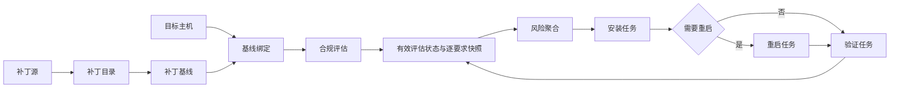
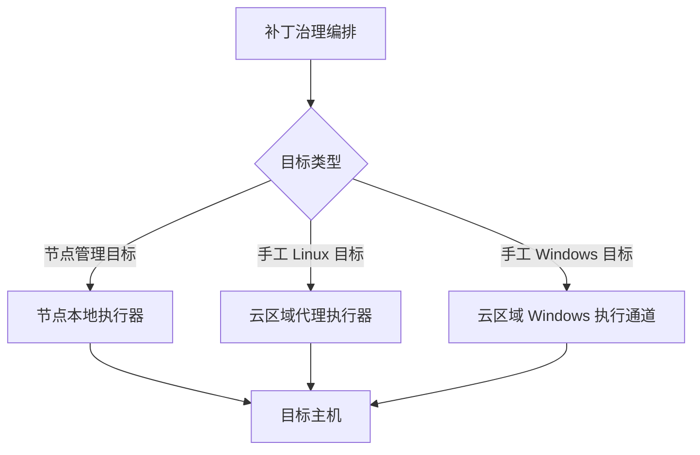

# 模块 ARD：Patch Management（补丁管理）

## 模块职责

补丁管理提供补丁源接入、补丁目录、主机目标、合规基线、风险聚合和治理任务六类领域能力，并通过概览和周期评估设置形成日常治理入口。

对应产品能力：[[patch-management-product.md#产品入口]]

对应功能清单：[[patch-management-function-list.md#二、功能清单]]

> 证据来源：server/apps/patch_mgmt/urls.py:18-40，web/src/app/patch-manager/constants/menu.json:2-42　|　同步基线：d2769559　|　【已实现】

## 组件与职责

| 组件 | 架构职责 |
|---|---|
| 补丁管理 API | 提供补丁源、补丁、目标、基线、治理任务、风险、概览和扫描设置的资源契约 |
| 源同步组件 | 验证补丁源连接，预览同步候选项，并将选定的 Windows 或 Linux 补丁写入补丁目录 |
| 基线与合规组件 | 维护固定补丁要求、主机绑定和逐要求四态合规快照；Linux 基于包管理器事实比较版本，Windows 基于 WUA/HotFix 事实判断已安装、缺失或未知 |
| 风险组件 | 从当前有效评估状态和逐要求快照动态聚合主机、补丁和基线三个视角的风险；未知和不适用快照不生成风险 |
| 治理编排组件 | 把评估、安装、重启和验证任务拆分为主机级工作单元，以执行栅栏、防超时状态投影、父子状态收敛和历史对账保证可恢复性 |
| 执行适配组件 | 根据目标来源和操作系统选择节点本地、区域代理或 Windows 远程执行通道 |
| 权限与审计适配 | 复用平台角色权限、组织（组）数据范围和操作日志 |
| 异步调度 | 执行周期评估、主机任务、超时巡检和重启恢复验证；巡检运行在独立的 `patch_maintenance` 队列 |

> 证据来源：server/apps/patch_mgmt/services/compliance_evaluator.py:81-198，server/apps/patch_mgmt/services/risk_service.py:299-333，server/apps/patch_mgmt/models/governance.py:121-134，server/apps/patch_mgmt/services/governance_convergence.py:47-113，server/apps/patch_mgmt/tasks.py:298-305　|　同步基线：d2769559　|　【已实现】

对应产品入口：[[patch-management-product.md#补丁库]]、[[patch-management-product.md#风险治理]]、[[patch-management-product.md#设置]]

对应功能清单：[[patch-management-function-list.md#2. 补丁源]]、[[patch-management-function-list.md#3. 补丁库]]、[[patch-management-function-list.md#6. 风险治理]]

## 接口契约

补丁管理挂载在 `/api/v1/patch_mgmt/`，资源路径统一位于其 `api/` 子路径：

| 资源 | 主要契约 |
|---|---|
| `patch_source` | 补丁源维护、启停、连通性检测、同步、候选预览与选择入库 |
| `patch` | 补丁目录维护、详情以及 Windows 补丁包上传与替换 |
| `patch_target` | 目标维护、节点批量纳入和连通性检测 |
| `baseline` | 基线维护、要求增删、主机绑定、主机列表和评估 |
| `governance` | 治理任务列表、详情、创建、取消、主机重试和风险项步骤日志 |
| `risk` | 风险列表、详情、汇总、治理和重启 |
| `dashboard` | 权限范围内的治理指标、合规分布、最近任务和高频风险 |
| `scan_setting` | 全局周期评估设置 |

> 证据来源：server/config/components/app.py:130-157，server/urls.py:16-24，server/apps/patch_mgmt/urls.py:16-42，server/apps/patch_mgmt/views/governance.py:110-200　|　同步基线：d2769559　|　【已实现】

## 数据与状态

| 聚合 | 职责与约束 |
|---|---|
| 补丁源 | 保存源类型、连接参数、启停状态、连通性和组织（组）归属 |
| 补丁 | 统一保存通用属性，Windows 和 Linux 分别保存操作系统专属信息 |
| 目标 | 独立保存补丁治理主机及连接信息；来源为手工录入或节点管理 |
| 基线 | 保存固定补丁要求；一台主机同时最多绑定一个基线 |
| 合规快照 | 按主机绑定与基线要求记录某次有效评估结果；要求状态为满足、缺失、未知或不适用 |
| 治理任务 | 统一承载评估、安装、重启、验证，以及主机级阶段、日志、失败信息和执行栅栏令牌 |
| 扫描设置 | 全局单例，保存小时、每日或每周的周期评估安排 |

基线当前只有生效中的固定清单，不提供历史版本快照。评估回写前会核对基线、要求和绑定签名，拒绝把已经失效的结果写回当前合规状态。Windows 替代关系由 WSUS 更新标识映射到补丁替代关系，评估时将替代 KB 作为可满足要求的候选；生产解析器当前没有写入“不适用”事实，故该结果只能作为模型/评估器预留，不能当作生产已覆盖能力。【待确认】

> 证据来源：server/apps/patch_mgmt/models/governance.py:121-140，server/apps/patch_mgmt/services/wsus_sync.py:343-365，server/apps/patch_mgmt/services/assess_parsers.py:240-250，server/apps/patch_mgmt/services/assess_parsers.py:288-317，server/apps/patch_mgmt/services/compliance_evaluator.py:142-198　|　同步基线：d2769559　|　【已实现/待确认】

## 治理数据流

治理任务先形成任务及主机级占位，并为主机执行记录设置栅栏令牌，再按立即执行或执行窗口投递。父任务拆分为每台主机独立的异步工作单元；父状态由全部子项的实时投影收敛。有副作用的主机操作不自动重试。安装或重启超时后转入只读结果核验，避免重复下发副作用操作；评估或验证超时才按可重试失败收口。历史陈旧活动记录可由有界、幂等的对账命令收敛为失败且不自动重跑。安装完成后进入验证；启用自动重启时会创建关联重启任务，主机恢复后继续验证。

> 证据来源：server/apps/patch_mgmt/models/governance.py:121-134，server/apps/patch_mgmt/services/governance_convergence.py:47-113，server/apps/patch_mgmt/services/governance_convergence.py:139-234，server/apps/patch_mgmt/tasks.py:298-375　|　同步基线：d2769559　|　【已实现】

## 执行拓扑

- 节点管理来源的目标在对应节点执行。
- 手工 Linux 目标由云区域执行组件代理远程连接。
- 手工 Windows 目标经云区域 Windows 执行通道连接；应用进程直连 WinRM 仅限显式 DEBUG 本地环境，生产环境不允许隐式降级。

相关模块：[[legacy-ard-modules-node-mgmt.md#1. 职责【已实现/已存在】]]

相关模块：[[legacy-ard-modules-base-core-rpc.md#rpc —— NATS RPC 网关【已实现/已存在】]]

> 证据来源：server/apps/patch_mgmt/services/target_execution_route.py:72-102，server/apps/patch_mgmt/services/target_connectivity.py:90-105，server/apps/patch_mgmt/services/patch_execution_service.py:78-154　|　同步基线：d2769559　|　【已实现】

## 权限、审计与存储

- API 角色域将补丁管理应用映射为 `patch`，资源权限分别控制查看、新增、编辑和删除。
- 补丁源、补丁、目标、基线和治理任务均按组织（组）数据范围隔离；批量操作会校验全部对象是否在授权范围内。
- 补丁源和目标的敏感连接凭据加密保存，接口只返回是否已配置，不回传明文。
- 操作日志复用系统管理审计能力。
- 私有对象存储分别保存目标 SSH 私钥和手工上传的 Windows 补丁包。
- 周期评估、超时巡检及重启恢复检查由异步调度组件执行。

相关模块：[[legacy-ard-modules-system-mgmt.md#4. 认证与权限【已实现/已存在】]]

> 证据来源：server/apps/core/backends.py:323-334，server/apps/patch_mgmt/utils/data_permissions.py:6-23，server/apps/patch_mgmt/models/patch_source.py:50-51，server/apps/patch_mgmt/models/patch.py:84-85，server/apps/patch_mgmt/models/patch_target.py:100-101，server/apps/patch_mgmt/models/baseline.py:24-25，server/apps/patch_mgmt/models/governance.py:54-55，server/apps/patch_mgmt/serializers/patch_source.py:111-150，server/apps/patch_mgmt/serializers/patch_target.py:48-60，server/apps/patch_mgmt/serializers/patch_target.py:93-129，server/apps/patch_mgmt/utils/operation_log.py:1-21，server/config/components/minio.py:19-28，server/apps/patch_mgmt/config.py:77-86　|　同步基线：d2769559　|　【已实现】

## 已知边界与待确认

- 基线版本管理和历史版本快照未实现。【已确认边界】
- Windows 评估已将 WSUS 替代关系映射为替代 KB 候选，可由已安装替代 KB 满足要求。【已确认边界】
- “不适用”状态尚未由生产 Windows 解析链写入；虽有评估器与模型预留，不能将其列为已交付的自动判定能力。【待确认】
- 补丁管理 RPC 已提供模块列表，并以 `get_patch_mgmt_module_data` 按组织返回可授权的目标实例，供系统管理数据权限选择器分页取数。【已实现】
- 周期任务会覆盖纳管目标，但只有已绑定基线的目标产生合规快照；未绑定目标不应被表述为已完成周期合规评估。【已确认边界】
- 概览中的待重启数量、最近扫描状态、扫描/安装任务分布等字段仍是固定值或空值，不作为已实现统计能力写入产品文档。【已确认边界】

> 证据来源：server/apps/patch_mgmt/services/wsus_sync.py:343-365，server/apps/patch_mgmt/services/assess_parsers.py:240-250，server/apps/patch_mgmt/services/assess_parsers.py:288-317，server/apps/patch_mgmt/services/compliance_evaluator.py:142-198　|　同步基线：d2769559　|　【已实现/待确认】
