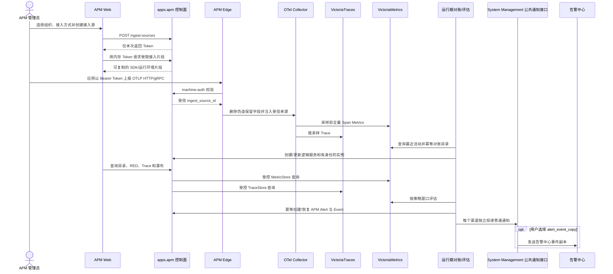

# APM MVP：接入、服务、Trace 与基础告警

Status: superseded by `specs/changes/apm-nats-vt-pipeline/spec.md`

> 本文件保留为 APM MVP 的历史设计记录，方案从未正式部署，不代表任何生产存量或迁移/回滚路径。后续产品决定已经废弃其中的 `ApmIngestSource`、APM Token、Edge Nginx、VictoriaMetrics Span Metrics 与尾采样方案。当前应用由用户创建，服务和实例由遥测发现，接入配置即时生成且不持久化；APM 数据面、查询和验收以 `apm-nats-vt-pipeline` 为唯一变更契约。告警生命周期与控制面/数据面分离原则仍分别遵循 ADR 0004 与 ADR 0006。

## Problem Statement

仓库已经有 `server/apps/apm`、`web/src/app/apm`、`deploy/apm` 和部分自动化测试，但 Phase 0 审计确认它仍是“后端骨架较多、用户闭环缺失”的半成品：接入页只有硬编码展示，用户不能创建接入源、取得一次性 Token 或复制可执行片段；实例和服务页面不能完成组织及归档管理；真实 OTLP、存储查询、策略触发与多渠道通知也尚未在本地全链验收。基线差距与新鲜运行证据见 [`gap-analysis.md`](./gap-analysis.md)。

当前 `/telegraf/api` 由 Telegraf 的 Influx 输入使用，不能接收 OTLP protobuf。Django 也不适合作为高吞吐 Span 接收器。APM 必须作为与 Monitor、Log 同级的独立产品域，在不破坏现有采集链路、不让外部 Trace 基础设施阻断 Server 启动的前提下，先打通“能接入、能看服务、能查 Trace、能告警”的纵向链路。

## Solution

新增独立的 APM 控制面，并把遥测数据面交给 OpenTelemetry Collector、VictoriaTraces 和 VictoriaMetrics：

```text
应用探针 / SDK
      │ OTLP/HTTP 或 OTLP/gRPC
      ▼
边缘鉴权 ── 校验接入凭证、移除伪造保留属性
      ▼
OpenTelemetry Collector Gateway
      ├── 全量 Span → Span Metrics → VictoriaMetrics
      └── 尾采样 Span ───────────→ VictoriaTraces

BK-Lite apps.apm
      ├── PostgreSQL：接入源、服务、实例、组织、策略、事件与告警
      ├── TraceStore：查询 VictoriaTraces
      ├── MetricStore：查询 VictoriaMetrics
      └── NotificationDispatcher ──→ 系统管理通知渠道
                                  ├── 邮件 / 机器人 / Webhook / 普通 NATS
                                  └── alert_event_copy ──→ 告警中心
```

第一期只实现添加接入、接入实例列表、服务目录与 RED、Trace 搜索与详情、基础阈值告警。首页、拓扑、SLO、Issue 聚类、运行时指标和高级治理保留 Storybook 设计，不进入本期生产路由。

## User Stories

1. As an APM 管理员, I want to create an ingest source and copy a language-specific setup snippet, so that telemetry is authenticated and attributed without modifying BK-Lite source code.
2. As an APM operator, I want to see every reporting runtime instance separately, so that a silent or replaced Pod does not disappear inside a service aggregate.
3. As an application owner, I want horizontally scaled instances to aggregate into one logical service, so that throughput, error rate and latency describe the whole service.
4. As an operator, I want service health separated by environment, so that testing traffic cannot pollute production health.
5. As a developer, I want to start from an anomalous service and drill into a concrete Trace and Span, so that I can locate the slow or failing dependency.
6. As an alert administrator, I want APM policies to maintain their own alert lifecycle and optionally use any authorized System Management notification channel, so that recipients can be notified without coupling APM to another product App, while an alert-center event copy remains an optional special target.
7. As a deployment administrator, I want APM storage failures to degrade APM pages without blocking BK-Lite Server startup, so that observability is not a circular hard dependency.

## Phase 0 审计结论与契约优先级

本文件是 APM MVP 的唯一目标契约；`gap-analysis.md` 只记录 `a2c80bdaf` 基线的事实证据。实现过程中如代码与本文件不一致，必须修改代码或提出明确的高影响分歧，不能把已有代码反向当成需求。通知渠道解耦是告警闭环中的一个子切片，不得优先于创建接入、凭证、数据上报、目录发现和查询诊断。

当前优先级按用户真实旅程固定为：

1. 页面创建并管理接入源，安全取得一次性 Token 和可执行片段；
2. 通过鉴权的 OTLP/HTTP 或 OTLP/gRPC 将真实 Span 写入存储；
3. 运行期发现实例和逻辑服务，并可管理组织与归档状态；
4. 查询真实服务 RED、Trace 列表和瀑布详情；
5. 创建、编辑、启停、测试并实际评估策略；
6. 保存 APM 自有告警事实，再独立投递普通通知和可选的告警中心事件副本。

## 用户旅程与系统时序



安全失败必须发生在相应边界：鉴权失败不得进入 Collector；存储不可用不得伪装为空数据；评估查询失败不得误触发/误恢复；通知失败不得回滚 APM 告警事实或阻断其他渠道。

## Implementation Decisions

### 1. 产品与模块边界

- 后端新增 `server/apps/apm`，由现有 app 自动发现机制暴露在 `/api/v1/apm/`；前端新增 `web/src/app/apm`，与 `/monitor`、`/log` 同级。
- APM 不复用 Monitor 的监控对象、监控实例或 CMDB 服务模型。它们的身份、生命周期和数据来源不同。
- APM 只拥有接入元数据、服务与实例目录、遥测查询编排、APM 策略、事件、告警和评估状态。原始 Span 与派生指标不写 PostgreSQL。
- Monitor、Log、APM 等同级 App 各自拥有领域告警事实与生命周期；任何 App 不得直接引用另一个 App 的模型、表或内部实现。告警中心仅作为可选通知渠道接收标准事件副本。
- Storybook 是视觉和交互参考，不把当前大型 story 文件直接复制进生产页面。生产页面按路由拆分并复用 Ant Design 和已有共享组件；只有出现至少两个真实使用方时才新增共享抽象。

### 2. 统一领域模型

#### 2.1 APM 接入源

`ApmIngestSource` 表示一次“添加接入”产生的受控上报入口，而不是逻辑服务或运行实例。它包含名称、接入方式、环境提示、启停状态、凭证摘要与前缀、首次/最近接收时间和审计字段。

`ApmIngestSourceOrganization` 是接入源与组织的多对多关系。添加接入时至少选择一个组织；新发现实例默认复制接入源当时的组织集合。接入源只提供默认权限，不参与服务或实例身份。

凭证规则：

- 创建或轮换时只展示一次明文，数据库仅保存不可逆摘要和可识别前缀；凭据不得写日志、操作记录、Span 或前端持久缓存。
- 接入代码片段必须携带 `Authorization: Bearer <token>`，不再沿用旧规格中的匿名 OTLP 入口。
- 禁用或轮换接入源必须使旧凭证失效；并发轮换以数据库状态为最终仲裁。
- 网关从认证结果注入受信任 `bk.ingest_source.id`。客户端提交的同名 `bk.*` 保留属性一律先删除，不能伪造来源或组织。
- `bk.ingest_source.id` 只用于来源追踪、接入方式解析和排障，不参与服务身份。

第一期边缘鉴权实现使用反向代理认证子请求：代理将 Bearer Token 交给 APM 机器认证接口校验，成功后把内部来源 ID 传给 Collector；正向结果可短时缓存，撤销延迟必须有上限并可测试。代理必须移除外部同名内部 Header。认证服务不可用时，新且未缓存的请求返回 503，不允许匿名降级。

#### 2.2 APM 接入实例

接入实例是一个实际上报遥测数据的运行实例，身份为：

```text
service.namespace + service.name + service.instance.id
```

- `service.instance.id` 必须在同名服务实例间唯一。接入向导按运行环境动态注入：Kubernetes 使用 Pod UID，Docker 使用容器实例 ID，固定主机使用稳定的平台实例 ID；无法取得稳定天然 ID 时由探针生成 UUID。
- 不能把一个写死的实例 ID复制到多个副本。Collector 无法无歧义判断来源时不得自行猜测实例 ID。
- 缺少 `service.instance.id` 的 Span 仍可进入 Trace 与服务级指标，但不创建虚假的接入实例；接入诊断展示“实例身份缺失”并给出修复片段。
- Pod 或运行实例被重建并产生新 ID 时创建新实例；旧实例停止上报后进入静默，达到归档阈值后自动归档。实例历史不因重建而覆盖。
- `ApmServiceInstanceOrganization` 表示实例可见、可操作组织。新实例默认继承接入源组织；用户可改为自定义组织集合。继承态随接入源组织变化，自定义态不被自动覆盖。
- 当前组织只影响实例列表、实例详情、具体 Trace 和实例操作的授权，不改变底层 Span 存储。

#### 2.3 APM 服务

APM 服务是一个长期存在的逻辑服务，身份为：

```text
service.namespace + service.name
```

- 同名服务的所有 `service.instance.id` 聚合为一个服务；接入源、版本、环境和实例 ID 都不参与服务身份。
- `service.namespace` 缺失时规范化为空 namespace，UI 展示为“未归类应用”；`service.name` 必须非空。不要因 namespace 缺失丢弃有效 Span。
- `deployment.environment` 与 `service.version` 是查询维度。服务身份不含环境，但 RED、健康和告警必须按环境分别计算。
- 服务目录的“全部环境”表示列出所有环境视图，不把生产、预发、测试的健康值合并成一个值。服务数量仍按逻辑服务去重。
- 服务指标全局聚合同一环境下的全部实例，不受实例组织权限影响。
- `ApmServiceOrganization` 独立控制服务聚合页、拓扑和服务级操作权限。服务首次原子创建时复制第一个成功发现实例的组织集合；多个实例同时首次上报时，以成功创建服务记录的实例为准。
- 后续实例及其实例权限变化不自动修改服务权限；管理员可以手动调整服务组织。因而有服务权限但无某实例权限的组织可以看到包含该实例贡献的聚合值，但不能查看该实例明细或 Trace。

#### 2.4 状态与归档

- 实例活跃：最近 15 分钟有 Span；静默：超过活跃窗但不足 7 天；已归档：静默至少 7 天或手动归档。
- 服务状态按“服务 + 环境”的全局实例指标计算，不复用实例状态。单个实例静默不能使仍有流量的服务归档。
- 归档只影响默认目录与操作状态，不删除 Trace、指标和元数据；数据是否可查询仍受其存储保留期限制。
- 新 Span 到达已归档实例或服务时自动解档。自动归档、解档和目录对账属于运行期幂等任务。

#### 2.5 PostgreSQL 模型

| 模型 | 关键字段与约束 |
| --- | --- |
| `ApmIngestSource` | UUID 主键、名称、接入方式、云区域、`credential_digest`、`credential_prefix`、启用状态、首次/最近接收时间、审计字段 |
| `ApmIngestSourceOrganization` | 接入源 + 组织唯一；作为继承态实例的默认权限 |
| `ApmService` | UUID 主键、规范化 namespace/name、首次/最近发现、归档时间/原因；namespace/name 条件唯一 |
| `ApmServiceOrganization` | 服务 + 组织唯一；与实例组织独立 |
| `ApmServiceInstance` | UUID 主键、服务外键、instance ID、环境、版本、来源外键、权限模式、首次/最近发现、归档字段；服务 + instance ID 唯一 |
| `ApmServiceInstanceOrganization` | 实例 + 组织唯一；实例为继承态时由接入源组织同步 |
| `ApmPolicy` | 服务、环境、指标类型、比较符、阈值、持续/恢复窗口、级别、通知开关、启用状态和审计字段 |
| `ApmPolicyNotificationTarget` | 策略、系统管理渠道 ID、接收人配置；策略 + 渠道唯一。渠道 ID 是外部引用，不建立跨 App 外键 |
| `ApmPolicyState` | 策略评估游标、连续命中/恢复计数、当前状态、最后成功/失败时间、外部告警 ID |
| `ApmAlert` | APM 告警唯一 ID、策略、服务、环境、状态、级别、当前值、开始/结束时间和组织快照 |
| `ApmEvent` | 事件唯一键、关联告警、动作、级别、值、内容、发生时间和组织快照 |
| `ApmAlertOutbox` | 关联 APM 事件、目标通知渠道、规范化 payload、投递状态、尝试次数和下次重试时间；事件 + 渠道唯一防止重复投递 |

- 所有数据库访问使用 Django ORM，不使用 raw SQL、`.raw()`、`RawSQL` 或 `cursor.execute`。
- 原始 namespace/name/instance ID 保留用于展示，同时保存规范化值用于唯一约束；规范化规则由一个领域函数统一实现，API、任务和迁移不能各自复制。
- 外部组织使用稳定 ID 关联并遵循现有组织删除语义；不得把组织 ID写进 Trace 或指标标签。
- `ApmAlert`、`ApmEvent`、`ApmAlertOutbox` 与策略状态更新处于同一数据库事务；实际通知发生在提交后的运行期任务。

### 3. 遥测入口与数据面

- Collector Gateway 是唯一 OTLP 接收器：内部支持 OTLP/gRPC `4317` 和 OTLP/HTTP `4318`；外部反向代理至少暴露 `POST /v1/traces`。
- 不复用 `/telegraf/api`。该路径继续服务 Influx line protocol，和 OTLP 数据面完全隔离。
- Django 不接收或转发原始 Span，不进入每次请求的高吞吐数据路径。
- Collector pipeline 至少包含接收、内存限制、批处理、保留属性清理、受信来源注入、Span Metrics、尾采样和两个 exporter。
- 数据发送失败使用 Collector 自身有界队列与重试；达到资源上限后按明确丢弃策略计数和告警，不无限占用内存或磁盘。
- 请求体大小、单批 Span 数、属性数量/长度、队列容量和接入速率都必须有部署级硬上限；超限返回明确错误并产生内部指标。

### 4. Span 与 Span Metrics

原始 Span 是单次调用明细，包含 `trace_id`、`span_id`、父子关系、时间、持续时长、状态和属性，写入 VictoriaTraces。Span Metrics 是 Collector 从大量 Span 生成的计数器和延迟直方图，写入 VictoriaMetrics。

第一期派生指标维度只允许有界集合：

```text
service.namespace
service.name
service.instance.id
deployment.environment
service.version
span.kind
span.name（规范化后的端点）
status.code
bk.ingest_source.id（受信来源）
```

- 禁止把 `trace_id`、`span_id`、完整 URL、用户 ID、订单 ID、异常消息等无界属性放入指标标签。
- HTTP 端点优先使用低基数 `http.route`；缺失时使用经规范化的 span name，不得直接使用含路径参数或查询串的 URL。
- 请求量使用入口 SERVER/CONSUMER Span；错误按 `span.status=ERROR` 或协议明确的服务端错误状态统一计算；延迟使用直方图，P95/P99 必须由分布聚合，不能平均各实例百分位。
- 服务 RED 查询必须携带环境和时间窗。实例视图额外按 `service.instance.id` 过滤。
- VictoriaMetrics 查询返回空向量时，`MetricStore` 必须保留“无样本”语义：请求率、错误率和延迟使用 `null`，API 返回 `data_state=no_data`，页面显示缺省值而不是伪造 `0`。只有查询确实返回数值 `0` 时才视为可用的零值。

### 5. 采样与保留

- Span Metrics 在采样前从全部 Span 生成，保证 RED 不因原始 Trace 采样而失真。
- Collector 使用尾采样：错误 Trace 100% 保留，超过慢阈值的 Trace 100% 保留，普通 Trace 默认保留 10%。慢阈值和普通采样率通过部署配置提供安全默认值。
- 第一阶段不同时启用探针头采样与 Collector 尾采样的复杂组合；若客户已有上游采样，UI 必须明确指标和 Trace 可得性的影响。
- 默认保留期：VictoriaTraces 7 天、VictoriaMetrics 30 天、APM 告警与 Issue 元数据 90 天；服务、实例和权限元数据长期保留。
- 第一阶段 VictoriaTraces 使用统一保留期，不实现“错误/慢 Trace 比普通 Trace 保存更久”的多层存储。保留期由部署环境变量配置，不在第一期 UI 中修改。

### 6. 元数据发现与对账

Collector 不同步调用 Django 创建服务或实例。`TelemetryCatalogReconciler` 在运行期周期性读取最近活跃的资源维度/实例信息指标，并幂等 upsert PostgreSQL 元数据：

- 以唯一约束仲裁服务和实例并发发现；同一批和重复任务不会产生重复记录。
- `first_seen_at` 在首次发现时写入后不后移，`last_seen_at` 单调前进。
- 根据受信 `bk.ingest_source.id` 解析接入方式，并为新实例复制当时的接入源组织。
- 服务不存在时与首个实例在同一数据库事务内创建，并复制该实例组织作为服务初始组织。
- 对账失败只记录健康状态并按有界退避重试；不得阻断 API、Worker 或 Server 启动。
- Metric Store 中引用已删除接入源的保留期内陈旧活动必须按来源去重计数并跳过，不能让一条历史时序阻断其余服务/实例发现或触发整批任务重试。
- 查询结果允许存在短暂的“Trace 已落库、目录尚未发现”窗口，接入页说明通常在 1–2 分钟内可见。

### 7. 深模块与存储端口

`apps.apm` 对外提供四个深模块：

1. `IngestSourceService`：创建、轮换、禁用接入源，管理默认组织，生成接入片段和校验机器凭证；隐藏摘要、轮换并发、审计和模板参数。
2. `TelemetryCatalogService`：发现、查询、归档服务与实例，管理服务/实例组织；隐藏身份规范化、继承/自定义权限、首次实例规则和状态机。
3. `TelemetryQueryService`：提供服务 RED、Trace 搜索与详情；隐藏查询语言、标签转义、时间窗/分页硬限制和外部错误映射。
4. `ApmPolicyService`：管理策略、周期评估和 APM 自有告警生命周期，并按策略通知配置创建事务性投递项；隐藏查询公式、连续命中、恢复、防重复与投递补偿。

外部存储通过小接口隔离：

```python
class TraceStore(Protocol):
    def search(self, query: TraceSearchQuery) -> TracePage: ...
    def get_trace(self, trace_id: str) -> TraceDetail | None: ...

class MetricStore(Protocol):
    def service_red(self, query: ServiceMetricQuery) -> ServiceRed: ...
    def instance_activity(self, query: InstanceActivityQuery) -> list[InstanceActivity]: ...

class NotificationChannelDirectory(Protocol):
    def list_available(self, query: ChannelQuery) -> Sequence[NotificationChannel]: ...

class NotificationDispatcher(Protocol):
    def dispatch(self, deliveries: Sequence[NotificationDelivery]) -> DispatchResult: ...
```

`NotificationChannel` 是 APM 与系统管理之间的公开能力 DTO，至少包含 `id`、`name`、`channel_type`、`description`、`delivery_mode` 和 `recipient_mode`：

- `delivery_mode=message`：发送适合人员或外部自动化消费的标题与正文。
- `delivery_mode=alert_event_copy`：发送标准告警事件副本；当前由系统管理把 `nats + receive_alert_events` 映射为该模式，APM 不读取或判断 `config.method_name`。
- `recipient_mode=none | system_user | free_text`：驱动接收人校验与 UI，不允许前后端分别按 `channel_type` 猜测。

`NotificationDelivery` 包含稳定投递键、渠道 ID、接收人快照、通知标题/正文和 APM 事件快照。生产 `NotificationDispatcher` 只调用系统管理公开 RPC；系统管理负责解析渠道当前配置、选择具体传输适配器以及规范化成功、可重试失败和终止失败。APM 的策略服务、View、Serializer 和 Celery task 不知道 NATS payload、邮件或机器人格式，也不得直接导入 `apps.system_mgmt`、`apps.alerts` 的模型或内部服务。

生产适配器分别使用 VictoriaTraces、VictoriaMetrics 和系统管理公开渠道接口。测试为所有端口提供功能完整的内存适配器；内存 `NotificationDispatcher` 必须覆盖普通消息与告警中心事件副本两种语义。

### 8. API 与权限

第一期 API 资源：

| 资源 | 核心能力 |
| --- | --- |
| `/api/v1/apm/ingest-sources/` | 列表、创建、详情、轮换、禁用、组织配置、接入片段 |
| `/api/v1/apm/instances/` | 接入实例列表、详情、组织调整、归档/解档 |
| `/api/v1/apm/services/` | 服务目录、环境视图、详情、组织调整、归档/解档 |
| `/api/v1/apm/services/{id}/metrics/` | RED 时序与 Top 端点 |
| `/api/v1/apm/traces/` | 有界时间窗、游标分页的 Trace 搜索 |
| `/api/v1/apm/traces/{trace_id}/` | Trace、Span 瀑布和属性详情 |
| `/api/v1/apm/policies/` | 基础策略 CRUD、启停与测试查询 |
| `/api/v1/apm/events/` | 查询 APM 自有事件与告警生命周期 |
| `/api/v1/apm/notification-channels/` | 查询当前组织可选择的系统管理通知渠道及展示、投递和接收人能力 |
| `/api/v1/apm/notification-recipients/` | 有界搜索当前组织内可用于 `system_user` 渠道的稳定用户 ID 与显示名 |
| `/api/v1/apm/notification-deliveries/` | 查询逐渠道投递状态，并对终止失败执行有权限的人工重投 |
| `/api/v1/apm/machine-auth/` | 仅供 edge 使用的 Bearer Token 校验与受信来源 Header |
| `/api/v1/apm/health/` | 查询目录、Collector、TraceStore、MetricStore、通知 responder、策略评估和通知投递的分项运行期状态 |

- APM 菜单声明独立 View/Operate 权限；读取要求 View，接入、组织、归档和策略变更要求对应 Operate。
- 服务 API 按 `ApmServiceOrganization` 与当前团队授权；实例和 Trace API 按 `ApmServiceInstanceOrganization` 授权。通过 trace ID 直接访问也必须先解析实例并鉴权。
- 不在当前数据范围和不存在统一返回 404，避免枚举；对象可见但缺少操作权限返回 403。
- 查询必须限制最大时间窗、分页大小、返回 Span 数和属性大小；拒绝用户直接提交任意 TraceQL/PromQL。
- Span 属性默认做服务端敏感键屏蔽和长度截断；Authorization、Cookie、密码、Token 等键不可回传 UI。第一期不提供请求/响应正文采集。

### 9. 告警边界

- `apps.apm` 保存并评估错误率、P95/P99、吞吐异常/无流量三类基础策略，评估维度为服务 + 环境。
- 评估任务查询 VictoriaMetrics；查询失败时保持上次状态，记录“评估失败”并重试，不产生触发、恢复或无数据误报。
- 一般指标窗口没有样本时，测试查询返回 `value=null`、`breached=null`、`data_state=no_data`；后台评估只推进幂等游标和成功探测时间，不改变连续命中/恢复计数、状态或事件。专门的“无流量”指标是唯一例外：缺失请求样本按请求率 `0` 参与比较，以便检测完全停止上报。
- 连续命中、恢复窗口和事件 external ID 必须幂等，任务重复执行不能创建重复告警。
- `apps.apm` 保存自身事件与告警生命周期；事件页面只查询 APM 模型，不读取其他 App 的表。
- 策略可选择当前组织有权使用的一个或多个系统管理通知渠道。普通渠道发送 APM 通知；`delivery_mode=alert_event_copy` 的渠道发送标准事件副本，用于告警中心跨源聚合与事故协同，但不反向拥有 APM 告警事实。
- 未选择通知渠道时仍正常产生 APM 告警；通知失败只影响对应渠道投递状态，不影响 APM 事件和状态。
- 事务提交后通知失败必须保留待投递状态并由运行期任务补偿；不能在请求事务内同步等待通知渠道响应。

#### 9.1 渠道目录与权限

- APM 只通过系统管理的公开、带调用者上下文的目录 RPC 查询渠道，不直接访问 `Channel` 模型。目录按当前组织及其已授权子组织过滤，返回能力 DTO；无权限与不存在的渠道在策略写入时统一拒绝。
- `system_user` 接收人通过独立的公开、组织内、有界用户目录查询，APM 页面和后端均不读取 System Management 用户模型或页面内部 DTO；选项值只使用稳定用户 ID。
- 策略详情读取不依赖目录实时可用；目录不可用时，已有策略和 APM 事件仍可查看，只有新增或修改通知目标返回可重试的 503。
- 策略保存时校验渠道和接收人能力；实际投递时再次由系统管理校验渠道当前状态。渠道被删除、禁用或授权撤销属于该投递项的终止失败，不能导致策略评估失败或无限重试。
- `channel_type` 只用于图标、类型标签和排障展示；行为由 `delivery_mode`、`recipient_mode` 决定。APM 不把所有 NATS 当作告警中心，也不把告警中心当作普通通知的必经路径。

#### 9.2 策略通知配置

- 规范化配置是一组 `notification_targets`，每项包含 `channel_id` 与该渠道自己的 `recipients`；允许同时选择不同接收人模式的多个渠道。
- `recipient_mode=none` 时接收人必须为空；`system_user` 时保存系统用户稳定 ID；`free_text` 时保存经过数量、长度和字符约束的字符串。所有面向 HTML 或 Markdown 的内容在传输适配层转义。
- 已实现的 `notice_type_ids + notice_users` 仅作为兼容输入：数据迁移为每个渠道创建 `ApmPolicyNotificationTarget`，复制原接收人列表；迁移不调用 RPC，也不依赖系统管理或任何运行期 responder。过渡期 API 可读旧字段，但新写入只使用 `notification_targets`，待前端和调用方完成迁移后删除旧字段。
- 通知内容由 APM 根据事件快照生成，至少包含状态、级别、策略、服务、环境、指标、当前值和发生时间；不得包含凭据、未脱敏 Span 属性或请求/响应正文。

#### 9.3 投递与告警中心特殊路径

- 每个 APM 事件和目标渠道创建一条 outbox，唯一键为事件 + 渠道；接收人、标题、正文和标准事件 payload 在创建时快照，避免策略后续修改改变历史投递语义。
- `NotificationDispatcher` 在 APM 的系统管理适配器内根据公开 `delivery_mode` 选择语义：普通消息使用统一消息接口；`alert_event_copy` 使用 `lite-apm` 标识和标准事件契约。策略服务本身不包含渠道类型分支。
- 系统管理负责把统一消息映射到邮件、企业微信机器人、飞书、钉钉、自定义 Webhook 或普通 NATS 所需格式，并返回统一结果；渠道供应商的原始响应不能泄漏到 APM 领域层。
- 告警中心未安装、未迁移或 NATS responder 不可用时，只有相应 `alert_event_copy` 投递失败；邮件、机器人、Webhook、普通 NATS 以及 APM 自有功能继续工作。
- System Management 提供有界的公开渠道探针：普通外部渠道只确认能力仍存在；`alert_event_copy` 通过无副作用的 `health_probe` 实际确认 Alerts responder 已注册。探针响应不暴露渠道配置、endpoint 或原始异常。

#### 9.4 失败分类与补偿

- outbox 状态至少包含 `pending`、`delivered`、`failed`，并记录 `attempts`、`next_retry_at`、`last_error_code`、`last_error_message` 和 `delivered_at`。错误文本必须截断且不得记录凭据或渠道密文。
- 超时、网络故障、限流和暂时性上游错误按指数退避有界重试，默认最多 8 次且单次任务最多处理 100 条；渠道不存在、授权撤销、接收人无效和 payload 不合法直接进入 `failed`。
- 运行期任务重复执行必须依赖稳定投递键保持幂等；系统管理接口无法提供传输级幂等时，APM 至少保证同一时刻只有一个 worker 占用一条 outbox，并保留可能的“已发送但响应丢失”审计事实。
- `failed` 支持在修正渠道或接收人后人工重投，人工重投创建审计记录并复用原事件快照；不得通过无限自动重试掩盖终止错误。

### 10. 前端范围

生产路由第一期只落地：

```text
/apm/integration/add
/apm/integration/instances
/apm/services
/apm/services/[serviceId]
/apm/traces
/apm/traces/[traceId]
/apm/events
/apm/policies
```

- 接入列表一行一个 `service.instance.id`，展示服务、应用(namespace)、环境、实例 ID、接入方式、首次/最近上报、状态和组织。
- 服务目录按逻辑服务展示；指标行按环境分开。详情页固定服务身份并允许切换环境和时间窗。
- 加载、无数据、无权限、存储不可用和部分数据状态必须可区分；不得用空数组伪装外部存储失败。
- 接入页面根据语言和运行环境生成动态实例 ID 配置，包含 OTLP 端点、协议、传播器、资源属性和 Authorization；Token 只在创建/轮换成功态显示一次。
- 策略页使用“通知配置”“通知渠道”“接收人”，不再使用“发送到告警中心”“告警中心 NATS 渠道”作为通用文案。
- 渠道按 Monitor/Log 已有样式展示为带图标、类型标签和说明的可多选卡片；`alert_event_copy` 额外显示“告警中心事件副本”语义标签，普通 NATS 只显示 NATS 类型。
- 每个已选渠道按 `recipient_mode` 渲染自己的接收人控件：`none` 不展示，`system_user` 使用系统用户多选，`free_text` 使用受限标签输入；混合选择时不得共用一个含义不明的全局接收人字段。
- 无可用渠道时提供前往系统管理配置的入口；目录加载失败、无权限、空列表和已选渠道失效必须是不同状态。通知 UI 不直接读取系统管理页面内部数据结构。
- Storybook fixtures 与 API DTO 分离；生产页面不得 import story 文件或硬编码演示数据。

### 11. 部署、启动与降级

- 默认部署新增 VictoriaTraces、APM OTel Collector Gateway 和边缘鉴权路由；VictoriaMetrics 复用现有实例。
- VictoriaTraces 是默认 Trace Store，但 `apps.apm` 只依赖 `TraceStore` 接口。外部部署可以提供兼容适配器，不把 VictoriaTraces SDK 类型泄漏到领域层。
- `batch_init` 不探测、不创建、不等待 Collector、VictoriaTraces、VictoriaMetrics、NATS listener 或通知渠道 responder。非关键外部声明和对账全部在 Supervisor 启动后的运行期执行。
- APM 外部依赖缺失时，BK-Lite Server 正常启动；APM 健康接口和页面返回明确 degraded 状态。元数据 CRUD 仍可用，遥测查询返回可重试的 503。
- APM 仅在运行期定时任务中通过 System Management 公开协议探测已启用策略引用的 `alert_event_copy` responder，单次请求超时上限为 2 秒。未配置相关渠道时为 `pending`；responder 缺失或超时只把 `notification_responder` 标为 `degraded`，不得阻断 API、Worker、Listener 或 Server 启动。
- Collector、VictoriaTraces 和边缘代理各自提供健康检查、资源限制和持久卷；“端口可连接”不等同于数据可写，接入自检以成功认证和最近落库事实为准。
- 不使用 `sleep`、无限重试或延长启动超时掩盖依赖顺序。

### 12. 控制面 API、权限与错误契约

- 所有浏览器操作只调用 `/api/v1/apm/` 公开接口；权限继续使用菜单资源的 `View`/`Operate` 动作。服务、实例、策略、事件和接入源先按当前组织过滤，再查对象；越权对象与不存在对象采用不可枚举结果。
- 接入源新增片段 action。输入只允许协议、语言/SDK、运行环境、服务 namespace/name、environment 和 endpoint 等白名单字段；Token 只存在于请求生命周期，服务端先按当前摘要验证再渲染，响应与日志不得包含摘要或其他接入源秘密。
- 创建、轮换、禁用、组织调整、归档/解档和策略写入必须使用 serializer 完整校验；并发轮换、重复归档/恢复和运行期对账以数据库最终状态为准，提供幂等语义。
- 目录列表、事件和投递审计使用有硬上限的分页；Trace 使用不透明 cursor；指标和 Trace 时间窗、返回 span 数、属性长度、序列点数、Top endpoint 数均在服务端限制。
- 错误映射统一区分：`400 invalid_query`、`401 invalid_credential`、`403 permission_denied`、不可枚举 `404`、`409 state_conflict`、`503 telemetry_unavailable` / `notification_channels_unavailable`。合法空数据仍返回 200 和空结构。

### 13. 数据面协议与安全

- edge 对外同时提供 OTLP/HTTP 与 OTLP/gRPC。两种协议都复用同一 Bearer Token、机器鉴权、短时正缓存、payload 上限、限流、内部 Header 清理和受信 `bk.ingest_source.id` 注入，认证服务不可用时 fail closed。
- gRPC 使用 edge 的 HTTP/2 listener，经认证子请求成功后 `grpc_pass` 到 Collector 内部 4317；Collector 4317/4318 只在 APM 内部网络可达，不将未鉴权端口发布给宿主机或外部网络。
- Collector 先删除客户端提供的 `bk.*` 保留身份和敏感正文，再注入 edge 认证产生的来源；spanmetrics 必须位于 tail sampling 之前。Metric exporter 写 VictoriaMetrics，trace exporter 写 VictoriaTraces，各自有界队列、超时和失败日志，不相互回滚。
- 创建/轮换后的旧 Token 在控制面立即失效，edge 最多受已声明的短时正缓存影响；禁用同理。凭据不能出现在 access log、Collector log、Span 属性、Web local/session storage 或操作审计正文。

### 14. 身份、组织和目录对账

- 服务键固定为规范化 `service.namespace + service.name`；实例键固定为服务键 + 非空 `service.instance.id`。environment、version、ingest source 都不是身份组成部分。
- 缺少实例 ID 的 Span 仍创建/更新逻辑服务，并记录可观察的身份诊断计数或状态，但不创建实例；这是对当前基线错误行为的强制修正。
- 服务首次创建时原子复制首个成功发现来源的组织；实例默认继承当前接入源组织。实例切为自定义组织后不再跟随；服务组织始终独立。调整组织立即影响当前和历史目录对象/Trace 的访问，不能重写遥测数据。
- 对账是运行期、幂等、可补偿任务。存储查询失败只更新降级状态，不归档对象；成功观察才推进 `last_seen_at`，明确超过阈值才自动归档，新观察自动解档。

### 15. Trace 与 Metric 查询

- `TraceStore` 只暴露受控搜索和详情，不允许透传 TraceQL；`MetricStore` 只暴露服务 RED、时间序列、Top endpoint、实例活动和策略窗口值，不允许透传 PromQL。
- 服务 RED 响应包含兼容 summary 字段、固定最大点数的 timeseries，以及以低基数 `span.name`/受控 route 聚合的 Top endpoint。百分位从全局 histogram 计算，不平均实例百分位。
- Trace 查询必须指定 service、environment 和有界时间；实例过滤可选。详情先取回受限数据再按实例组织或缺实例时的受信来源组织判权；响应统一脱敏、截断并标注 partial/truncated。
- 前端必须分别呈现 loading、合法空数据、查询条件错误、无权限和存储 degraded；服务页能携带同一 service/environment/time window 跳到 Trace，Trace 搜索再进入瀑布详情。

### 16. 前端完整操作与状态

- `/apm/integration/add` 改为真实接入管理页：接入源列表、创建表单、组织多选、接入方式、创建成功一次性 Token 弹窗、复制反馈、语言/运行环境/协议片段切换、轮换二次确认、禁用和组织编辑全部调用真实 API。
- Token 弹窗关闭前明确提示“无法再次查看”；关闭或刷新即清空 React 内存态。复制失败有显式反馈，不用硬编码成功；片段不能含占位假 Token。
- 实例和服务页面提供详情、组织管理、归档/解档与确认弹窗；操作后使查询失效并刷新，显示权限不足、并发状态冲突和 API 错误。归档对象通过明确筛选显示，不在默认列表混入。
- 服务详情提供 RED summary、趋势、Top endpoint 和到 Trace 的跳转；Trace 页面保留受控筛选与瀑布；策略页提供 CRUD/启停/测试查询和能力驱动的逐渠道表单；事件页展示触发/恢复事实及每渠道通知状态/人工重投入口。
- 所有页面使用 Ant Design 与现有 Monitor/Log 交互语言；生产代码不 import story/fixture，不显示无法操作的假按钮。尚未进入 MVP 的功能使用明确的 disabled/“暂未支持”，不得伪装已可用。

### 17. 告警、通知与失败补偿

- 策略评估先持久化 APM 自有 PolicyState、Alert 和 Event，再按事件 + 渠道创建独立 outbox；通知调用不参与领域事务。重复评估、任务重放和进程重启不得重复产生领域事件或 outbox。
- System Management 只通过公开能力 DTO 暴露当前组织可用渠道，字段至少包含 ID、名称、类型、说明、`delivery_mode`、`recipient_mode`、availability；公开投递响应统一为成功或稳定 `code/retryable/message`，不得让 APM 解析内部模型/异常。
- 策略以 `ApmPolicyNotificationTarget` 保存逐渠道 ID、模式与接收人配置。普通渠道发送人类可读通知；`alert_event_copy` 发送标准事件 envelope；普通 NATS 仍是普通渠道，不因传输类型获得告警中心语义。
- outbox 状态至少为 `pending/delivered/failed`，保存 attempt、next_attempt_at、last_error_code/message、delivered_at/failed_at。可重试错误指数退避且最多 8 次；越权、删除、配置失效等终止错误直接 failed；人工重投重新进入 pending 并留下审计。
- 单渠道失败不影响其他渠道、APM Alert/Event 或页面查询；Alerts 未安装/不可用时只有被选择的 `alert_event_copy` 失败，普通通知和全部 APM 领域功能继续工作。

### 18. 上线、迁移兼容与回滚

1. 先发布 System Management 向后兼容的渠道目录/投递协议，保留旧 RPC 参数和响应读取能力；不在迁移或 `batch_init` 中调用 responder。
2. 发布 PostgreSQL schema：新增逐渠道 target 和 outbox 审计/终态字段。纯 ORM 数据迁移把旧 `notice_type_ids + notice_users` 转为 target，按策略 + 渠道去重；空值、重复 ID、仅 NATS 和无效历史渠道都有确定映射。
3. 发布 APM 后端双读兼容：旧前端仍可读取旧字段，新写入只创建 target/outbox 新结构；完成数据核对后再发布新 Web。
4. 发布 edge/Collector：先内部验证新配置和 HTTP/gRPC 鉴权，再切外部端口；VictoriaTraces/VictoriaMetrics 不健康时保持旧控制面可用并显示 degraded。
5. 最后删除旧写路径和过期 UI 文案；至少跨一个发布窗口后才允许移除旧字段。回滚应用版本不得回滚或删除 APM Event/Alert/outbox 数据；数据迁移 reverse 只重建可表示的旧字段，不能丢新渠道事实。

部署和回滚均使用当前环境注入的 endpoint/凭据，不提交 `.env`、Token、绝对 worktree 路径或环境专属配置。外部依赖永远不是 `batch_init` 或 Server 启动硬门禁。

## 实施切片

以下切片是从当前基线继续实施的纵向闭环；既有代码必须在对应切片重新验证，不能因“文件已存在”跳过 DoD。

### Slice 1：创建接入源、一次性凭证与可执行片段

- **范围**：`server/apps/apm` 接入 source serializer/action/service；`web/src/app/apm/integration/add`、API hook、类型与聚焦测试；必要的菜单/权限回归。
- **依赖**：现有组织选择能力与 `integration_add-Operate`；不依赖 Collector、存储或通知。
- **DoD**：管理员可在生产页面选择组织、名称、接入方式并创建；创建/轮换只显示一次 Token；可复制至少 Python/Java/Node 及 Kubernetes/Docker/Host 的 HTTP/gRPC 片段；可查看源、编辑组织、禁用/轮换；刷新后无法取回 Token。
- **自动化**：serializer/API 权限、Token 不序列化/不日志、轮换/禁用失效、片段白名单与多运行环境、Web 表单 DTO/一次性 modal/复制与错误态。
- **本地真实验证**：浏览器创建源并保存 API 响应截图；刷新确认 Token 消失；用旧/新 Token 调机器鉴权并核对 401/204；复制的命令可直接运行。

### Slice 2：双协议鉴权数据面与真实存储落库

- **范围**：`deploy/apm` edge HTTP/gRPC、Collector、compose、健康检查、容器契约和测试上报应用；接入片段 endpoint/protocol。
- **依赖**：Slice 1 的源和 Token；可用 VictoriaTraces/VictoriaMetrics。
- **DoD**：OTLP/HTTP 与 OTLP/gRPC 均经 Bearer 鉴权；外部伪造来源被覆盖；全量 Span Metrics 写 VM、尾采样 Trace 写 VT；无/错/旧/禁用 Token 失败；`/telegraf/api` 不变；唯一 compose project 从当前 worktree 新启动且健康。
- **自动化**：Nginx/Collector 静态契约、真实容器 HTTP/gRPC happy path、认证失败、Header 覆盖、采样前 metrics、payload/queue 限制。
- **本地真实验证**：用官方 OTel SDK/测试应用分别通过 HTTP 和 gRPC 上报，直接查询 VT/VM 保存响应和容器日志；停止 Server machine-auth 验证新请求 503，再恢复。

### Slice 3：目录发现、组织与归档闭环

- **范围**：TelemetryCatalog 深模块、运行期任务、服务/实例 API 与页面操作、健康状态；修正缺实例 ID 行为。
- **依赖**：Slice 2 有可查询的真实 span metrics；不依赖通知。
- **DoD**：三个同服务不同实例展示三行并聚合一个服务；缺实例 ID 仍发现服务但不造实例；组织继承/自定义、服务独立组织、手动/自动归档和新流量解档均可由页面操作/观察；失败不阻断启动。
- **自动化**：并发首次发现、缺身份、Pod 重建、继承/自定义组织、不可枚举权限、重复对账、存储失败不误归档、Web 操作与状态刷新。
- **本地真实验证**：上报多实例和缺身份 Span，运行对账任务，从浏览器编辑组织、归档/解档并用不同组织会话验证边界；重启 worker 后再次对账无重复。

### Slice 4：服务 RED、Trace 搜索与瀑布诊断

- **范围**：MetricStore/TraceStore 生产 adapter、查询服务、API DTO、服务详情图表/Top endpoint、Trace 搜索/详情和完整降级状态。
- **依赖**：Slice 2 的 VT/VM 数据、Slice 3 的目录和组织。
- **DoD**：真实服务页显示分环境 RED summary/趋势/Top endpoint；可带条件跳 Trace、搜索到真实上报、打开瀑布和脱敏属性；越权/不存在不可枚举；空数据与存储不可用不同。
- **自动化**：受控 query builder、全局 histogram、低基数 endpoint、窗口/点数/响应上限、游标、Trace 鉴权/脱敏/截断、Web loading/empty/error/degraded。
- **本地真实验证**：测试应用生成成功/错误/慢 Trace，直查存储与 API 对账数值，浏览器从服务页一路进入具体 Span；分别停止 VT/VM 验证 503 和页面降级，再恢复。

### Slice 5：APM 策略、告警事实与通用通知

- **范围**：System Management 公开渠道能力和 dispatcher；APM target/outbox schema、纯 ORM 迁移、策略/事件 API、运行期任务；策略与事件页面。
- **依赖**：Slice 4 的 MetricStore 查询；普通渠道可以独立于 Alerts 工作。
- **DoD**：策略 CRUD/启停/测试查询可用；阈值触发与恢复只产生一次 APM Alert/Event；同一策略可选普通渠道与 `alert_event_copy`，逐渠道接收人独立；最多 8 次重试后终止，支持人工重投；单渠道/Alerts 失败不污染其他渠道或 APM 事实。
- **自动化**：System Management 能力/权限/兼容 RPC，数据迁移，策略状态机，事件/outbox 幂等、成功/可重试/终止、重启恢复，Alerts 未安装，Web 能力驱动表单与投递状态。
- **本地真实验证**：配置本地 Webhook、普通 NATS 和告警中心副本，实际触发/恢复；核对数据库、接收 payload 与 UI；中断 responder/Alerts/单渠道后恢复并验证补偿。

### Slice 6：迁移、启动、浏览器与全栈收口

- **范围**：受影响迁移/部署/文档、全量回归、生产路由浏览器 E2E 和验收证据；只修复会阻断本目标的公共接口或基线问题。
- **依赖**：Slice 1–5 全部 DoD。
- **DoD**：全新 PostgreSQL migration、已有数据升级、Server/Web/APM compose 启动、重启恢复和 19 条验收场景全部有新鲜证据；不存在启动循环依赖、环境专属路径或凭据；代码与契约一致。
- **自动化**：受影响后端/System Management/RPC 测试，Web 聚焦测试、lint/type-check/build，架构边界，compose config/container contract，migration forward/reverse/重跑。
- **本地真实验证**：从浏览器创建接入到事件/通知完成一条全链，再逐项执行 Token、存储、responder、Alerts 和重启故障演练；保存 API、容器日志、存储查询和 UI 截图。

## 必须覆盖的验收场景

1. `/telegraf/api` 保持 Influx 行为；对外 OTLP/HTTP 与 OTLP/gRPC 均经 edge 鉴权，Collector 内部 4317/4318 不直接暴露。
2. 无 Token、错误 Token、禁用源和伪造内部来源字段均被拒绝或覆盖；明文 Token 不落库、不进日志，只显示一次。
3. 三个同 namespace/name、不同 instance ID 的 Pod 在接入列表显示三行，在服务目录聚合成一个逻辑服务。
4. Pod 重建产生新实例；旧实例静默并归档，新实例继承接入源组织，历史实例不被覆盖。
5. 新实例默认继承多个组织；改为自定义后不再被接入源权限更新覆盖；当前权限调整同时影响历史和未来实例明细访问。
6. 服务复制首个实例组织且以后不随实例权限变化；有服务权限但无某实例权限时可见全局聚合、不可见该实例和 Trace。
7. 同一服务的 production/testing 指标分开；“全部环境”列出环境视图而不混算健康值。
8. Span Metrics 基于采样前全量 Span；错误/慢 Trace 全保留，普通 Trace 按配置比例保留。
9. RED 查询不平均实例百分位；无界属性不进入指标标签；动态 URL 不导致指标基数无界增长。
10. 缺少 instance ID 的 Span 可在服务和 Trace 中出现，但不生成伪实例，并可观察身份诊断。
11. Trace 直接访问经过实例组织鉴权；越权和不存在返回不可枚举结果；敏感属性不回传。
12. 评估重复执行不重复告警；VictoriaMetrics 查询失败或一般指标无样本不误触发或误恢复；只有专门的无流量策略把缺失样本按零计算；通知渠道投递失败按错误类型有界补偿并可审计。
13. Collector、VictoriaTraces、VictoriaMetrics、NATS 或通知渠道不可用均不阻断 Server 启动；未安装 Alerts 时 APM 全部领域功能仍可用；`batch_init` 不调用任何运行期进程。
14. 外部存储失败与合法空数据在 API 和 UI 中有不同状态；查询时间窗、分页和响应大小都有硬限制。
15. 生产页面使用真实 API，无 Storybook fixture 泄漏；中英文菜单、权限和主要空/错/加载态均有覆盖。
16. 同一策略可同时选择邮件、机器人/Webhook、普通 NATS 和告警中心事件副本；每个渠道使用自己的接收人配置，一个渠道失败不影响其他渠道或 APM 告警事实。
17. APM 不导入 System Management、Monitor、Log 或 Alerts 的模型和内部服务；删除或停用 Alerts 后，普通通知、策略评估、事件查询与页面访问仍能工作。
18. 渠道目录只返回当前组织有权使用的目标；保存越权渠道被拒绝，已选渠道失效有明确 UI 与终止投递状态，不产生无限重试。
19. 策略页按能力显示渠道图标、类型、说明和逐渠道接收人控件；普通 NATS 与“告警中心事件副本”在文案和行为上可区分。

## 总测试矩阵

| 层级 | 必测范围 | 通过门槛 |
| --- | --- | --- |
| Django 模型/领域 | 接入 Token 生命周期；服务/实例身份；组织继承/自定义；归档/解档；策略状态机；Alert/Event/outbox 幂等 | 新鲜聚焦测试全通过；不使用 raw SQL；时钟、并发和重放均有覆盖 |
| APM API/权限 | 本规格全部 API；serializer 边界；当前组织；View/Operate；不可枚举；空数据与 503；分页/窗口/响应上限 | 每个写操作有成功、无权限、越权对象、非法输入；每个存储查询有 empty/degraded |
| Trace/Metric adapter | VictoriaTraces 受控查询/映射/脱敏；VictoriaMetrics RED summary/timeseries/Top endpoint/活动/策略值 | transport error 稳定映射；无 TraceQL/PromQL 透传；真实存储契约与单元测试都通过 |
| System Management/RPC | 组织范围渠道目录；能力推导；普通消息/NATS/`alert_event_copy`；无副作用 responder 探针；`code/retryable`；旧调用兼容 | APM 只依赖公开 DTO/RPC；目录、投递和探针的成功、超时、越权、失效均覆盖 |
| 数据迁移 | 全新安装；0001–最新升级；旧通知字段到 target；outbox 字段；重复/反向；迁移一致性 | PostgreSQL 实跑成功；`makemigrations --check --dry-run` 无漂移；迁移过程零 RPC/外部依赖 |
| 架构边界 | APM 不 import System Management、Monitor、Log、Alerts 的模型/内部服务；运行期任务不进入 `batch_init` | 静态架构测试覆盖四个产品域；Alerts 未安装的 Django test collection 与关键场景通过 |
| Web 单元/交互 | 接入创建/一次性 Token/片段；源/实例/服务管理；RED/Trace；策略多渠道；事件/重投；所有加载/空/错/权限态 | APM 聚焦脚本与组件测试全通过；生产代码零 story fixture；按钮均对应真实 API 或明确 disabled |
| Web 静态/构建 | APM app type-check、lint、动态路由权限、菜单、中英文资源、production build | `NEXTAPI_INSTALL_APP=apm` 环境下全部 exit 0；若基线失败保留原始输出并证明与改动无关，但不能跳过聚焦测试 |
| Compose/数据面 | compose config；HTTP/gRPC 鉴权；来源覆盖；spanmetrics 前置；VT/VM exporter；健康/资源/队列；`/telegraf/api` | 当前 worktree 唯一项目全新启动；容器契约不 skip；HTTP/gRPC 都有成功与拒绝证据 |
| 真实 SDK 上报 | 至少一种官方 SDK 同时生成成功、错误、慢、缺 instance 和多实例 Span | VT Trace、VM metrics、APM 目录/API/UI 四方数据可对账；Token 不出现在任一日志或存储 |
| 浏览器 E2E | 创建源→复制运行→实例/服务→RED→Trace→策略→事件→通知；组织/归档/启停/测试查询 | 只走生产路由和真实 API；保存关键页面截图、请求响应与最终数据库/接收端证据 |
| 失败与恢复 | 错/旧/禁用 Token；machine-auth DB 不可用；Collector/VT/VM 停止；通知 responder/Webhook/Alerts 停止；Server/worker/容器重启 | Server 启动不被阻断；UI 显示正确 degraded；无误告警/误恢复/重复事件；恢复后运行期自动补偿且重试有界 |

最低新鲜验证命令包括但不限于：

```bash
cd server
uv run python manage.py makemigrations --check --dry-run
uv run python manage.py migrate --noinput
uv run pytest apps/apm/tests \
  apps/system_mgmt/tests/test_nats_api_handlers.py \
  apps/rpc/tests/test_system_mgmt_forwarding.py -v

cd ../web
NEXTAPI_INSTALL_APP=apm pnpm type-check
NEXTAPI_INSTALL_APP=apm pnpm lint
NEXTAPI_INSTALL_APP=apm pnpm build
pnpm test:apm-dynamic-route-permission
pnpm test:apm-menu-route
pnpm test:apm-integration-flow
pnpm test:apm-notification-form

cd ../deploy/apm
docker compose config --quiet
RUN_APM_CONTAINER_CONTRACT=1 pytest tests/test_data_plane_contract.py -v
```

### 本地真实全流程验收

1. 使用唯一 compose project 和新卷启动 `compose-server`、`compose-web`、`deploy/apm`，在 PostgreSQL 完整执行迁移；检查 `batch_init` 没有等待 Collector、存储、NATS responder 或通知目录。
2. 浏览器在当前组织创建接入源，取得一次性 Token，切换 HTTP/gRPC 与语言/运行环境片段并复制；刷新确认秘密消失。
3. 运行真实测试应用，上报多实例、缺实例、成功、错误和慢 Trace；用错误/旧/禁用 Token 重试，核对 edge 响应、日志脱敏和内部来源覆盖。
4. 直接查询 VictoriaTraces/VictoriaMetrics，运行目录对账，再在页面核对实例、逻辑服务、分环境 RED、Top endpoint、Trace 搜索和瀑布；完成组织调整、归档/解档。
5. 创建/编辑/启停策略并执行测试查询；用可控指标触发一次和恢复一次，核对 APM 自有 Alert/Event 去重。
6. 在 System Management 配置本地捕获 Webhook、普通 NATS 和 `alert_event_copy`；同一策略多选，核对普通通知、告警中心事件副本、逐渠道 outbox 和 UI 状态。
7. 依次中断 machine-auth DB、Collector、VT、VM、通知 responder、单个 Webhook 和 Alerts，再重启 Server/worker/容器；核对 fail closed、明确降级、无启动循环、无误告警和恢复补偿。
8. 保存每一阶段的 API 请求/响应、容器健康与日志、VT/VM 查询、数据库 Alert/Event/outbox、通知捕获 payload 和浏览器截图。只有 19 条验收场景全部关闭，目标才可标记完成。

## Out of Scope

- APM 首页综合看板、服务拓扑、SLO、Issue 聚类/回归、运行时指标和智能归因。
- eBPF、Kubernetes Operator、完整 OTel Collector 管理和远程探针下发；第一期页面可保留“即将支持”但不能伪装可用。
- 用户自定义 TraceQL/PromQL、任意高基数指标标签和请求/响应正文采集。
- 按错误/慢/普通 Trace 使用不同物理保留层、用量计费、软硬配额和自动成本治理。
- 跨服务实例权限过滤后的服务聚合；服务聚合明确全局，不受实例组织权限影响。
- 把 APM 服务同步为 CMDB 服务或 Monitor 监控实例。

## Further Notes

- 本规格覆盖并修正 `spec/requirements/APM` 中“接入列表按服务键聚合”“接入页不签发凭证”“Service 表同时保存接入方式与实例状态”等旧口径；过期 Storybook/PRD 只能作为视觉参考，不构成第二份契约。
- 默认 VictoriaMetrics 当前部署保留期为 30 天；VictoriaTraces、Collector 和 edge 已有部署资产，但必须按 Slice 2 在当前 worktree 隔离启动并完成真实数据验证。
- 本设计遵守 Server 启动约束：所有遥测目录对账、通知渠道投递和外部健康检查都属于运行期、可重试、非启动硬门禁。
