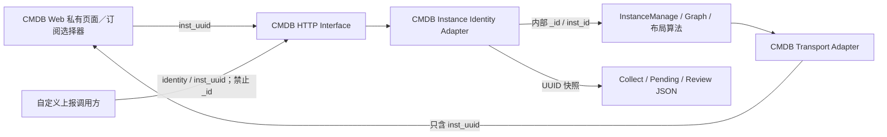

# CMDB 实例 UUID 补齐方案：配置采集、自定义上报、资产实例与订阅

Status: **implemented / 代码已实施，待生产发布与迁移验收**

Date: 2026-08-17

契约准绳：[spec.md](./spec.md) · [ADR 0005](../../../docs/adr/0005-use-uuid-as-cmdb-instance-identity.md)

历史前端清单：[FRONTEND_HANDOFF.md](./FRONTEND_HANDOFF.md)

## 1. 背景与目标

现有 UUID 主契约已经锁定：CMDB Web、HTTP/OpenAPI、消息与跨模块引用只使用
`inst_uuid`；CMDB 后端同进程内部可以使用图 `_id` / `inst_id`。

2026-08-17 针对“配置采集点击同步数据报错”进行前后端扫描后，确认当前代码仍有
四类未收口路径：

1. 配置采集前端仍从已剥离 `_id` 的实例响应中读取 `_id`，IP 子网场景会把
   `NaN` 序列化为 `null`，后端随后执行 `int(None)` 并返回 500。
2. 自定义上报后端会把实例图 ID 写入待补关系和清理审核 JSON，跨请求继续使用。
3. 资产实例主 CRUD 已基本 UUID 化，但通用拓扑树、机房和机柜布局仍向 Web 暴露
   或依赖实例图 ID。
4. 订阅的两套“指定实例”选择器仍读取响应中的 `_id` 并转换为数字；实例响应仅提供
   `inst_uuid` 时选项会变成 `NaN` 并被过滤，导致无法选择实例。订阅表单与后端实际已经
   要求 `instance_uuids`，前后端在该接缝处不一致。

本方案目标是补齐上述四条改造链路，并把关注资产、OA 的存量迁移核验纳入发布门禁，
同时满足：

- UUID 改动只作用于 CMDB 前端，不改变公共组件库及其他 App 的接口或默认行为。
- 后端对外只认 UUID；后端内部继续使用 `inst_id`，避免无必要地重写图算法。
- 不提供新的数字实例 ID 对外兼容入口；存量持久化 JSON 只允许有限期内部读取兼容。
- Telegraf `instance_id=cmdb_<CollectModels.id>` 保持不变，它是采集任务身份。

## 2. 领域模型与不变量

### 2.1 身份分类

| 身份 | 语义 | 允许出现的位置 |
|---|---|---|
| `inst_uuid` | CMDB 实例不可变业务身份 | Web 状态、URL、请求、响应、任务快照、跨请求 JSON、消息 |
| `_id` / 内部 `inst_id` | FalkorDB 节点工作集 ID | CMDB 后端一次请求或一次任务执行的内存工作集 |
| `CollectModels.id` | 配置采集任务主键 | 采集任务 CRUD、调度、`cmdb_<task_id>` 标签 |
| 自定义上报 task/batch/credential/review `id` | PostgreSQL 业务实体主键 | 自定义上报管理页面和对应 HTTP 路径 |
| 上报 identity keys | 自定义上报的幂等合并键 | ingest 实例 upsert 和同批关系解析；不是图实例 ID |

### 2.2 强制不变量

1. 前端不能读取、比较、缓存或提交 CMDB 实例 `_id` / 数字 `inst_id`。
2. 后端实例入口必须校验 UUID 格式；无效 UUID 返回 400，不允许变成 500。
3. 后端可以在入口后把 UUID 解析为 `_id`，但出站前必须递归移除图内部身份。
4. PostgreSQL JSON、Celery 参数、待审核数据和跨请求缓存不得保存实例图 ID。
5. 图重建导致 `_id` 改变但 `inst_uuid` 不变时，四条改造链路行为必须保持正确。
6. 模型、关联类型、任务、批次、凭据等非实例实体的普通 `id` 不做机械 UUID 化。

## 3. 范围

### 3.1 本次包含

- CMDB 配置采集：所有共享 `BaseTask` 的采集对象、IP 子网采集、任务编辑回显、
  已选目标去重、任务快照、下发前目标解析。
- CMDB 自定义上报：ingest 关系解析、待补关系、快照/过期清理审核、相关企业版测试。
- CMDB 资产实例：列表/详情契约复核、关系拓扑、拓扑展开、机房俯视图、机柜 U 位图。
- CMDB 订阅：两套“指定实例”选择器、规则创建/编辑回显、UUID 请求体和触发链路回归。
- 关注资产与 OA：不改当前正常功能链路，只核验存量 UUID 迁移、verify 结果和关键回归。
- 上述范围内的存量 JSON 清洗、验证命令和回归测试。

### 3.2 明确不包含

- `web/src/components/**` 公共组件行为、默认 `rowKey` 或 Ant Design 封装。
- CMDB 以外 App 的前端接口和状态模型。
- 关注资产、OA 的现有正常功能代码改造；它们只进入存量迁移与发布验收范围。
- 把后端图查询、布局计算和权限过滤算法全面改写为 UUID。
- 把所有名称包含 `instance_id` 的字段机械替换为 CMDB `inst_uuid`。

若实施扫描发现公共模块或其他 App 必须改变接口才能完成本方案，应停止实施并重新确认
范围，不能以“顺手统一”为由扩大改动。

## 4. 目标模块与接缝



### 4.1 前端接缝

在 `web/src/app/cmdb/**` 内建立 CMDB 私有实例选择类型和映射函数，承担：

- 验证/读取 `inst_uuid`。
- 把实例转换为 Ant Design Select 的 `value`。
- 为 `CustomTable` 提供 UUID `rowKey`。
- 按 UUID 完成已选、禁用、删除、批量删除和编辑回显。

公共 `CustomTable`、Ant Design `Select` 仍只处理普通 `React.Key` / 字符串，不需要理解
`inst_uuid`，因此无需修改公共组件 Interface。

### 4.2 后端接缝

复用现有 `normalize_inst_uuid` / `InstanceManage.query_entity_by_uuid(s)`，在每条 HTTP 或
持久化写入口完成：

1. 校验 UUID。
2. 按权限查询实例。
3. 必要时解析为内部 `_id`。
4. 构造只含 UUID 身份的任务/审核快照。

拓扑、关系和布局内部算法继续使用数字 ID；在出站 Transport Adapter 中递归映射为 UUID，
以较小后端改动获得统一外部 Interface。

## 5. 配置采集方案

### 5.1 Web

所有配置采集对象统一执行：

- `instId` 表单字段改为语义明确的 `instUuid`。
- Select `value`、表格 `rowKey`、选中集合、禁用集合全部使用 `inst_uuid`。
- 任务编辑从 `instances[0].inst_uuid` 回显。
- 多资产任务按 `inst_uuid` 删除和去重。
- 禁止以 `_id` 作为名称回退；缺少合法 UUID 的实例不可选，并给出可理解提示。

IP 子网采集单独调整：

- `selectedSubnetIds` / `subnet_ids` 改为 `selectedSubnetUuids` / `subnet_uuids`。
- 地址数量估算仍使用选项携带的非身份元数据，不依赖图 ID。
- 前端请求体不再产生 `Number(undefined)` 或数字子网引用。

涉及的采集对象至少包括：主机、PC、配置文件、SQL、InfluxDB、IPMI、K8s、IP、网络配置
文件、VM、平台 API、SNMP、云平台和 WinSphere。

### 5.2 Server

`CollectModelSerializer` 增加实例目标契约校验：

- 列表型 `instances` 中每个实例必须含合法 `inst_uuid`。
- 明确拒绝 `_id` 和数字 `inst_id` 作为实例身份。
- Server 按 UUID 重查目标实例，构造可信任务快照；只保留采集确实需要的连接和展示字段。
- IP 任务只接受 `subnet_uuids` 新写入；下发时批量解析为内部实例，再构造子网范围。

`model_instances` 响应只返回 UUID；存量任务缺 UUID 时跳过并记录可定位告警，不回退返回
数字 `_id`。

### 5.3 存量任务

复用并收紧 `migrate_cmdb_instance_uuid_refs`：

- 已有 `instances[*]._id` 能映射时补齐 `inst_uuid`。
- 已有 `subnet_ids` 能映射时补齐 `subnet_uuids`。
- 新代码读取 UUID；数字字段只在迁移窗口内作为 Server 内部只读回退。
- `--verify` 必须报告无法映射的活动任务，并阻断移除回退。
- 验证通过后停止读取 `subnet_ids` / `instances[*]._id`；删字段可另行做数据清理，不要求新增
  数据库列迁移。

## 6. 自定义上报方案

### 6.1 管理前端

自定义上报页面当前使用的 task、batch、credential、review `id` 不是 CMDB 实例身份，保持
不变。前端本次不需要公共组件或实例 UUID 改造。

### 6.2 Ingest Interface

- 上报实例继续使用任务配置的 identity keys 做幂等 upsert。
- 同批关系可以使用 identity 定位本批新建/更新的实例。
- 显式引用一个既有 CMDB 实例时，只接受 `inst_uuid`。
- 明确拒绝外部 payload 中的 `_id`、`inst_id`、`src_inst_id`、`dst_inst_id`。

identity keys 是上报合并 Interface，不是对外暴露图实例 ID 的兼容窗。

### 6.3 内部关系处理

- `merge_service` 可在本次 ingest 内部维护 `identity -> {_id, inst_uuid}` 工作集。
- 建边前优先取得源/目标 UUID，再调用 UUID 关系 Interface；该 Interface 内部可解析图 ID。
- `CustomReportingPendingRelation.relation_payload` 只保存 source/target identity 或 UUID，禁止
  保存 `_id`。
- backfill 每次执行时重新按 identity/UUID 解析当前图节点，不能复用历史图 ID。

### 6.4 清理与审核

- 当前请求内的即时差集计算可以临时使用 `_id`。
- 一旦创建人工审核，`review_payload` 必须保存 `delete_uuids`，不能保存 `delete_ids`。
- 审核通过时按 UUID 批量解析当前实例，再执行内部删除。
- UUID 不存在、无权限或映射不完整时失败关闭：不部分删除、不猜测、不回退数字 ID。

### 6.5 存量企业数据

增加企业版数据清理/验证步骤：

- 待补关系存在 identity 时移除 `_id`，后续按 identity 重查。
- 仅有 `_id` 时尝试在当前图中映射为 `inst_uuid`；无法映射则标记不可执行并进入人工处理。
- 待审核 `delete_ids` 映射为 `delete_uuids`；任一映射失败时该审核不可批准。
- 清理过程必须支持 dry-run、apply、verify，且不进入 `batch_init`。

## 7. 资产实例方案

### 7.1 已符合契约的主路径

资产列表、详情 URL、普通 CRUD、批量删除和关系创建/删除继续保持现有 UUID Interface；本次
只补契约测试，不重写已正确实现。

### 7.2 通用拓扑

- 图查询和权限裁剪继续在后端内部使用 `_id`。
- 在拓扑结果出站前，递归把每个实例节点转换为 `inst_uuid` 身份并剥离 `_id`。
- `parent_uuid`、展开请求和返回树节点统一使用 UUID。
- Web `NodeData`、X6 node id、父子关系、缓存 key、详情跳转全部使用 `inst_uuid`。
- 关联边自身的展示/画布局部 ID 若不是实例身份可以保留，但不得冒充实例 ID。

### 7.3 机房与机柜布局

- `room_layout`、`rack_layout` 对外 DTO 移除 `inst_id`。
- `RoomRack`、`RackDevice`、机柜摘要、冲突集合、重叠集合全部用 `inst_uuid`。
- 布局构建内部可以使用图 ID 做批量查询和临时 map；出站前只返回 UUID。
- React key、SVG key、点击跳转和高亮状态使用 UUID。
- 实例缺少 UUID 时不返回一个貌似可操作的数字目标；应报告清洗问题并安全跳过/失败。

### 7.4 出站剥离

普通 `_transport_instance` 除 `_id` / `_labels` 外，也必须防止数字语义 `inst_id` 泄漏。
嵌套实例结构不能只处理顶层，拓扑、关联分组和布局 DTO 都要有独立契约测试。

## 8. 兼容与发布策略

### 8.0 订阅、关注资产与 OA

#### 订阅：纳入本次功能改造

- 同时修复 `web/src/app/cmdb/components/subscription/instanceSelector.tsx` 与
  `web/src/app/cmdb/components/cmdb-subscription-drawer/instanceSelector.tsx`，避免两套实现行为分叉。
- 实例选项 `value`、已选值、编辑回显和提交体统一使用规范化后的 `inst_uuid` 字符串。
- 禁止读取或回退 `_id`；缺少合法 UUID 的实例不生成可选项，并给出可定位的提示/日志。
- 保持后端现有边界：Serializer 新写入只接受 `instance_uuids`；trigger 对存量
  `instance_ids` 仅做发布窗口内只读兼容，内部仍可使用图 ID 完成计算。
- 增加前端回归，必须覆盖“接口仅返回 `inst_uuid` 时仍能选择并提交”和“编辑旧 UUID 规则可回显”。

#### 关注资产：功能代码不改，增加迁移门禁

- 新关注、取消关注、查询和用户配置写入继续只使用 `inst_uuid`。
- 上线前运行 `migrate_cmdb_instance_uuid_refs` 的 dry-run/apply/verify，确认
  `cmdb_followed_assets` 中活动记录均有合法 `inst_uuid`。
- 仅有无法映射数字 `inst_id` 的记录必须出具清单并人工处理；不得以 Web 静默过滤作为迁移完成证据。
- 增加定向测试，覆盖数字旧值迁移、UUID 旧别名读取以及新写入不再产生 `inst_id`。

#### OA：功能代码不改，增加迁移门禁

- 活跃前后端继续只使用 `bk_inst_uuid`；`bk_inst_id` / `instId` 只能存在于迁移兼容逻辑和迁移测试。
- 上线前运行 `migrate_oa_cmdb_instance_uuid_refs` 的 dry-run/apply/verify，确认画布、接口引用、
  Dashboard Render Snapshot 等持久化 JSON 已转换完成。
- 无法映射的 OA 节点/接口引用必须按命令策略移除或进入人工处置，并保留统计证据。
- 复跑 OA 画布保存、读取、运行时和 WeOps Adapter 回归，防止迁移正确但消费链路回退。

### 8.1 推荐策略

采用“外部立即 UUID、内部存量读取短兼容”的方式：

- Web 和新 HTTP 写入不接受数字实例身份。
- Server 对已经存在的 `CollectModels` / enterprise JSON 允许一个发布周期的只读数字回退，
  仅用于完成映射和清洗，不返回给调用方。
- dry-run → apply → verify 全绿后移除运行时数字回退。
- 不允许无限期双写或把数字字段重新定义成公共 Interface。

### 8.2 发布顺序

1. 备份相关 PostgreSQL 表和图库，运行 dry-run。
2. 部署同时支持 UUID 新写入和存量内部读取的 Server。
3. 部署 CMDB Web 配置采集、资产实例与订阅选择器改动。
4. 分别 apply CMDB 与 OA 清理并运行 verify，核对关注资产和 OA 存量统计。
5. 烟测四条改造链路以及关注资产、OA 后移除内部数字回退；如不能同版移除，须登记明确截止版本。

不增加启动期依赖，不把清理命令放入 `batch_init`。

### 8.3 回滚

- 流量前：可恢复 PostgreSQL/图库备份并回滚同一版本前后端。
- 新 UUID 写入已经产生流量后：不回滚到只认数字 ID 的版本，采用前向修复。
- 清理命令必须幂等；失败时保留原数字字段直到 verify 通过，避免不可恢复删除。

## 9. 实施切片（确认后执行）

### T0 — 红灯契约测试

- 固化 IP `undefined -> NaN -> null -> int(None)` 回归。
- 固化订阅实例响应仅有 `inst_uuid` 时，选项不为空且提交 `instance_uuids` 的回归。
- 固化三类出站响应不得包含实例 `_id` / 数字 `inst_id`。
- 固化图 `_id` 变化但 UUID 保持时，待补关系、清理审核、拓扑与布局仍正确。

### T1 — 配置采集 Server Interface

- Serializer UUID 校验与可信快照。
- IP `subnet_uuids` 解析。
- `model_instances` 移除数字出站回退。
- 存量清洗和 verify 补强。

### T2 — 配置采集 Web

- CMDB 私有实例 Option Adapter。
- BaseTask 及所有采集对象 UUID 状态、rowKey、编辑回显。
- IP 子网 UUID 化。

### T3 — 自定义上报

- 外部数字 ID 拒绝。
- pending 关系和 cleanup review UUID 持久化。
- 企业数据 dry-run/apply/verify 与回归测试。

### T4 — 资产实例 Server Transport

- 拓扑递归 UUID DTO。
- 机房/机柜 UUID DTO。
- 嵌套响应剥离契约测试。

### T5 — 资产实例 Web

- 拓扑 NodeData / X6 id UUID 化。
- 机房机柜类型、冲突/重叠集合、点击跳转 UUID 化。
- 清理仅作为变量名兼容存在的 `instId`。

### T6 — 订阅与既有主规格链路验收

- 修复两套订阅实例选择器，统一使用 UUID Option Adapter。
- 订阅创建、编辑回显、触发查询和存量 `instance_ids` 只读兼容回归。
- 关注资产迁移测试与 `migrate_cmdb_instance_uuid_refs --verify` 证据。
- OA 迁移、画布 API、运行时和 Adapter 回归及 `migrate_oa_cmdb_instance_uuid_refs --verify` 证据。

### T7 — 收口与发布证据

- 定向测试、Web lint/type-check。
- 静态扫描四条改造链路中禁止的实例 `_id` / 数字 `inst_id` 用法。
- dry-run/apply/verify 证据和人工烟测记录。

切片按 T0 → T7 执行；每个切片只改自身范围，不做全仓机械替换。

## 10. 测试与验收矩阵

| 场景 | 验收 |
|---|---|
| 配置采集实例选择 | Select、表格、编辑回显、去重均以 UUID 工作 |
| IP 子网同步 | 请求只含 `subnet_uuids`，不会产生 `null`，同步成功 |
| 全配置采集对象 | 每种对象至少覆盖创建/编辑中的实例 UUID 快照 |
| 非法数字输入 | Web/HTTP/ingest 数字实例定位返回 400，不产生 500 |
| 自定义上报同批关系 | identity 解析成功，内部建边不暴露图 ID |
| 自定义上报 pending | 跨请求只存 identity/UUID，图重建后可 backfill |
| 自定义上报清理审核 | 只存 `delete_uuids`，图重建后仍删除正确实例 |
| 资产列表/详情 | UUID URL、CRUD 和关系操作保持通过 |
| 通用拓扑 | 返回树无 `_id`，展开、缓存、跳转使用 UUID |
| 机房机柜 | DTO 无 `inst_id`，冲突、重叠、高亮与跳转使用 UUID |
| 订阅指定实例 | 两套选择器只读 `inst_uuid`，创建和编辑提交合法 `instance_uuids` |
| 订阅触发 | UUID 规则按 `inst_uuid` 查询；存量数字只读兼容有明确移除门禁 |
| 关注资产 | 新写入仅含 `inst_uuid`；存量数字配置迁移后 verify 无活动遗留 |
| OA | 活跃链路仅含 `bk_inst_uuid`；OA 清洗 verify、画布 API 与运行时回归通过 |
| 公共组件回归 | `web/src/components/**` 无改动，其他 App type-check 不受影响 |
| Telegraf 回归 | `cmdb_<task_id>` 保持不变 |
| 图重建不变量 | `_id` 变化后全部活跃引用仍指向原 UUID 实例 |

最低验证：

```bash
cd server
make test

cd web
pnpm lint
pnpm type-check
```

另需运行四条改造链路的定向 pytest / 前端测试，以及 CMDB、OA 两条清洗命令 `--verify`。
如环境或基线失败，必须保留原始命令与输出，不以静态阅读替代交付验证。

## 11. 风险与防护

| 风险 | 防护 |
|---|---|
| 把任务/批次等普通 ID 误改成 UUID | 只处理被证明确认是 CMDB 实例身份的字段 |
| 前端改公共组件影响其他 App | UUID Adapter 固定在 `web/src/app/cmdb/**` |
| 存量任务缺 UUID | dry-run 列表、可重复清理、verify 阻断移除回退 |
| 待审核数字 ID 已失效导致错删 | 映射不完整时失败关闭，禁止部分删除 |
| 拓扑递归转换遗漏嵌套节点 | 对完整嵌套响应做契约测试和禁止字段扫描 |
| 同版本前后端契约错位 | 前后端协调发布并保留精确烟测 |
| 把采集任务身份误当实例 UUID | 明确保护 `cmdb_<task_id>` 不变量 |
| 两套订阅组件只修一套 | 两个入口共用契约测试并纳入同一实施切片 |
| 关注资产数字旧值被前端静默隐藏 | 以迁移 verify 和遗留清单为门禁，不以页面无报错代替 |
| OA 迁移完成但运行时消费回退 | 同版复跑画布 API、runtime 和 WeOps Adapter 测试 |

## 12. 已确认决定

以下决定已由用户确认并作为本次实现边界：

1. **范围**：补配置采集、自定义上报、资产实例和订阅；关注资产、OA 只做迁移验收；
   不改公共组件及其他 App。**推荐：确认**。
2. **后端内部**：保留图 `_id` 算法，在 HTTP/持久化接缝做 UUID Adapter。**推荐：确认**。
3. **存量兼容**：允许一个发布周期的 Server 内部只读数字回退；对外无数字兼容。**推荐：确认**。
4. **自定义上报**：identity keys 保留 upsert 语义；显式既有实例引用只收 UUID。**推荐：确认**。
5. **无法映射数据**：失败关闭并进入人工处理，不猜测、不部分执行。**推荐：确认**。
6. **实施顺序**：按 T0–T7，先失败测试和后端 Interface，再改 Web 调用方，最后完成
   订阅、关注资产、OA 验收。**推荐：确认**。

## 13. 确认栏

- [x] 批准本方案，按 T0–T7 开始实施
- [ ] 批准，但调整范围/顺序：_______________
- [ ] 仅批准其中模块：_______________
- [ ] 驳回，继续讨论：_______________

用户已明确批准代码实施。本次未对生产数据执行迁移，也未执行发布操作；生产环境仍须按
第 8.2 节完成备份、dry-run、apply、verify 和人工烟测。

## 14. 实施记录（2026-08-17）

- 配置采集 Web、IP 子网及 Server 写入口已统一使用 UUID；Server 会按 UUID 重查并生成
  白名单可信快照，拒绝 `_id`、`inst_id`、`subnet_ids` 新写入。
- 自定义上报 pending/review 已改为 identity/UUID 持久化，并对旧 ID、模型不匹配和映射不全
  失败关闭；迁移清理保持幂等。
- 资产拓扑、机房、机柜与 Room3D 出站 DTO 已使用 UUID，缺 UUID 的实例安全跳过，不回退图 ID。
- 两套订阅选择器使用 CMDB 私有 UUID Option Adapter；关注资产与 OA 纳入迁移及回归门禁，
  未修改公共组件和其他 App。
- 本地已完成定向后端测试、CMDB 前端单测和全量 TypeScript type-check；生产迁移命令与人工
  烟测留待发布窗口执行并留存证据。
