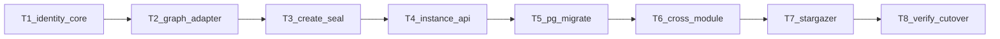

# CMDB 实例 UUID — 实现 Plan

Status: **complete**（T1–T8 完成；前端代码仍延期）  
Date: 2026-08-10  
Updated: 2026-08-10（T8 完成）  
Branch: `local_codex/cmdb-instance-uuid`  
契约准绳：[spec.md](./spec.md)（approved）  
事实清单：[BASELINE_INVENTORY.md](./BASELINE_INVENTORY.md)  
实现前走读：[IMPLEMENTATION_WALKTHROUGH.md](./IMPLEMENTATION_WALKTHROUGH.md)

> 门禁：W1/W7 已确认；T1–T8 已完成。Neo4j 本阶段不做。前端仍延期（仅对接说明）。

## 边界（不可偏移）

- 对外 / CMDB 前后端 = `inst_uuid`；后端内部 Adapter/`InstanceManage` 可用 `_id`/`inst_id`；出站剥离图 ID。
- 关联边持久化 `src_inst_uuid`/`dst_inst_uuid`，删除数字端点属性。
- 不以 `worktrees/cmdb-instance-uuid` 为准（可对照，禁止整包搬回）。
- **本 Plan 不含前端改动**；T8 只产出对接说明。
- Telegraf `cmdb_{task_id}` 不变。

每张票：红-绿优先；只改本票范围；对照契约 §13。

---

## T1 — 身份核心

**状态：完成**（2026-08-10）

- 新增 `server/apps/cmdb/services/instance_identity.py`
- 单测 `server/apps/cmdb/tests/test_instance_identity_pure.py`：**10 passed**
- **未改**：View / OpenAPI / Adapter / 迁移

**完成定义**：纯函数测试全绿 ✓

---

## T2 — 图 Adapter（**仅 FalkorDB**）

**状态：完成**（2026-08-10；Neo4j 本阶段明确不做）

**目标**：按 UUID 查询/索引；创建边写 UUID 端点。

- `server/apps/cmdb/graph/falkordb.py`：
  - create/batch：写入前 `ensure_graph_instance_identity`
  - `inst_uuid` 索引（`ensure_node_property_index`）
  - 按 `inst_uuid` / 批量查询
  - `create_edge`：持久化 `src_inst_uuid`/`dst_inst_uuid`；禁止 `src_inst_id`/`dst_inst_id`
  - 拓扑：优先图连接端点建树；边属性保留 UUID
- `instance_identity.prepare_edge_endpoint_properties`：边端点写入边界
- **不做**：`neo4j.py`
- 契约测试：`test_falkordb_client.py` + `test_instance_identity_pure.py`：**96 passed**；真实图库测有条件 skip/跑

**完成定义**：FalkorDB 契约测通过；边无数字端点属性 ✓

---

## T3 — 创建路径封闭

**状态：完成**（2026-08-10）

**目标**：所有创建旁路必有合法 `inst_uuid`。

封闭：
- `InstanceManage.instance_create` / `instance_batch_create` → `prepare_new_instance_identity`
- `collection/common.py` `add_inst`
- `pc_discovery.py` PC/软件创建
- `Import.inst_list_save`
- IPAM / NodeMgmt 走 `instance_create`（已覆盖）
- 图层 `ensure_graph_instance_identity`（T2）继续兜底 `batch_save` 等新增分支

**完成定义**：旁路回归断言创建结果含合法 `inst_uuid` ✓

---

## T4 — Instance 服务 + HTTP/OpenAPI/NATS/RPC

**状态：完成**（2026-08-10）

**目标**：对外定位 UUID；出站剥离 `_id`。

- `services/instance.py`：UUID facade（`query_entity_by_uuid(s)`）；CRUD/关联/拓扑入口接 UUID，内部解析 `_id`
- `views/instance.py`：`_transport_instance` 剥离 `_id`；数字 path/pk 拒绝
- `open_api/`：`serialize_instance` 不再 `_id→inst_id`；路径 `<str:inst_uuid>`；文档已更新
- `nats/nats.py`、`rpc/cmdb.py`：UUID 参数 + `protocol_version=2`；旧数字安全拒绝
- 相关单测：**203 passed**

**完成定义**：相关测试绿；数字定位被拒；响应无图业务键。 ✓

---

## T5 — PG schema + 清洗命令 + 启动编排

**状态：完成**（2026-08-10）

**目标**：先结构、再数据；清洗不进 `batch_init`。

**已落地：**

1. Django `0045_instance_uuid_transition`：仅结构  
   - `ChangeRecord` 可空 `inst_uuid`；`inst_id` 改为可空保留  
   - `ConfigFileVersion` **新增**可空 `instance_uuid`，**保留** `instance_id`  
   - `CmdbUuidMigrationState` 断点表  
   - **无**数据 `RunPython`；**无**删列 / NOT NULL cutover  
2. 运行期：`create_change_record*` 写 `inst_uuid`；配置版本双写 `instance_uuid`；Operation target 双写  
3. `migrate_cmdb_instance_uuid_refs`：`--dry-run` / `--apply` / `--verify`  
   - 图补 UUID、边写 UUID 端点并去数字端点  
   - PG 回填 ChangeRecord / ConfigFileVersion  
   - 订阅/关注资产/采集等 JSON **双写** UUID 字段，保留旧数字键（避免 T6 前读侧断）  
   - **不含** OA/告警（T6）；**不改** `migrate || true`  
4. 相关单测：迁移结构 + 清洗图逻辑 + ChangeRecord 写入

**完成定义**：迁移单测 + 命令幂等/verify 相关测通过 ✓

---

## T6 — 跨模块后端

**状态：完成**（2026-08-10）

**已落地：**

- CMDB：订阅写入只收 `instance_uuids`；trigger 优先 UUID、回退 `instance_ids`
- Collect 目标 / IPAM discovery：优先 `inst_uuid` / `subnet_uuids`
- Operation target：新提交只写 `instance_uuid`
- alerts enrichment / source_adapter：`protocol_version=2` + `inst_uuid(s)`
- OpsPilot CMDB tools：全量 `inst_uuid` / 关联业务键
- OA：`bk_inst_id` → `bk_inst_uuid`（运行时 + 测试）
- 独立清洗命令 `migrate_oa_cmdb_instance_uuid_refs`（可与 CMDB 清洗并行；不进 batch_init）

**完成定义**：模块针对性测试绿 ✓

---

## T7 — Stargazer 配置采集

- 下发 `target_instance_uuid` + `protocol_version`
- 拒 `target_instance_id`；回调 `instance_uuid`
- 不改 `cmdb_{task_id}` 监控标签

**状态**：✅ 完成（SSH/网络配置采集协议 v2；Server 回调按 UUID 解析并双写 `instance_id`+`instance_uuid`）

**完成定义**：协议拒绝/UUID 保留测试绿。

---

## T8 — 验证与收口

**状态：完成**（2026-08-10）

- 受影响自动化复跑证据：[ACCEPTANCE.md](./ACCEPTANCE.md)（CMDB 245 + Falkor 烟测 11 + Stargazer 18 等）
- §13 自检表已填；图重建完整烟测列为运维门禁（cutover §2）
- 清洗幂等入口：`migrate_cmdb_instance_uuid_refs` / `migrate_oa_*`（无 prepare / 无删列 cutover）
- Runbook：[docs/operations/cmdb-instance-uuid-cutover.md](../../../docs/operations/cmdb-instance-uuid-cutover.md)
- ADR：[docs/adr/0005-use-uuid-as-cmdb-instance-identity.md](../../../docs/adr/0005-use-uuid-as-cmdb-instance-identity.md)
- Changelog：`docs/changelog/release/community/2026-08-10.md`
- 前端对接说明：[FRONTEND_HANDOFF.md](./FRONTEND_HANDOFF.md)（**未改 Web**）

**完成定义**：§13 有证据；未要求则不 commit/push。 ✓

---

## 执行约定

1. 严格 T1→T8；用户确认本 Plan 后再改代码。  
2. 禁止从旧 worktree 整目录复制。  
3. 契约歧义先停，改规格再继续。  
4. 无关基线失败：记录隔离，不顺手大修。

## 确认栏

- [ ] 已阅读并确认 [IMPLEMENTATION_WALKTHROUGH.md](./IMPLEMENTATION_WALKTHROUGH.md)  
- [ ] 批准本实现 Plan，从 T1 开始执行  
- [ ] 批准但调整顺序/范围：_______________  
- [ ] 驳回：_______________
