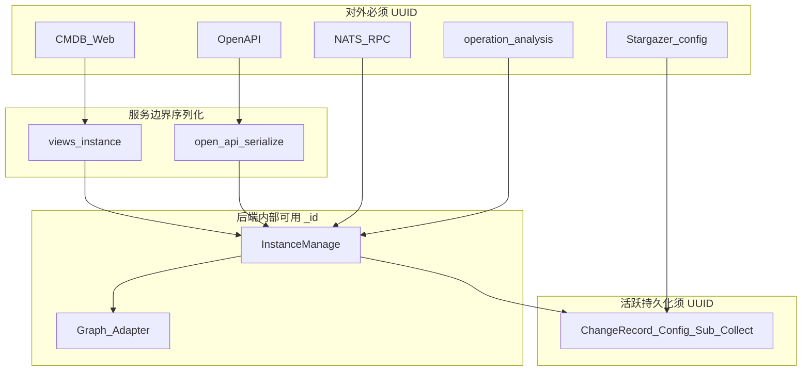

# CMDB 实例 UUID — 实现前走读

Status: walkthrough-complete（**尚未开始写业务代码**）  
Date: 2026-08-10  
Baseline: `local_codex/cmdb-instance-uuid` @ `902698906`  
契约：[spec.md](./spec.md)  
事实清单：[BASELINE_INVENTORY.md](./BASELINE_INVENTORY.md)  
实现草案：[IMPLEMENTATION_PLAN.md](./IMPLEMENTATION_PLAN.md)（**须走读确认后再执行**）

> 说明：先前在契约批准后直接抛出 T1–T8 实现 Plan，**跳过了实现向走读**。本文补齐「契约条款 → 基线代码落点 → 改动触点 → 风险」。确认走读无误后，才允许按 IMPLEMENTATION_PLAN 改代码。

---

## 1. 契约 → 代码落点总图



| 契约条款 | 基线现状 | 第一触点（文件/符号） | 实现含义 |
|---|---|---|---|
| 对外 / CMDB 前后端 / 跨模块 = `inst_uuid` 唯一定位实例 | View/OpenAPI 回 `_id` 或别名 `inst_id`；告警/监控/节点侧多绑数字或任务标签 | `views/instance.py`；`open_api/services.py` `serialize_instance`；alerts/rpc；node_configs | 路径与跨模块协议改 UUID；出站剥 `_id`；**注意**：Telegraf `cmdb_{task_id}` 仍是采集任务身份，不是实例 UUID |
| 内部可用 `_id`/`inst_id` | 全链路已是数字工作集 | `InstanceManage` + `graph/*` | **保留**内部解析后用 `ID(n)`；勿假装图 ID 消失 |
| 节点必有不可变 UUID | 无 `inst_uuid` | `instance_create` → `create_entity` | T1 生成 + T2/T3 写入 |
| 边存 `src/dst_inst_uuid`，删数字端点 | 边属性 `src/dst_inst_id`；`format_topo` 硬依赖 | `instance_association_create`；`falkordb.format_topo` | 写边改属性；拓扑导航算法同步改 |
| PG 一等键切 UUID | `ChangeRecord.inst_id` 等 | 模型 + `change_record.py` / `config_file_service` / subscription | T5 迁移 + 运行期写入改字段 |
| 配置采集目标 UUID | 下发 `target_instance_id`=_id | `node_configs/ssh/config_file.py`；`network_config_file.py` | T7；SSH 回调今常回主机名再反查，需协议一并理顺 |
| 清洗 ∉ `batch_init` | startup=`migrate→batch_init`；无清洗命令 | `startup.sh`；`batch_init._init_cmdb` | T5 维护编排；batch_init 只门禁 |
| 前端本阶段不改 | Web 仍用数字 | `DEFER.md` | 后端先切时：**要么**联调暂用旧前端会挂，**要么**后端与前端同发——须在执行前明确发布节奏 |

---

## 2. 创建链路走读

### 2.1 主路径（应生成 UUID 的主入口）

```text
InstanceViewSet.create (views/instance.py ~399-435)
  → OperationService.execute_graph (operation_service.py)
  → InstanceManage.instance_create (instance.py ~754-798)
  → GraphClient.create_entity (falkordb/neo4j)
  → entity_to_dict 注入 _id=node.id
  → response_success(inst) 整包回前端（含 _id）
```

**走读结论**：UUID 生成应挂在 `instance_create`（及 batch）必经处；图层兜底防旁路漏写；`OperationService._commit_graph_result` 今日把 `result["_id"]` 写入 `CmdbOperation.target.instance_id`——最终态应对外/持久化改 UUID，内部账本字段名需按契约重命名以免名实不符。

### 2.2 直写图旁路（封闭优先级最高）

| 旁路 | 触点 | 风险 |
|---|---|---|
| 采集入库 | `collection/common.py` `add_inst` → `create_entity` ~186 | 绕过 InstanceManage → 无 UUID |
| PC discovery | `pc_discovery.py` ~202、~316 | 同上 |
| Excel Import | `utils/Import.py` `batch_create_entity` ~576 | 同上 |
| 关联旁路 | `common.set_asso_info` 写 `src_inst_id=_id` | 边仍数字 |

IPAM / NodeMgmt 已走 `instance_create`，封闭主入口即可覆盖，但仍需测。

---

## 3. 读改删与对外协议走读

| 入口 | 现状键 | 契约最终态 |
|---|---|---|
| `retrieve/destroy/partial_update(pk)` | `int(pk)` → `query_entity_by_id` | path = UUID；内部再解析 `_id` |
| 批量 body `inst_ids` | int 列表 | `inst_uuids` / `instance_uuids` |
| OpenAPI `serialize_instance` | `_id`→`inst_id` | 暴露 `inst_uuid`；禁止把图 ID 当业务键 |
| NATS update/delete | `inst_id`/`_id` | 跨服务参数改 UUID；旧数字拒绝 |
| 出站 | `WebUtils.response_success` 不改字段 | **必须在组 payload 时剥离**，不能指望包装器 |

---

## 4. 关联与拓扑走读（设计敏感点）

**写边**：`instance_association_create` 把整个 `data`（含 `src_inst_id`/`dst_inst_id`）作为边 properties；`create_edge` 只 `SET e += $props`，并用 `ID(a)/ID(b)` 连节点。

**读拓扑**：`format_topo` / `create_node` **用边属性上的数字 `src_inst_id` 与 `entity["_id"]` 匹配**建树。

**走读结论（实现必须面对）**：

1. 契约要求边存 UUID 端点 → 写边改属性键。  
2. 拓扑若继续靠边属性导航，应改为用 `src_inst_uuid` 与 `entity.inst_uuid` 匹配，**或**改为仅用图连接关系遍历、不再靠边属性上的端点 ID（更贴近「连接即真相」）。  
3. **推荐实现倾向**（走读建议，执行前可再确认）：  
   - 边属性存 UUID（满足契约与按端点过滤的查询）；  
   - 拓扑优先走图连接（`_edges`/`_nodes`），属性 UUID 作校验与对外序列化；避免再复制一套「属性数字 ID 导航」。  

此点比 T1 纯函数更影响 Adapter 设计，**不应在未走读时直接开写**。

---

## 5. PG / 跨模块走读摘要

| 数据 | 现状 | 迁移/运行期注意 |
|---|---|---|
| ChangeRecord | `inst_id` BigInt | +`inst_uuid`；历史无映射可留数字 |
| ConfigFileVersion | `instance_id` 字符串=_id；MinIO key 含之 | 契约：新 key 用 UUID；**旧对象不搬**（与历史 MinIO 策略一致，实现时写清） |
| Subscription | `instance_ids` + snapshot 数字键 | 改 UUID；孤儿禁用 |
| CollectModels.instances | JSON `_id` | 活跃任务快照改 UUID |
| 关注资产 | `inst_id` in user config | 后端迁移 JSON；前端后置时旧前端会读数字——发布节奏问题 |
| OA | `bk_inst_id` | 默认改 `bk_inst_uuid` |
| CmdbOperation.target | `instance_id`=_id | 活跃操作账本改 UUID |

---

## 6. 配置采集协议走读

| 方向 | 现状 | 契约落差 |
|---|---|---|
| 下发 | `target_instance_id` = `_id` | → `target_instance_uuid` |
| SSH 回调 | 常回**主机名**作 `instance_id`，Server 再反查 `_id` | 最终应带回/校验 UUID，主机名仅辅助 |
| 网络回调 | 可回 `target_instance_id` | → UUID |
| Telegraf | `cmdb_{task_id}` | **不动** |

---

## 7. 启动与迁移走读

```text
现状 startup: migrate(||true) → cache → static → batch_init → supervisord
batch_init._init_cmdb: 模型/OID/采集/字段…/reconcile_node_mgmt —— 无身份清洗
```

契约：身份转换 = 维护命令；失败阻断；`batch_init` 只验最终态。  
实现时还需决定：`migrate || true` 是否改为硬失败（旧 worktree 曾改；本基线仍是 `|| true`）——**属可靠性变更，走读建议单独写进 T5 并符合 startup-dependencies 文档，不与 UUID 逻辑缠死**。

---

## 8. 走读发现的风险 / 实现前待拍板

| # | 问题 | 状态 |
|---|---|---|
| W1 | 拓扑导航今日靠边数字属性 | **已确认**：边存 UUID + 拓扑优先图连接 |
| W2 | 后端先切、前端后置 → Web 联调会坏 | 上线同发或维护窗（假设） |
| W3 | SSH 配置回调用主机名 | T7 回调必须带 `instance_uuid`（假设） |
| W4 | MinIO 旧 key 含数字 | 不搬对象；DB 保留旧 key（假设） |
| W5 | OpenAPI 别名移除 | 破坏性变更 + changelog（契约已定） |
| W6 | `startup.sh` 里 `migrate \|\| true` 是否改硬退出 | **默认不动**（与 UUID 解耦；除非另开可靠性变更） |
| W7 | ChangeRecord / PG 策略 | **已确认 C1** + 先 schema migrate、再 management 清洗补 UUID（见 §8.1） |

### 8.1 PG 存 UUID：能否不改 Django 模型？

**结论：不能一刀切。** 取决于列类型。

| 存储 | 类型（基线） | 直接把值改成 UUID 字符串？ | 建议 |
|---|---|---|---|
| `ConfigFileVersion.instance_id` | `CharField(128)` | **可以**（长度够） | 数据迁移改值 + `help_text`/注释标明存 `inst_uuid`；**可不改列名/类型** |
| `SubscriptionRule.instance_filter` / `snapshot_data` | `JSONField` | **可以** | 只改 JSON 内容与读写代码；模型无 DDL |
| `CollectModels.instances` / Operation `target` | `JSONField` | **可以** | 同上 |
| 关注资产 `config_value` | `JSONField` | **可以** | 同上 |
| **`ChangeRecord.inst_id`** | **`BigIntegerField`** | **不可以** | UUID 无法写入 bigint；必须二选一（见下） |
| 图节点/边属性 | 图属性 | 可以（字符串属性） | 无 Django 模型 |

**ChangeRecord（已确认 C1，2026-08-10）：**

- 新增 `inst_uuid` 列（可空起步）；`inst_id` 保留，供无法映射的历史数字只读。  
- 当前查询走 `inst_uuid`。  
- **发布顺序（已同意）**：  
  1. Django migration 只做**结构**（加列/索引；Char/JSON 侧可只改 help_text，无强制 rename）。  
  2. 再跑 **management command** 清洗：图实例补 UUID、边端点改写、PG/JSON 回填、孤儿处理、verify。  
  3. （可选第二段 migration）对必须非空的活跃列做 cutover 约束——仅当清洗 verify 通过后。  
- 清洗命令 ∈ 维护编排，**不**塞进 `batch_init`；可 `--dry-run` / `--apply` / `--verify`，须幂等。

**C2/C3**：否决。

因此：「Char/JSON 原字段存 UUID + 注释」可以；ChangeRecord **必须** migration 加列，再 management 回填。

---

## 9. 与 IMPLEMENTATION_PLAN 的关系

| 票 | 走读是否支撑开写 |
|---|---|
| T1 身份纯函数 | 是（无歧义） |
| T2 Adapter + 边/拓扑 | **先确认 W1** |
| T3 创建封闭 | 是（旁路表已列全） |
| T4 API 对外 | 是；注意 W2/W5 |
| T5 迁移编排 | 是；确认 W4/W6 |
| T6 跨模块 | 是 |
| T7 Stargazer | 确认 W3 |
| T8 验证 | 是 |

**当前状态：走读完成，实现未开始。**

---

## 10. 请你确认

| # | 项 | 状态 |
|---|---|---|
| W1 | 边存 UUID + 拓扑优先图连接 | **已同意** |
| W7 | ChangeRecord = C1；先 Django schema，再 management 清洗补 UUID | **已同意** |
| W6 | `migrate \|\| true` | **默认不动**（可在实现 Plan 里维持） |
| 门禁 | 是否批准按 IMPLEMENTATION_PLAN 从 **T1** 开始编码 | **已批准并完成 T1**；下一票 T2 待你确认后再开 |

未批准「开始 T1」前：**不改业务代码**。
