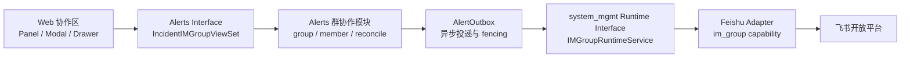
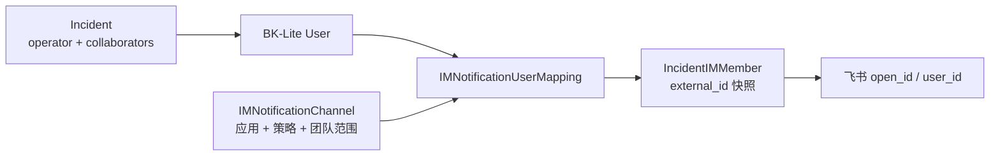
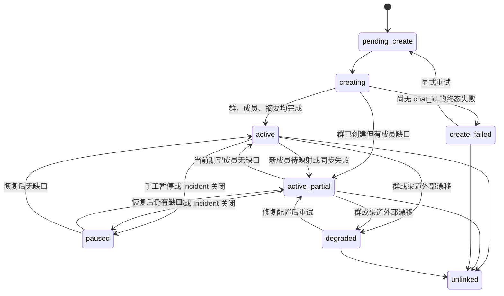

# Incident 飞书协作群：快速设计导览

> **已被取代（2026-07-30）**：该文档记录早期“社区版 Alerts 直接承载、首期仅飞书、
> 停止管理后可重新建群”的设计与实现历史。当前正式设计为企业版、多 Provider
> 创建前选择且绑定后不可切换，见
> [企业版 Incident 一键拉群](../enterprise-incident-im-group/spec.md)。

> 面向第一次接触该功能的开发者和评审者。目标是在 10 分钟内理解需求、关键接口、可靠性边界与发布条件；实现细节以代码和[完整规格](../../../docs/superpowers/specs/2026-07-21-incident-feishu-im-group-design.md)为准。

## 1. 一句话目标

Incident 负责人可以在处置协作区一键创建飞书群，并把当前及后续新增的负责人、协作人可靠地加入群聊，从而缩短事故协同的启动时间。

首期只交付飞书闭环。企业微信仅保留后续接入的 Provider seam，不进入本期实现、验证或发布范围。

## 2. 先记住这些术语和规则

| 术语 | 含义 |
|---|---|
| Incident 负责人 | `Incident.operator` 中的用户；只有负责人能管理协作群 |
| Incident 协作人 | `Incident.collaborators` 中的用户；可入群、可查看，但不能管理 |
| 当前期望成员 | `operator + collaborators` 去重后的当前集合 |
| 群绑定 | BK-Lite Incident 与一个外部飞书群的本地管理关系 |
| IM 通道 | `IMNotificationChannel`；同时确定飞书应用、用户映射策略和团队可见范围 |
| 用户映射 | 通道内 BK-Lite `User` 到飞书身份的对应关系；建群使用冻结后的外部 ID 快照 |
| 持续同步 | 新增当前期望成员时自动补拉；不是外部群成员的强制一致性 |
| 只增不减 | 人员从 Incident 移除后不自动踢出飞书群 |
| 解绑 | BK-Lite 停止管理该群；不会删除、解散外部飞书群 |

关键产品规则：

- 写操作要求“当前用户是 `operator`”且具备 `Incidents-Edit`。
- 至少一名负责人已映射即可建群；其他未映射人员不阻断创建。
- 一个 Incident 同时最多一个未解绑绑定；解绑后可以重新建群。
- Incident 关闭时暂停，重开后按关闭前语义继续；手工暂停不会被重开自动恢复。
- 用户主动退出飞书群后，本期不循环强拉。
- `team` 只控制通道是否可见，不决定群成员，也不把 Incident 与组织节点绑定。

## 3. 用户主流程

1. 系统管理员配置飞书集成实例，完成 IM 通道用户同步与群能力 readiness 检查。
2. Incident 负责人进入“协作”页，点击“一键建群”。
3. 创建 Modal 加载可用通道、成员映射预览和已映射负责人候选。
4. 负责人确认通道、群名、群主和持续同步开关。
5. 后端在事务中保存群绑定、成员快照和 Outbox，返回 `202`；前端进入创建中轮询。
6. Worker 创建群、保存 `chat_id`、补拉剩余成员、发送 Incident 摘要。
7. 页面展示正常或部分成功；未映射/失败成员可在 Drawer 查看并重试。
8. 后续新增负责人或协作人触发对账；移除人员只停止尚未发生的邀请，不踢出已入群人员。

### 前端方案 A

沿用 Incident 协作页“左侧处置动态 + 右侧 220px 协作者栏”的布局：

- `IncidentIMGroupPanel` 位于右侧协作者列表上方。
- 未建群：紧凑空状态和“一键建群”入口。
- 创建：Modal 承载通道、群名、群主、成员预览和持续同步开关。
- 运行态：卡片只保留状态、关键人数、“当前优先动作”和“更多”。
- 成员与异常：Drawer 分页展示已加入、待映射、冲突和失败成员。
- 创建中短轮询；稳定态随协作页刷新。切换 Incident 或卸载页面时取消请求与计时器。

| 页面状态 | 用户看到的重点 | 主要动作 |
|---|---|---|
| 未建群 | 可建群资格、渠道是否可用 | 创建 |
| `pending_create` / `creating` | 当前阶段和进度 | 查看详情 |
| `active` | 已加入人数、同步设置 | 打开群/复制群 ID |
| `active_partial` | 待映射、失败和待同步数量 | 查看详情/重试 |
| `paused` | 手工暂停或 Incident 关闭原因 | 恢复（仅手工暂停） |
| `create_failed` | 群尚未建立及安全错误 | 重试或解绑 |
| `degraded` | 外部群/渠道配置异常 | 重新检查/重试或解绑 |

前端只消费服务端状态和 `permissions` 动作矩阵，不复制权限或状态机判断。

## 4. 总体模块与 seam



这个切分形成两个主要 seam：

- Alerts interface 隐藏 Incident 权限、生命周期、状态聚合和可靠投递；Web 不需要理解飞书。
- `IMGroupRuntimeService` 隐藏凭据、Provider 路由和平台错误归一；Alerts 不读取 token、不直接调用飞书 HTTP。

### 用户映射



映射行在通讯录重同步时可能重建，因此 `IncidentIMMember` 不外键依赖映射行。群创建后固定 `member_id_type`；对账只接受同类型身份，避免通道配置变化后向旧群传入错误类型的 ID。

## 5. 深模块与文件导航

| 模块 / Interface | 它隐藏的实现与不变量 | 代码入口 |
|---|---|---|
| 飞书集成与凭据 | `app_id/app_secret`、tenant token、能力配置 | [`feishu.py`](../../../server/apps/system_mgmt/providers/manifests/feishu.py) |
| 飞书 `im_group` Adapter | readiness、建群、查群、加人、摘要消息、平台错误归一 | [`feishu.py`](../../../server/apps/system_mgmt/providers/adapters/feishu.py) |
| IM 群运行时 Interface | 可用通道过滤、团队访问、统一执行入口 | [`im_group_service.py`](../../../server/apps/system_mgmt/services/im_group_service.py) |
| 通道与用户映射 | 渠道同步状态、匹配策略、外部身份 | [`im_notification_channel.py`](../../../server/apps/system_mgmt/models/im_notification_channel.py) |
| 群绑定与成员模型 | 群/阶段/暂停/成员同步事实、跨库唯一槽位、delivery lease | [`incident_im.py`](../../../server/apps/alerts/models/incident_im.py) |
| 群管理 Interface | 创建、设置、暂停/恢复、重试准备、解绑、审计 | [`groups.py`](../../../server/apps/alerts/service/incident_im/groups.py) |
| 成员解析模块 | 当前期望成员、映射解析、ID 类型冻结、只增不减快照 | [`members.py`](../../../server/apps/alerts/service/incident_im/members.py) |
| 对账模块 | 人员变化、映射补齐、Incident 关闭/重开 | [`reconcile.py`](../../../server/apps/alerts/service/incident_im/reconcile.py) |
| Delivery 模块 | 外部事实的两阶段落库、单批增员、群级 lease | [`delivery.py`](../../../server/apps/alerts/service/incident_im/delivery.py) |
| Outbox 模块 | 认领 generation、过期回收、有界重试、终态收口 | [`outbox.py`](../../../server/apps/alerts/service/outbox.py) |
| 可观测模块 | 脱敏字段白名单和结构化事件 | [`observability.py`](../../../server/apps/alerts/service/incident_im/observability.py) |
| HTTP Interface | 状态汇总、成员分页、权限和动作合同 | [`incident_im.py`](../../../server/apps/alerts/views/incident_im.py) |
| Web hook | 请求取消、轮询、动作 loading、陈旧响应隔离 | [`useIncidentIMGroup.ts`](<../../../web/src/app/alarm/(pages)/incidents/components/collaboration/imGroup/useIncidentIMGroup.ts>) |
| Web view model | 服务端状态到卡片/动作的纯映射 | [`viewModel.ts`](<../../../web/src/app/alarm/(pages)/incidents/components/collaboration/imGroup/viewModel.ts>) |
| Web 视图 | Panel、Modal、Drawer、确认框 | [`imGroup/`](<../../../web/src/app/alarm/(pages)/incidents/components/collaboration/imGroup/>) |

## 6. 数据模型与状态

### `IncidentIMGroup`

关键字段：

- `incident`、`channel`、`provider_key`：绑定上下文。
- `external_chat_id`、`external_owner_id`、`member_id_type`：外部事实和冻结的身份类型。
- `status`、`current_stage`、`pause_reason`：用户可见状态与投递阶段。
- `continuous_sync_enabled`、`resume_after_reopen`：持续同步和重开语义。
- `idempotency_key`：飞书建群/摘要使用的稳定键。
- `delivery_lock_token`、`delivery_lock_expires_at`：同一群增员串行 lease。
- `last_sync_at`：真实同步完成时间；`last_reconcile_attempt_at`：公平扫描游标。
- `last_error_code/message`：脱敏、可行动错误。

`active_slot` 是跨数据库唯一槽位：未解绑绑定固定为 `1`，解绑历史为 `NULL`，普通唯一约束 `(incident, active_slot)` 同时适用于 PostgreSQL、MySQL 和 SQLite。

### `IncidentIMMember`

每个 `(group, username)` 唯一，保存角色、外部 ID 快照、映射状态、同步状态、尝试次数和错误事实。已成功 `joined` 的历史成员即使从 Incident 移除也保留；尚未入群且已移除的成员不会被旧任务继续邀请。



`current_stage` 独立描述 `queued → creating_chat → adding_members → sending_summary → completed`；不要把投递阶段当作用户可见状态的替代品。

## 7. HTTP Interface 与权限

以下路径均位于 `/api/v1/alerts/api/incident/{incident_pk}`：

| 方法与路径 | 用途 | 权限 |
|---|---|---|
| `GET /im-group/` | 群状态和成员汇总 | 可查看 Incident |
| `GET /im-group/options/` | 建群资格；负责人可进一步获得渠道和映射预览 | 可查看 Incident；详细数据仅 `operator + Incidents-Edit` |
| `GET /im-group/members/` | 分页成员详情 | 可查看 Incident |
| `POST /im-group/` | 异步创建，返回 `202` | `operator + Incidents-Edit` |
| `PATCH /im-group/` | 修改持续同步开关 | `operator + Incidents-Edit` |
| `POST /im-group/retry/` | 重试群或单个成员 | `operator + Incidents-Edit` |
| `POST /im-group/pause/` | 手工暂停 | `operator + Incidents-Edit` |
| `POST /im-group/resume/` | 手工恢复并对账 | `operator + Incidents-Edit` |
| `DELETE /im-group/` | 解绑，不删除外部群 | `operator + Incidents-Edit` |

非负责人调用 `options` 仍可得到 `200 + can_create=false`，但渠道、成员映射和群主候选必须为空。超级管理员也不能绕过“必须是当前 operator”这一业务规则。

## 8. 可靠性设计与明确限制

### 外部事实分阶段提交

- 创建群成功取得 `chat_id` 后立即落库，再做增员与摘要；后续崩溃不能重新建第二个群。
- create、add-members、summary 分别有独立 Outbox 事件和稳定本地键。
- Worker 认领以 `attempts` 作为 generation；终态更新需要 CAS，过期旧 worker 不能覆盖新 worker。
- 过期 `delivering` 会被周期任务回收；已耗尽记录直接收敛为 `failed`，不再重复外部副作用。

### 增员批次

- 单个 add-members Outbox 事件最多执行一次飞书调用、最多 50 人。
- 事件 payload 冻结成员主键和批次摘要；ACK 丢失重投复用同一冻结批次。
- 当前批次本地事实提交后才入队下一批，因此 51/101 人会形成 2/3 个串行事件。
- 每批调用前复核 Outbox generation、群级 lease、Incident 生命周期和当前期望成员；暂停、关闭、解绑或成员移除不会被旧队列事件越过。
- 同一群靠 75 秒 delivery lease 串行，不同群可并行。

时限不变量：

```text
Celery soft time limit 45s
    < hard time limit 60s
    < group delivery lease 75s
    < Outbox reclaim lease 300s
```

### 暂停、关闭与解绑

- 关闭持续同步：不自动补拉，但不改变群状态，也不踢人。
- 手工暂停：权威状态为 `paused/manual`，仅负责人显式恢复。
- Incident 关闭：可暂停的创建/运行态进入 `paused/incident_closed`；重开按是否已有 `chat_id` 恢复创建或对账。
- 解绑：`active_slot=NULL`，旧 Outbox 和耗尽 hook 不再改写该绑定；外部群保留。

### 飞书 add-members 的不可消除窗口

飞书 add-members 接口没有本功能可用的原生幂等键。本地通过“冻结批次 + generation fencing + 群级 lease + 成员事实”最大限度缩小重复邀请窗口，但仍有一个平台限制：

> 外部加人请求已经成功，而进程在任何可识别的本地成功事实落库前硬崩溃时，重投可能再次发送同一批次。

当前实现不能把这条限制伪装成 exactly-once，也不假设“已在群内”错误已被统一归一为成功。该行为必须在真实租户场景中验证，并通过监控和人工恢复处理平台差异。

## 9. Readiness 与安全边界

一个通道可用于建群必须同时满足：

- 通道启用且状态为 `ready`；
- 集成实例启用且状态为 `ready`；
- `im_notification` 与 `im_group` capability 均为 `ready`；
- 当前用户可访问通道所属团队；
- 飞书 token 获取成功；
- 固定官方诊断接口 `/application/v6/applications/me` 能确认所需权限；
- 固定官方诊断接口 `/bot/v3/info` 返回机器人已启用且有 `open_id`。

权限要求按能力表达：

| 能力 | 接受的飞书权限 |
|---|---|
| 查询应用自身权限 | `application:application:self_manage` |
| 创建群 | `im:chat:create` |
| 读取群 | `im:chat` 或 `im:chat:read` |
| 添加成员 | `im:chat` 或 `im:chat.members:write_only` |
| 发送摘要 | `im:message` 或 `im:message:send_as_bot` |
| 以群主身份持续操作 | `im:chat:operate_as_owner` |

安全不变量：

- 凭据只在 `system_mgmt` 运行时解密和使用；Alerts/Web 不读取、不返回。
- readiness 只能调用固定飞书官方 HTTPS 诊断 URL，不能由业务输入改写为任意地址。
- 响应和日志不记录 token、secret、原始平台载荷或完整成员 ID 列表。
- 错误消息只暴露稳定错误码、脱敏说明和飞书 request ID。

## 10. 可观测性

当前没有引入新的 metrics SDK；结构化日志是指标载体。事件白名单：

- `incident_im_group_delivery`：create/add/summary 的结果、耗时、错误码、request ID。
- `incident_im_member_batch`：单批成功、失败、invalid 和成员数量。
- `incident_im_reconcile`：对账结果、等待映射/待同步/失败数量。
- `incident_im_lifecycle`：关闭、重开、暂停、恢复和跳过原因。
- `incident_im_outbox_backlog`：pending/delivering/failed 数量和最老 pending 年龄。

字段也使用白名单；日志写入失败不得阻断业务路径。排障时先按 `group_id`、`incident_id`、`operation`、`error_code` 和 `request_id` 串联事件。

## 11. 验证与发布状态

截至 2026-07-29：

- 合并到 `feature_windyzhao` 后的最终统一回归：`360 passed`。
- Delivery/Outbox 覆盖率：`94% / 98%`，合计 `95%`。
- Incident 前端合同：`105` 条断言通过；功能改动 focused ESLint 通过。
- 迁移漂移与目标 SQL 生成通过。
- 仓库 Web 全量 lint/type-check 存在与本需求无关的既有基线失败，按报告记录豁免。
- 真实飞书租户 12 个场景全部 `Not Run`，整体验证结论仍是 **Block**。

因此自动化通过不等于可发布。必须按 Runbook 准备专用测试租户、应用和测试用户，完成 12 场景并留下脱敏证据；尤其要覆盖 create、summary、add-members 三种 ACK 丢失窗口。

## 12. 企业微信后置边界

后续企业微信接入应新增 `wecom` Provider、通讯录同步和 `userid` 映射，并实现相同的 IM 群运行时 Interface。Alerts 的群绑定、状态机、Outbox 和 Web 不应为企业微信重写。

但企业微信 `appchat` 仅支持企业内部成员，创建后还必须发送首条应用消息才会在客户端出现；这些平台差异应留在 WeCom Adapter 实现内。本期不包含企微凭据、映射、SDK 接线或真实验收。

## 13. 延伸阅读

- [完整需求与前后端规格](../../../docs/superpowers/specs/2026-07-21-incident-feishu-im-group-design.md)
- [TDD 实施计划](../../../docs/superpowers/plans/2026-07-21-incident-feishu-im-group.md)
- [最终验证报告](../../../docs/reviews/incident-feishu-group-validation-2026-07-21.md)
- [真实飞书验证 Runbook](../../../docs/validation/incident-feishu-group-runbook.md)
