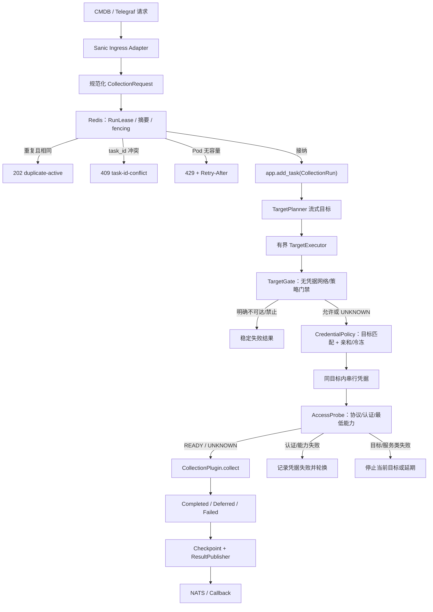

# Stargazer 无状态异步采集：AI 任务交接

更新时间：2026-08-06  
当前分支：`codex-stargazer-stateless-async-collection`  
工作区状态：存在大量未提交改动；其中既包含本轮预检改造，也包含此前已合并到该工作区的异步化改造。继续工作前不得 reset、全仓格式化或覆盖这些改动。

## 1. 任务目标与当前结论

本变更要把 Stargazer 从 ARQ 队列/固定 Worker 槽位模型，升级为由 Sanic 承载的无状态统一异步采集运行时：

- HTTP 入口以调用方提供的 `task_id` 做跨 Pod 重入检测；
- 一个 `task_id` 对应一个 `CollectionRun`，每个目标是一个逻辑任务；
- 不再生成全局 `IP × 凭据` 任务，目标之间并行、同一目标内凭据串行轮询；
- 配置采集和 `monitor_plugins` 共享同一运行时；
- 无凭据 `TargetGate` 先做地址、策略和网络条件检查；
- 有凭据 `AccessProbe` 再做协议、认证和最低采集能力检查；
- 原生异步插件直接 `await`；暂时不能异步化的同步 SDK 在插件内部显式使用 `asyncio.to_thread()`，运行时不维护同步插件线程池；
- Redis 只去除 ARQ 队列职责，仍可保留租约、fencing、重入、断点、凭据亲和/冷冻和 callback 上下文；
- 所有网络边界必须设置真实协议超时，运行时再施加外层超时；
- 服务本身保持无状态，通过 Pod 横向扩容提升不同采集运行的吞吐。

当前代码已搭好统一 `AccessProbe` 框架，并为 SSH、MySQL、PostgreSQL、InfluxDB 和 IP 扫描提供了实际适配。未实现协议探针的插件会安全返回 `UNKNOWN` 并继续正式采集，不会被误判为 `READY`，但也暂时得不到采集前过滤和凭据预验证的收益。

## 2. 必读事实源

继续实现前，必须按以下顺序核对事实，不能根据聊天记录补实现：

1. [`spec.md`](./spec.md)：本变更唯一功能事实源，含测试方案 §1–§3 和验收标准；
2. [`CONTEXT.md`](../../../CONTEXT.md)：领域和长期架构约束；
3. [`backend-engineering.md`](../../capabilities/backend-engineering.md)、[`platform-security.md`](../../capabilities/platform-security.md)、[`platform-reliability.md`](../../capabilities/platform-reliability.md)、[`engineering-quality.md`](../../capabilities/engineering-quality.md)：后端、安全、可靠性和质量红线；
4. 当前代码和测试：最终证据优先于历史方案和本交接文档；
5. [`ip-preflight-and-credential-cooldown-review-2026-08-06.md`](./ip-preflight-and-credential-cooldown-review-2026-08-06.md)：IP 预检和凭据冷冻复审；
6. [`snmp-256-timeout-load-test-report.md`](./snmp-256-timeout-load-test-report.md)：256 目标 SNMP 超时负载测试记录。

## 3. 已锁定的设计决定

### 3.1 任务和并发模型

- 一个 `CollectionRun` 包含多个 `TargetCollection`。
- 不同目标通过有界窗口并发，窗口值可配置；`200` 只是测试场景，不是固定部署约束。
- 同一目标内只串行尝试与该目标匹配的候选凭据。
- 凭据失败后不得回到全局队尾，也不得把同一目标的多个凭据并行打向设备。
- 目标通过预检后立即进入采集，不等待整个网段预检结束。
- Sanic handler 只做校验、租约/重入、容量接纳和顶层后台任务注册，不在 HTTP 请求内等待全量扫描。

### 3.2 异步边界

- 运行时只接受异步插件契约，不再引入 `SyncPluginAdapter`、`threaded_collect` 或专用线程池。
- 同步插件可以保留同步实现，但其公开异步入口必须显式 `await asyncio.to_thread(...)`。
- 禁止把 Redis、目标预检、凭据策略、正式采集和结果发布组成的整个目标任务一起塞进线程。
- `to_thread()` 只是把阻塞从事件循环隔离出去，不能终止已经运行的线程。因此同步 SDK 自身必须设置连接/读取超时，不能只依赖外层 `asyncio.timeout()`。
- CPU 密集工作仍需隔离；目标并发窗口也要限制等待默认线程池的包装异步任务数量。

### 3.3 两级预检

`TargetGate` 与 `AccessProbe` 必须保持职责分离：

| 层级 | 是否使用凭据 | 负责内容 | 不负责内容 |
| --- | --- | --- | --- |
| `TargetGate` | 否 | 地址解析、出站策略、确定性网络条件、必要的 TCP/TLS 基础检查 | 登录、权限、最低采集能力；不能以 ICMP 失败直接淘汰目标 |
| `AccessProbe` | 是 | 协议握手、认证、最小只读能力检查、稳定错误分类 | 完整采集、写操作、昂贵枚举 |

特别注意：SNMP 使用 UDP。仅创建或连接 UDP socket 不能证明目标在线、161 端口可用或 community 正确，因此通用 `TargetGate` 对 UDP/SNMP 必须返回 `UNKNOWN`，真实 SNMP 预检应由协议 Adapter 发起最小 SNMP GET 并等待有效响应。

### 3.4 Redis 与无状态含义

“无状态”不是“完全不使用 Redis”。Redis 可继续保存：

- `RunLease`、owner、TTL 和 fencing token；
- `task_id` 重入和请求摘要；
- `TargetCheckpoint`；
- 凭据亲和与冷冻状态；
- Host Remote 等延迟完成的 callback 上下文。

不得恢复 ARQ 的排队、Worker 或任务消费职责。

## 4. 当前数据流



配置采集和 `monitor_plugins` 仅入口参数及结果发布契约不同，不能分裂成两套调度、预检或容量体系。

## 5. 本轮已实现的代码

### 5.1 AccessProbe 核心框架

- `agents/stargazer/core/target_collection_executor.py`
  - 增加 `AccessProbeStatus`、`AccessProbeResult`、`AccessProbe` 和默认 `UnknownAccessProbe`；
  - 每个候选凭据先探测，再决定采集、轮换、延期或终止目标；
  - 探针异常只影响当前目标，返回稳定 `access_probe_error`，不得泄露异常文本和凭据；
  - 探针超时按 `NO_RESPONSE` 处理，允许轮换凭据但不冷冻凭据。
- `agents/stargazer/core/collection_application.py`
  - 解析一次插件；插件实现 `probe` 时作为 `AccessProbe` 传入，否则使用默认 `UNKNOWN`。
- `agents/stargazer/core/collection_plugins.py`
  - 配置采集通过 `CollectionService.probe()` 进入注册执行器；
  - Monitor collector 若有公开 `probe` 则调用，没有则返回 `UNKNOWN`。
- `agents/stargazer/service/collection_service.py`
  - 增加公开异步 `probe()`，复用与正式采集相同的注册执行器。
- `agents/stargazer/core/plugin_executor.py`
  - 增加公开异步 `probe()`；加载同一 collector，准备 job `script_path`，校验返回类型。
- `agents/stargazer/core/collection_metrics.py`
  - 增加探针耗时、总数、超时和错误指标。

### 5.2 结果分类和调度语义

| `AccessProbeStatus` | 当前行为 |
| --- | --- |
| `READY` | 进入正式采集 |
| `UNKNOWN` | 兼容尚无真实探针的插件，进入正式采集 |
| `AUTH_FAILED` | 记录凭据失败/冷冻并尝试下一个匹配凭据 |
| `CAPABILITY_DENIED` | 当前同样记录失败/冷冻并尝试下一凭据；是否与认证失败使用同一冷冻周期仍需产品确认 |
| `NO_RESPONSE` | 尝试下一凭据，不冷冻凭据 |
| `TARGET_UNREACHABLE` | 停止当前目标，标记不可达 |
| `RATE_LIMITED` | 当前目标延期 |
| `SERVICE_UNAVAILABLE` | 停止当前目标，不做凭据放大 |
| `TLS_VALIDATION_FAILED` | 停止当前目标，不做凭据放大 |
| `PROTOCOL_MISMATCH` | 停止当前目标，不做凭据放大 |
| `MISCONFIGURED` | 停止当前目标，不做凭据放大 |

所有外部错误必须用字面量稳定错误码表达；日志、结果和指标标签不得包含密码、community、token、私钥或未经清洗的底层异常。

### 5.3 凭据选择与摘要

- `agents/stargazer/core/credential_policy.py`
  - 增加目标匹配凭据过滤；支持凭据中的精确 `target_host` 或 `host` 绑定；
  - 绑定到某目标的凭据不得用于其他目标；
  - 重试时间只考虑当前目标的匹配凭据。
- `agents/stargazer/core/collection_runtime.py`
  - 请求摘要纳入非敏感的目标绑定字段；绑定变化会改变摘要，秘密仍被排除。

当前只支持精确 host 绑定，尚未实现 CIDR、标签或通用 selector。

### 5.4 TargetGate 修正

- `agents/stargazer/core/preflight.py`
  - HTTP 探测遵循 `base_url` 的实际 scheme/port，不再对裸 host 强制推断为 HTTPS/443；
  - TLS 证书失败使用稳定 `tls_validation_failed`；
  - UDP/SNMP 通用门禁保持 `UNKNOWN`，不伪造“UDP 端口可达”结论。

### 5.5 已有真实协议探针

| 插件/协议 | 已实现的最小探针 |
| --- | --- |
| SSH / Job | 通过 NATS `ssh.execute.<node>` 执行只读无副作用命令 `true`，携带 `connection_test=True`；本地节点直接 `READY` |
| MySQL | 登录后执行最小 `SHOW GLOBAL VARIABLES LIKE 'version'`，区分 1045 认证失败且不泄密 |
| PostgreSQL | 登录后执行 `SHOW server_version` |
| InfluxDB | `/health`、v1 `/ping` 或 token `/api/v2/config`，区分认证、权限、限流、服务、TLS、超时和协议不匹配 |
| IP Discovery Scanner | 返回 `READY`，因为扫描器本身已执行有界探测，避免重复扫网 |

这些同步 SDK 的探针通过插件内部 `asyncio.to_thread()` 隔离，相关测试包含事件循环心跳断言。

### 5.6 异步链路相关改造

当前工作区还包含此前阶段的异步契约、yaml reader、配置与 monitor collector 包装异步等改动。需要以 `git diff` 和当前测试逐文件审查，不要假设所有 `async def` 都已经完成真实异步化。特别要区分：

- 原生异步 IO；
- 插件内部 `to_thread()` 包装的假异步；
- 只有异步函数外壳但仍直接调用同步 IO 的错误实现。

## 6. 尚未完成的关键工作

### P0：补齐高价值协议 AccessProbe

框架已完成，但以下内置/厂商 collector 尚无真实 `probe()`，目前走 `UNKNOWN → 正式采集`：

1. SNMP：在 `SnmpFacts` 里做最小只读 GET，并验证响应、community 和协议版本；不得使用裸 UDP connect 代替；
2. Windows WMI：DCOM 登录加安全的最小查询，同时覆盖 `monitor_plugins` Host WMI 链路；
3. Oracle、MSSQL 及兼容数据库：登录加版本/身份类最小只读查询；
4. VMware、Redfish/BMC、OceanStor/其他存储 API：登录和最小只读资源查询；
5. Aliyun、QCloud、Huawei Cloud：调用最小身份或区域 API，区分认证、权限、限流和服务错误；
6. 其余 HTTP/API collector：根据协议增加真实响应检查，不能只以 TCP connect 判定凭据可用。

厂商 SDK 依赖在本地不可用时允许对应契约测试显式 skip，但不能用 skip 掩盖核心运行时测试失败。

### P1：减少重复连接和完善语义

- `AccessProbeResult.evidence` 已可返回证据，但正式 collector 多数尚未复用探针建立的 session/连接，因此成功探针后通常会再次登录；应只在真实重复明显时为具体插件局部复用，不要先设计通用 Driver/Session 框架。
- 明确 `CAPABILITY_DENIED` 是否应使用与 `AUTH_FAILED` 相同的 1h/4h/24h 冷冻周期；当前实现相同。
- Monitor Host Remote 当前在 responder TargetGate 后仍可能为 `UNKNOWN`；需要在 responder 侧补凭据/协议探针，同时保留 callback/fencing 语义。
- 如有真实需求，再扩展凭据目标 selector 到 CIDR/标签；不要预先设计通用规则引擎。
- 继续审计插件，确保同步 IO 没有直接运行在事件循环中。

## 7. TDD 继续方式

此前用户已经确认测试设计，继续工作必须遵循“一次一个 seam”：

1. 读取事实源和当前实现；
2. 选择一个公开边界；
3. 先写一条失败测试，Given/When/Then 只断言行为、字面量结果或稳定错误码；
4. 运行测试确认真实 Red，而不是导入错误或测试自身错误；
5. 做最小生产实现；
6. 跑本 seam 和完整相关链路，确认 Green；
7. 必要时小范围重构，再次验证；
8. 再进入下一个 seam。

测试禁止：

- 断言 private 方法、内部 call count 或调度实现细节；
- 为凑覆盖率写无业务意义测试；
- 用内部 mock 代替完整公开链路；
- 将真实阻塞插件伪装成异步。测试中的坏插件调用 `time.sleep()` 时，事件循环心跳必须失败；使用 `asyncio.to_thread()` 包装后心跳必须继续；
- 在断言或失败信息中写入真实秘密。

推荐下一位 AI 从“SNMP 或 Windows WMI 的公开 `probe()` 契约”二选一开始。SNMP 是本轮争议的直接来源；Windows WMI 则能优先覆盖 `monitor_plugins` 共享链路。每次只做一个协议，不要一次批量改完所有厂商插件。

## 8. 验证命令与最新证据

### 8.1 需求固定命令

README 指定命令如下：

```bash
cd agents/stargazer
uv run pytest -q -o addopts='' \
  tests/test_collection_runtime.py \
  tests/test_target_collection_executor.py \
  tests/test_redis_collection_state.py \
  tests/test_async_plugin_contract.py \
  tests/test_collection_load.py

uv run pytest -q -o addopts='' \
  tests/test_collection_service_async.py \
  tests/test_yaml_reader_async.py \
  tests/test_native_async_boundaries.py
```

当前机器没有安装 `uv`，用户已明确允许跳过“README 固定命令不可执行”问题。实际使用项目 `.venv` 执行了等价测试。

### 8.2 本轮完整相关链路

```bash
cd agents/stargazer
.venv/bin/pytest -q -o addopts='' \
  tests/test_collection_runtime.py \
  tests/test_collection_request_builder.py \
  tests/test_preflight.py \
  tests/test_target_collection_executor.py \
  tests/test_credential_policy.py \
  tests/test_redis_collection_state.py \
  tests/test_collection_plugins.py \
  tests/test_async_plugin_contract.py \
  tests/test_collection_load.py \
  tests/test_collection_service_async.py \
  tests/test_yaml_reader_async.py \
  tests/test_native_async_boundaries.py \
  tests/test_influxdb_info.py \
  tests/test_collection_end_to_end.py
```

最新结果：`92 passed, 1 skipped, 1 warning in 14.05s`。skip 是未配置真实厂商 SNMP 环境。

相关测试在 coverage 下（负载测试单独运行）结果为 `91 passed, 1 skipped`，本次 diff coverage 为 `81.9% (253/309)`。`test_collection_load.py` 在 coverage 插桩下曾因事件循环最大延迟约 110 ms 失败；不加 coverage 时通过，约 0.13 秒。不要把 coverage 插桩下的负载结果当作生产性能结论。

其他验证：

- 目标改动文件 `flake8 --max-line-length=150 --extend-ignore=E203,W503`：通过；
- `git diff --check`：通过；
- 未执行全仓 Black 格式化，避免改写脏工作区中的用户/历史改动。

### 8.3 已知仓库基线问题

以下失败不属于本变更，但继续测试时会遇到：

- 全量 pytest 在收集阶段被 `common/cmp/cloud_apis/resource_apis/sync_cloud_resource/test_sync.py` 缺少 `home_application` 阻塞；
- `pytest tests --ignore=tests/collect_fixtures` 为 `399 passed, 1 skipped, 1 failed`，失败是 `test_windows_wmi_metrics_config.py::test_windows_wmi_metrics_expose_telegraf_aligned_network_rates`：期望 dimensions 为 `["interface"]`，实际为 `[{"name": "interface"}]`；
- `tests/collect_fixtures` 存在既有失败，已确认其中 `test_catalog.py::test_mssql_in_model_specs` 因 MSSQL 不在 `MODEL_SPECS` 失败；不要在没有重新运行的情况下推断其余失败数量或原因。

处理新测试失败前，要先证明它由本次变更引入；不要顺手修复这些无关基线问题。

## 9. 交接后的安全操作顺序

```bash
git branch --show-current
git status --short
git diff --stat
git diff --check
```

确认分支应为 `codex-stargazer-stateless-async-collection`。随后：

1. 阅读本交接文档和 `spec.md`；
2. 查看 `git diff`，识别哪些文件已经有用户/历史改动；
3. 运行 §8.2 的现有相关测试，建立新鲜基线；
4. 选一个 P0 协议，从公开 `probe()` seam 开始 TDD；
5. 同时验证完整 HTTP → Redis → Runtime → TargetGate → CredentialPolicy → AccessProbe → collect → NATS/callback 链路；
6. 更新 `spec.md`、协议矩阵和测试证据；
7. 交付前再次跑相关测试、`git diff --check` 和秘密扫描。

## 10. 明确禁止的回退或过度设计

- 不得重新引入 ARQ、Celery、Joblib 或其他队列/Worker 模型；
- 不得把 `IP × 凭据` 展开成全局任务；
- 不得把 ICMP 失败作为硬过滤条件；
- 不得把 UDP socket connect 当作 SNMP 可达或凭据有效；
- 不得因 `NO_RESPONSE` 冷冻凭据；网络无响应不能证明凭据错误；
- 不得在目标/服务类故障上遍历全部凭据制造放大流量；
- 不得记录 secret、community、token、密码、私钥或原始 SDK 异常；
- 不得建立运行时同步插件专用线程池或恢复 `threaded_collect`；
- 不得为了统一外观先建立通用 Session/Driver/探针框架；只为已经存在的重复实现抽象；
- 不得全仓格式化、reset 或覆盖当前脏工作区；
- 不得把厂商测试 skip、coverage 数字或 mock 负载测试描述成真实生产设备验证。

## 11. 完成定义

此任务整体完成至少要求：

- ARQ 队列职责从采集链路移除，Sanic 统一异步运行时成为唯一执行链路；
- 配置采集和 `monitor_plugins` 共享运行时且完整链路测试通过；
- 目标并发有界、同目标凭据串行、重入/fencing/断点行为稳定；
- 关键内置协议拥有真实 `AccessProbe`，其余协议明确 `UNKNOWN`，不存在伪阳性网络判断；
- 认证失败、能力不足、无响应、目标不可达、服务故障、TLS、协议不匹配、限流均有稳定分类；
- 事件循环心跳测试能阻止阻塞插件进入主链路；
- 不泄密，所有外部 IO 有真实超时；
- 需求固定测试与优先 seam 测试通过，diff coverage 不低于用户要求的 80%；
- 性能结果明确区分 mock、实验室真实设备和生产环境，资源占用与耗时有可复现报告。

当前状态是“核心架构和探针框架已落地、相关链路测试通过、协议适配仍需逐项补齐”，不要将其表述为所有厂商采集链路已经完成。
