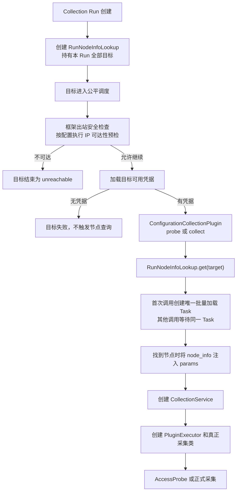

# Stargazer Job 采集节点信息 Run 级预加载方案

更新日期：2026-08-19
适用变更：`stargazer-stateless-async-collection`
状态：**Implemented / 待生产压测验收**

> 本文记录已实施的设计和验收证据。已确认的生产并发候选值继续保持
> `MAX_ACTIVE_RUNS=16`、`MAX_ACTIVE_TARGETS=150`、`TARGET_TASK_WINDOW=150`，
> 本方案不调整这三个参数，也不新增插件容量组。

## 1. 背景与现状

Job 类型配置采集需要根据目标是否为已纳管 Node，决定真正采集类走本地节点执行还是 SSH：

```text
有 node_info  → local.execute.{node_id}
无 node_info  → ssh.execute.{node_id}
```

改造前的 `CollectionService` 按单个目标、单次凭据尝试实例化；正式采集在解析 YAML
执行器后调用 `set_node_info()`，再实例化 `PluginExecutor`。因此节点信息查询可能按以下规模放大：

```text
节点查询次数 ≈ Target Collection 数 × Credential Attempt 数
```

例如一个 Collection Run 包含 100 个 IP，每个 IP 最多尝试 3 个凭据，最坏可能产生
约 300 次 `bklite.node_list` 请求。当前接口还是 `ip__icontains + page_size=1` 的单 IP
模糊查询，不具备可靠的批量精确查询能力。

改造前的关键调用链：

```text
Collection Run
  → Target Collection
    → 框架 IP/出站预检
    → Credential Attempt
      → ConfigurationCollectionPlugin.probe()/collect()
      → 创建 CollectionService
      → CollectionService.set_node_info()
      → 创建 PluginExecutor
      → 创建并执行真正采集类
```

## 2. 目标

1. Job 类型采集在框架 IP/出站预检之后、凭据 AccessProbe 和正式采集之前准备
   `node_info`。
2. `node_info` 在创建 `CollectionService`、`PluginExecutor` 和真正采集类之前注入。
3. 同一个 Collection Run 内的全部目标和全部凭据尝试共享一次逻辑节点信息加载。
4. 100/150 个 IP 的常规任务只产生一次物理节点信息 RPC。
5. 多个目标并发首次访问时只创建一个加载任务，不发生请求穿透。
6. 单目标取消不得取消共享加载；整个 Run 取消或应用关闭时必须终止共享加载。
7. 查询失败、节点缺失或节点身份不明确时继续回退 SSH，不阻断采集，也不逐目标补查。
8. 不在 Redis 或进程全局缓存节点信息，不跨 Run、组织或租户复用。
9. Protocol、SNMP、VMware 和云采集等非 Job 路径不触发节点信息加载。

## 3. 非目标

- 不修改 `16/150/150` 全局并发配置；
- 不新增 Job、SNMP 或节点查询专属生产并发参数；
- 不等待全部目标预检完成后再开始采集；
- 不为节点信息建立 Redis 缓存、磁盘缓存或跨 Run TTL 缓存；
- 不改变凭据匹配、亲和、冷冻和轮换语义；
- 不把关闭预检解释为关闭出站安全检查；
- 不保证超过单批上限的超大 Run 只有一次物理 NATS RPC；
- 不在本变更中处理 Node IP 数据唯一性迁移。

## 4. 已确认设计

### 4.1 执行时序

采用“预检后、首次需要时、Run 级懒加载”，不采用“等待全部目标预检完成”的全局屏障：



这条时序保留当前流式、公平调度：已经通过预检的目标不用等待最慢目标；如果全部目标都在
框架预检阶段失败，则不会查询节点信息。

关闭可达性预检时仍执行出站安全检查，之后直接进入 Run 级节点信息加载与正式采集：

```text
开启预检：出站安全检查 → 可达性预检 → node_info → AccessProbe → collect
关闭预检：出站安全检查 → node_info → collect
```

### 4.2 模块与 seam

新增一个 Run 级深模块 `RunNodeInfoLookup`。其外部 interface 保持最小：

```python
node_info = await lookup.get(target, connect_host=validated_connect_host)
await lookup.close()
```

模块内部隐藏：

- 首次加载的 Singleflight 并发控制；
- 目标 IP 规范化和去重；
- 有界分批和 NATS 请求；
- `IP → node_info` 映射；
- missing、ambiguous 和 failed 结果缓存；
- 单目标取消隔离与 Run 关闭清理；
- 查询耗时、命中率和失败指标。

推荐由每个 `ConfigurationCollectionPlugin` 实例持有一个 `RunNodeInfoLookup`，因为当前
`UnifiedPluginFactory.resolve(request)` 在每个 Collection Run 中只创建一个配置采集插件，
而 `CollectionService` 会按目标和凭据尝试重复创建。

通用 `TargetCollectionExecutor` 不感知 `node_info`，避免把 Job 特有知识放入所有采集类型
共用的执行框架。

### 4.3 Singleflight 并发控制

`RunNodeInfoLookup` 使用 `asyncio.Lock + 共享 Task + double-check`：

```python
async def get(self, target, *, connect_host=""):
    task = self._load_task
    if task is None:
        async with self._lock:
            if self._load_task is None:
                self._load_task = asyncio.create_task(self._load_all())
            task = self._load_task

    node_map = await asyncio.shield(task)
    return node_map.get(self._lookup_ip(target, connect_host))
```

约束：

1. 锁只保护共享 Task 的创建，不在锁内等待 NATS；
2. 150 个并发目标只能观察到同一个 `_load_task`；
3. 首个目标只是触发加载，查询范围在 Run 创建时由不可变请求确定，不使用首个目标的凭据；
4. 单个等待者取消时使用 `asyncio.shield()`，不得取消共享 Task；
5. 整个 Run 取消或应用关闭时调用 `close()`，显式取消并等待共享 Task；
6. 查询异常在 `_load_all()` 内收敛为失败结果并缓存，后续目标不得自动重新初始化；
7. 如需重试，只能在 `_load_all()` 内做一次 Run 级有限重试，禁止每个目标独立重试。

初始实施推荐不自动重试节点信息查询：节点信息是执行路径优化信息，不是采集准入条件；查询
失败直接回退 SSH，可以避免 node_mgmt 或 NATS 故障时形成重试风暴。

### 4.4 插件集成位置

`ConfigurationCollectionPlugin.probe()` 和 `collect()` 在创建 `CollectionService` 前执行同一段
Job 参数增强：

```text
构造单目标 params
  → executor_type != job：不处理
  → executor_type == job：await lookup.get(...)
  → 写入 node_info（若找到）
  → 创建 CollectionService(params)
```

必须同时覆盖 `probe()` 和 `collect()`。否则 AccessProbe 可能走 SSH，而正式采集走本地节点，
造成探测路径与正式执行路径不一致。

### 4.5 CollectionService 唯一入口

批量查询存在“找到”“未找到”“查询失败”三种结果。`CollectionService` 不再持有节点查询职责，
也不再调用旧的 `bklite.node_list`：

```text
存在 node_info → 本地节点执行
不存在 node_info → 使用原 node_id 回退 SSH
```

因此不再需要 `_runtime_node_info_resolved` 内部标记，也不存在逐目标查询兼容链路。绕过统一运行
时直接调用 `CollectionService.collect()` 的调用方必须自行传入已解析的 `node_info`，或者接受
无 `node_info` 时的 SSH 回退行为。

## 5. 服务端批量查询契约

### 5.1 新增专用 NATS 方法

不复用当前面向列表展示的 `node_list`，新增精确、精简的内部查询：

```text
bklite.get_nodes_by_ips
```

概念请求：

```json
{
  "ips": ["10.0.0.1", "10.0.0.2"],
  "collect_task_id": 91,
  "cloud_region_id": 1
}
```

概念响应只返回 Job 执行需要的字段：

```json
{
  "nodes": [
    {
      "id": "node-id",
      "ip": "10.0.0.1",
      "operating_system": "linux"
    }
  ]
}
```

服务端使用 Django ORM 精确过滤 `ip__in`，不得使用 raw SQL；沿用并收紧现有组织、云区域和
权限范围，批量接口不得成为跨组织枚举节点的旁路。NATS 方法不接受调用方指定
`organization_ids`、`skip_permission` 或 `permission_data`，而是用 `collect_task_id` 从服务端
可信采集任务记录解析 Job 类型和组织范围。调用沿用 Stargazer 现有 NATS
`nats_request` 的 `args/kwargs` RPC 封包和 Server `nats_client.register` 处理方式，不增加
另一套业务层签名协议。调用方身份继续交给现有 NATS 连接凭据与 subject ACL，
不信任消息体声明的身份或权限。任务不存在、不是 Job 或缺少组织范围时均 fail-closed。

### 5.2 输入与响应边界

- IP 去重、规范化，拒绝非字符串和超长输入；
- 单批固定最多 500 个 IP，与当前节点列表默认安全上界一致；
- 空 IP 集合直接返回空结果；
- 只序列化 `id/ip/operating_system`，不返回 metrics、status、tags 等完整 Node 内容；
- Stargazer 对超过 500 个 IP 的 Run 做有界分批；
- 单批 NATS 超时初始为 10 秒；
- 整个 Run 节点信息加载总预算初始为 15 秒，超出后未完成批次记为 failed 并回退 SSH；
- 批次初始按顺序处理，不一次创建全部批次 Task；后续只有压测证明需要时才考虑有界并行。

物理请求数量：

| Run 中规范化 IP 数 | 逻辑加载次数 | 物理 NATS RPC |
| ---: | ---: | ---: |
| 100 | 1 | 1 |
| 150 | 1 | 1 |
| 500 | 1 | 1 |
| 3000 | 1 | 6 |
| 10000 | 1 | 20 |

不把 10000 个目标强制放进一条消息，避免超过 NATS payload、放大 JSON 编码内存或形成超大
数据库 `IN` 查询。

### 5.3 IP、域名和重复节点

本方案对任务目标为字面量 IPv4/IPv6 的 Job 采集提供“一批一次”保证，这覆盖当前主机 IP
批量采集场景。

域名目标必须先使用框架出站检查返回的 `validated_connect_host`，再在 Run 内按解析后的 IP
去重查询。由于其他目标的域名在各自预检前尚未解析，域名任务不承诺整个 Run 只有一次物理
RPC，但相同解析 IP 在本 Run 内不得重复查询。不得为追求单次 RPC 而绕过出站解析和安全校验。

当前 `Node.ip` 没有数据库唯一约束。同一组织和云区域过滤后若一个 IP 仍对应多个 Node：

- 不随机选择第一条；
- 将该 IP 标记为 `ambiguous`；
- 当前 Target Collection 回退 SSH；
- 记录汇总数量，不在普通日志打印完整节点内容。

## 6. 凭据与失败语义

共享范围仅包含：

```text
IP → node_info / missing / ambiguous / failed
```

以下状态继续按目标独立维护：

```text
凭据匹配
凭据亲和
凭据冷冻
Credential Attempt 顺序
采集和发布结果
```

失败策略：

| 场景 | 行为 |
| --- | --- |
| Node 找到 | 带 `node_info` 实例化采集链路，走 local 执行 |
| Node 未找到 | 缓存 missing，走 SSH，不再单台补查 |
| Node 重复且无法消歧 | 缓存 ambiguous，走 SSH |
| 单批节点查询超时/异常 | 该批缓存 failed，走 SSH，不影响其他批次 |
| 单目标等待期间取消 | 取消该目标，保留共享加载 |
| 整个 Run 取消/关闭 | 取消共享加载并等待清理 |
| 凭据认证失败后轮换 | 复用同一 node_info，不重新查询 |

节点信息查询失败不得把 Target Collection 标记为失败，也不得取消 Collection Run；真正的
SSH/local 执行结果仍决定采集状态。

## 7. 可观测性

每个发生 Job 节点加载的 Collection Run 输出一条汇总日志：

```text
event=job_node_info_lookup
task_id=...
targets=150
unique_ips=150
found=140
missing=8
ambiguous=2
failed=0
rpc_calls=1
duration_ms=85
status=completed
```

批次失败单独记录：

```text
event=job_node_info_batch_failed
task_id=...
batch_size=500
batch_index=2
error_type=TimeoutError
```

日志不得包含凭据、完整请求参数、节点 metrics/status 或批量 IP 明细。

建议指标：

```text
job_node_info_lookup_total
job_node_info_lookup_rpc_total
job_node_info_lookup_target_total
job_node_info_lookup_found_total
job_node_info_lookup_missing_total
job_node_info_lookup_ambiguous_total
job_node_info_lookup_failure_total
job_node_info_lookup_duration_seconds
```

现有三分钟容量日志和 `16/150/150` 并发指标保持不变。

## 8. 预计代码影响范围

实施时预计只修改以下范围，最终以当时当前代码为准：

| 范围 | 预计职责 |
| --- | --- |
| `agents/stargazer/core/collection/` | 新增 Run 级节点信息加载模块；配置插件接入共享加载器 |
| `agents/stargazer/core/collection/plugins.py` | 在 Job 的 probe/collect 创建 `CollectionService` 前注入节点信息 |
| `agents/stargazer/core/collection/application.py` | 在组合根注入真实节点批量查询 Adapter，并确保 Run 结束清理 |
| `agents/stargazer/service/node_info_loader.py` | 提供带组织范围的批量查询 Adapter |
| `agents/stargazer/service/collection_service.py` | 删除单目标节点查询职责；只消费上层已注入的 `node_info` |
| `server/apps/node_mgmt/nats/node.py` | 注册内部批量 IP 查询方法 |
| `server/apps/node_mgmt/services/node.py` | Django ORM 精确过滤、权限和输入边界、精简返回字段 |
| 两侧相关测试 | 行为、并发、取消、权限、失败和资源上界验证 |

不修改采集插件 YAML，不修改 Redis 池，不修改 NATS 发布协议，也不调整全局采集并发。

## 9. 实施顺序

实施应采用行为测试先行，每一步保持可独立验证：

1. **锁定服务端契约测试**：精确批量过滤、组织/云区域范围、500 上限、空输入、重复 IP。
2. **实现服务端批量查询**：新增 NATS 方法和 Node ORM 查询，确认只返回最小字段。
3. **锁定 Run 级并发测试**：150 个并发 `get()` 只调用一次批量 Adapter。
4. **实现 `RunNodeInfoLookup`**：Singleflight、失败缓存、shield、close、总超时和分批。
5. **锁定采集链路测试**：框架预检后、AccessProbe/collect 前注入；多凭据不重复查询。
6. **接入 Configuration 插件**：仅 Job 启用，Protocol/云采集不受影响。
7. **收敛 CollectionService 查询**：删除单目标查询和内部解析标记，未命中时只按原 `node_id` 回退 SSH。
8. **增加日志和指标**：验证不泄漏凭据和目标明细。
9. **运行 Stargazer、node_mgmt 定向测试和相关回归测试**。
10. **使用 100/150 IP 的 Job 采集压测**，验证 RPC 数量、事件循环停顿、NATS/Redis 压力和成功率。

## 10. 测试与验收矩阵

### 10.1 正确性与并发

1. 100 个字面量 IP 并发采集，节点批量 Adapter 只调用 1 次；
2. 150 个目标同时首次进入，只有一个 `_load_task`；
3. 同一 IP 依次尝试多个凭据，节点信息不重复查询；
4. `probe()` 与 `collect()` 竞争首次初始化时仍只加载一次；
5. 第一个等待者被取消，其他目标仍能得到共享结果；
6. 整个 Run 取消后，共享 Task 已取消并回收；
7. 查询失败后其他目标不重新初始化；
8. 不同 Collection Run 各自查询，不跨 Run 复用；
9. 未通过框架预检的目标不进入凭据和采集；全部目标均失败时节点 RPC 为 0；
10. 关闭可达性预检时仍经过出站安全检查，然后正常触发节点加载。

### 10.2 执行路径

1. 找到 Node 时，AccessProbe 和正式 collect 都使用相同 `node_info`；
2. 未找到、重复或查询失败时走 SSH，不执行单目标 `set_node_info()`；
3. `node_info` 在真正采集类实例化前可见；
4. 不再向真正采集类传递 `_runtime_node_info_resolved` 内部标记；
5. Protocol、SNMP、VMware、云采集不触发 Job 节点加载；
6. 直接调用 `CollectionService` 不会触发逐目标节点 RPC，只使用已注入的 `node_info` 或回退 SSH。

### 10.3 安全与资源边界

1. 未提供权限或组织范围且未显式允许的服务端请求 fail-closed；
2. 组织 A 不可查询组织 B 的节点；
3. 单批超过 500 个 IP 被明确拒绝；
4. 服务端不返回完整 Node 大字段；
5. 日志不包含密码、community、token、私钥或完整 IP 列表；
6. 10000 个目标不会一次创建全部批次 Task；
7. 节点加载总等待不超过 15 秒。

### 10.4 压测验收

在保持以下配置不变的情况下验证：

```env
MAX_ACTIVE_RUNS=16
MAX_ACTIVE_TARGETS=150
TARGET_TASK_WINDOW=150
```

100/150 个 IP 的 Job 任务应满足：

- 节点信息物理 RPC 为 1；
- 凭据轮换不会增加节点 RPC；
- 不出现节点查询请求风暴；
- 不增加明显事件循环停顿；
- 节点查询失败不扩大为 Run 取消；
- 与修改前相比，采集成功率不下降；
- 节点信息命中时 local 执行路径保持一致；
- 节点信息未命中时 SSH 回退保持一致。

## 11. 发布与回滚

建议先部署服务端批量查询，再部署 Stargazer；旧 Stargazer 不调用新 subject，因此服务端变更
向后兼容。

Stargazer 在批量 subject 不可用或查询失败时必须回退 SSH，所以灰度期间不会因为版本顺序
阻断正式采集。若生产验证异常，回滚 Stargazer 即恢复原单目标查询路径；服务端新增的只读
批量方法可以保留，也可以随后移除。

回滚不得改变凭据状态、Redis 租约或 NATS 结果发布数据。

## 12. 实施结果与验证

已按用户授权完成实现，当前状态为 `Implemented / 待生产压测验收`：

- 同 Run 的字面 IP 通过共享 Task 批量查询，域名解析后的 IP 在同 Run 内去重并串行受总预算约束；
- missing、ambiguous、failed 分开缓存和计数，失败不会触发逐目标补查；
- 单批最多 500 个 IP，Run 总预算 15 秒；
- 每个实际发生节点加载的 Run 在关闭时输出一条汇总日志；
- NATS 查询必须绑定服务端存在的 Job 采集任务，组织范围由服务端任务记录解析，消息参数不能
  指定组织或开启权限旁路；
- 节点查询复用现有 NATS `args/kwargs` RPC 契约，不要求额外的节点查询专用密钥；
- 全局并发继续保持 `16/150/150`，本次未改动 Redis 池、NATS 发布协议或插件 YAML。

新鲜验证（2026-08-19）：

- Stargazer 节点加载、插件、执行器、生命周期和健康指标定向回归：`80 passed`；
- node_mgmt 服务、NATS handler、权限和输入边界回归：`72 passed`；
- Python 编译、格式和 diff 空白检查通过。

剩余验收项是使用真实 100/150 IP Job 任务做生产等价压测，确认一次物理 RPC、事件循环停顿、
NATS/Redis 压力和最终采集成功率。该压测结果不通过前，不将状态升级为生产验收完成。
