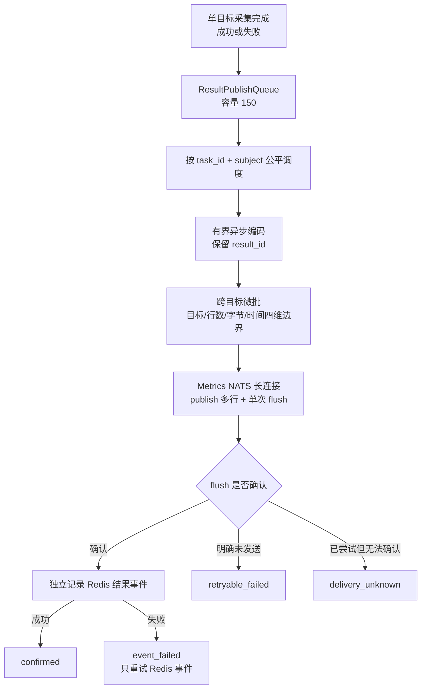

# Stargazer NATS 结果发布最终治理方案

更新日期：2026-08-17
适用变更：`stargazer-stateless-async-collection`
状态：**Implemented / 已实施，待生产压测验收**

> 本文补充并替代同目录 `collection-failure-remediation-plan-2026-08-14.md`
> 中“6. P1：有界结果发布”以及 `PUBLISH_TIMEOUT` 覆盖队列等待、发送和 flush
> 全阶段的设计。其余已确认结论保持不变，特别是全局并发继续使用
> `MAX_ACTIVE_RUNS=16`、`MAX_ACTIVE_TARGETS=150`、`TARGET_TASK_WINDOW=150`。

## 1. 背景与证据

2026-08-17 新采集日志覆盖约 39 分钟，共收到 16 个采集请求并启动 2966 台网络设备采集。
日志中出现 155 个 `result_publish_unknown`，其中 147 个集中在同一个任务，数量接近
`TARGET_TASK_WINDOW=150`。同时出现 NATS 共享连接 `TimeoutError` 和后续重新建连。

代码复核表明，当前 `result_publish_unknown` 可能混合三种不同情况：

1. 结果仍在发布队列中，排队超过 30 秒，尚未真正调用 NATS；
2. 已调用 NATS `publish()`，但在 `flush()` 前后发生异常，投递状态确实无法确认；
3. NATS 已经成功，后续 Redis 结果事件记录失败，但异常仍被执行器归入 `unknown`。

当前所谓批量发布会从队列提取最多 50 个目标，但实现内部仍按目标串行编码、逐目标
`flush()`。因此它只批量取数，没有形成真正的跨目标 NATS 微批；一个大结果也会阻塞
同一 writer 后面的其他任务和插件。

## 2. 已确认决策

1. 采集成功和采集失败的结果都在**单目标完成后立即入队**，不等待整个 Run 完成。
2. 成功和失败结果都按 NATS subject 做微批汇聚；失败结果不再逐台 `flush()`。
3. 保持现有消息格式：一行 Influx Line Protocol 仍是一条 NATS 消息；不把多台设备拼成
   一个新的大 JSON 消息，避免破坏消费端协议。
4. 多台设备、多行消息共享一次有界 `flush()`，降低 NATS 往返和 TLS 连接压力。
5. 每台设备继续携带包含 `attempt_id` 的稳定 `collection_result_id`，同一周期任务的不同采集轮次不会碰撞；批量发送后仍逐设备返回结果。
6. 一台设备或一个 chunk 失败不得取消同批其他设备，也不得取消 Run 剩余目标。
7. 只有已经调用过 NATS `publish()`、但无法确认 `flush()` 的结果才是
   `delivery_unknown`；尚未发送的结果必须可安全重试。
8. NATS 指标发送与 Redis 结果事件记录拆成两个阶段；Redis 失败不得触发 NATS 指标重发。
9. 发布继续采用内存有界队列，不增加本地磁盘 spool，本阶段不切换 JetStream。
10. 不调整采集并发，不增加插件容量组或插件级并发参数，不修改 Redis 池并发。

## 3. 目标架构



执行器只依赖发布模块的外部 interface：

```python
receipt = await publisher.enqueue(request, result, lease)
outcome = await receipt.wait()
```

队列、编码、微批、连接恢复、超时、重试、部分失败归因和结果事件记录全部隐藏在发布模块
内部。执行器不再通过底层异常类型猜测是否投递。

## 4. 发布状态机与最终状态

### 4.1 内部阶段

```text
queued
  → encoding
  → ready
  → sending
  → flush_confirmed
  → recording_event
  → confirmed
```

内部必须记录是否至少成功调用过一次 NATS `publish()`。该事实不能通过普通
`TimeoutError` 或异常默认值推断。

### 4.2 对执行器暴露的结果

| 状态 | 含义 | 后续动作 |
| --- | --- | --- |
| `confirmed` | NATS flush 和结果事件都成功 | 完成 |
| `retryable_failed` | 能证明尚未发送 | 在总截止时间内有限重试 |
| `delivery_unknown` | 已尝试发送但无法确认 flush | 不盲目重发，记入任务错误 |
| `event_failed` | NATS 已确认，Redis 事件失败 | 只重试幂等结果事件 |
| `permanent_failed` | 非法数据、单行/单目标超限等永久错误 | 当前设备失败，不重试 |

Run 汇总继续区分采集与发布：

```text
targets_total
collection_succeeded
collection_failed
publish_confirmed
publish_retryable_failed
publish_unknown
publish_event_failed
publish_permanent_failed
```

除 `publish_confirmed` 外存在任一终态时，Run 为 `completed_with_errors`；单目标发布失败
不得将 Run 改成 `cancelled`，也不得取消剩余设备。

## 5. 成功与失败结果的微批规则

### 5.1 入队时机

每台设备结束正式采集后立即生成结果并入队：

```text
设备成功 → 结构化资产数据 → 入队
设备失败 → 一行结构化错误指标 → 入队
```

不得等待一个包含数百台设备的 Run 全部结束后再发布。等待整 Run 会增加延迟和内存占用，
并让慢设备拖住已经完成的设备。

### 5.2 汇聚键

微批按以下键组织：

```text
NATS subject + payload format version
```

成功和失败可以位于同一个 subject/chunk。每行必须保留：

```text
collection_task_id
collection_fence
collection_target
collection_plugin_ref
collection_result_id
collect_status
```

消费端继续通过这些字段区分设备和结果，不需要适配新的批量 JSON Schema。

### 5.3 flush 触发条件

一个微批满足任一条件即发送：

| 边界 | 初始值 |
| --- | ---: |
| 聚合等待时间 | 20ms |
| 目标数 | 50 |
| Influx 行数 | 1000 |
| UTF-8 总字节数 | 900KB |

低流量时最多等待 20ms，不为了凑满批次增加明显延迟。

### 5.4 成功结果

成功设备可能产生多行资产：

```text
设备 A：300 行
设备 B：120 行
设备 C：50 行
→ 同 subject 合并为 470 条独立 NATS 消息
→ 执行一次 flush
```

单台设备超过 chunk 边界时可以跨 chunk：

```text
设备 D：2500 行
→ 1000 + 1000 + 500 三个 chunk
```

只有包含该设备数据的全部 chunk 都确认后，设备 D 才能进入 `confirmed`。

### 5.5 失败结果

失败设备通常只有一行错误指标，必须和其他失败结果汇聚后发送，不能逐台 flush：

```text
失败设备 A：1 行
失败设备 B：1 行
失败设备 C：1 行
→ 连续 publish 3 条独立消息
→ 执行一次 flush
```

失败结果不等待整个 Run；它与成功结果一样遵循 20ms、50 目标、1000 行和 900KB 边界。

### 5.6 部分失败归因

每个 chunk 维护 `result_id → 行范围 → 是否尝试 publish → 是否 flush 确认` 的映射。

例如一个 chunk 含 200 台失败设备，在第 80 台附近发生连接异常：

- 已调用过 `publish()` 且无法确认 flush 的目标：`delivery_unknown`；
- 明确尚未调用 `publish()` 的目标：`retryable_failed`，允许安全重试；
- 之前已成功 flush 的 chunk：保持 `confirmed`；
- 后续设备继续处理，不把整个批次统一标成 unknown。

## 6. 公平调度与资源边界

### 6.1 跨任务和跨 subject 公平

发布器按 `(task_id, subject)` 建立内部逻辑 lane，并以 round-robin 每次发送一个 chunk：

```text
网络任务 A 一个 chunk
→ 主机任务 B 一个 chunk
→ 网络任务 C 一个 chunk
→ VMware 任务 D 一个 chunk
→ 回到任务 A
```

一个超大主机、网络或 VMware 结果不得连续占用 writer 直到全部发送完毕。

### 6.2 有界编码与内存

- 发布队列容量继续复用 `TARGET_TASK_WINDOW=150`，不新增发布队列容量参数；
- 编码使用最多 4 个内部后台任务，避免 CPU 编码阻塞事件循环；
- 预编码就绪区最多保留 4 个 chunk，按 900KB 上限计算约 3.6MiB；
- 单行继续限制为 900KB；
- 单目标初始限制为最多 100000 行、编码后最多 64MiB；
- 正式发送前完整扫描单目标编码结果，超限只产生当前目标
  `permanent_failed/result_too_large`，不能先发送部分 chunk，也不能影响其他目标。

单目标总量初始值需要在实施前用仓库内最大的 host、network、VMware 和云采集 fixture 验证；
如需调整，只调整数据安全上界，不引入插件级并发配置。

## 7. 超时与重试

新增并兼容以下配置：

```env
PUBLISH_QUEUE_TIMEOUT=60
PUBLISH_DELIVERY_TIMEOUT=30
PUBLISH_TOTAL_TIMEOUT=120
PUBLISH_MAX_ATTEMPTS=2
```

| 配置 | 计时范围 |
| --- | --- |
| `PUBLISH_QUEUE_TIMEOUT` | 等待有界发布队列接纳结果 |
| `PUBLISH_DELIVERY_TIMEOUT` | 实际开始 NATS 发送到 flush 完成 |
| `PUBLISH_TOTAL_TIMEOUT` | 从入队到最终发布状态的总边界 |
| `PUBLISH_MAX_ATTEMPTS` | 确认未发送时的最大尝试次数 |

兼容期若未设置 `PUBLISH_DELIVERY_TIMEOUT`，读取现有 `PUBLISH_TIMEOUT`，仍缺失时默认 30 秒。
旧 `PUBLISH_TIMEOUT` 不再同时代表队列、发送和事件记录三个阶段。

重试规则：

1. 排队超时、编码前失败、建连前失败均为 `retryable_failed`；
2. 只有 `retryable_failed` 在相同总截止时间内重试，默认总尝试 2 次；
3. 重试复用同一原始结果和固定发布时间戳，确定性重编码后保持 payload 字节不变；
4. 已确认 flush 的 chunk 不重复发送；
5. `delivery_unknown` 在没有消费端幂等保证前不自动盲目重发；
6. `event_failed` 只重试 Redis 事件，绝不重新发送 NATS 指标。

总截止时间到达时，回执先尝试在 transport 未触达前撤销队列项；撤销成功的结果不会晚发，
也不会记为 `delivery_unknown`。只有已经开始调用 NATS publish 的结果才进入 unknown 语义。

## 8. NATS 连接治理

### 8.1 自动重连

连接状态处理：

```text
connected    → 直接使用
reconnecting → 有界等待 nats-py 自动重连，不关闭旧连接
closed       → 创建新连接
```

不得因为 `is_connected=False` 就关闭正在自动重连的连接并创建新连接。业务等待仍受
`PUBLISH_DELIVERY_TIMEOUT` 和 `PUBLISH_TOTAL_TIMEOUT` 约束，不能无限等待。

### 8.2 控制流与指标流隔离

维护两条进程级共享长连接：

| 连接 | 用途 |
| --- | --- |
| control | request、callback、凭据结果和控制消息 |
| metrics | 成功/失败采集指标的微批发布 |

连接按用途复用，不按任务或设备创建。指标洪峰不得阻塞远程任务请求和 callback。

### 8.3 flush

NATS adapter 必须显式使用 delivery timeout：

```python
await nc.flush(timeout=delivery_timeout)
```

adapter 返回实际尝试的消息数量与 flush 是否确认，发布模块据此逐设备归因，不再使用
`getattr(error, "delivery_detected", True)` 作为默认判断。

## 9. NATS 与 Redis 结果事件拆分

NATS 指标发布和 Redis 凭据/结果事件是两个独立副作用：

```text
metrics flush confirmed
→ record result event
```

规则：

1. NATS 未确认时不记录“发布完成”事件；
2. NATS 已确认、Redis 失败时返回 `event_failed/result_event_record_failed`；
3. Redis 重试继续使用稳定 `collection_result_id + event_index`，保证幂等；
4. Redis 重试不得重新编码或重新发布 NATS 指标；
5. Redis 达到重试上限后仅当前设备进入 `completed_with_errors`。

## 10. 代码实施范围

| 文件/模块 | 计划改动 |
| --- | --- |
| `core/collection/contracts.py` | 增加明确的 `PublishOutcome`/状态契约 |
| `core/collection/result_publisher.py` | 收敛状态机、微批、公平调度、回执和结果事件阶段 |
| `core/collection/executor.py` | 消费明确结果，不再猜测异常；持续回收 receipt，释放大结果引用 |
| `tasks/utils/nats_helper.py` | 按 subject 跨目标流式编码和 chunk 映射，不逐目标 flush |
| `core/infra/nats_utils.py` | metrics/control 连接、重连状态与 `publish_chunk` adapter |
| `core/collection/application.py` | 新超时读取、旧配置兼容和发布模块装配 |
| `core/collection/metrics.py` | 发布状态、批次、连接和耗时指标 |
| `api/health.py` | 暴露新增健康与容量指标 |
| `README.md` | 部署参数、语义、排障和回滚说明 |

如果拆分 `metrics_codec.py` 或 `metrics_batcher.py`，它们只作为发布模块内部 seam，不增加执行器
或插件需要理解的 interface。

## 11. 日志与可观测性

失败设备记录一个发布终态，不打印完整采集 payload；成功设备不逐台输出，避免 3000 台场景的
同步日志反过来阻塞事件循环：

```text
event=result_publish_terminal
task_id=...
target=...
result_id=...
status=retryable_failed|delivery_unknown|event_failed|permanent_failed
attempts=...
queue_wait_ms=...
delivery_ms=...
event_record_ms=...
error_code=...
```

Run 结束输出可对账汇总。修正失败结果被记录为 `Collection completed successfully` 的误导日志，
删除或截断主机进程列表等巨大 payload 日志，凭据不得进入日志。

默认每 3 分钟输出一次 `event=collection_capacity`，记录 150 个全局异步目标槽位的当前占用、
剩余、利用率与进程生命周期峰值，并同时记录待调度目标/Run、发布队列深度/利用率和事件循环
lag。周期由 `CAPACITY_LOG_INTERVAL` 控制；该日志观察的是 `MAX_ACTIVE_TARGETS` 异步并发，
不是线程池并发。`MAX_ACTIVE_RUNS=16`、`MAX_ACTIVE_TARGETS=150`、
`TARGET_TASK_WINDOW=150` 保持不变。

新增或补齐：

```text
publish_confirmed_total
publish_retryable_failed_total
publish_delivery_unknown_total
publish_event_failed_total
publish_permanent_failed_total
publish_queue_timeout_total
publish_delivery_timeout_total
publish_connect_failure_total
publish_flush_failure_total
publish_encode_duration_seconds_p99
publish_queue_wait_seconds_p99
publish_delivery_duration_seconds_p99
publish_chunk_lines_p99
publish_chunk_bytes_p99
publish_targets_per_chunk_p99
target_slots_used
target_slots_capacity
target_slots_available
target_slots_utilization_percent
nats_metrics_connected
nats_metrics_reconnect_total
nats_metrics_reconnect_duration_seconds_p99
nats_metrics_pending_bytes
```

## 12. 测试矩阵

实施必须先增加可失败的行为测试，再修改实现。

### 12.1 状态与部分失败

- 排队超时且 transport 调用次数为 0：`retryable_failed`；
- 第一条 publish 前建连失败：允许重试；
- publish 部分消息后 flush 超时：只把已触达结果标记 `delivery_unknown`；
- 未触达结果保持 `retryable_failed`；
- NATS 成功、Redis 失败：`event_failed`，NATS 调用次数不增加；
- 单目标永久编码失败不影响同批其他目标；
- 单设备发布失败不取消 Run 剩余设备。

### 12.2 批量与边界

- 50 个同 subject 目标共用 chunk flush，不逐目标 flush；
- 成功和失败结果可以共享同 subject 微批；
- 1000 行和 900KB 边界均正确切块；
- 单设备跨多个 chunk 后仅在全部确认时成功；
- 单行和单目标超限只失败当前目标；
- 编码就绪区与队列内存保持有界。

### 12.3 公平性和连接故障

- 一个超大结果存在时，小结果和其他 Run 仍持续获得发送机会；
- 16 个 Run、150 个目标突发完成时无跨任务饥饿；
- NATS 发送前断开、发送中断开、flush 超时均得到不同状态；
- 断开 5 秒和 15 秒后自动重连并继续排空队列；
- reconnecting 连接不会被业务调用主动关闭；
- metrics 洪峰不阻塞 control request/callback；
- shutdown grace 内排空，超时后逐目标产生明确终态。

测试必须通过发布模块外部 interface 和故障注入 adapter 验证行为，不使用源码字符串扫描断言。

## 13. 压测与验收

生产候选配置保持：

```env
MAX_ACTIVE_RUNS=16
MAX_ACTIVE_TARGETS=150
TARGET_TASK_WINDOW=150
```

压测组合：

1. 3000 台网络设备、十多个并行 Run；
2. network、host、VMware 和云采集混合；
3. 正常 NATS；
4. NATS 断开 5 秒和 15 秒；
5. 注入慢 flush、慢消费者和单台超大结果；
6. NATS 成功但 Redis 结果事件失败。

正常网络验收值：

| 指标 | 标准 |
| --- | ---: |
| `publish_delivery_unknown_total` | 0 |
| 发布队列等待 P99 | < 5s |
| NATS delivery P99 | < 2s |
| 发布队列峰值 | < 120（容量 80%） |
| 最后一台采集完成后队列排空 | < 30s |
| 单目标失败取消其他设备 | 0 次 |
| Run 目标与所有终态对账 | 100% |
| 事件循环 P99 停顿 | < 100ms |

故障注入验收：

- 未发送结果可以有限重试；
- 已触达但无法确认的结果只影响对应 chunk/目标；
- NATS 恢复后队列继续排空；
- 不再出现一个接近 150 目标的窗口被统一错误归为 unknown；
- Redis 事件失败不会重复发布 NATS 指标；
- 进程内存不随任务数量无边界增长。

## 14. 实施与发布顺序

1. 先补状态分类、部分失败和微批行为测试；
2. 引入明确 `PublishOutcome`，修复 queued/unknown/event_failed 语义；
3. 拆分 queue、delivery、total timeout，并保持旧配置兼容；
4. 拆分 NATS 指标发送与 Redis 事件记录；
5. 修复 NATS reconnecting 连接管理；
6. 实现按 subject 的跨目标微批和单次 flush；
7. 增加跨 Run/subject 公平调度和有界编码；
8. 分离 control 与 metrics 长连接；
9. 补齐指标、Run 汇总、日志和运行文档；
10. 完成故障注入和 3000 台压测后单节点灰度，再扩大部署。

本变更不涉及数据库迁移，不改变现有 Influx Line NATS 消息格式。回滚时恢复上一版本 Stargazer
镜像和原 `PUBLISH_TIMEOUT` 配置即可；Server/消费端无需同步回滚。

## 15. 非目标

- 不修改 `MAX_ACTIVE_RUNS=16`、`MAX_ACTIVE_TARGETS=150`、`TARGET_TASK_WINDOW=150`；
- 不增加 SNMP、同步 SDK、remote/job 或插件级并发参数；
- 不修改 Redis 连接池并发；
- 不修改 SNMP 正式采集逻辑；
- 不修改 VMware 和云采集已确认的 300 秒正式采集超时；
- 不引入 Stargazer 本地磁盘持久队列；
- 本阶段不切换 JetStream，不承诺跨进程崩溃后的 exactly-once；
- 不修改现有 NATS 指标消息的消费协议。
