# Stargazer SNMP 256 目标异步完整链路压测报告

## 1. 结论

在单进程 Sanic、目标并发上限 200、SNMP 超时 5 秒的最坏场景下，256 个目标分两批完成，
总耗时 **10.745 秒**，接近理论下限 10 秒。测试期间事件循环最大调度延迟
**24.410 毫秒**，没有出现随 SNMP 5 秒等待一起阻塞的现象。

256 个目标都按预期得到 `plugin_timeout`，结果全部经过 NATS Publisher 边界发布；完成后活跃
运行、活跃目标和目标 worker 均回到 0。该结果支持“网络 IO 等待由有界 asyncio 任务承载，
不会把 Sanic 事件循环同步阻塞”的设计判断。

本报告不能代替真实设备兼容性测试。SNMP 网络响应在系统边界模拟，因此结果衡量的是
Stargazer 调度、状态和超时链路，不包含真实交换机响应、丢包、设备限速或厂商 SDK 解析成本。

## 2. 测试范围

测试通过公开 HTTP 接口驱动以下链路：

```mermaid
flowchart LR
    HTTP["Sanic HTTP 接纳"] --> Request["CollectionRequest<br/>256 targets / 1 credential"]
    Request --> Redis["真实临时 Redis<br/>Lease / Fencing / Checkpoint"]
    Redis --> Task["Sanic app.add_task"]
    Task --> Workers["200 个有界目标 worker"]
    Workers --> Preflight["真实 SNMP Preflight<br/>UDP 状态 UNKNOWN"]
    Preflight --> Credential["真实 CredentialPolicy"]
    Credential --> SNMP["模拟 SNMP 无响应 IO"]
    SNMP --> Timeout["asyncio.timeout 5 秒"]
    Timeout --> Publisher["真实 NatsResultPublisher"]
    Publisher --> NATS["模拟 NATS 出站边界"]
    Publisher --> Checkpoint["真实 Redis Checkpoint"]
```



使用真实实现的部分：

- Sanic ASGI HTTP 路由、Header 参数解析和 `202/200` 接纳协议；
- `CollectionApplication`、`CollectionRuntime` 和 `app.add_task`；
- Redis RunLease、fencing、凭据状态、pending/completed checkpoint；
- SNMP 预检选择、目标窗口、全局 Semaphore 和凭据策略；
- 插件 5 秒超时、错误收敛、结果 ID 和 `NatsResultPublisher`。

模拟的外部边界：

- SNMP 设备响应：每次异步等待 60 秒，预期被运行时在 5 秒取消；
- NATS 网络发送：记录发布数量，不连接真实 NATS。

## 3. 测试参数

| 参数 | 值 |
| --- | ---: |
| 目标范围 | 用户指定前缀的 `.0` 至 `.255`，运行时注入，文档脱敏 |
| 目标数量 | 256 |
| 凭据数量 | 1 |
| SNMP version | `v2` |
| community | 运行时注入，输出固定为 `***` |
| SNMP port | 161 |
| 单目标插件超时 | 5 秒 |
| 最大活跃目标 | 200 |
| 目标 worker 窗口 | 200 |
| 最大活跃运行 | 1 |
| Run deadline | 20 秒 |

community 的具体字符串不写入测试、日志或报告。它只在模拟 SNMP 边界校验，请求摘要和 Redis
状态不会保存凭据正文。community 内容不参与任何耗时计算，因此替换为同长度或其他 mock 值
不会改变本压测结论。

## 4. 测试环境

| 项目 | 值 |
| --- | --- |
| 执行时间 | 2026-08-06 14:23:34 +0800 |
| 分支 | `codex-stargazer-stateless-async-collection` |
| 基线提交 | `a1f36cd5b`，另含当前未提交改动 |
| 操作系统 | macOS 15.6 / Darwin 24.6.0 / arm64 |
| CPU | Apple M1，8 个逻辑核心 |
| 内存 | 16 GiB |
| Python | 3.12.11 |
| Sanic | 24.6.0 |
| Redis | 6.2.4，本机 Unix Socket 临时实例 |

测试进程同时包含 pytest、Sanic 和被测应用，因此 RSS 是完整测试进程数据，不等同于纯生产
Pod 的增量。Redis 内存通过 `INFO memory` 单独采集。

## 5. 正式结果

| 指标 | 结果 |
| --- | ---: |
| pytest 结果 | `1 passed` |
| pytest 总时间 | 11.12 秒 |
| 链路墙钟时间 | **10.745 秒** |
| 理论两批超时下限 | 10.000 秒 |
| 调度、Redis、HTTP、发布附加时间 | 0.745 秒，约 7.45% |
| 目标结果吞吐 | 23.83 targets/s |
| 插件调用 | 256 |
| 插件超时 | 256 |
| 发布结果 | 256 |
| 峰值插件 IO 并发 | **200** |
| 峰值 asyncio Task | 204 |
| 事件循环最大延迟 | **24.410 ms** |
| 事件循环采样数 | 922 |
| 进程 CPU 时间 | 1.339 秒 |
| 相对单核平均 CPU | 12.47% |
| 进程最大 RSS | 64.00 MiB |
| 测试阶段最大 RSS 增量 | 2.97 MiB |
| Python tracemalloc 峰值 | 1.40 MiB |
| Redis 完成时内存 | 1.23 MiB |
| Redis 测试阶段增量 | 93.25 KiB |
| Redis 峰值内存 | 1.31 MiB |
| 完成后 active runs | 0 |
| 完成后 active targets | 0 |
| 完成后 target workers | 0 |

运行汇总：

```json
{
  "total": 256,
  "succeeded": 0,
  "failed": 256,
  "unreachable": 0,
  "deferred": 0,
  "skipped": 0
}
```

全部 `failed` 是本用例主动构造“SNMP 无响应超过 5 秒”的预期结果，不代表框架异常。SNMP
是 UDP 协议，通用预检返回 `UNKNOWN`，因此超时发生在凭据感知的插件采集阶段。

## 6. 验收判断

| 检查项 | 期望 | 结果 |
| --- | --- | --- |
| HTTP 异步接纳 | 首次返回 202 | 通过 |
| 完成重入 | 返回 200 + summary | 通过 |
| 目标不一次性无限并发 | 峰值不超过 200 | 通过，峰值 200 |
| 5 秒超时有效 | 256 次均产生 `plugin_timeout` | 通过 |
| 两批执行 | 总耗时约 10 秒 | 通过，10.745 秒 |
| 事件循环不随 IO 一起阻塞 | 不出现秒级 lag | 通过，最大 24.410 ms |
| 每目标结果发布 | 256 个结果 | 通过 |
| 完成后资源释放 | runs/targets/workers 均为 0 | 通过 |
| 凭据契约 | v2、community、161 全部匹配 | 通过，0 次不匹配 |

## 7. 复现方式

测试代码位于：

`agents/stargazer/tests/test_collection_end_to_end.py::test_snmp_256_target_timeout_load_through_http_redis_runtime_and_nats`

运行时注入已授权测试前缀和 mock community：

```bash
cd agents/stargazer
STARGAZER_SNMP_TEST_PREFIX='<authorized-test-prefix>' \
STARGAZER_SNMP_TEST_COMMUNITY='<mock-community>' \
.venv/bin/pytest -q -s -o addopts='' \
  tests/test_collection_end_to_end.py::test_snmp_256_target_timeout_load_through_http_redis_runtime_and_nats
```

测试输出一行 `SNMP_E2E_LOAD_RESULT=<json>`，可作为后续机器或容器间对比的原始指标。

## 8. 限制与后续对比项

1. 本轮是全超时最坏场景，主要验证大量异步 IO 等待；真实成功响应包含 SNMP 解码和结果转换，
   CPU、内存和 NATS payload 会更高，应另做成功响应数据量分级测试。
2. 测试在开发机单进程运行，没有施加同时到达的其他 HTTP 流量；最大 event-loop lag 只能证明
   本场景没有同步阻塞，不能替代生产 SLO 监控。
3. Redis 使用本机 Unix Socket，容器网络 Redis 的 RTT 会增加 checkpoint 开销。
4. RSS 是 pytest + Sanic 进程累计高水位；容量规划应在目标生产镜像中重复同一测试，并采集
   Pod working set、CPU throttling、网络和 Redis latency。
5. 不建议把固定绝对耗时设为跨机器 CI 门禁。自动化测试只保留 20 秒安全上界、200 并发峰值、
   事件循环 200 毫秒上界和资源完全释放等稳定契约。

## 9. 指定凭据复测对比

2026-08-06 14:33:00 +0800 使用用户指定的 SNMP v2 community（通过环境变量注入并在所有
输出中脱敏）和端口 161，再次执行相同测试。两轮的目标、并发、超时、Redis、Sanic 进程和
模拟 SNMP 行为完全一致。

| 指标 | 第一轮 mock community | 第二轮指定 community | 差异 |
| --- | ---: | ---: | ---: |
| pytest 结果 | 通过 | 通过 | 无变化 |
| 链路墙钟时间 | 10.745 s | **10.703 s** | -0.042 s / -0.39% |
| pytest 总时间 | 11.12 s | 11.13 s | +0.01 s |
| 进程 CPU 时间 | 1.339 s | **1.326 s** | -0.013 s / -0.97% |
| 相对单核平均 CPU | 12.47% | **12.39%** | -0.08 个百分点 |
| 进程最大 RSS | 64.00 MiB | 63.91 MiB | -0.09 MiB / -0.15% |
| 测试阶段 RSS 增量 | 2.97 MiB | 3.13 MiB | +0.16 MiB / +5.26% |
| Python tracemalloc 峰值 | 1.40 MiB | 1.41 MiB | +0.99% |
| Redis 完成时内存 | 1,288,480 B | 1,288,544 B | +64 B |
| Redis 测试阶段增量 | 95,488 B | 95,552 B | +64 B |
| Redis 峰值内存 | 1,372,288 B | 1,409,520 B | +37,232 B / +2.71% |
| 事件循环最大延迟 | 24.410 ms | **53.690 ms** | +29.280 ms |
| 峰值 asyncio Task | 204 | 204 | 无变化 |
| 峰值插件 IO | 200 | 200 | 无变化 |
| 插件调用 / 超时 / 发布 | 256 / 256 / 256 | 256 / 256 / 256 | 无变化 |
| 凭据字段不匹配 | 0 | 0 | 无变化 |
| 完成后 runs / targets / workers | 0 / 0 / 0 | 0 / 0 / 0 | 无变化 |

第二轮事件循环最大延迟增至 53.690 毫秒，但仍低于测试稳定门限 200 毫秒，且 925 个采样中
没有秒级停顿。单次最大值容易受到操作系统调度、pytest、Redis 和 HTTP 轮询影响；两轮数量
不足以建立延迟分布，因此不能把约 120% 的相对增幅解释为凭据变化造成的性能退化。

两轮墙钟时间差异仅 0.39%，CPU、RSS、Redis 内存和任务数量也处于同一量级。community 是
一个不参与调度或分配规模计算的字符串，本次结果符合预期：替换 community 值不会改变
Stargazer 异步容量模型。指定凭据已通过 256 次插件边界校验，未出现字段不匹配。

## 10. 4 个真实目标与 252 个 mock 目标混合复测

### 10.1 场景变化

第三轮使用用户提供的 4 组目标和凭据执行真实 `SnmpFacts` 只读采集，其余 252 个地址仍模拟
5 秒无响应。目标地址和 community 均通过环境变量注入，仓库与报告不保存明文。

- 真实目标 A：`timeout=20`、`retries=3`；
- 真实目标 B/C/D：使用插件默认 `timeout=1`、`retries=2`；
- 252 个 mock 目标：固定异步等待 5 秒后返回 `mock_snmp_timeout`；
- 运行时插件安全上限：30 秒，确保不会提前截断目标 A 的内部重试；
- 总目标窗口和并发上限仍为 200。

混合测试第一次运行暴露了测试适配器缺陷：适配器在 `async collect()` 内同步首次导入
`pysnmp`，造成 375–435 毫秒事件循环停顿。生产 `PluginExecutor` 已在线程中加载插件模块，
因此测试改为在负载计时与心跳启动前加载 `SnmpFacts`，随后使用完全相同的输入正式复跑。
这是测试工具修复，没有修改生产代码或放宽 200 毫秒最大延迟门限。

### 10.2 真实 SNMP 结果

| 目标 | 参数 | 结果 | 耗时 | system / interface 记录 |
| --- | --- | --- | ---: | ---: |
| A | timeout 20 / retries 3 | 无 SNMP 响应 | 21.471 s | 0 / 0 |
| B | timeout 1 / retries 2 | 无 SNMP 响应 | 4.382 s | 0 / 0 |
| C | timeout 1 / retries 2 | 无 SNMP 响应 | 4.410 s | 0 / 0 |
| D | timeout 1 / retries 2 | 无 SNMP 响应 | 4.392 s | 0 / 0 |

UDP 无响应不能区分目标离线、ACL/防火墙丢弃、SNMP 服务未启用、版本不匹配或 community
不匹配，因此本测试只能报告 `snmp_collection_failed`，不能据此断言凭据错误。

### 10.3 与第二轮全 mock 结果对比

第二轮使用指定 community，但 256 个目标全部模拟 5 秒超时；第三轮替换其中 4 个为真实
SNMP。两轮不是纯粹的 community A/B 测试，差异主要来自真实 `pysnmp` SDK、重试和长超时。

| 指标 | 第二轮：256 mock | 第三轮：4 real + 252 mock | 差异 |
| --- | ---: | ---: | ---: |
| pytest 结果 | 通过 | **通过** | 无变化 |
| 链路墙钟时间 | 10.703 s | **27.179 s** | +16.476 s / +153.94% |
| pytest 总时间 | 11.13 s | 27.71 s | +16.58 s |
| 进程 CPU 时间 | 1.326 s | **4.352 s** | +3.026 s / +228.21% |
| 相对单核平均 CPU | 12.39% | **16.01%** | +3.62 个百分点 |
| 进程最大 RSS | 63.91 MiB | **103.22 MiB** | +39.31 MiB / +61.52% |
| 测试阶段 RSS 增量 | 3.13 MiB | **34.66 MiB** | +31.53 MiB |
| Python tracemalloc 峰值 | 1.41 MiB | **14.18 MiB** | +12.77 MiB |
| Redis 完成时内存 | 1,288,544 B | 1,292,592 B | +4,048 B / +0.31% |
| Redis 测试阶段增量 | 95,552 B | 165,120 B | +69,568 B |
| Redis 峰值内存 | 1,409,520 B | 1,412,656 B | +3,136 B |
| 事件循环最大延迟 | 53.690 ms | **170.557 ms** | +116.867 ms |
| 事件循环 p95 | 未采集 | 3.850 ms | — |
| 事件循环 p99 | 未采集 | **14.747 ms** | 低于 100 ms 目标 |
| 峰值 asyncio Task | 204 | 204 | 无变化 |
| 峰值插件 IO | 200 | 200 | 无变化 |
| 发布结果 | 256 | 256 | 无变化 |
| 完成后 runs / targets / workers | 0 / 0 / 0 | 0 / 0 / 0 | 无变化 |

第三轮理论关键路径约为第一批 mock 5 秒，加第二批真实目标 A 21.471 秒，共 26.471 秒；
实际 27.179 秒，HTTP、Redis、调度和发布附加时间约 0.708 秒。长耗时来自用户指定的 SNMP
内部 timeout/retries，而不是目标 worker 排队失控。

真实 `pysnmp` 相比纯 `asyncio.sleep` 明显增加 CPU 和内存；但它通过插件自身
`asyncio.to_thread()` 运行后，事件循环 p99 为 14.747 毫秒，低于规格的 100 毫秒初始目标，
最大值 170.557 毫秒也低于本测试 200 毫秒门限。完成后运行、目标和 worker 全部归零，未发现
任务泄漏。

本轮只有 4 个真实同步 SNMP 调用，其余 252 个是原生 asyncio mock，因此不能据此宣称单 Pod
可以同时执行 200 个真实 `pysnmp` 调用。同步插件最终仍受 asyncio 默认线程池容量约束；若要做
真实 SNMP 容量规划，应逐级测试 16/32/64 个真实设备并观察线程池排队、RSS 和设备侧限速。
