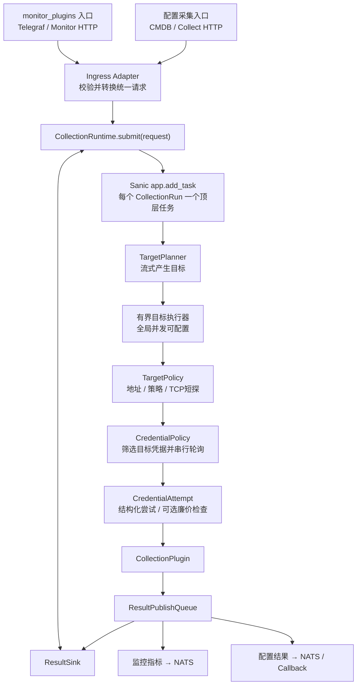
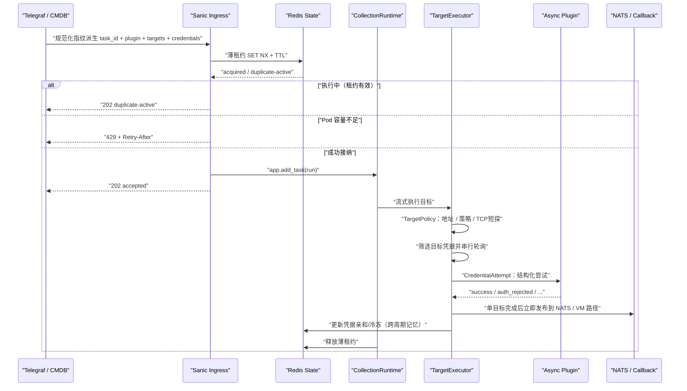
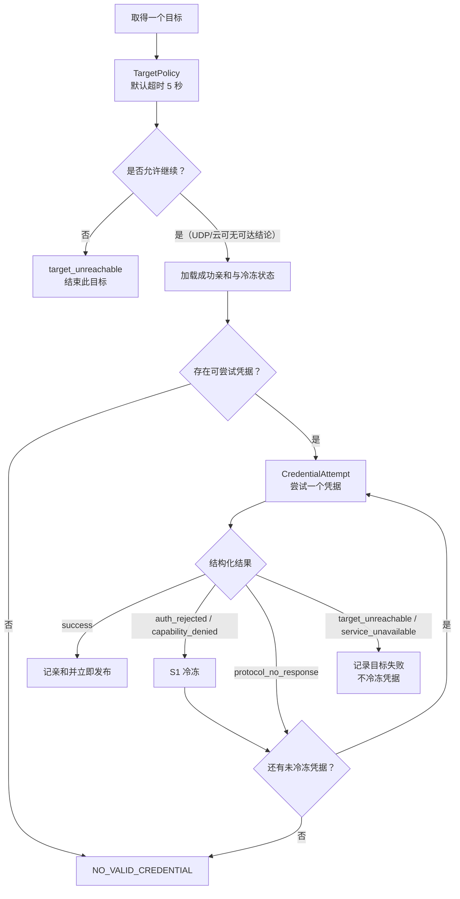

# Stargazer 无状态统一异步采集运行时

Status: approved for implementation (COMPLETE-PLAN-2026-08-06.md); code converging from superseding digest/fencing/AccessProbe workspace

2026-08-14 补充锁定：以同目录
`collection-failure-remediation-plan-2026-08-14.md` 为准。请求未开启 `params.ip_precheck` 时跳过
全部采集前探测但保留出站安全检查；全局容量默认
`MAX_ACTIVE_RUNS=16`、`MAX_ACTIVE_TARGETS=250`、`TARGET_TASK_WINDOW=250`；单目标发布失败不得取消
同 Run 其他目标，Run 汇总为 `completed_with_errors`。

2026-08-20 容量补充锁定：单 Pod 默认目标并发与任务窗口由 `150/150` 提升为 `250/250`；
`collection_capacity` 同步记录进程 CPU/RSS/线程/FD 与 cgroup CPU、内存、throttling，供压测后
判断是否继续扩容。下文保留的 `150` 仅为既有验证示例，不代表当前默认值。

2026-08-26 workload 容量补充锁定：网络拓扑基础配额默认 50；普通目标既未运行也未排队时，
拓扑可借用普通容量的一半，默认动态上限为 150。普通目标到达后停止新增借槽但不抢占在途目标，
单 Pod 总目标并发仍受 `MAX_ACTIVE_TARGETS` 与 `TARGET_TASK_WINDOW` 的较小非零值约束。

2026-08-17 结果发布补充锁定：发布状态、成功/失败结果微批、超时拆分、NATS 重连与
Redis 结果事件隔离以同目录 `nats-result-publishing-final-plan-2026-08-17.md` 为准；该文档替代
2026-08-14 方案中的结果发布和单一 `PUBLISH_TIMEOUT` 设计；容量默认值后续由上述 2026-08-20
锁定调整为 `16/250/250`。

2026-08-20 SangforSCP 补充锁定：企业版配置采集的原生 HTTP async、300 秒单一总预算、
完整快照失败语义、分页/对象/字节边界和发布诊断字段以同目录
`sangforscp-async-remediation-2026-08-20.md` 为准；不改变 NATS 单 writer，容量默认值以本文件
上述 `16/250/250` 补充锁定为准。

## 摘要

Stargazer 移除 ARQ 队列与 Worker，改由 Sanic 承载一个统一的异步采集运行时。
配置采集插件与 `monitor_plugins` 只保留入口参数和结果契约差异，共用任务重入、目标预检、
每目标凭据轮询、有界异步并发、插件执行、结果发布和故障恢复链路。

所有插件向运行时暴露同一个异步接口。原生异步插件直接 `await`；暂时无法改造的同步插件
在插件内部用 `asyncio.to_thread()` 包装成异步插件。运行时不建立 `SyncPluginAdapter`，
不维护插件专用线程池，也不感知插件是真异步还是包装异步。

Redis 不再充当采集任务队列，但继续承担执行中薄租约、凭据亲和/冷冻和异步回调上下文。
结果仍通过 NATS、VictoriaMetrics 路径或既有 callback 契约发布；单目标完成后立即发布。

> 产品锁定（2026-08-06）：HTTP 接纳采用**薄租约模型**——固定 `task_id` 执行中则 skip，
> Pod 崩溃丢未发布目标、下周期整轮补采。不做 digest 冲突、fencing 接管与断点续跑。
> 当前工作区代码若仍含完整 digest/fencing/checkpoint，视为实现超集，后续收敛到本模型。
>
> 预检锁定（2026-08-06）：`TargetPolicy`（出站 + TCP 类短探）+ `CredentialAttempt`（结构化尝试结果）。
> 不再强制公开 `AccessProbe`；禁止长期以 `UNKNOWN → 正式采集` 为主路径。
> 无响应（`protocol_no_response`）默认连续最多尝试 3 个凭据，可配置取消上限；明确
> `auth_rejected` / `capability_denied` 仍继续尝试其余未冷冻凭据（不设个数上限）。
> Host Remote 锁定（2026-08-06）：保留回调专用 attempt/token 身份校验（与薄租约/整轮 fencing
> 脱钩）。到目标的 SSH/凭据 Attempt 以 Responder 为准；Stargazer 负责 TargetPolicy、提交与
> 结构化回传契约。本变更 host 范围：monitor host remote + 配置侧 SSH/Job；WMI 非必须可记债。

## 问题陈述

当前配置采集入口先把目标拆成单 IP 任务，再提交 ARQ。ARQ Worker 默认并发数为 10；网络
等待也会长期占用 Worker 槽位。配置插件的执行器虽然定义为异步方法，但同步
`list_all_resources()` 仍可能直接运行在事件循环中。多凭据场景下，当前凭据失败后会把下一凭据
重新放回全局队尾，使一个 IP 的完整尝试被拆散，并形成接近 `IP × 凭据` 的排队压力。

相关当前实现：

- [`api/collect.py`](../../../agents/stargazer/api/collect.py)：展开目标并逐个入队；
- [`api/monitor.py`](../../../agents/stargazer/api/monitor.py)：`monitor_plugins` 入口使用同一任务队列；
- [`core/worker.py`](../../../agents/stargazer/core/worker.py)：统一 Worker 按 `monitor_type` 或
  `model_id` 分发，默认 `TASK_MAX_JOBS=10`；
- [`core/plugin_executor.py`](../../../agents/stargazer/core/plugin_executor.py)：同步插件可能直接执行；
- [`tasks/handlers/plugin_handler.py`](../../../agents/stargazer/tasks/handlers/plugin_handler.py)：
  失败后将下一凭据重新入全局队列；
- [`core/credential_state_cache.py`](../../../agents/stargazer/core/credential_state_cache.py)：
  凭据亲和和冷冻状态已经独立存在于 Redis；
- [`core/host_remote_callback.py`](../../../agents/stargazer/core/host_remote_callback.py)：
  Host Remote 等延迟完成场景已经使用 Redis 保存 callback 上下文。

堵塞的根因不是 asyncio 不适合网络采集，而是任务粒度、同步代码执行位置和 ARQ Worker 槽位
模型不适合大量并发网络等待。

## 目标

1. 移除 ARQ 队列、Worker 进程和 ARQ Redis Client 依赖。
2. 配置采集与 `monitor_plugins` 共用一个采集运行时。
3. HTTP 入口按调用方提供的 `task_id` 做跨 Pod 薄租约去重：执行中则跳过，等下周期。
4. 一个目标对应一个逻辑目标采集；凭据在目标内部串行轮询，不再失败后回全局队尾。
5. 目标先经过无凭据 `TargetPolicy`，再对匹配凭据执行 `CredentialAttempt`（插件内可选廉价检查
   或直接采集）；以结构化尝试结果驱动冷冻与轮换，不以默认 `UNKNOWN` 探针为主路径。
6. 全链路以异步接口组织，任何遗留同步插件都不得直接阻塞 Sanic 事件循环。
7. 并发、超时和目标窗口均可配置，`200` 只作为验证场景，不是部署约束。
8. 服务保持无状态；Docker/Pod 扩容提升不同采集运行之间的整体吞吐。
9. 用插件契约测试和事件循环负载测试阻止阻塞实现重新进入主链路。
10. 本变更 CredentialAttempt 必做协议：SNMP、host、VMware（配置与 monitor 同一套）；其余协议
    分批记债。云厂商 TargetPolicy 使用 API Endpoint TCP/TLS（非 ICMP）。
11. `protocol_no_response` 默认连续最多 3 次凭据尝试（可配置取消）；`auth_rejected` 仍试完未冷冻凭据。

## 非目标

- 不为配置采集与 `monitor_plugins` 建立两套运行时、队列或容量池；
- 不引入 Celery、Joblib 或另一套持久任务框架；
- 不把 `IP × 凭据` 展开为全局任务；
- 不以 ICMP 成败作为是否采集的硬门槛；
- 首版不把同一个采集运行拆到多个 Pod；
- 不承诺 exactly-once；
- 不建立通用的插件 Session/Driver 基类；只有存在真实重复的产品插件才局部复用 Driver；
- 不把服务运行可观测性误称为 `monitor_plugins` 业务采集链路。

## 领域模型

| 名称 | 含义 |
| --- | --- |
| `CollectionRun` | 一个 `task_id` 标识的一次完整采集运行，可包含多个目标 |
| `TargetCollection` | 对一个 IP、域名、API Endpoint、云账号或远程节点的逻辑采集 |
| `CredentialAttempt` | 一个目标内部使用一个候选凭据进行的一次认证/采集尝试 |
| `PluginRef` | 运行时使用的统一插件标识；入口的 `monitor_type`、`model_id/plugin_name` 均转换为它 |
| `CollectOutcome` | 插件返回的 `Completed`、`Deferred` 或 `Failed` 结果 |
| `RunLease` | Redis 中带 TTL 与心跳的薄租约，仅表示「此 task_id 正在执行」 |
| `TargetCheckpoint` | （非薄模型产品要求）旧实现中用于同 task_id 续跑跳过；产品路径不依赖 |

核心不变量：

> 一个 `CollectionRun` 包含多个 `TargetCollection`；不同目标之间并行，同一目标内的凭据严格串行。

## 架构决定

### 1. 统一运行时



Sanic HTTP handler 不在请求内扫描目标，也不等待预检结果。它只负责输入校验、重入检测、
容量接纳和启动一个受注册表管理的顶层后台任务，然后立即返回接纳结果。

目标执行采用有界窗口；不能一次为任意数量的目标创建全部协程。目标通过预检后立即进入
认证和采集，不设置“等待全网段预检完成”的全局屏障。

### 2. 深模块与接口

运行时对入口只暴露一个接口：

```python
async def submit(request: CollectionRequest) -> Submission:
    ...
```

这个接口隐藏以下实现：薄租约去重、Pod 容量接纳、Sanic 任务注册、目标
流式调度、并发限制、凭据策略、结果汇总和关闭期处理。HTTP 层不得分别编排这些步骤。

概念请求结构：

```python
CollectionRequest(
    task_id="required",
    plugin_ref="oceanstor.metrics | oceanstor.config | host.metrics",
    targets=[...],
    credentials=[...],
    execution_context={...},
    result_context={...},
    deadline=None,
)
```

两个真实的入口 Adapter 保留：

- Monitor Ingress Adapter：把 `monitor_type` 和 Telegraf Headers 转为统一请求，并按调用方要求
  返回 Prometheus 接纳响应；
- Config Ingress Adapter：把 `model_id/plugin_name`、目标范围、凭据池和 callback 参数转为统一请求。

运行时内部只有在行为确实变化的位置建立 seam：

- `TargetPolicy`：无凭据政策与可选 TCP 短探，只判断是否允许继续尝试凭据；
- `CredentialAttempt`：插件返回结构化尝试结果；可选内部廉价检查，不强制公开 probe；
- `CollectionPlugin`：不同插件实现；
- `ResultPublishQueue`：向有界队列提交单目标结果并返回 receipt；
- `ResultSink`：由队列调用，负责监控指标、配置数据和 callback 的最终批量投递。

### 3. 统一异步插件契约

所有插件必须实现同一个异步接口：

```python
class CollectionPlugin:
    async def collect(
        self,
        target: Target,
        credential: Credential,
        context: CollectionContext,
    ) -> CollectOutcome:
        ...
```

运行时不再包含 `SyncPluginAdapter`，插件清单也不声明 `execution_mode`。

原生异步插件直接使用异步网络库：

```python
async def collect(self, target, credential, context):
    return await self.client.collect(target, credential)
```

暂时无法异步改造的同步插件在插件内部显式包装：

```python
async def collect(self, target, credential, context):
    return await asyncio.to_thread(
        self._sync_collect,
        target,
        credential,
        context,
    )
```

项目不提供 `threaded_collect` 装饰器；显式入口让异步边界、同步实现和参数传递在代码审查中
可直接识别。不得把包含 Redis、预检、凭据策略和 NATS 发布的整个目标任务包装进线程。

禁止只有 `async def` 外壳、内部仍直接执行同步函数：

```python
async def collect(self, target, credential, context):
    return self._sync_collect(target, credential, context)  # 禁止：仍会阻塞事件循环
```

`asyncio.to_thread()` 底层仍使用 asyncio 共享默认线程池，但 Stargazer 不建立或管理插件专用
线程池。目标并发窗口限制同时处于执行或等待共享线程池的目标数量，避免无限提交。

包装异步的硬约束：

- 同步 SDK 必须设置真实的连接和读取超时；
- 外层仍使用 `asyncio.timeout()` 限制等待时间；
- 取消 `to_thread()` 的等待不能杀死已运行线程，因此不能只依赖外层超时；
- 包装方式是迁移手段；可使用成熟异步库的插件应逐步改为原生异步。

### 4. HTTP 重入与接纳（薄模型）

薄租约键由入口对 HTTP 请求做**规范化指纹**派生（`METHOD` + path + 排序 query +
排序后的业务 headers，忽略 Host/User-Agent/`X-Task-ID` 等噪声头），形如 `req_<sha256>`。
调用方**不必**再传稳定 `task_id`；显式 `X-Task-ID` / body `task_id` 不参与租约身份。
同一 Telegraf input / 直触发在 headers/query 不变时指纹稳定，用于防重叠；凭据或参数变更会换键（单飞失效可接受）。

业务字段 `collect_task_id`（及监控 `instance_id` 等）仍用于凭据亲和/冷冻等范围，与租约键解耦。
CMDB 本轮 `execution_id`（`CollectModels.task_id`）与 Stargazer `CollectionRun.task_id`（请求指纹）不是同一概念。
失败或重叠则等下一周期；不以同一指纹做崩溃后续跑。

因此接纳只做两件事：**防重叠**与**本 Pod 容量保护**。不做「同 task_id 不同正文」的
`409` 冲突判定，不在租约过期后接管续跑，不以 fencing 作为主正确性机制。

Redis 使用原子薄租约（`SET NX` + TTL，或等价 Lua）：

| 状态 | 行为 |
| --- | --- |
| 相同请求指纹租约仍有效（执行中） | 返回 `202 duplicate-active`（或兼容别名 `skipped`），不创建第二个任务 |
| 租约不存在或已过期 | 取得薄租约并执行；上一轮未完成目标视为**丢单**，由下周期补采 |
| 本 Pod 达到接纳上限 | 返回 `429` 和 `Retry-After`，不在内存中无限排队 |

只有在取得薄租约和本地容量后才调用 `app.add_task`。每个顶层任务必须有名称、完成回调和异常
消费路径；不得创建无人持有的 fire-and-forget Task。运行中心跳续期；正常结束或 TTL 到期释放租约。
响应头 `X-Task-ID` 回传派生指纹，便于排查。

非目标（本薄模型明确不做）：

- `409 task-id-conflict`（同身份不同正文冲突）；
- 跨 Pod fencing 递增接管；
- 按 `TargetCheckpoint` 跳过已完成目标后的同指纹续跑；
- 已完成汇总回读作为主路径（调用方从 VM / 自身状态消费结果）。

### 5. 数据流



### 6. 单目标流程



凭据失败后绝不创建新的全局任务。一个目标的所有凭据尝试必须在同一个
`TargetCollection` 内完成。单目标成功后立即发布，不等待整次 `CollectionRun` 结束。
Pod 崩溃时未发布的目标丢单；已发布结果保留；下周期用同一固定 `task_id` 整轮重采。

### 7. TargetPolicy 与 CredentialAttempt（预检重设计）

“IP 是否通”不能等同于“可以采集”。产品锁定的预检不再强制两段公开接口
（`TargetGate` + `AccessProbe`），而改为：

1. **`TargetPolicy`（无凭据）**：地址、DNS、出站策略；对 TCP 类目标可做短连接探测。成功只表示
   **允许继续尝试凭据**，不宣称协议/凭据/权限有效。UDP/SNMP 不做裸 UDP connect，也不在此层
   给出可达结论。
2. **`CredentialAttempt`（有凭据）**：运行时对每个候选凭据发起一次结构化尝试。插件**可选**在
   内部先做廉价协议检查再采集，或直接正式采集；运行时不强制公开 `probe()`，也不以
   `UNKNOWN → 正式采集` 作为默认主路径。

#### 7.1 CredentialAttempt 稳定结果

| 结果 | 含义 | 决策 |
| --- | --- | --- |
| `success` | 本凭据采集成功 | 记亲和，立即发布，停止后续凭据 |
| `auth_rejected` | 明确认认证失败 | S1 冷冻，尝试下一凭据 |
| `capability_denied` | 认证成功但缺最低读取能力 | 暂与认证失败同冻，尝试下一凭据 |
| `protocol_no_response` | 无响应，无法区分网络/ACL/凭据 | 不冷冻，尝试下一凭据；**默认连续最多 3 次，可配置取消上限** |
| `target_unreachable` | 有充分证据表明目标不可达 | 结束目标，不尝试更多凭据 |
| `service_unavailable` | 目标可达但服务不可用/繁忙 | 结束或延迟目标，不放大凭据 |
| `tls_validation_failed` | 证书校验失败 | 结束目标；不得降级跳过校验 |
| `protocol_mismatch` | 端口开放但不是所需协议 | 结束目标 |
| `rate_limited` / `account_locked` | 限流或账号锁定 | 结束或延迟，不冷冻为普通认证失败 |
| `plugin_failed` / `misconfigured` | 插件或请求配置错误 | 结束该目标，不逐凭据放大 |

#### 7.2 协议落地优先级与深度

| 目标类型 | TargetPolicy | CredentialAttempt 要求 |
| --- | --- | --- |
| 云账号（Aliyun/QCloud/Huawei 等） | API Endpoint **TCP/TLS** 可达（非 ICMP） | 能做则做身份/最低只读 API；**做不到可靠检查时不做假探针**，可达后直接正式采集并用结构化错误分类 |
| SSH / host / Job | DNS、策略、TCP/22 等 | **本变更必做**：与 host 采集链路同一套 Attempt（含 monitor host 路径） |
| WinRM / WMI | DNS、策略、TCP/5985 或 5986 | 认证 + 无副作用检查，或直接 attempt（可与 host 批次一并） |
| MySQL/PostgreSQL/Oracle/MSSQL 等 | DNS、策略、协议端口 TCP 短探 | 登录 + 最低成本能力查询；本变更非必做，分批记债 |
| HTTP/HTTPS / 存储 API 等 | DNS、策略、TCP/TLS 短探 | 能廉价验证则内部先做；否则直接采集 + 结构化错误；分批记债 |
| VMware | DNS、策略、TCP/TLS | **本变更必做**：配置采集与 monitor **同一套**完整登录 + 最低成本只读 |
| SNMP/UDP | 地址与出站策略；不做裸 UDP connect | **本变更优先必做**：带凭据的最小 SNMP GET，区分无响应与明确授权错误 |
| Remote Job | Responder 可用 | Responder 侧检查到目标的执行能力（可与 host 批次相关） |
| IP 扫描 | 地址范围与容量上界 | 扫描插件自身有界探测，不逐端口重复 Policy |

当前工作区若仍实现强制 `AccessProbe` + 默认 `UNKNOWN`，视为过渡实现；收敛目标以本节为准。ICMP 不能作硬过滤。TCP 短探成功不能替代凭据尝试。不先建立通用
Session/evidence 回传框架；插件若能在同连接内先检查再采集可自行局部复用。

### 8. 凭据亲和与冷冻

凭据状态不能只绑定 `task_id`，否则周期性 `monitor_plugins` 在每次生成新任务 ID 后无法复用
成功凭据。新作用域为：

```text
scope_id + plugin_ref + target_id + credential_set_version
```

Redis 只保存 `credential_id`、失败分类、计数和过期时间，不保存密码、Token、community 或私钥。

尝试顺序：

1. 上次成功且未冷冻的凭据；
2. 其余未冷冻凭据，保持输入的稳定顺序；
3. 已冷冻凭据跳过；
4. 全部冷冻时返回 `NO_VALID_CREDENTIAL` 和最近 `next_retry_at`。

目标选择器过滤后不存在候选凭据时返回 `NO_MATCHING_CREDENTIAL`；该结果与“存在匹配凭据但
全部处于冷冻期”的 `NO_VALID_CREDENTIAL` 必须区分。

失败分类：

| 失败 | 状态归属 | 是否尝试下一凭据 |
| --- | --- | --- |
| 明确认认证失败、权限不足 | target + credential | 是 |
| IP/端口不可达 | target | 否 |
| 服务限流或繁忙 | target/plugin endpoint | 否 |
| 插件代码、协议解析、结果格式错误 | plugin execution | 否 |
| SNMP 无响应 | 不确定 | 可尝试下一凭据，但不直接判定 IP 离线 |

产品锁定冷冻梯度为 `5min → 30min → 4h → 24h`（另加少量随机抖动）。成功后只清理**当前成功凭据**
的失败状态并更新亲和，不清除同目标其它凭据的已确认认证失败。网络失败与插件失败不冷冻。

### 9. 结果契约

配置插件和 `monitor_plugins` 共用执行运行时，但不强行合并产物：

- Metrics Result Publisher：把 `monitor_plugins` 结果转换并发布到 NATS；
- Configuration Result Publisher：发布配置采集结果或业务 callback；
- Deferred Result Publisher：保存可信执行身份和 callback 上下文，回调必须校验 task、attempt、
  fencing token 和 caller，拒绝重复、乱序或过期结果。

每个目标完成后立即发布，不等待整个目标集合结束。发布协议是 at-least-once（含有限重试）。

去掉以 fencing/pending/checkpoint 支撑的同 `task_id` 续跑发布路径。发布失败时**再重试 1 次**
（合计 2 次）；仍失败则该目标记失败，不伪报成功，依赖下周期补采或 CMDB 超时兜底。

下游（VictoriaMetrics 时间序列、CMDB 对账、callback 消费方）按自身窗口与业务键去重。
Host Remote 等 Deferred 回调仍须校验 task / attempt / caller 等可信身份（回调安全，不是整轮
续跑 fencing）。

Stargazer 与 CMDB 凭据命中事件字段对齐，以及 CMDB「查询 VM → 转换层 → 图库」映射问题，
另开任务排查，不阻塞本变更发布路径收敛。

### 10. 并发与容量

所有上限通过部署配置提供，不在代码中硬编码 `200`：

| 参数 | 含义 |
| --- | --- |
| `MAX_ACTIVE_RUNS` | 单 Pod 同时运行的 `CollectionRun` 数量 |
| `MAX_ACTIVE_TARGETS` | 单 Pod 同时活跃的 `TargetCollection` 数量 |
| `NETWORK_TOPOLOGY_MAX_ACTIVE_TARGETS` | 网络拓扑 workload 的基础目标配额；普通采集完全空闲时可动态借槽 |
| `TARGET_TASK_WINDOW` | 已创建但未完成的目标协程上限，并复用为有界发布队列容量 |
| `MAX_TARGETS_PER_RUN` | 单个请求允许的目标数量上限 |
| `MAX_CREDENTIALS_PER_RUN` | 单个请求允许的候选凭据数量上限 |
| `PREFLIGHT_TIMEOUT` | 协议预检超时，默认 15 秒；兼容期回退 `CONNECT_TIMEOUT` |
| `PROBE_TIMEOUT` | 插件 AccessProbe 超时，默认 15 秒；兼容期回退 `CONNECT_TIMEOUT` |
| `COLLECTION_TIMEOUT` | 正式采集缺省 60 秒；插件 YAML executor `timeout` 优先，兼容期回退 `PLUGIN_TIMEOUT` |
| `PUBLISH_TIMEOUT` | 单目标发布阶段端到端超时，默认 30 秒 |
| `RUN_DEADLINE` | 整个采集运行的可选截止时间 |

`app.add_task` 只用于每个 `CollectionRun` 的顶层任务。生产路径的目标并发由全局公平调度器
统一控制；无调度器的兼容执行路径才使用本地 Semaphore/worker budget。结果进入容量为
`TARGET_TASK_WINDOW` 的发布队列后释放目标调度槽位，Run 通过发布回执等待最终状态。队列满时
入队等待形成有界背压，不能把内存中的大量等待协程当成免费队列。

网络拓扑和普通采集不拆成两套执行器或两个固定池。调度器只在普通目标既未运行也未排队时，
把拓扑上限从基础配额临时提高到
`基础配额 + floor((全局目标容量 - 基础配额) / 2)`；普通目标一旦出现，停止派发超出基础配额的
新拓扑目标，但不取消或抢占已开始的目标。两个全局目标边界都显式关闭时不基于内部哨兵容量借槽，
拓扑维持基础配额。

验证示例：255 个 IP、5 个凭据、`MAX_ACTIVE_TARGETS=150`、预检超时 5 秒。

- 最多 150 个目标处于执行或等待插件状态；
- 不可达 IP 只做一次协议预检，不尝试 5 个凭据；
- 全部不可达时约为两轮预检，理论下限约 `ceil(255/150) × 5 ≈ 10` 秒，加调度开销；
- 可达但 5 个凭据全部各自超时，一个 IP 最坏约 25 秒，两批目标约 50 秒；
- 首个凭据成功后立即停止后续尝试。

凭据不并行尝试，避免设备认证风暴、账号锁定和多个成功 Session 的资源浪费。

### 11. Redis 职责迁移

保留：

- `task_id` 薄租约（执行中标记、TTL、心跳续期）；
- 凭据成功亲和、冷冻和结果事件（跨 Telegraf 周期记忆）；
- Host Remote 等 Deferred callback 上下文与回调身份校验；
- 必要的短期发布辅助状态（若后续做发布重试）。

不再作为产品要求（可从实现中移除或降级为内部细节）：

- 请求 digest 与 `409 task-id-conflict`；
- fencing token 递增接管；
- 单目标完成断点用于同 `task_id` 续跑；
- 已完成运行汇总回读作为 HTTP 主路径。

移除：

- ARQ Job 队列和 Job ID；
- `enqueue_collect_task()` 及失败后重新入队；
- ARQ WorkerSettings、`max_jobs`、Worker 启动进程；
- ARQ Job retry、队列健康检查和孤儿 Job 清理；
- 非队列模块对 `arq.create_pool`、`ArqRedis`、`RedisSettings` 的依赖。

Redis 访问改用普通异步 Redis Client。Redis 不保存完整任务密钥，也不成为待执行目标清单。

### 12. 无状态、Pod 故障与水平扩容

每个 Pod 只保留当前进程内的活动 Task 注册表、Semaphore 和连接池；跨 Pod 的「是否执行中」
由薄租约表达，凭据状态与 Deferred 上下文仍在 Redis，结果在 NATS / VictoriaMetrics / 下游。

Pod 故障后的恢复语义（薄模型）：

1. 当前异步执行随进程终止；
2. 薄租约因 TTL 过期而释放；
3. 未发布的目标视为丢单；已发布的单目标结果保留；
4. 调用方（Telegraf 固定 `task_id` 周期 scrape，或 CMDB 新一轮 execution）在下周期再次触发；
5. 新一轮是完整重采，不跳过「上一轮已完成目标」，也不 fencing 拒绝迟到写——下游按时间窗/
   业务键消化重复。

必须明确：移除持久队列后，薄租约只防重叠执行，不提供自动重新调度或断点续跑。这与
CMDB「每轮新 execution_id、失败等下周期、主路径拉 VM」以及 Telegraf「固定 task_id 周期触发」
一致。

Docker/Pod 扩容提升不同 `task_id` 之间的吞吐。首版一个 `CollectionRun` 固定在接收它的 Pod
内执行，不为单次网段采集增加跨 Pod 分片。只有出现明确的单任务跨 Pod SLA 后，才评估确定性
HTTP 分片；本变更不提前实现。

### 13. Sanic 生命周期

启动：

- 初始化普通异步 Redis、NATS 和网络 Client；
- 初始化运行接纳器、目标 Semaphore 和本地 Task 注册表；
- 不扫描历史任务，不把非关键 Redis 清理或对账变成启动硬依赖；
- 启动依赖顺序必须遵守
  [`docs/operations/server-startup-dependencies.md`](../../../docs/operations/server-startup-dependencies.md)。

停止：

1. 停止接纳新运行；
2. 在可配置宽限期内等待活动异步任务；
3. 取消仍未完成的异步 Task；
4. 把运行标记为 `abandoned` 或让租约自然过期；
5. 关闭 NATS、Redis 和网络 Client。

本地 Task 注册表只负责生命周期，不是业务事实来源。

### 14. 运行可观测性

以下指标用于证明运行时没有拖慢 Sanic，不属于 `monitor_plugins` 业务产物：

- `event_loop_lag_seconds`；
- `active_runs`、`active_targets`、`target_window_size`；
- `submission_rejected_total`；
- `preflight_duration_seconds`、`target_unreachable_total`；
- `access_probe_duration_seconds`、`access_probe_total`、`access_probe_timeout_total`、
  `access_probe_error_total`；
- `credential_attempt_total`、`credential_cooldown_total`；
- `plugin_duration_seconds`、`plugin_timeout_total`；
- `result_publish_failure_total`、`lease_duplicate_skip_total`。

不再提供插件专用线程池活跃数或队列长度，因为该线程池不存在。日志只记录 `task_id`、
`target_id`/目标哈希、`plugin_ref`、`credential_id` 和稳定错误码，严禁输出凭据
明文或认证请求头。

生产 INFO 日志保留 Run 开始、聚合结果和终态；每个失败目标必须输出可检索的
`target_collection_failed`。插件加载步骤、预检跳过和发布成功降为 DEBUG。日志统一写 stdout，
由日志平台按结构化字段建立视图，不再创建 SNMP 专用日志文件；NATS、Redis、租约、发布不确定等
基础设施异常继续保留 WARNING/ERROR。
插件执行、协议预检及插件内部捕获的每个异常通过 `plugin_exception` 记录，必须带任务、插件、模型和
目标上下文、异常类型、脱敏且有长度上限的异常正文，以及有界的文件、行号、函数名与 traceback
源码行；禁止记录运行时局部变量、请求头或凭据字段。
Run 开始、进度、汇总和终态日志必须携带 `instance_id`。生产 INFO 以约 10% 完成度输出有界
`collection_progress`；SNMP 正式采集仅由插件输出 `snmp_facts_collection_started`，执行器不得重复输出
通用目标开始日志。协议探测无响应使用
`target_collection_failed stage=access_probe reason=timeout` 为每个失败目标提供终态日志，并在 Run 汇总保留
`protocol_no_response` 计数，不得降级为含混的 `credentials_exhausted`。发布失败逐 Run 最多输出
3 条 `result_publish_failed`，完整计数与样本在 Run 汇总聚合；成功发布不输出逐目标终态日志。
`collection_capacity` 保留稳定英文 `event`，正文使用中文分区、单位、状态和阈值提示；底层不可用的
资源采样显示为“不可用”，机器指标继续由健康接口和 Prometheus 字段提供。

## 测试方案

本方案对齐 2026-08-06 产品锁定（薄租约、TargetPolicy + CredentialAttempt、S1 冷冻、
发布重试 1 次、必做 SNMP/host/VMware）。**TDD：每个 seam 先写失败测试再改生产代码。**
断言只针对公开行为、字面量结果与稳定错误码；禁止断言 private 方法/内部 call count；
禁止在断言或日志期望中写入真实秘密。

### 0. 相对旧测试的处置

| 旧方向 | 处置 |
| --- | --- |
| digest 409 / completed 汇总回读 / fencing 接管续跑 | **删除或改写**为薄租约语义，不再作为产品门禁 |
| pending 发布失败后重入复用、不重复采集 | **删除或改写**为：发布失败再试 1 次，仍失败则目标失败，下周期整轮重采 |
| 强制 AccessProbe + 默认 UNKNOWN→采集 | **改写**为 CredentialAttempt 结构化结果；去掉「UNKNOWN 即放行」主路径断言 |
| 冷冻 `1h→4h→24h`、成功清整个 scope | **改写**为 S1 `5m→30m→4h→24h`；成功只清当前凭据失败 |
| 同 task_id 跳过已完成目标 checkpoint | **删除**产品门禁（薄模型不续跑） |

现有相关文件（改代码时按上表清理）：
`test_collection_runtime.py`、`test_target_collection_executor.py`、`test_credential_policy.py`、
`test_preflight.py`、`test_async_plugin_contract.py`、`test_result_publisher.py`、
`test_collection_end_to_end.py`，以及本变更新增的协议契约测试。

### 1. 运行时与薄租约

- 同 `task_id` 租约有效 → 只一个顶层任务，后续 `duplicate-active`；
- 租约 TTL 过期后 → 允许新一轮**完整**执行（不跳过上一轮已完成目标）；
- 本 Pod 容量满 → `429` + `Retry-After`（Collect；Monitor 本变更可一并补齐），不建后台排队任务；
- Redis 不可用 → fail-closed，不在缺失去重保护时执行；
- 心跳丢失/租约丢失 → 取消运行中任务；
- 优雅停机：停接纳 → 宽限 → cancel，无未消费异常。

### 2. TargetPolicy

- TCP 类：短探失败 → 目标结束，`attempts=0`，零凭据尝试；
- UDP/SNMP：不做裸 UDP connect，不因 Policy 宣称可达；
- 云：对 API Endpoint 做 TCP/TLS（非 ICMP）；不通则不进凭据；
- ICMP 不得作为硬过滤；
- 出站策略拒绝 → 稳定错误码，不进凭据。
- **IP 预检锁定修订（2026-08-26）**：移除全局 `PREFLIGHT_REACHABILITY` 开关。任务仅在
  `params.ip_precheck` 显式开启时，按协议做无凭据
  连接性探测作为准入：TCP/TLS 直连类拨协议端口；SSH/job 拨目标 SSH 端口（目标 IP 与
  执行节点管理 IP 一致时跳过）；SNMP/UDP 等未确认类型本期放行；云账号等逻辑目标忽略
  开关。预检组件自身故障时放行目标并记告警，不得阻断采集。

### 3. CredentialPolicy（S1）

- 目标绑定凭据不得用于其它目标；
- 串行尝试，首个成功即停；
- `auth_rejected` / `capability_denied` → S1 冷冻（`5m→30m→4h→24h` + 抖动），并继续未冷冻凭据；
- `protocol_no_response` → 不冷冻；**默认连续最多 3 次**后停止该目标；可配置取消上限时须有测试；
- 成功 → 只清**当前**凭据失败，其它凭据冷冻保留；更新亲和；
- 全冻 → `no_valid_credential` + `next_retry_at`；无匹配 → `no_matching_credential`。

### 4. CredentialAttempt 决策

对公开执行器注入假插件，断言互斥决策：

| 结构化结果 | 期望 |
| --- | --- |
| success | 立即发布，停止后续凭据 |
| auth_rejected | 冷冻并换下一凭据；可配置下试完未冻集合 |
| capability_denied | 同认证失败冷冻策略 |
| protocol_no_response | 不冻；受连续 3 次上限 |
| target_unreachable / service_unavailable / tls / protocol_mismatch / misconfigured | 结束目标，不放大凭据 |
| rate_limited / account_locked | 结束或延期，不按普通认证冷冻 |
| plugin_failed | 结束，不冻凭据 |

禁止：默认 `UNKNOWN → 正式采集` 作为主路径断言。

### 5. 发布

- 单目标成功后**立即** publish，不等待整 run；
- 发布失败 → **再试 1 次**（共 2 次）；仍失败 → 目标失败，不伪报成功；
- 不存在 pending 续跑复用门禁；
- 结果与日志不含密码/community/token/私钥；可用 `result_id` 做下游去重标识（不依赖 fencing 续跑）。

### 6. 协议契约（本变更必做）

**SNMP（优先）**

- 带凭据最小 GET；明确授权错误 → `auth_rejected`；超时/无响应 → `protocol_no_response`；
- 不得用裸 UDP connect 当作 READY/成功；
- 同步 SDK 经 `to_thread` 且带真实 timeout；心跳在阻塞坏实现下失败、在包装实现下继续。

**host（monitor host remote + 配置 SSH/Job）**

- 结构化 Attempt 结果可驱动冷冻/轮换；
- Deferred 回调：拒绝伪造、错误 caller、乱序/重复；保留 attempt/token 校验（非整轮 fencing）；
- Responder 不可用/提交失败 → 稳定失败，不伪造成功。

**VMware（配置 + monitor 同一套）**

- 完整登录 + 最低成本只读；认证失败与权限失败可区分（或至少稳定归类）；
- 配置采集与 monitor 入口走同一 Attempt 契约测试矩阵。

云厂商：本变更仅要求 Endpoint TCP/TLS 可达测试；不要求假身份探针。其它协议分批记债。

### 7. 异步契约与事件循环负载

- 注册入口为协程；包装插件必须把 timeout 传到 SDK；
- 坏插件 `time.sleep` → 心跳失败；`to_thread` 包装 → 心跳继续；
- 压测场景（可配置，示例 255×5×200×5s）：
  - `active_targets` ≤ 上限；
  - Task 数受 `TARGET_TASK_WINDOW` 约束；
  - 不可达目标无凭据尝试；
  - 重复 `task_id` 只有一个发布者；
  - 结束后无遗留 Task；
  - `/health` 相对空载劣化与 lag 门槛沿用现约定（coverage 插桩下的负载失败不作为生产结论）。

### 8. 固定验证命令（实现后必须新鲜跑通）

```bash
cd agents/stargazer
.venv/bin/pytest -q -o addopts='' \
  tests/test_collection_runtime.py \
  tests/test_collection_request_builder.py \
  tests/test_preflight.py \
  tests/test_target_collection_executor.py \
  tests/test_credential_policy.py \
  tests/test_redis_collection_state.py \
  tests/test_collection_plugins.py \
  tests/test_async_plugin_contract.py \
  tests/test_collection_load.py \
  tests/test_collection_service_async.py \
  tests/test_yaml_reader_async.py \
  tests/test_native_async_boundaries.py \
  tests/test_result_publisher.py \
  tests/test_collection_end_to_end.py
# 另加本变更新增：SNMP / host / VMware Attempt 契约测试文件
```

另：`git diff --check`；目标文件 flake8（max-line-length=150）；秘密扫描。
不把无关仓库基线失败算作本变更回归。

### 9. 明确不测 / 另开任务

- Stargazer↔CMDB 凭据事件字段对齐（另开）；
- CMDB「VM 查询→转换层→图库」映射正确性（另开）；
- 全部厂商协议 Attempt 一次做完；
- 自适应扇出/半开/惩罚分；
- 真实实验室设备性能数字不得用 mock 负载冒充。

## 验收标准

- 配置采集和 `monitor_plugins` 均通过 `CollectionRuntime.submit()` 进入同一运行时；
- 仓库不再存在采集用途的 ARQ enqueue、WorkerSettings 或 Worker 启动入口；
- 非队列 Redis 状态不再依赖 ARQ Client；
- 每个 HTTP 请求最多创建一个顶层 Sanic 后台任务；
- 相同 `task_id` 执行中重叠请求返回 `duplicate-active` 且不创建第二任务；
- 每个目标内部完成全部凭据轮询，不把下一凭据放回全局队列；
- `TargetPolicy` 不通过的目标不执行凭据尝试；TCP 短探成功不得直接判定凭据或协议可采集；
- 配置采集和 `monitor_plugins` 共用 `CredentialAttempt` 结构化结果与凭据轮询决策；
- 不强制公开 `AccessProbe`；不以默认 `UNKNOWN → 正式采集` 为主路径；
- SNMP 具备带凭据的最小 GET；VMware 具备完整登录+最低只读；云厂商在无法可靠身份检查时仅
  Endpoint 可达后直接采集并用结构化错误分类，不做假探针；
- 目标专用凭据不得被尝试到其他目标；
- 所有插件暴露异步 `collect`（或等价 attempt），同步实现只允许在插件内部使用 `asyncio.to_thread()` 包装；
- 运行时不存在 `SyncPluginAdapter` 和插件专用线程池；
- 单目标完成后立即发布，不等待整次 `CollectionRun` 结束；发布失败再重试 1 次，仍失败不伪报成功；
- 不存在同 `task_id` fencing/pending 续跑产品门禁；
- SNMP / host / VMware Attempt 契约测试通过；
- `255 IP × 5 凭据 × 200 目标并发 × 5s 预检超时` 压测满足事件循环、并发上界和任务泄漏门禁；
- §测试方案 固定命令新鲜跑通；diff coverage 不低于既有约定（约 80%）；
- 密码、Token、community、私钥不进入 Redis 状态、日志、指标或异常上下文。

## 实施顺序

1. 建立 `CollectionRequest`、`CollectOutcome`、错误分类和统一异步插件契约；
2. 先补插件契约测试并盘点所有插件的原生异步/包装异步状态；
3. 将同步插件迁移为插件内部 `asyncio.to_thread()` 包装，禁止运行时直接调用同步入口；
4. 使用普通异步 Redis Client 实现薄租约与凭据状态；
5. 实现 `CollectionRuntime`、目标流式窗口、协议预检和目标内凭据轮询；
6. 将配置采集入口切换到统一运行时；
7. 将 `monitor_plugins` 入口切换到同一运行时；
8. 迁移 Host Remote 等 Deferred callback 状态和可信回调校验；
9. 删除 ARQ Worker、队列、Job 重试、启动配置和依赖；
10. 将现有重 digest/fencing/checkpoint 实现收敛为薄模型（若工作区仍为完整租约实现）；
11. 运行插件契约、255×5×200 负载、重叠 skip、NATS 失败和优雅停止测试；
12. 灰度观察事件循环 lag、目标延迟、发布失败和 duplicate skip，再删除旧链路。

## 回滚

- 在删除 ARQ 前保留一个镜像级回滚点；不在运行时同时写新旧队列；
- Redis 新状态键使用独立前缀和版本，回滚镜像忽略新键；
- NATS 和 callback 结果契约在迁移中保持可识别的版本/幂等键；
- 回滚通过部署上一镜像完成，不迁移或删除仍可能被回滚版本使用的 Redis 数据；
- 灰度期间一旦出现事件循环阻塞、结果重复、回调乱序或大面积 429，停止放量并回滚镜像。

## 已接受的取舍

1. `asyncio.to_thread()` 是包装异步，不会让同步 SDK 本身变成异步；它只保证同步调用不直接
   阻塞事件循环。
2. 不使用专用线程池意味着包装插件与进程内其他 `to_thread()` 调用共享 asyncio 默认线程池；
   该风险通过目标窗口、SDK 真实超时、事件循环压测和逐步原生异步化控制。
3. **薄租约模型**：固定 `task_id`（Telegraf/CMDB `collect_task_id`）下，执行中重叠则 skip，
   Pod 崩溃丢未发布目标，靠下周期整轮补采。不做 digest 409、不做 fencing 接管、不做同
   `task_id` 断点续跑。这与 CMDB「每轮新 execution_id、主路径拉 VM、失败等下周期」一致。
4. 水平扩容首先提升不同采集运行之间的吞吐，不自动加速单个超大网段任务。首版不为这一未
   证实需求引入分布式分片。
5. NATS/callback 发布失败时再重试 1 次（共 2 次）；仍失败则该目标失败，靠下周期/CMDB 超时兜底，
   不恢复 fencing 续跑语义。
6. 凭据冷冻梯度锁定为 `5min → 30min → 4h → 24h`（S1）；成功只清当前凭据失败；
   `CAPABILITY_DENIED` 暂与 `AUTH_FAILED` 同冻。与 CMDB 命中表短期各管各的，长期意向以
   Stargazer 执行为准。自适应扇出/半开不纳入本变更必做项。
7. Host Remote：保留回调 attempt/token 校验（非整轮 fencing）；到目标 Attempt 以 Responder 为准；
   本变更 host = monitor host remote + 配置 SSH/Job。
8. 当前工作区若仍实现 digest/fencing/checkpoint/强制 AccessProbe，视为相对本锁定的**实现超集**；
   收敛前行为可能仍正确，但验收以本文产品锁定为准。
